<div align="center">


<p>
Universidad Peruana de Ciencias Aplicadas<br>
Carrera de Ingeniería de Software
</p>

<br>

<p>
<strong>1ASI0729</strong><br>
<strong>Desarrollo de Aplicaciones Open Source</strong>
</p>

<p>
NRC<br>
<strong>7750</strong>
</p>

<h3>Informe del Trabajo Final</h3>

<p>
Docente<br>
<strong>Bautista Ubillús, Efraín Ricardo</strong>
</p>

<br>

<p>
Equipo<br>
<strong>CleanCode</strong>
</p>

<p>
Proyecto<br>
<strong>MaquiGest</strong>
</p>

<br>

<p><strong>Integrantes</strong></p>

<p>
<span style="display:inline-block; width:120px; text-align:left;"><strong>Código</strong></span>
<span style="display:inline-block; width:300px; text-align:left;"><strong>Apellidos y Nombres</strong></span>
<br>

<span style="display:inline-block; width:120px; text-align:left;">U202115277</span>
<span style="display:inline-block; width:300px; text-align:left;">Delgado Perez, James Caleb</span>
<br>

<span style="display:inline-block; width:120px; text-align:left;">U202111529</span>
<span style="display:inline-block; width:300px; text-align:left;">Montalvo Vasquez, Bruno Rodrigo</span>
<br>

<span style="display:inline-block; width:120px; text-align:left;">U202410211</span>
<span style="display:inline-block; width:300px; text-align:left;">Manosalva Tovar, Miroslav</span>
</p>

<br>

<p><strong>Período 202620</strong></p>

<br>

<p><strong>Septiembre 2026</strong></p>

</div>

<div style="page-break-after: always;"></div>


## Registro de Versiones del Informe

| Versión | Fecha |  Autor   |                                                  Descripción de modificación                                                   |
| :-----: |:-----:|:--------:| :----------------------------------------------------------------------------------------------------------------------------: |
|   AV1   |       |  Todos   | Se agregó la primera versión del informe, incluyendo carátula, registro de versiones, perfiles del equipo, análisis inicial del problema, artefactos de UX, arquitectura preliminar y evidencias del Sprint 1. |

<div style="page-break-after: always;"></div>


## Project Report Collaboration Insights

A continuación, se presenta el repositorio utilizado para la elaboración colaborativa del informe del proyecto MaquiGest.

#### Link del repositorio del Reporte:

- https://github.com/upc-pre-202620-1asi0729-7750-cleancode/maquigest-report

### Entrega AV1:

#### Participación por integrante:

##### Commits en el Project Report:

<div style="page-break-after: always;"></div>


# Contenido

## Índice

- [Registro de Versiones del Informe](#registro-de-versiones-del-informe)
- [Project Report Collaboration Insights](#project-report-collaboration-insights)
- [Contenido](#contenido)
- [Student Outcome](#student-outcome)
- [Capítulo I: Introducción](#capítulo-i-introducción)
    - [1.1. Startup Profile](#11-startup-profile)
        - [1.1.1. Descripción de la Startup](#111-descripción-de-la-startup)
        - [1.1.2. Perfiles de integrantes del equipo](#112-perfiles-de-integrantes-del-equipo)
    - [1.2. Solution Profile](#12-solution-profile)
        - [1.2.1. Antecedentes y problemática](#121-antecedentes-y-problemática)
        - [1.2.2. Lean UX Process](#122-lean-ux-process)
            - [1.2.2.1. Lean UX Problem Statements](#1221-lean-ux-problem-statements)
            - [1.2.2.2. Lean UX Assumptions](#1222-lean-ux-assumptions)
            - [1.2.2.3. Lean UX Hypothesis Statements](#1223-lean-ux-hypothesis-statements)
            - [1.2.2.4. Lean UX Canvas](#1224-lean-ux-canvas)
    - [1.3. Segmentos objetivo](#13-segmentos-objetivo)
- [Capítulo II: Requirements Elicitation & Analysis](#capítulo-ii-requirements-elicitation--analysis)
    - [2.1. Competidores](#21-competidores)
        - [2.1.1. Análisis competitivo](#211-análisis-competitivo)
        - [2.1.2. Estrategias y tácticas frente a competidores](#212-estrategias-y-tácticas-frente-a-competidores)
    - [2.2. Entrevistas](#22-entrevistas)
        - [2.2.1. Diseño de entrevistas](#221-diseño-de-entrevistas)
        - [2.2.2. Registro de entrevistas](#222-registro-de-entrevistas)
        - [2.2.3. Análisis de entrevistas](#223-análisis-de-entrevistas)
    - [2.3. Needfinding](#23-needfinding)
        - [2.3.1. User Personas](#231-user-personas)
        - [2.3.2. User Task Matrix](#232-user-task-matrix)
        - [2.3.3. User Journey Mapping](#233-user-journey-mapping)
        - [2.3.4. Empathy Mapping](#234-empathy-mapping)
    - [2.4. Big Picture Event Storming](#24-big-picture-event-storming)
    - [2.5. Ubiquitous Language](#25-ubiquitous-language)
- [Capítulo III: Requirements Specification](#capítulo-iii-requirements-specification)
    - [3.1. User Stories](#31-user-stories)
    - [3.2. Impact Mapping](#32-impact-mapping)
    - [3.3. Product Backlog](#33-product-backlog)
- [Capítulo IV: Product Design](#capítulo-iv-product-design)
    - [4.1. Style Guidelines](#41-style-guidelines)
        - [4.1.1. General Style Guidelines](#411-general-style-guidelines)
        - [4.1.2. Web Style Guidelines](#412-web-style-guidelines)
    - [4.2. Information Architecture](#42-information-architecture)
        - [4.2.1. Organization Systems](#421-organization-systems)
        - [4.2.2. Labeling Systems](#422-labeling-systems)
        - [4.2.3. SEO Tags and Meta Tags](#423-seo-tags-and-meta-tags)
        - [4.2.4. Searching Systems](#424-searching-systems)
        - [4.2.5. Navigation Systems](#425-navigation-systems)
    - [4.3. Landing Page UI Design](#43-landing-page-ui-design)
        - [4.3.1. Landing Page Wireframe](#431-landing-page-wireframe)
        - [4.3.2. Landing Page Mock-up](#432-landing-page-mock-up)
    - [4.4. Web Applications UX/UI Design](#44-web-applications-uxui-design)
        - [4.4.1. Web Applications Wireframes](#441-web-applications-wireframes)
        - [4.4.2. Web Applications Wireflow Diagrams](#442-web-applications-wireflow-diagrams)
        - [4.4.3. Web Applications Mock-ups](#443-web-applications-mock-ups)
        - [4.4.4. Web Applications User Flow Diagrams](#444-web-applications-user-flow-diagrams)
    - [4.5. Web Applications Prototyping](#45-web-applications-prototyping)
    - [4.6. Domain-Driven Software Architecture](#46-domain-driven-software-architecture)
        - [4.6.1. Design-Level Event Storming](#461-design-level-event-storming)
        - [4.6.2. Software Architecture Context Diagram](#462-software-architecture-context-diagram)
        - [4.6.3. Software Architecture Container Diagram](#463-software-architecture-container-diagram)
        - [4.6.4. Software Architecture Component Diagrams](#464-software-architecture-component-diagrams)
    - [4.7. Software Object-Oriented Design](#47-software-object-oriented-design)
        - [4.7.1. Class Diagrams](#471-class-diagrams)
    - [4.8. Database Design](#48-database-design)
        - [4.8.1. Database Diagrams](#481-database-diagrams)
- [Capítulo V: Product Implementation, Validation & Deployment](#capítulo-v-product-implementation-validation--deployment)
    - [5.1. Software Configuration Management](#51-software-configuration-management)
        - [5.1.1. Software Development Environment Configuration](#511-software-development-environment-configuration)
        - [5.1.2. Source Code Management](#512-source-code-management)
        - [5.1.3. Source Code Style Guide & Conventions](#513-source-code-style-guide--conventions)
        - [5.1.4. Software Deployment Configuration](#514-software-deployment-configuration)
    - [5.2. Landing Page, Services & Applications Implementation](#52-landing-page-services--applications-implementation)
        - [5.2.1. Sprint 1](#521-sprint-1)
            - [5.2.1.1. Sprint Planning 1](#5211-sprint-planning-1)
            - [5.2.1.2. Aspect Leaders and Collaborators](#5212-aspect-leaders-and-collaborators)
            - [5.2.1.3. Sprint Backlog 1](#5213-sprint-backlog-1)
            - [5.2.1.4. Development Evidence for Sprint Review](#5214-development-evidence-for-sprint-review)
            - [5.2.1.5. Execution Evidence for Sprint Review](#5215-execution-evidence-for-sprint-review)
            - [5.2.1.6. Services Documentation Evidence for Sprint Review](#5216-services-documentation-evidence-for-sprint-review)
            - [5.2.1.7. Software Deployment Evidence for Sprint Review](#5217-software-deployment-evidence-for-sprint-review)
            - [5.2.1.8. Team Collaboration Insights during Sprint](#5218-team-collaboration-insights-during-sprint)
- [Conclusiones](#conclusiones)
    - [Conclusiones y recomendaciones](#conclusiones-y-recomendaciones)
- [Bibliografía](#bibliografía)
- [Anexos](#anexos)

<div style="page-break-after: always;"></div>

## Student Outcome

El curso contribuye al cumplimiento del Student Outcome ABET:  
**ABET - EAC - Student Outcome 3**

**Criterio:** *Capacidad de comunicarse efectivamente con un rango de audiencias.*

En el siguiente cuadro se describe las acciones realizadas y enunciados de conclusiones por parte del grupo, que permiten sustentar el haber alcanzado el logro del ABET - EAC - Student Outcome 3.

| Criterio específico | Acciones realizadas | Conclusiones |
| :--- | :--- | :--- |
| **Comunica oralmente con efectividad a diferentes rangos de audiencia.** | **Delgado Perez, James Caleb**<br>**AV1:**<br><br>**Montalvo Vasquez, Bruno Rodrigo**<br>**AV1:**<br><br>**Manosalva Tovar, Miroslav**<br>**AV1:** | **AV1:** |
| **Comunica por escrito con efectividad a diferentes rangos de audiencia.** | **Delgado Perez, James Caleb**<br>**AV1:**<br><br>**Montalvo Vasquez, Bruno Rodrigo**<br>**AV1:**<br><br>**Manosalva Tovar, Miroslav**<br>**AV1:** | **AV1:** |

<div style="page-break-after: always;"></div>

# Capítulo I: Introducción

## 1.1. Startup Profile

### 1.1.1. Descripción de la Startup

CleanCode es una startup orientada al desarrollo de soluciones digitales accesibles que permitan organizar y optimizar los procesos de pequeñas y medianas empresas. Su propuesta se enfoca en resolver problemas operativos mediante herramientas especializadas, sencillas de utilizar y adaptadas a las necesidades de sus usuarios.

Como parte de esta iniciativa, CleanCode desarrolla MaquiGest, una plataforma SaaS dirigida principalmente a pequeñas y medianas empresas dedicadas al alquiler de maquinaria y equipos para obras de construcción de pequeña escala. Estas empresas suelen gestionar sus operaciones mediante hojas de cálculo, llamadas, mensajes y sistemas independientes, lo cual dificulta el control de sus equipos y aumenta la posibilidad de cometer errores.

MaquiGest centralizará la gestión del inventario, disponibilidad, reservas, contratos, pagos, entregas, devoluciones, incidencias y mantenimiento de los equipos. De esta manera, permitirá realizar el seguimiento de la maquinaria durante todo su ciclo de alquiler y facilitará la interacción con las personas que necesitan alquilar equipos para sus proyectos personales relacionados con la construcción.

#### Misión

Nuestra misión es facilitar la gestión integral de las pequeñas y medianas empresas dedicadas al alquiler de maquinaria y equipos para construcción mediante una plataforma digital sencilla, accesible y confiable. Buscamos centralizar sus operaciones, reducir errores relacionados con la disponibilidad y las reservas, mejorar el control del estado de los equipos y brindar una mejor experiencia tanto a las empresas como a las personas que alquilan maquinaria.

#### Visión

Nuestra visión es convertirnos en una startup referente en el Perú en soluciones digitales para la gestión del alquiler de maquinaria de construcción, contribuyendo a que las pequeñas y medianas empresas profesionalicen sus operaciones y brinden servicios más eficientes, organizados y confiables.

#### Valores

Nuestros valores principales son los siguientes:

* **Innovación:** Aplicamos tecnología para mejorar y simplificar los procesos tradicionales del alquiler de maquinaria.
* **Simplicidad:** Diseñamos soluciones comprensibles y accesibles para empresas con diferentes niveles de experiencia tecnológica.
* **Responsabilidad:** Promovemos una gestión adecuada de los equipos, la información y las operaciones de alquiler.
* **Colaboración:** Valoramos el trabajo en equipo y la comunicación con las empresas y personas que utilizarán MaquiGest.
* **Calidad:** Buscamos ofrecer una plataforma confiable, organizada y orientada a las necesidades reales de sus usuarios.

### 1.1.2. Perfiles de integrantes del equipo

|   Código   | Nombre completo del integrante  | Descripción de la carrera                                          |                               Fotografía                                | Conocimientos y habilidades                                                                                                                                                                                                                                                                                                                                                                                                                                                                                                                                                                                                                                                                                                                                                                                                                                                                                                                                                                                                             |
| :--------: |:--------------------------------| :----------------------------------------------------------------- |:-----------------------------------------------------------------------:| :-------------------------------------------------------------------------------------------------------------------------------------------------------------------------------------------------------------------------------------------------------------------------------------------------------------------------------------------------------------------------------------------------------------------------------------------------------------------------------------------------------------------------------------------------------------------------------------------------------------------------------------------------------------------------------------------------------------------------------------------------------------------------------------------------------------------------------------------------------------------------------------------------------------------------------------------------------------------------------------------------------------------------------------- |
| U202115277 | Delgado Perez, James Caleb      | Ingeniería de Software - Universidad Peruana de Ciencias Aplicadas |  | Soy estudiante de Ingeniería de Software y me apasiona la creación de productos digitales que simplifiquen procesos y ayuden a las personas a ahorrar tiempo para enfocarse en lo que realmente importa. Me motiva transformar problemas en soluciones prácticas, eficientes y con impacto real. Actualmente estoy fortaleciendo mis conocimientos en C# y tengo experiencia con C++, HTML, CSS, JavaScript y Java, este último desarrollado durante el curso de Diseño y Patrones de Software. Me interesa especialmente el área de frontend, bases de datos y aplicaciones web. Lo que más me motiva de este proyecto es que representa una gran oportunidad para incorporarme al mundo laboral, adquirir nuevos conocimientos y seguir fortaleciendo mi perfil profesional. Además, me considero una persona organizada, que aprende rápido y que trabaja bien en equipo. Fuera del ámbito académico y tecnológico, me gustan los deportes, y también encuentro en la programación y la música una forma de expresión y creatividad. |
| U202111529 | Montalvo Vasquez, Bruno Rodrigo | Ingeniería de Software - Universidad Peruana de Ciencias Aplicadas |  | Soy Bruno Rodrigo Montalvo Vasquez, estudiante de la carrera de Ingeniería de Software. Me encuentro interesado y motivado por aprender nuevos temas relacionados con mi carrera. Asimismo, estoy abierto a trabajar con profesionales de mi área académica para mejorar mis conocimientos, adquirir experiencia y fortalecer mis habilidades de trabajo en equipo.                                                                                                                                                                                                                                                                                                                                                                                                                                                                                                                                                                                                                                                                     |           
| U202410211 | Manosalva Tovar, Miroslav       | Ingeniería de Software - Universidad Peruana de Ciencias Aplicadas |  | Soy Miroslav Manosalva Tovar, estudiante de Ingeniería de Software. Tengo conocimientos en el área de programación y experiencia en la elaboración de interfaces de usuario (UI), que puedo aportar al desarrollo de MaquiGest. Mi experiencia trabajando con interfaces me permite contribuir a la presentación de la información y a la organización visual de las funcionalidades de la plataforma. Me considero una persona responsable y persistente: procuro cumplir con las actividades que asumo y mantener el esfuerzo cuando encuentro dificultades. En este proyecto, busco aplicar mis conocimientos de programación y diseño de interfaces, seguir fortaleciendo mi formación y contribuir al desarrollo de una solución útil para sus usuarios. |

## 1.2. Solution Profile

### 1.2.1. Antecedentes y problemática

Actualmente, muchas pequeñas y medianas empresas dedicadas al alquiler de maquinaria y equipos para construcción gestionan sus operaciones mediante herramientas dispersas, como hojas de cálculo, documentos físicos, llamadas telefónicas y aplicaciones de mensajería. Aunque estos medios permiten registrar información básica, no proporcionan una visión integrada y actualizada sobre la disponibilidad, ubicación, condición y mantenimiento de cada equipo.

El alquiler de maquinaria comprende distintas actividades que deben mantenerse coordinadas, entre ellas el registro del inventario, la consulta de disponibilidad, la creación de reservas, la elaboración de contratos, el registro de pagos, la programación de entregas, la recepción de devoluciones y la atención de incidencias. Cuando esta información se encuentra distribuida en diferentes medios, aumenta la posibilidad de generar reservas duplicadas, entregar equipos que no están disponibles, perder el seguimiento de los contratos o retrasar los mantenimientos correspondientes.

Esta situación también afecta a las personas que necesitan alquilar maquinaria para remodelaciones, reparaciones u obras personales. La comunicación con las empresas suele realizarse mediante llamadas o mensajes, por lo que el cliente puede tener dificultades para conocer qué equipos están disponibles, cuáles son sus condiciones de alquiler y en qué estado se encuentra su solicitud.

Existen plataformas orientadas a empresas de alquiler de gran escala; sin embargo, pueden resultar complejas o poco accesibles para negocios pequeños que necesitan organizar sus operaciones sin incorporar sistemas sobredimensionados. En consecuencia, se identifica la necesidad de una solución especializada que centralice el ciclo de alquiler y que pueda ser utilizada tanto por las empresas proveedoras como por las personas interesadas en alquilar los equipos.

MaquiGest abordará esta problemática mediante una plataforma SaaS que permitirá administrar en un único entorno el inventario, la disponibilidad, las reservas, los contratos, los pagos, las entregas, las devoluciones, las incidencias y el mantenimiento. De esta manera, las empresas podrán mantener un mejor control de sus equipos y los clientes podrán realizar sus procesos de alquiler de forma más organizada.

#### 5W & 2H

**Who (¿Quiénes?)**

La problemática afecta principalmente a los propietarios, administradores y trabajadores de pequeñas y medianas empresas dedicadas al alquiler de maquinaria para construcción. También afecta a personas que necesitan alquilar equipos para ejecutar remodelaciones, reparaciones u otros proyectos personales relacionados con la construcción.

**What (¿Qué?)**

El problema principal es la ausencia de una plataforma especializada que permita administrar integralmente el ciclo de alquiler de la maquinaria. La información sobre inventario, disponibilidad, reservas, contratos, pagos, entregas, devoluciones, incidencias y mantenimiento suele encontrarse distribuida en diferentes herramientas y medios de comunicación.

**Where (¿Dónde?)**

La problemática se presenta en las operaciones internas de las pequeñas y medianas empresas de alquiler y durante la comunicación con sus clientes. Abarca tanto la gestión administrativa del negocio como el seguimiento de los equipos que son entregados para obras de construcción de pequeña escala.

**When (¿Cuándo?)**

Puede manifestarse durante cualquier etapa del ciclo de alquiler: cuando un cliente consulta la disponibilidad, realiza una reserva, firma un contrato, efectúa un pago, recibe el equipo, comunica una incidencia, devuelve la maquinaria o cuando la empresa debe programar su mantenimiento.

**Why (¿Por qué?)**

La problemática ocurre porque las herramientas utilizadas no se encuentran integradas y requieren que la información sea registrada o comprobada manualmente. Asimismo, muchas soluciones existentes están orientadas a operaciones de mayor escala y pueden resultar excesivamente complejas para pequeñas empresas.

**How (¿Cómo?)**

Las empresas revisan y actualizan manualmente hojas de cálculo, documentos, llamadas y conversaciones por mensajería para determinar el estado de sus alquileres. Esta forma de trabajo puede producir información desactualizada, registros duplicados, dificultades de coordinación y pérdida de trazabilidad sobre los equipos.

**How Much (¿Cuánto impacta?)**

El impacto se refleja en el tiempo empleado para comprobar información, los posibles conflictos de disponibilidad, los retrasos en entregas y devoluciones, la inmovilización de equipos que requieren mantenimiento y la pérdida de oportunidades de alquiler. También puede afectar la confianza y satisfacción de los clientes. La dimensión cuantitativa de este impacto se determinará posteriormente mediante las entrevistas y la investigación de los segmentos objetivo.

#### Objetivos

**Corto plazo**

* Identificar y validar las necesidades principales de las empresas de alquiler y de las personas que solicitan maquinaria.
* Diseñar una experiencia digital comprensible para los dos segmentos objetivo.
* Implementar y desplegar la primera versión del Landing Page de MaquiGest.
* Definir las funcionalidades iniciales relacionadas con inventario, disponibilidad, reservas y alquileres.

**Mediano plazo**

* Implementar progresivamente la gestión de contratos, pagos, entregas, devoluciones, incidencias y mantenimiento.
* Integrar la Web Application con el RESTful API desarrollado por el equipo.
* Incorporar un servicio externo que complemente las funcionalidades de la plataforma.
* Mejorar el producto a partir de las entrevistas y validaciones realizadas con los segmentos objetivo.

**Largo plazo**

* Conseguir una adopción recurrente de MaquiGest por parte de pequeñas y medianas empresas del sector.
* Reducir los errores relacionados con reservas, disponibilidad y seguimiento de equipos.
* Incorporar nuevas herramientas de análisis y seguimiento de las operaciones.
* Posicionar MaquiGest como una solución especializada para la gestión del alquiler de maquinaria de construcción.

#### Restricciones

* MaquiGest debe desarrollarse como una solución web distribuida compuesta por un Landing Page, una Web Application y un RESTful API propio.
* La lógica del lado servidor debe desarrollarse con Java y tecnologías open-source, conforme a los lineamientos del curso.
* La plataforma debe integrar al menos un servicio externo de terceros.
* La interfaz debe adaptarse a las dimensiones de computadoras, tabletas y dispositivos móviles.
* La experiencia visual y funcional debe ser consistente entre el Landing Page y la Web Application.
* Los call-to-action del Landing Page deben dirigir a las vistas correspondientes de la Web Application.
* El funcionamiento de la plataforma dependerá de una conexión a Internet para consultar y actualizar la información.
* El alcance de la primera versión debe priorizar las funcionalidades principales que puedan desarrollarse dentro del ciclo académico.
* El código y la documentación deben gestionarse en repositorios públicos de la organización de GitHub de CleanCode.
* El equipo debe aplicar GitFlow y Conventional Commits durante la evolución del proyecto.

### 1.2.2. Lean UX Process

#### 1.2.2.1. Lean UX Problem Statements

La situación actual del sector de alquiler de maquinaria y equipos para pequeñas construcciones se ha centrado principalmente en empresas que gestionan sus operaciones mediante herramientas dispersas como hojas de cálculo, llamadas, mensajes y sistemas independientes, dificultando el control de la disponibilidad, reservas, contratos, entregas, devoluciones y mantenimiento de sus equipos.

Lo que los productos y servicios existentes no logran abordar completamente es la necesidad de las pequeñas empresas de contar con una solución especializada, sencilla y accesible, que les permita gestionar de manera integral el ciclo de vida de su maquinaria sin enfrentarse a la complejidad de plataformas orientadas a operaciones de mayor escala.

Nuestro producto abordará esta brecha mediante una plataforma SaaS especializada en pequeñas empresas de alquiler de maquinaria para construcción, que centralizará en un único lugar la gestión de inventario, disponibilidad, reservas, contratos, pagos, entregas, devoluciones, incidencias y mantenimiento, permitiendo realizar un seguimiento del equipo durante todo su ciclo de alquiler.

Nuestro enfoque inicial será pequeñas y medianas empresas dedicadas al alquiler de maquinaria y equipos utilizados en proyectos de construcción de pequeña escala, que necesitan profesionalizar y organizar sus operaciones sin incorporar herramientas excesivamente complejas.

Sabremos que hemos tenido éxito cuando veamos una adopción recurrente de la plataforma por parte de estas empresas, una reducción de errores relacionados con reservas y disponibilidad, un mayor control sobre el estado de los equipos y un incremento en el uso de funcionalidades como gestión de alquileres y mantenimiento

#### 1.2.2.2. Lean UX Assumptions

**Business Assumptions:**
* Creemos que las pequeñas y medianas empresas de alquiler de equipo necesitan una solución digital especializada para gestionar sus operaciones de alquiler.

* Creemos que las pequeñas empresas de construcción están dispuestas a utilizar una plataforma digital para buscar, reservar y gestionar el alquiler de equipo de construcción.

* Creemos que las empresas de alquiler de equipo están dispuestas a pagar una suscripción mensual de SaaS por una plataforma que centralice y simplifique sus operaciones de alquiler.

* Creemos que un modelo de suscripción de tres niveles puede adaptarse a las diferentes necesidades operativas y niveles de crecimiento de las pequeñas y medianas empresas de alquiler de equipo.

**Business Outcome Assumptions:**

* Creemos que MaquiGest logrará un número cada vez mayor de empresas de alquiler que paguen por el servicio gracias a la adopción de su plataforma SaaS.

* Creemos que MaquiGest  logrará una alta tasa de retención de clientes al brindar valor continuo a las empresas de alquiler de equipos.

* Creemos que MaquiGest aumentará la adopción de planes de suscripción de mayor nivel a medida que las empresas de alquiler amplíen su inventario y sus necesidades operativas.

* Creemos que la participación de las empresas de construcción aumentará el número de transacciones de alquiler gestionadas a través de la plataforma.

**User Assumptions:**

* Creemos que los propietarios y administradores de pequeñas y medianas empresas de alquiler de equipos son usuarios clave que necesitan supervisar el inventario, los alquileres, los ingresos y el mantenimiento de los equipos.

* Creemos que los operadores de alquiler son responsables de gestionar las reservaciones, los contratos, las entregas de equipo, las devoluciones y los incidentes.

* Creemos que los gerentes de compras o los jefes de obra en pequeñas empresas constructoras son responsables de buscar y alquilar el equipo necesario para sus proyectos.

* Creemos que las empresas constructoras necesitan conocer la disponibilidad del equipo, las condiciones de alquiler y las fechas de devolución al gestionar sus proyectos.

**User Outcome and Benefit Assumptions:**

* Creemos que los administradores de las empresas de alquiler desean conocer rápidamente el estado, la ubicación y la disponibilidad de cada equipo para poder tomar mejores decisiones operativas.

* Creemos que los operadores de alquiler desean gestionar de manera eficiente las reservaciones, entregas y devoluciones para reducir los errores operativos y ahorrar tiempo.

* Creemos que los administradores de empresas de alquiler desean monitorear el estado de los equipos y el historial de mantenimiento para maximizar la disponibilidad y la vida útil de los mismos.

* Creemos que los gerentes de construcción desean encontrar rápidamente equipos adecuados y disponibles para obtener a tiempo los recursos necesarios para sus proyectos.

* Creemos que las empresas constructoras desean contar con información clara sobre las condiciones de alquiler, los costos y las fechas de devolución para planificar mejor los recursos y gastos de sus proyectos.

**Feature Assumptions:**

* Creemos que las empresas de alquiler necesitan un módulo de administración de inventario para registrar el equipo, sus características, ubicación, estado y disponibilidad.

* Creemos que las empresas de alquiler necesitan un sistema de reservaciones que verifique automáticamente la disponibilidad de los equipos y evite que se superpongan las reservaciones.

* Creemos que las empresas de alquiler necesitan un módulo integrado de gestión de alquileres para administrar contratos, tarifas, pagos, entregas y devoluciones.

* Creemos que las empresas de alquiler necesitan un módulo de gestión de mantenimiento para registrar inspecciones, incidentes, reparaciones, costos y mantenimiento programado.

* Creemos que las empresas constructoras necesitan una interfaz de búsqueda y alquiler de equipos para encontrar la maquinaria adecuada, verificar la disponibilidad y solicitar alquileres de acuerdo con los requisitos de sus proyectos.

* Creemos que las empresas constructoras necesitan una interfaz de seguimiento de alquileres para monitorear sus alquileres activos, los períodos de alquiler, los costos y las fechas de devolución

#### 1.2.2.3. Lean UX Hypothesis Statements

* Creemos que lograremos una mayor retención de clientes si los administradores de las empresas de alquiler pueden conocer rápidamente el estado, la ubicación y la disponibilidad de su equipo mediante un módulo centralizado de gestión de inventario.

* Creemos que lograremos una mayor satisfacción y retención de los clientes si las empresas de alquiler pueden gestionar de manera eficiente las reservaciones y evitar conflictos de disponibilidad mediante un sistema automatizado de gestión de reservaciones.

* Creemos que aumentaremos el número de transacciones de alquiler completadas si los operadores de alquiler pueden gestionar los contratos, los pagos, las entregas y las devoluciones en un solo lugar mediante un módulo integrado de gestión de alquileres.

* Creemos que podremos aumentar la utilización de los equipos y reducir el tiempo de inactividad operativa si los administradores de las empresas de alquiler pueden monitorear de manera proactiva el estado y las necesidades de mantenimiento de sus equipos mediante un módulo de gestión de mantenimiento.

* Creemos que aumentaremos el número de transacciones de alquiler gestionadas a través de MaquiGest si los gerentes de construcción pueden encontrar rápidamente el equipo adecuado y disponible para sus proyectos mediante una interfaz de búsqueda y alquiler de equipo.

* Creemos que lograremos aumentar la retención de usuarios entre las empresas de construcción si los gerentes de obra pueden monitorear fácilmente sus alquileres activos, los costos y las fechas de devolución mediante una interfaz de seguimiento de alquileres.

#### 1.2.2.4. Lean UX Canvas


## 1.3. Segmentos objetivo

**Segmento #1: Pequeñas y medianas empresas de alquiler de maquinaria**

Empresas dedicadas al alquiler de maquinaria y equipos utilizados principalmente en construcción, remodelación, movimiento de tierras y obras civiles. 

* Aspectos demográficos:
  - Edades: aproximadamente 30–55 años. 
  - Ubicación: principalmente zonas urbanas donde existe concentración de actividad empresarial y construcción.
* Aspectos psicográficos:
  - Comportamiento tecnológico: utiliza computadora y smartphone para gestionar el negocio; suele utilizar WhatsApp, Excel, correo electrónico y sistemas administrativos básicos.
  - Motivación: reducir pérdidas, mantener los equipos disponibles y tener mayor control sobre el negocio.

**Segmento #2: Pequeñas empresas constructoras**

Pequeñas empresas constructoras y contratistas que necesitan alquilar maquinaria para ejecutar proyectos de construcción de pequeña y mediana escala. 

* Aspectos demográficos:
  - Edades: aproximadamente 28–50 años. 
  - Ubicación: zonas urbanas y áreas con actividad constructiva. 
* Aspectos psicográficos:
  - Comportamiento: Prefieren procesos de solicitud simples y rápidos.
  - Motivación: reducir costos y evitar retrasos en sus proyectos.

# Capítulo II: Requirements Elicitation & Analysis

## 2.1. Competidores

En esta sección se analizan soluciones digitales que actualmente brindan soporte a empresas dedicadas al alquiler de equipos y otros activos, con el objetivo de conocer las alternativas existentes e identificar oportunidades de diferenciación para MaquiGest.

Para el análisis se han seleccionado **Booqable, EZRentOut y Point of Rental**, debido a que cuentan con modelos de negocio basados en productos digitales relacionados directamente con la gestión de alquileres. Booqable ofrece una plataforma SaaS para la administración de inventario, pedidos y reservas; EZRentOut se especializa en la gestión de alquiler de equipos e incorpora funcionalidades de mantenimiento y seguimiento de activos; mientras que Point of Rental ofrece soluciones de gestión para empresas de alquiler de distintos tamaños, incluyendo aquellas vinculadas al alquiler de herramientas y maquinaria.

### 2.1.1. Análisis competitivo

A través del presente análisis se busca conocer la posición de MaquiGest frente a soluciones digitales consolidadas dentro del mercado de gestión de alquileres. La comparación permite identificar las principales fortalezas, debilidades, oportunidades y amenazas relacionadas con cada alternativa y determinar posibles características diferenciales para la propuesta de CleanCode.


<table>
  <thead>
    <tr>
      <th colspan="6">Competitive Analysis Landscape</th>
    </tr>
    <tr>
      <td colspan="2"><strong>¿Por qué llevar a cabo este análisis?</strong></td>
      <td colspan="4">¿Cómo puede MaquiGest posicionarse como una alternativa especializada para pequeñas y medianas empresas dedicadas al alquiler de maquinaria y equipos para construcción frente a soluciones digitales de gestión de alquiler ya existentes?</td>
    </tr>
    <tr>
      <td colspan="2"><strong>(En la cabecera colocar por cada competidor nombre y logo)</strong></td>
      <th>
        MaquiGest<br>
        
      </th>
      <th>
        Booqable<br>
        
      </th>
      <th>
        EZRentOut<br>
        
      </th>
      <th>
        Point of Rental<br>
        
      </th>
    </tr>
  </thead>
  <tbody>
    <tr>
      <th rowspan="2">Perfil</th>
      <td><strong>Overview</strong></td>
      <td>Plataforma SaaS desarrollada por CleanCode para centralizar el ciclo de alquiler de maquinaria y equipos para construcción. Contempla la gestión de inventario, disponibilidad, reservas, contratos, pagos, entregas, devoluciones, incidencias y mantenimiento.</td>
      <td>Plataforma SaaS orientada a empresas de alquiler. Integra gestión de inventario, pedidos, disponibilidad, reservas, presupuestos, contratos, facturas, pagos y reservas online.</td>
      <td>Plataforma especializada en empresas de alquiler de equipos. Integra inventario, disponibilidad, reservas, devoluciones, mantenimiento, facturación y seguimiento de los equipos dentro de una misma solución.</td>
      <td>Plataforma cloud para empresas de alquiler de diferentes industrias. Permite gestionar inventario, contratos, facturación, disponibilidad, mantenimiento, comercio electrónico, clientes y reportes.</td>
    </tr>
    <tr>
      <td><strong>Ventaja competitiva</strong><br>¿Qué valor ofrece a los clientes?</td>
      <td>Busca diferenciarse mediante una experiencia especializada para pequeñas y medianas empresas dedicadas al alquiler de maquinaria para construcción, priorizando simplicidad, centralización y trazabilidad durante todo el ciclo de alquiler.</td>
      <td>Ofrece una puesta en marcha sencilla, disponibilidad en tiempo real y un conjunto amplio de herramientas para gestionar alquileres y recibir reservas online desde una misma plataforma.</td>
      <td>Ofrece una cobertura amplia del ciclo de los equipos, integrando alquiler, mantenimiento, órdenes de trabajo, facturación y herramientas avanzadas de seguimiento de activos.</td>
      <td>Cuenta con una trayectoria consolidada en software de alquiler y ofrece un ecosistema escalable que permite crecer desde operaciones pequeñas hasta empresas con múltiples ubicaciones y mayores necesidades operativas.</td>
    </tr>
    <tr>
      <th rowspan="2">Perfil de Marketing</th>
      <td><strong>Mercado objetivo</strong></td>
      <td>Pequeñas y medianas empresas dedicadas al alquiler de maquinaria y equipos utilizados principalmente en obras de construcción de pequeña escala, además de personas interesadas en alquilar dichos equipos.</td>
      <td>Operadores independientes, pequeñas empresas, negocios de alquiler en crecimiento y empresas con múltiples ubicaciones pertenecientes a distintas industrias.</td>
      <td>Empresas dedicadas al alquiler de equipos y, mediante sus planes de mayor nivel, compañías con múltiples ubicaciones y operaciones relacionadas con maquinaria pesada.</td>
      <td>Empresas de alquiler de herramientas, equipos, eventos, maquinaria y otros activos, desde negocios en crecimiento hasta organizaciones con operaciones de mayor escala.</td>
    </tr>
    <tr>
      <td><strong>Estrategias de marketing</strong></td>
      <td>Se plantea utilizar presencia digital, contenido relacionado con la gestión de maquinaria, demostraciones del producto y contacto directo con empresas del sector para facilitar el conocimiento y adopción de la plataforma.</td>
      <td>Utiliza prueba gratuita, demostraciones, contenido digital y planes diferenciados según el tamaño y crecimiento de la empresa.</td>
      <td>Emplea pruebas gratuitas, demostraciones comerciales, contenido especializado y planes diferenciados según la complejidad de la operación.</td>
      <td>Utiliza demostraciones personalizadas, casos de éxito, contenido especializado y soluciones diferenciadas según la industria y el tamaño de las operaciones.</td>
    </tr>
    <tr>
      <th rowspan="3">Perfil de Producto</th>
      <td><strong>Productos &amp; Servicios</strong></td>
      <td>Gestión de inventario, disponibilidad, reservas, alquileres, contratos, pagos, entregas, devoluciones, incidencias y mantenimiento. También contempla una experiencia digital para que los clientes consulten equipos y realicen procesos relacionados con sus alquileres.</td>
      <td>Gestión de inventario y pedidos, disponibilidad en tiempo real, reservas online, presupuestos, contratos, facturas, pagos, reportes, integraciones, página de reservas y acceso a API en determinados planes.</td>
      <td>Gestión de inventario, reservas, calendario de disponibilidad, pagos, tienda de alquiler, mantenimiento, órdenes de trabajo, aplicaciones móviles, alquileres de largo plazo y, en planes superiores, GPS y telemática.</td>
      <td>Gestión de inventario, contratos, facturación, mantenimiento, órdenes de trabajo, reservas, portal para clientes, comercio electrónico, disponibilidad en múltiples ubicaciones, pagos, reportes y analítica.</td>
    </tr>
    <tr>
      <td><strong>Precios &amp; Costos</strong></td>
      <td>El esquema definitivo de precios deberá validarse durante el desarrollo del modelo de negocio. Se plantea un modelo SaaS basado en suscripciones adaptadas a las necesidades y capacidad operativa de las empresas objetivo.</td>
      <td>Cuenta con los planes Start, Grow y Scale. Con facturación anual, sus precios publicados parten aproximadamente de USD 29, USD 69 y USD 149 mensuales respectivamente, además de complementos opcionales.</td>
      <td>El plan Growth parte de USD 399 mensuales con facturación anual, Premium de USD 499 mensuales y Enterprise utiliza un esquema de precio personalizado.</td>
      <td>No publica una tarifa única. El costo se determina mediante una cotización basada en factores como tamaño de la flota, número de ubicaciones y funcionalidades requeridas.</td>
    </tr>
    <tr>
      <td><strong>Canales de distribución</strong><br>(Web y/o Móvil)</td>
      <td>Landing Page y Web Application responsive accesibles mediante Internet.</td>
      <td>Plataforma web, página de reservas, integración con sitios web y herramientas móviles complementarias para la gestión de alquileres.</td>
      <td>Aplicación web, aplicaciones móviles para Android y iOS y Rental Webstore orientada a los clientes.</td>
      <td>Plataforma web cloud, portal para clientes, comercio electrónico y herramientas móviles para las operaciones de alquiler.</td>
    </tr>
    <tr>
      <th colspan="2">Análisis SWOT</th>
      <td colspan="4">Se realiza el análisis para MaquiGest y sus competidores. Las fortalezas de MaquiGest deben apoyar sus oportunidades y contribuir a la posible ventaja competitiva de la propuesta.</td>
    </tr>
    <tr>
      <th rowspan="4">Análisis SWOT</th>
      <td><strong>Fortalezas</strong></td>
      <td>
        <ul>
          <li>Especialización propuesta en pequeñas y medianas empresas vinculadas al alquiler de maquinaria para construcción.</li>
          <li>Centralización del ciclo de alquiler.</li>
          <li>Orientación tanto a las empresas como a sus clientes.</li>
          <li>Propuesta enfocada en simplicidad y trazabilidad.</li>
        </ul>
      </td>
      <td>
        <ul>
          <li>Plataforma madura y fácil de adoptar.</li>
          <li>Disponibilidad en tiempo real.</li>
          <li>Reservas online.</li>
          <li>Amplio conjunto de funcionalidades e integraciones.</li>
          <li>Plan inicial de menor costo frente a otras soluciones analizadas.</li>
        </ul>
      </td>
      <td>
        <ul>
          <li>Amplia cobertura del ciclo de alquiler.</li>
          <li>Gestión avanzada de mantenimiento.</li>
          <li>Aplicaciones móviles.</li>
          <li>Soporte para operaciones con maquinaria pesada.</li>
          <li>Integraciones de GPS y telemática en el plan Enterprise.</li>
        </ul>
      </td>
      <td>
        <ul>
          <li>Amplia experiencia en el mercado de alquiler.</li>
          <li>Ecosistema escalable.</li>
          <li>Gestión de mantenimiento y órdenes de trabajo.</li>
          <li>Gran cantidad de reportes.</li>
          <li>Soporte para múltiples industrias y ubicaciones.</li>
        </ul>
      </td>
    </tr>
    <tr>
      <td><strong>Debilidades</strong></td>
      <td>
        <ul>
          <li>Producto nuevo y todavía en desarrollo.</li>
          <li>Ausencia inicial de reconocimiento de marca.</li>
          <li>Menor cantidad de funcionalidades durante el MVP.</li>
          <li>Base inicial limitada de usuarios e integraciones.</li>
          <li>Necesidad de validar la disposición de pago del segmento objetivo.</li>
        </ul>
      </td>
      <td>
        <ul>
          <li>Está orientado a diferentes industrias de alquiler y no específicamente al alquiler de maquinaria para construcción.</li>
          <li>Algunas funcionalidades avanzadas dependen de planes superiores o complementos adicionales.</li>
        </ul>
      </td>
      <td>
        <ul>
          <li>El precio inicial puede representar una barrera para pequeñas empresas con presupuestos reducidos.</li>
          <li>Algunas capacidades avanzadas se encuentran únicamente en planes superiores.</li>
        </ul>
      </td>
      <td>
        <ul>
          <li>El precio no se encuentra publicado directamente y requiere contacto comercial.</li>
          <li>Su amplia cobertura puede superar las necesidades iniciales de pequeños negocios que buscan digitalizar solamente sus procesos esenciales.</li>
        </ul>
      </td>
    </tr>
    <tr>
      <td><strong>Oportunidades</strong></td>
      <td>
        <ul>
          <li>Digitalización de empresas que todavía utilizan hojas de cálculo, documentos y mensajería.</li>
          <li>Especialización en un nicho concreto del alquiler de maquinaria.</li>
          <li>Adaptación a las necesidades de empresas locales.</li>
          <li>Incorporación progresiva de nuevas funcionalidades y servicios.</li>
          <li>Desarrollo de planes SaaS adecuados al crecimiento de las empresas.</li>
        </ul>
      </td>
      <td>
        <ul>
          <li>Crecimiento de las reservas digitales.</li>
          <li>Expansión hacia nuevas industrias y empresas con múltiples ubicaciones.</li>
          <li>Ampliación de integraciones y automatización de procesos.</li>
        </ul>
      </td>
      <td>
        <ul>
          <li>Crecimiento de la digitalización de flotas.</li>
          <li>Mayor adopción de mantenimiento preventivo y telemática.</li>
          <li>Expansión hacia empresas de maquinaria pesada y operaciones multi-sede.</li>
        </ul>
      </td>
      <td>
        <ul>
          <li>Crecimiento de empresas de alquiler que buscan migrar a soluciones cloud.</li>
          <li>Incorporación de analítica e inteligencia artificial.</li>
          <li>Expansión de servicios para operaciones multi-sede.</li>
        </ul>
      </td>
    </tr>
    <tr>
      <td><strong>Amenazas</strong></td>
      <td>
        <ul>
          <li>Presencia de competidores internacionales consolidados.</li>
          <li>Resistencia al cambio de empresas acostumbradas a procesos manuales.</li>
          <li>Sensibilidad al precio en pequeñas empresas.</li>
          <li>Posibilidad de que plataformas existentes profundicen su oferta para el mismo segmento.</li>
          <li>Dificultad inicial para generar confianza.</li>
        </ul>
      </td>
      <td>
        <ul>
          <li>Aparición de soluciones especializadas en nichos específicos.</li>
          <li>Competencia basada en precios.</li>
          <li>Plataformas regionales que ofrezcan mayor adaptación al mercado local.</li>
        </ul>
      </td>
      <td>
        <ul>
          <li>Competencia de soluciones SaaS de menor costo.</li>
          <li>Preferencia de pequeñas empresas por herramientas más simples.</li>
          <li>Aparición de plataformas especializadas en sectores concretos.</li>
        </ul>
      </td>
      <td>
        <ul>
          <li>Competencia de soluciones SaaS más económicas y de menor alcance.</li>
          <li>Aparición de plataformas especializadas por industria.</li>
          <li>Empresas pequeñas que prefieran soluciones con precios publicados y adopción inmediata.</li>
        </ul>
      </td>
    </tr>
  </tbody>
</table>


El análisis permite observar que **Booqable, EZRentOut y Point of Rental cuentan con soluciones consolidadas y una cobertura funcional considerable**. Booqable destaca por su facilidad de adopción y su capacidad para habilitar reservas digitales; EZRentOut presenta una fuerte orientación a la gestión integral de equipos y mantenimiento; mientras que Point of Rental dispone de un ecosistema de mayor amplitud y escalabilidad para distintos tipos de operaciones.

Frente a estas alternativas, MaquiGest no plantea competir inicialmente mediante una mayor cantidad de funcionalidades. Su oportunidad preliminar consiste en **especializar la experiencia en pequeñas y medianas empresas dedicadas al alquiler de maquinaria y equipos para construcción**, priorizando los procesos de mayor valor para este segmento, una experiencia sencilla y la centralización del ciclo de alquiler. Estas características deberán contrastarse posteriormente con los resultados obtenidos en las entrevistas con los segmentos objetivo.

### 2.1.2. Estrategias y tácticas frente a competidores

A partir del análisis competitivo realizado, CleanCode plantea las siguientes estrategias y tácticas preliminares para posicionar a MaquiGest frente a las soluciones identificadas. Estas propuestas buscan aprovechar las oportunidades del mercado, utilizar las fortalezas de MaquiGest, responder a las fortalezas de los competidores y aprovechar las limitaciones identificadas en sus propuestas.

#### 1. Aprovechar la fortaleza: especialización en el alquiler de maquinaria para construcción

**Estrategia**

Posicionar MaquiGest como una plataforma especializada en los procesos de pequeñas y medianas empresas dedicadas al alquiler de maquinaria y equipos para construcción, evitando competir únicamente mediante la cantidad de funcionalidades disponibles.

**Tácticas**

- **Terminología especializada:** utilizar conceptos propios del dominio del alquiler de maquinaria de manera consistente dentro de la plataforma.
- **Priorización de procesos principales:** centrar el MVP en inventario, disponibilidad, reservas, alquileres, entregas, devoluciones y mantenimiento.
- **Validación con empresas del sector:** utilizar las entrevistas para identificar cuáles de estos procesos representan mayor valor para los usuarios.
- **Experiencia orientada al ciclo de alquiler:** diseñar los flujos de acuerdo con las etapas que atraviesa un equipo desde su disponibilidad hasta su devolución y posterior mantenimiento.

**Valor Añadido**

- Mayor adaptación de la plataforma al contexto específico de las empresas objetivo.
- Reducción de funcionalidades innecesarias durante las primeras etapas de adopción.
- Experiencia de uso alineada con las tareas que realizan las empresas de alquiler de maquinaria.

#### 2. Aprovechar las debilidades de competidores: costos y amplitud funcional

**Estrategia**

Reducir la barrera de entrada para pequeñas y medianas empresas que no necesitan inicialmente el alcance funcional de plataformas más amplias o cuyos costos pueden superar su capacidad de inversión.

**Tácticas**

- **Adopción progresiva:** permitir que las empresas comiencen utilizando las funcionalidades esenciales de gestión de alquiler.
- **Modelo SaaS escalonado:** evaluar planes de suscripción que permitan aumentar las capacidades disponibles conforme crezca la operación de la empresa.
- **MVP orientado al valor:** evitar incorporar funcionalidades avanzadas que todavía no hayan sido validadas con los segmentos objetivo.
- **Configuración simplificada:** reducir la cantidad de pasos necesarios para registrar inicialmente los equipos y comenzar a administrar alquileres.

**Valor Añadido**

- Menor barrera para la adopción de una plataforma digital por parte de pequeñas empresas.
- Posibilidad de incorporar nuevas capacidades conforme aumenten las necesidades del negocio.
- Mayor relación entre las funcionalidades contratadas y las necesidades reales de la empresa.

#### 3. Afrontar las fortalezas de competidores consolidados

**Estrategia**

Frente a la experiencia, amplitud funcional y reconocimiento de Booqable, EZRentOut y Point of Rental, MaquiGest buscará construir confianza mediante una experiencia sencilla, trazable y adaptada al segmento objetivo.

**Tácticas**

- **Seguimiento del estado de las operaciones:** mostrar claramente el estado de reservas, alquileres, entregas, devoluciones e incidencias.
- **Historial de equipos:** mantener registros relevantes sobre alquileres, incidencias y mantenimiento de cada equipo.
- **Experiencia consistente:** mantener una navegación y comunicación coherentes entre el Landing Page y la Web Application.
- **Retroalimentación de usuarios:** actualizar progresivamente el producto según los hallazgos obtenidos mediante Needfinding y Validation Interviews.

**Valor Añadido**

- Mayor visibilidad sobre el estado de los equipos y alquileres.
- Reducción de la incertidumbre generada por información distribuida en diferentes herramientas.
- Construcción progresiva de confianza mediante procesos claros y trazables.

#### 4. Aprovechar la oportunidad: digitalización de empresas con procesos dispersos

**Estrategia**

Orientar la propuesta de MaquiGest hacia empresas que actualmente dependen de hojas de cálculo, documentos físicos, llamadas y aplicaciones de mensajería para coordinar sus operaciones de alquiler.

**Tácticas**

- **Centralización de información:** concentrar inventario, disponibilidad, reservas y alquileres en un mismo entorno.
- **Consulta de disponibilidad:** facilitar que los responsables del negocio puedan conocer el estado de los equipos antes de confirmar un alquiler.
- **Digitalización progresiva de documentos:** incorporar de manera gradual contratos, pagos y otros registros asociados al ciclo de alquiler.
- **Contenido demostrativo:** utilizar el Landing Page y material audiovisual para mostrar de forma sencilla los beneficios de reemplazar procesos dispersos por una plataforma centralizada.

**Valor Añadido**

- Menor dependencia de registros distribuidos entre diferentes herramientas.
- Mayor facilidad para consultar información actualizada durante las operaciones.
- Mejor trazabilidad del ciclo de alquiler desde la reserva hasta la devolución del equipo.

## 2.2. Entrevistas

### 2.2.1. Diseño de entrevistas

**Segmento 1: Pequeñas y medianas empresas de alquiler de maquinaria**

**Objetivo:** Conocer cómo gestionan actualmente sus máquinas y alquileres, qué problemas enfrentan y qué tan útil podría resultarles una solución como MaquiGest.

**Contexto**

1. ¿A qué se dedica actualmente su empresa y qué tipo de maquinaria suelen alquilar?

2. ¿Quién se encarga normalmente de gestionar los alquileres y las máquinas?

**Situación actual**

3. Cuando un cliente quiere alquilar una máquina, ¿cómo realizan normalmente todo el proceso?

4. ¿Cómo saben qué máquinas están disponibles, alquiladas o fuera de servicio?

5. ¿Qué herramientas utilizan actualmente para llevar el control de sus máquinas y alquileres?

**Problemas**

6. ¿Cuál es la principal dificultad que tienen al gestionar sus alquileres?

7. ¿Alguna vez han tenido problemas porque una máquina fue reservada para más de un cliente o no estaba disponible cuando debía estarlo?

8. ¿Qué ocurre cuando una máquina es devuelta con algún daño o presenta una falla?

9. ¿Cómo controlan actualmente los mantenimientos y cuándo una máquina puede volver a alquilarse?

10. ¿Qué parte del proceso de alquiler les toma más tiempo o les genera más problemas?

**Opinión sobre MaquiGest**

> *"Estamos desarrollando MaquiGest, una plataforma pensada para pequeñas y medianas empresas de alquiler de maquinaria. La idea es permitir gestionar las máquinas y alquileres desde un solo lugar, desde la reserva hasta la devolución y mantenimiento, de una manera sencilla."*

11. ¿Qué le parece esta idea? ¿Cree que podría ser útil para su empresa? ¿Por qué?

12. Si pudiera mejorar una sola parte de la gestión de sus alquileres, ¿cuál sería?


**Segmento 2: Pequeñas empresas constructoras**

**Objetivo:** Conocer cómo buscan y alquilan maquinaria actualmente, qué dificultades encuentran y qué tan útil podría resultarles MaquiGest.

**Contexto**

1. ¿A qué tipo de proyectos de construcción o remodelación se dedica su empresa?

2. ¿Con qué frecuencia necesitan alquilar maquinaria o equipos?

**Situación actual**

3. Cuando necesitan una máquina para un proyecto, ¿cómo buscan actualmente dónde alquilarla?

4. ¿Cómo averiguan si una máquina está disponible para las fechas que necesitan?

5. ¿Qué información necesitan conocer antes de decidir alquilar una máquina?

**Problemas**

6. ¿Cuál es la principal dificultad que encuentran cuando necesitan conseguir maquinaria?

7. ¿Alguna vez han necesitado una máquina y no pudieron conseguirla cuando la necesitaban? ¿Qué ocurrió?

8. ¿Han tenido problemas con la entrega, el uso o la devolución de una máquina alquilada?

9. ¿Qué parte del proceso de conseguir y alquilar maquinaria les toma más tiempo?

10. ¿Qué cambiarían de la forma en que actualmente buscan o alquilan maquinaria?

**Opinión sobre MaquiGest**

> *"Estamos desarrollando MaquiGest, una plataforma pensada para facilitar el alquiler de maquinaria. La idea es que las empresas puedan buscar equipos, consultar información y disponibilidad y gestionar sus alquileres desde un solo lugar, de una manera sencilla."*

11. ¿Qué le parece esta idea? ¿Cree que podría ser útil para su empresa? ¿Por qué?

12. Si pudiera encontrar toda la información de una máquina en un solo lugar, ¿qué información sería indispensable para usted?

### 2.2.2. Registro de entrevistas

### Entrevista 1 — Pedro González

| Campo | Detalle |
|-------|---------|
| Nombres y apellidos | Pedro González |
| Edad | 27 años |
| Distrito | Villa El Salvador |
| Segmento objetivo | Primer segmento objetivo: Pequeñas y medianas empresas de alquiler de maquinaria |
| Fecha de entrevista | 18 setiembre 2026 |
| Duración | 02:48 |
| Timing en el video | 00:00 - 02:48 |
| URL del video | [Ver video](https://upcedupe-my.sharepoint.com/:v:/g/personal/u202111529_upc_edu_pe/IQA5a8CNSsMpS4FCXtf1oudtAc2qhMOlDfRb31DJTwyH6q4?nav=eyJyZWZlcnJhbEluZm8iOnsicmVmZXJyYWxBcHAiOiJTdHJlYW1XZWJBcHAiLCJyZWZlcnJhbFZpZXciOiJTaGFyZURpYWxvZy1MaW5rIiwicmVmZXJyYWxBcHBQbGF0Zm9ybSI6IldlYiIsInJlZmVycmFsTW9kZSI6InZpZXcifX0%3D&e=8aWP0C)|

<p align="center">
  
</p>

**Resumen:**  
Pedro González se desempeña como contratista en el rubro de alquiler de maquinaria pesada (tractores, camiones y mezcladoras). Su gestión la realiza de forma manual y mediante correos electrónicos. Mantiene el control de la disponibilidad y el estado de sus equipos a través de documentación física y papeles, lo que dificulta el seguimiento constante y puede ocasionar el traspapeleo de registros importantes. Confirmó haber tenido inconvenientes debido a la falta de trazabilidad en las reservas. Cuando una maquinaria es devuelta con fallas o daños, aplican penalidades previamente pactadas. Para el control de salidas y mantenimientos, realizan una inspección previa con fotografías y escaneo preventivo antes de liberar la máquina. Identifica que la etapa más crítica y propensa a problemas es el registro de retorno de los equipos por mal uso o daños no reportados. Mostró gran interés en la propuesta de MaquiGest, destacando que una solución web centralizada agilizaría considerablemente sus procesos y reduciría la dependencia de documentos físicos, siendo el módulo de registro de entrada y salida de equipos la función que más valoraría.

### Entrevista 2 — Carlos Rodríguez

| Campo | Detalle |
|-------|---------|
| Nombres y apellidos | Carlos Rodríguez |
| Edad | 51 años |
| Distrito | San Juan de Miraflores |
| Segmento objetivo | Primer segmento objetivo: Pequeñas y medianas empresas de alquiler de maquinaria |
| Fecha de entrevista | 18 setiembre 2026 |
| Duración | 04:34 |
| Timing en el video | 02:49 - 07:23 |
| URL del video | [Ver video](https://upcedupe-my.sharepoint.com/:v:/g/personal/u202111529_upc_edu_pe/IQA5a8CNSsMpS4FCXtf1oudtAc2qhMOlDfRb31DJTwyH6q4?nav=eyJyZWZlcnJhbEluZm8iOnsicmVmZXJyYWxBcHAiOiJTdHJlYW1XZWJBcHAiLCJyZWZlcnJhbFZpZXciOiJTaGFyZURpYWxvZy1MaW5rIiwicmVmZXJyYWxBcHBQbGF0Zm9ybSI6IldlYiIsInJlZmVycmFsTW9kZSI6InZpZXcifX0%3D&e=8aWP0C)|

<p align="center">
  
</p>

**Resumen:**  
Carlos Rodríguez es técnico mecánico y también se dedica al alquiler de camiones de carga. Gestiona los alquileres y el control de las unidades de manera directa e informal junto a su esposa, utilizando únicamente un cuaderno de apuntes para registrar las fechas de retorno, mantenimiento y disponibilidad. Esta falta de un sistema centralizado les ha ocasionado problemas frecuentes como duplicidad de reservas, vehículos parados por falta de fluidez en la demanda y complicaciones cuando una unidad presenta fallas técnicas en ruta. Respecto a la propuesta del aplicativo, mostró una valoración positiva destacando que permitiría automatizar el proceso, evitar errores en los apuntes manuales y optimizar significativamente los tiempos de gestión de su negocio.

### Entrevista 3 — Carmen Losada Paredes

| Campo | Detalle |
|-------|---------|
| Nombres y apellidos | Carmen Losada Paredes |
| Edad | 51 años |
| Distrito | San Juan de Lurigancho |
| Segmento objetivo | Primer segmento objetivo: Pequeñas y medianas empresas de alquiler de maquinaria |
| Fecha de entrevista | 18 setiembre 2026 |
| Duración | 03:13 |
| Timing en el video | 07:24 - 10:38 |
| URL del video | [Ver video](https://upcedupe-my.sharepoint.com/:v:/g/personal/u202111529_upc_edu_pe/IQA5a8CNSsMpS4FCXtf1oudtAc2qhMOlDfRb31DJTwyH6q4?nav=eyJyZWZlcnJhbEluZm8iOnsicmVmZXJyYWxBcHAiOiJTdHJlYW1XZWJBcHAiLCJyZWZlcnJhbFZpZXciOiJTaGFyZURpYWxvZy1MaW5rIiwicmVmZXJyYWxBcHBQbGF0Zm9ybSI6IldlYiIsInJlZmVycmFsTW9kZSI6InZpZXcifX0%3D&e=8aWP0C)|

<p align="center">
  
</p>

**Resumen:**  
Carmen Losada Paredes administra una pequeña empresa dedicada al alquiler de camiones concreteros (mixers). Gestiona el negocio de manera directa a través de redes sociales para la captación de clientes y utiliza una base de datos en Excel como única herramienta para controlar la disponibilidad de las unidades y los mantenimientos. La falta de una herramienta centralizada y automatizada le ha generado problemas de duplicidad de reservas, alquilando la misma máquina a dos clientes distintos en una misma fecha. Además, considera que el trámite administrativo actual es bastante pesado y tedioso. Respecto a la propuesta del aplicativo, mostró una recepción positiva, destacando que le permitiría agilizar los procesos de tramitación, evitar errores en las reservas y lograr una mayor rotación en el alquiler de sus equipos.

### Entrevista 4 — Yovani Meléndez Zuleta

| Campo | Detalle |
|-------|---------|
| Nombres y apellidos | Yovani Meléndez Zuleta |
| Edad | 49 años |
| Distrito | San Juan de Lurigancho |
| Segmento objetivo | Segundo segmento objetivo: Pequeñas empresas constructoras |
| Fecha de entrevista | 18 setiembre 2026 |
| Duración | 04:22 |
| Timing en el video | 10:39 - 14:59 |
| URL del video | [Ver video](https://upcedupe-my.sharepoint.com/:v:/g/personal/u202111529_upc_edu_pe/IQA5a8CNSsMpS4FCXtf1oudtAc2qhMOlDfRb31DJTwyH6q4?nav=eyJyZWZlcnJhbEluZm8iOnsicmVmZXJyYWxBcHAiOiJTdHJlYW1XZWJBcHAiLCJyZWZlcnJhbFZpZXciOiJTaGFyZURpYWxvZy1MaW5rIiwicmVmZXJyYWxBcHBQbGF0Zm9ybSI6IldlYiIsInJlZmVycmFsTW9kZSI6InZpZXcifX0%3D&e=8aWP0C)|

<p align="center">
  
</p>

**Resumen:**  
Yovani Meléndez Zuleta es administrador de maquinaria en una empresa dedicada a la ejecución de obras públicas y privadas, principalmente enfocado en áreas verdes, parques y pistas. Requiere alquilar maquinaria con alta frecuencia y actualmente recurre a anuncios en internet, avisos publicitarios y coordinación directa telefónica para ubicar proveedores. Su principal problema radica en la pérdida de tiempo durante la búsqueda y la falta de disponibilidad oportuna de equipos en buen estado técnico. Destaca la recepción positiva hacia la propuesta de la plataforma, manifestando que centralizar la disponibilidad e información en un solo lugar les permitirá optimizar tiempos de gestión y agilizar la contratación de las máquinas para sus obras.

### Entrevista 5 — Sonia Gutiérrez

| Campo | Detalle |
|-------|---------|
| Nombres y apellidos | Sonia Gutiérrez |
| Edad | 41 años |
| Distrito | San Juan de Miraflores |
| Segmento objetivo | Segundo segmento objetivo: Pequeñas empresas constructoras |
| Fecha de entrevista | 18 setiembre 2026 |
| Duración | 03:33 |
| Timing en el video | 14:59 - 18:32 |
| URL del video | [Ver video](https://upcedupe-my.sharepoint.com/:v:/g/personal/u202111529_upc_edu_pe/IQA5a8CNSsMpS4FCXtf1oudtAc2qhMOlDfRb31DJTwyH6q4?nav=eyJyZWZlcnJhbEluZm8iOnsicmVmZXJyYWxBcHAiOiJTdHJlYW1XZWJBcHAiLCJyZWZlcnJhbFZpZXciOiJTaGFyZURpYWxvZy1MaW5rIiwicmVmZXJyYWxBcHBQbGF0Zm9ybSI6IldlYiIsInJlZmVycmFsTW9kZSI6InZpZXcifX0%3D&e=8aWP0C)|

<p align="center">
  
</p>

**Resumen:**  
Sonia Gutiérrez trabaja en una empresa inmobiliaria ubicada en San Juan de Miraflores y requieren alquilar maquinaria o equipos de construcción aproximadamente cada 15 días. Actualmente, cuando necesitan equipos para sus proyectos u obras inmobiliarias, buscan proveedores navegando por internet y se comunican directamente con ellos para consultar precios y disponibilidad. Mencionó que han enfrentado problemas como la cancelación o falta de disponibilidad a última hora por parte de proveedores que ya habían confirmado el alquiler. Además, señala que el proceso actual de buscar y comparar proveedores uno por uno les consume bastante tiempo. Mostró una recepción muy positiva hacia la propuesta de la plataforma centralizada, destacando que les facilitaría encontrar en un solo lugar la oferta disponible, la capacidad/carga técnica de las máquinas y los precios, agilizando considerablemente su gestión.

### Entrevista 6 — Ana Rivera Quispe

| Campo | Detalle |
|-------|---------|
| Nombres y apellidos | Ana Rivera Quispe |
| Edad | 36 años |
| Distrito | Los Olivos |
| Segmento objetivo | Segundo segmento objetivo: Pequeñas empresas constructoras |
| Fecha de entrevista | 18 setiembre 2026 |
| Duración | 02:50 |
| Timing en el video | 18:33 - 21:22 |
| URL del video | [Ver video](https://upcedupe-my.sharepoint.com/:v:/g/personal/u202111529_upc_edu_pe/IQA5a8CNSsMpS4FCXtf1oudtAc2qhMOlDfRb31DJTwyH6q4?nav=eyJyZWZlcnJhbEluZm8iOnsicmVmZXJyYWxBcHAiOiJTdHJlYW1XZWJBcHAiLCJyZWZlcnJhbFZpZXciOiJTaGFyZURpYWxvZy1MaW5rIiwicmVmZXJyYWxBcHBQbGF0Zm9ybSI6IldlYiIsInJlZmVycmFsTW9kZSI6InZpZXcifX0%3D&e=8aWP0C)|

<p align="center">
  
</p>

**Resumen:**  
Ana Rivera Quispe se dedica a la administración de pequeñas empresas dedicadas a la construcción de pequeños edificios, departamentos y casas. Requieren alquilar maquinaria con mucha frecuencia debido a la demanda de sus obras. Actualmente, buscan proveedores principalmente mediante redes sociales por ser un canal más rápido y confirman la disponibilidad conversando directamente con la persona encargada. La principal condición que evalúan antes de alquilar es que las máquinas se encuentren en buenas condiciones de operatividad. Señala que el mayor obstáculo y la parte que les toma más tiempo en todo el proceso es lograr comunicarse y conversar directamente con la persona indicada o el propietario de la máquina. Valora de forma positiva la propuesta del aplicativo centralizado, destacando que les permitiría encontrar los equipos adecuados de manera mucho más rápida.

### 2.2.3. Análisis de entrevistas

## 2.3. Needfinding

### 2.3.1. User Personas

El user persona se construyó a partir de patrones encontrados en las entrevistas

**Segmento objetivo 1: Pequeñas y medianas empresas de alquiler de maquinaria**


**Segmento Objetivo 2: Pequeñas empresas constructoras**


### 2.3.2. User Task Matrix

| TASK | Armando Casas (Empresa de alquiler) Frecuencia | Armando Casas (Empresa de alquiler) Importancia | Andrea Torres (Empresa constructora) Frecuencia | Andrea Torres (Empresa constructora) Importancia |
| :---- | :---: | :---: | :---: | :---: |
| **Consultar el inventario de maquinaria** | **Often** | **High** | **Sometimes** | **Medium** |
| **Consultar la disponibilidad de una maquinaria** | **Often** | **High** | **Often** | **High** |
| **Registrar o actualizar información de maquinaria** | **Often** | **High** | **Rarely** | **Low** |
| **Gestionar reservas y solicitudes de alquiler** | **Often** | **High** | **Often** | **High** |
| **Coordinar la entrega de maquinaria** | **Often** | **High** | **Often** | **High** |
| **Registrar la devolución de maquinaria** | **Often** | **High** | **Sometimes** | **Medium** |
| **Verificar el estado de la maquinaria después de un alquiler** | **Often** | **High** | **Sometimes** | **Medium** |
| **Registrar incidentes o daños en una maquinaria** | **Sometimes** | **High** | **Sometimes** | **High** |
| **Consultar el historial de mantenimiento de una maquinaria** | **Often** | **High** | **Rarely** | **Medium** |
| **Programar o registrar mantenimientos** | **Sometimes** | **High** | **Rarely** | **Low** |
| **Buscar maquinaria según las necesidades de un proyecto** | **Rarely** | **Low** | **Often** | **High** |
| **Consultar características y condiciones de una maquinaria** | **Sometimes** | **Medium** | **Often** | **High** |
| **Realizar seguimiento del estado de una solicitud o alquiler** | **Often** | **High** | **Often** | **High** |

### 2.3.3. User Journey Mapping

**1. User Journey Map para el primer segmento**


**2. User Journey Map para el segundo segmento**


### 2.3.4. Empathy Mapping

**1. Empathy Map para el primer segmento**


**2. Empathy Map para el segundo segmento**


## 2.4. Big Picture Event Storming

## 2.5. Ubiquitous Language

# Capítulo III: Requirements Specification

## 3.1. User Stories 

<table>
<tr>
<th>Epic / Story ID</th>
<th>Título</th>
<th>Descripción</th>
<th>Criterios de Aceptación</th>
<th>Relacionado con</th>
</tr>

<tr>
<td>EP01</td>
<td>Gestión de usuarios y acceso</td>
<td>Epic orientado al registro, autenticación y gestión básica de las cuentas de los usuarios de MaquiGest.</td>
<td>-</td>
<td>-</td>
</tr>

<tr>
<td>US01</td>
<td>Registro de usuario</td>
<td>Como usuario, quiero registrarme en MaquiGest para acceder a las funcionalidades de la plataforma.</td>
<td>
Given que el usuario accede al formulario de registro<br>
When ingresa sus datos correctamente<br>
Then el sistema crea su cuenta<br>
And muestra un mensaje de confirmación
</td>
<td>EP01</td>
</tr>

<tr>
<td>US02</td>
<td>Inicio de sesión</td>
<td>Como usuario registrado, quiero iniciar sesión para acceder a las funcionalidades correspondientes a mi cuenta.</td>
<td>
Given que el usuario posee una cuenta registrada<br>
When ingresa credenciales válidas<br>
Then el sistema permite el acceso a la plataforma
</td>
<td>EP01</td>
</tr>

<tr>
<td>US03</td>
<td>Gestionar perfil</td>
<td>Como usuario, quiero consultar y actualizar mis datos personales y de contacto para mantener mi información actualizada.</td>
<td>
Given que el usuario ha iniciado sesión<br>
When modifica sus datos de perfil<br>
Then el sistema guarda la información actualizada<br>
And muestra los nuevos datos
</td>
<td>EP01</td>
</tr>

<tr>
<td>US04</td>
<td>Recuperar contraseña</td>
<td>Como usuario, quiero recuperar mi contraseña para volver a acceder a mi cuenta.</td>
<td>
Given que el usuario solicita recuperación<br>
When ingresa su correo<br>
Then el sistema envía instrucciones de recuperación
</td>
<td>EP01</td>
</tr>

<tr>
<td>US05</td>
<td>Cerrar sesión</td>
<td>Como usuario, quiero cerrar sesión para proteger mi cuenta.</td>
<td>
Given que el usuario está autenticado<br>
When selecciona cerrar sesión<br>
Then el sistema finaliza su sesión
</td>
<td>EP01</td>
</tr>

<tr>
<td>EP02</td>
<td>Gestión de maquinaria</td>
<td>Epic orientado al registro, organización y consulta del inventario de maquinaria disponible para alquiler.</td>
<td>-</td>
<td>-</td>
</tr>

<tr>
<td>US06</td>
<td>Registrar maquinaria</td>
<td>Como empresa de alquiler, quiero registrar mis máquinas y equipos para mantener organizado mi inventario.</td>
<td>
Given que el usuario tiene permisos para gestionar maquinaria<br>
When registra los datos de un equipo<br>
Then el sistema almacena la maquinaria en el inventario<br>
And muestra el equipo registrado
</td>
<td>EP02</td>
</tr>

<tr>
<td>US07</td>
<td>Consultar maquinaria</td>
<td>Como empresa de alquiler, quiero consultar las máquinas registradas para conocer la información de mis equipos.</td>
<td>
Given que existen equipos registrados<br>
When el usuario consulta el inventario<br>
Then el sistema muestra la lista de maquinaria<br>
And muestra información relevante de cada equipo
</td>
<td>EP02</td>
</tr>

<tr>
<td>US08</td>
<td>Actualizar información de maquinaria</td>
<td>Como empresa de alquiler, quiero actualizar la información de mis equipos para mantener el inventario actualizado.</td>
<td>
Given que existe una maquinaria registrada<br>
When el usuario modifica sus datos<br>
Then el sistema guarda la información actualizada
</td>
<td>EP02</td>
</tr>

<tr>
<td>US09</td>
<td>Consultar disponibilidad de maquinaria</td>
<td>Como empresa de alquiler, quiero conocer la disponibilidad de cada equipo para evitar conflictos al gestionar nuevos alquileres.</td>
<td>
Given que existen equipos registrados<br>
When el usuario consulta su disponibilidad<br>
Then el sistema muestra si cada equipo está disponible, reservado o alquilado
</td>
<td>EP02</td>
</tr>

<tr>
<td>US10</td>
<td>Consultar estado de maquinaria</td>
<td>Como empresa de alquiler, quiero conocer el estado de mis equipos para evitar alquilar maquinaria que no se encuentra en condiciones de uso.</td>
<td>
Given que existe una maquinaria registrada<br>
When el usuario consulta su información<br>
Then el sistema muestra su estado actual<br>
And permite identificar si está disponible para alquiler
</td>
<td>EP02</td>
</tr>

<tr>
<td>EP03</td>
<td>Búsqueda y solicitud de alquiler</td>
<td>Epic orientado a permitir que las pequeñas empresas constructoras encuentren maquinaria y gestionen solicitudes de alquiler.</td>
<td>-</td>
<td>-</td>
</tr>

<tr>
<td>US11</td>
<td>Buscar maquinaria</td>
<td>Como empresa constructora, quiero buscar maquinaria según mis necesidades para encontrar equipos adecuados para mi proyecto.</td>
<td>
Given que el usuario accede al catálogo de maquinaria<br>
When busca o filtra equipos<br>
Then el sistema muestra las maquinarias que coinciden con sus necesidades
</td>
<td>EP03</td>
</tr>

<tr>
<td>US12</td>
<td>Consultar información de maquinaria</td>
<td>Como empresa constructora, quiero consultar las características de una maquinaria para determinar si es adecuada para mi proyecto.</td>
<td>
Given que el usuario visualiza una maquinaria<br>
When selecciona el equipo<br>
Then el sistema muestra sus características, estado y condiciones de alquiler
</td>
<td>EP03</td>
</tr>

<tr>
<td>US13</td>
<td>Consultar disponibilidad para un periodo</td>
<td>Como empresa constructora, quiero consultar la disponibilidad de una maquinaria para un periodo determinado antes de solicitar el alquiler.</td>
<td>
Given que el usuario selecciona una maquinaria y un periodo<br>
When consulta su disponibilidad<br>
Then el sistema indica si el equipo puede ser alquilado durante dicho periodo
</td>
<td>EP03</td>
</tr>

<tr>
<td>US14</td>
<td>Solicitar alquiler de maquinaria</td>
<td>Como empresa constructora, quiero solicitar el alquiler de una maquinaria para utilizarla en mi proyecto.</td>
<td>
Given que la maquinaria está disponible<br>
When el usuario registra una solicitud de alquiler<br>
Then el sistema registra la solicitud<br>
And muestra su estado
</td>
<td>EP03</td>
</tr>

<tr>
<td>EP04</td>
<td>Planes y suscripciones</td>
<td>Epic orientado a la gestión de planes.</td>
<td>-</td>
<td>-</td>
</tr>

<tr>
<td>US15</td>
<td>Visualizar planes disponibles</td>
<td>Como usuario, quiero ver los planes para elegir uno.</td>
<td>
Given que el usuario accede a la sección de planes<br>
When visualiza opciones<br>
Then el sistema muestra los planes con sus características y precios
</td>
<td>EP04</td>
</tr>

<tr>
<td>US16</td>
<td>Suscribirse a un plan</td>
<td>Como usuario, quiero suscribirme a un plan para acceder a funciones premium.</td>
<td>
Given que el usuario selecciona un plan<br>
When confirma la suscripción<br>
Then el sistema registra el plan
</td>
<td>EP04</td>
</tr>

<tr>
<td>US17</td>
<td>Cambiar de plan</td>
<td>Como usuario, quiero cambiar de plan según mis necesidades.</td>
<td>
Given que el usuario tiene un plan activo<br>
When selecciona otro<br>
Then el sistema actualiza la suscripción
</td>
<td>EP04</td>
</tr>

<tr>
<td>EP05</td>
<td>Gestión de reservas y alquileres</td>
<td>Epic orientado a la administración de reservas y al seguimiento del ciclo de alquiler de los equipos.</td>
<td>-</td>
<td>-</td>
</tr>

<tr>
<td>US18</td>
<td>Gestionar solicitudes de alquiler</td>
<td>Como empresa de alquiler, quiero revisar las solicitudes recibidas para decidir cuáles atender y mantener control sobre mis alquileres.</td>
<td>
Given que existen solicitudes de alquiler<br>
When el usuario consulta las solicitudes<br>
Then el sistema muestra la información de cada solicitud<br>
And permite identificar su estado
</td>
<td>EP05</td>
</tr>

<tr>
<td>US19</td>
<td>Confirmar o rechazar una solicitud</td>
<td>Como empresa de alquiler, quiero aceptar o rechazar solicitudes de alquiler para controlar la disponibilidad de mis equipos.</td>
<td>
Given que existe una solicitud pendiente<br>
When el usuario selecciona aceptar o rechazar<br>
Then el sistema actualiza el estado de la solicitud<br>
And muestra el nuevo estado
</td>
<td>EP05</td>
</tr>

<tr>
<td>US20</td>
<td>Consultar alquileres activos</td>
<td>Como empresa de alquiler, quiero consultar mis alquileres activos para conocer qué equipos están actualmente alquilados.</td>
<td>
Given que existen alquileres activos<br>
When el usuario consulta sus alquileres<br>
Then el sistema muestra los equipos alquilados<br>
And muestra información del periodo correspondiente
</td>
<td>EP05</td>
</tr>

<tr>
<td>US21</td>
<td>Consultar estado de una solicitud de alquiler</td>
<td>Como empresa constructora, quiero consultar el estado de mi solicitud para saber si mi alquiler fue aceptado, rechazado o aún está pendiente.</td>
<td>
Given que el usuario ha realizado una solicitud<br>
When consulta sus solicitudes<br>
Then el sistema muestra el estado actualizado de cada una
</td>
<td>EP05</td>
</tr>

<tr>
<td>US22</td>
<td>Gestionar entregas y devoluciones</td>
<td>Como empresa de alquiler, quiero registrar las entregas y devoluciones de maquinaria para mantener trazabilidad sobre los equipos alquilados.</td>
<td>
Given que existe un alquiler confirmado<br>
When se registra la entrega o devolución<br>
Then el sistema actualiza el estado del alquiler<br>
And registra la operación realizada
</td>
<td>EP05</td>
</tr>

<tr>
<td>EP06</td>
<td>Gestión de mantenimiento e incidencias</td>
<td>Epic orientado al seguimiento del estado operativo de la maquinaria y a la gestión de mantenimientos e incidencias.</td>
<td>-</td>
<td>-</td>
</tr>

<tr>
<td>US23</td>
<td>Registrar mantenimiento</td>
<td>Como empresa de alquiler, quiero registrar mantenimientos realizados a una maquinaria para mantener un historial de su estado operativo.</td>
<td>
Given que existe una maquinaria registrada<br>
When el usuario registra un mantenimiento<br>
Then el sistema almacena la información<br>
And la relaciona con el equipo correspondiente
</td>
<td>EP06</td>
</tr>

<tr>
<td>US24</td>
<td>Programar mantenimiento</td>
<td>Como empresa de alquiler, quiero programar mantenimientos para evitar que los equipos sean utilizados cuando requieren atención.</td>
<td>
Given que una maquinaria requiere mantenimiento<br>
When el usuario registra una fecha de mantenimiento<br>
Then el sistema guarda la programación<br>
And permite consultar el mantenimiento pendiente
</td>
<td>EP06</td>
</tr>

<tr>
<td>US25</td>
<td>Registrar incidencia de maquinaria</td>
<td>Como empresa de alquiler, quiero registrar incidencias de mis equipos para llevar un control de problemas y reparaciones.</td>
<td>
Given que una maquinaria presenta una incidencia<br>
When el usuario registra el problema<br>
Then el sistema almacena la incidencia<br>
And la relaciona con la maquinaria correspondiente
</td>
<td>EP06</td>
</tr>

<tr>
<td>US26</td>
<td>Consultar historial de maquinaria</td>
<td>Como empresa de alquiler, quiero consultar el historial de una maquinaria para conocer sus alquileres, incidencias y mantenimientos.</td>
<td>
Given que existe una maquinaria registrada<br>
When el usuario consulta su historial<br>
Then el sistema muestra las operaciones asociadas al equipo
</td>
<td>EP06</td>
</tr>

<tr>
<td>EP07</td>
<td>Información y contratación del servicio</td>
<td>Epic orientado a brindar información sobre MaquiGest y facilitar el contacto de potenciales clientes con la plataforma.</td>
<td>-</td>
<td>-</td>
</tr>

<tr>
<td>US27</td>
<td>Consultar información de MaquiGest</td>
<td>Como visitante, quiero conocer las funcionalidades y beneficios de MaquiGest para determinar si la solución se adapta a las necesidades de mi empresa.</td>
<td>
Given que el visitante accede al Landing Page<br>
When revisa la información del producto<br>
Then el sistema muestra sus principales funcionalidades y beneficios
</td>
<td>EP07</td>
</tr>

<tr>
<td>US28</td>
<td>Solicitar demostración</td>
<td>Como potencial cliente, quiero solicitar una demostración de MaquiGest para conocer cómo funciona antes de utilizar el servicio.</td>
<td>
Given que el visitante desea conocer la plataforma<br>
When completa y envía el formulario de demostración<br>
Then el sistema registra la solicitud<br>
And muestra un mensaje de confirmación
</td>
<td>EP07</td>
</tr>

<tr>
<td>US29</td>
<td>Contactar con MaquiGest</td>
<td>Como potencial cliente, quiero contactar con el equipo de MaquiGest para realizar consultas sobre el servicio.</td>
<td>
Given que el visitante accede a la sección de contacto<br>
When completa y envía sus datos y consulta<br>
Then el sistema registra la solicitud de contacto
</td>
<td>EP07</td>
</tr>

<tr>
<td>EP08</td>
<td>Landing Page de MaquiGest</td>
<td>Epic orientado a presentar la propuesta de valor de MaquiGest y facilitar la navegación de los potenciales clientes hacia las funcionalidades y acciones principales de la plataforma.</td>
<td>-</td>
<td>-</td>
</tr>

<tr>
<td>US30</td>
<td>Visualizar propuesta de valor</td>
<td>Como visitante, quiero identificar la propuesta de valor de MaquiGest para comprender cómo puede ayudar a mi empresa a gestionar el alquiler de maquinaria.</td>
<td>
Given que el visitante accede al Landing Page<br>
When visualiza la sección principal<br>
Then el sistema muestra la propuesta de valor de MaquiGest<br>
And presenta sus principales beneficios para la gestión de alquileres
</td>
<td>EP08</td>
</tr>

<tr>
<td>US31</td>
<td>Explorar funcionalidades principales</td>
<td>Como potencial cliente, quiero conocer las principales funcionalidades de MaquiGest para identificar cuáles pueden ayudarme a gestionar mis operaciones de alquiler de maquinaria.</td>
<td>
Given que el visitante se encuentra en el Landing Page<br>
When revisa la sección de funcionalidades<br>
Then el sistema muestra las principales funcionalidades de MaquiGest<br>
And presenta una descripción breve de cada funcionalidad
</td>
<td>EP08</td>
</tr>

<tr>
<td>US32</td>
<td>Identificar la solución para mi empresa</td>
<td>Como visitante, quiero identificar cómo MaquiGest puede ayudar según mi tipo de empresa para conocer las funcionalidades relevantes para mis necesidades.</td>
<td>
Given que el visitante accede a la sección orientada a clientes<br>
When selecciona o visualiza su tipo de empresa<br>
Then el sistema presenta los beneficios relevantes para empresas de alquiler o empresas constructoras
</td>
<td>EP08</td>
</tr>

<tr>
<td>US33</td>
<td>Acceder a la Web Application</td>
<td>Como visitante, quiero acceder a la Web Application desde el Landing Page para utilizar las funcionalidades de MaquiGest.</td>
<td>
Given que el visitante se encuentra en el Landing Page<br>
When selecciona el CTA para acceder a la plataforma<br>
Then el sistema redirige al visitante hacia la Web Application
</td>
<td>EP08</td>
</tr>

<tr>
<td>US34</td>
<td>Consultar el Landing Page en diferentes dispositivos</td>
<td>Como visitante, quiero visualizar correctamente el Landing Page desde diferentes dispositivos para conocer MaquiGest sin importar el dispositivo que utilice.</td>
<td>
Given que el visitante accede al Landing Page desde un dispositivo<br>
When navega por sus diferentes secciones<br>
Then el sistema adapta correctamente el contenido a la resolución de pantalla<br>
And permite utilizar las funcionalidades de navegación sin pérdida de información
</td>
<td>EP08</td>
</tr>

<tr>
<td>US35</td>
<td>Cambiar el idioma del Landing Page</td>
<td>Como visitante, quiero cambiar el idioma del Landing Page para consultar la información de MaquiGest en el idioma de mi preferencia.</td>
<td>
Given que el visitante accede al Landing Page<br>
When selecciona un idioma disponible<br>
Then el sistema muestra el contenido del Landing Page en el idioma seleccionado<br>
And mantiene la estructura y funcionalidad de la página
</td>
<td>EP08</td>
</tr>

</table>

## 3.2. Impact Mapping

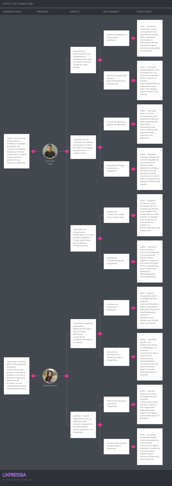

## 3.3. Product Backlog

# Capítulo IV: Product Design

## 4.1. Style Guidelines

Las **Style Guidelines** de MaquiGest establecen las decisiones visuales y de interacción que deben mantenerse de forma consistente en la Landing Page y en la Web Application. Estas pautas funcionan como referencia común para el equipo al momento de diseñar e implementar interfaces, assets y componentes, evitando variaciones innecesarias entre productos y dispositivos.

La propuesta toma como base la identidad ya implementada en la Landing Page de MaquiGest y la extiende a la Web Application. Además, se adoptan principios de **Material Design** para la jerarquía, los estados, el feedback visual y la consistencia de los componentes. En la futura implementación de la Web Application, estos criterios se alinean con el uso de **Angular Material**.

### 4.1.1. General Style Guidelines

#### Tone of Voice

El tono de comunicación de MaquiGest se define como **serio, formal, respetuoso y sereno**. La plataforma se dirige principalmente a empresas que necesitan controlar operaciones de alquiler y a pequeñas empresas constructoras que requieren maquinaria para sus proyectos, por lo que la comunicación debe transmitir control, claridad y confianza.

- **Serio:** se priorizan mensajes útiles y orientados a la operación del negocio.
- **Formal:** se emplean expresiones claras y profesionales, evitando lenguaje ambiguo o excesivamente coloquial.
- **Respetuoso:** los mensajes de ayuda, error y validación orientan al usuario sin atribuirle culpa.
- **Sereno:** incluso en estados de mantenimiento, retraso o incidencia, la interfaz informa la situación y la acción disponible sin recurrir a mensajes alarmistas.

#### Branding

MaquiGest utiliza una identidad visual asociada a la gestión de maquinaria y a la digitalización de operaciones. El logotipo combina una **M** con elementos gráficos vinculados a maquinaria pesada, mientras que el naranja funciona como acento de energía y acción. El azul oscuro refuerza los atributos de confianza, control y estabilidad.

El logotipo completo se utiliza en cabeceras, hero sections y piezas promocionales. El isotipo se reserva para espacios compactos como favicon, navegación móvil o identificadores de aplicación. Debe mantenerse la proporción original del recurso y evitar cambios arbitrarios de color, rotación, deformación o fondos que reduzcan el contraste.

#### Typography

La familia tipográfica principal es **Inter**, importada en la implementación actual de la Landing Page con pesos `400`, `500`, `600`, `700`, `800` y `900`. Se seleccionó por su alta legibilidad en pantallas y por su comportamiento consistente en interfaces con cards, formularios, dashboards y tablas.

Se establece la siguiente jerarquía como referencia:

| Nivel | Referencia de uso | Peso sugerido |
|---|---|---:|
| H1 / Hero | Mensaje principal de Landing Page y títulos de alto impacto | 700–800 |
| H2 / Section title | Títulos de Benefits, Features, Solutions, Plans, etc. | 700 |
| H3 / Card title | Títulos de cards, planes y módulos de aplicación | 600–700 |
| Body | Descripciones, formularios, tablas y contenido general | 400 |
| Caption / Helper | Badges, metadatos, ayudas y estados | 400–500 |
| Button label | CTA y acciones operativas | 600 |

#### Colors

La paleta se toma de los tokens presentes en `css/global.css` de la Landing Page actual.

| Token | Hex | Aplicación |
|---|---|---|
| Primary | `#1E3A5F` | Branding, títulos, navegación y elementos principales |
| Primary Dark | `#1E293B` | Texto de alto contraste y superficies oscuras |
| Primary Light | `#E2E8F0` | Fondos suaves, selección y superficies secundarias |
| Secondary | `#2563EB` | Enlaces, focus y acciones secundarias |
| Accent | `#F59E0B` | CTA principal y acciones destacadas |
| Background | `#F8FAFC` | Fondo general de la experiencia |
| Surface | `#FFFFFF` | Cards, formularios y paneles |
| Text Muted | `#64748B` | Descripciones, metadatos y texto auxiliar |
| Border | `#E2E8F0` | Bordes, divisores y contornos |

En la Web Application se utilizan además colores semánticos para estados de operación: verde para disponibilidad o éxito, azul para estados confirmados, naranja para mantenimiento o atención requerida y rojo para error o acciones críticas.

#### Spacing

El sistema de espaciado se organiza a partir de una base de **8 px**, utilizando principalmente `8`, `16`, `24`, `32` y `48 px` para márgenes, paddings y separación entre bloques. La implementación actual también define radios de `10 px`, `16 px`, `24 px`, `30 px` y `999 px` para pills.

El ancho compartido de contenido de la Landing Page es de **1080 px** (`--page-max-width`), con adaptación progresiva a pantallas de menor tamaño. Las cards y paneles utilizan sombras suaves para generar jerarquía sin sobrecargar la interfaz.

<p align="center">
  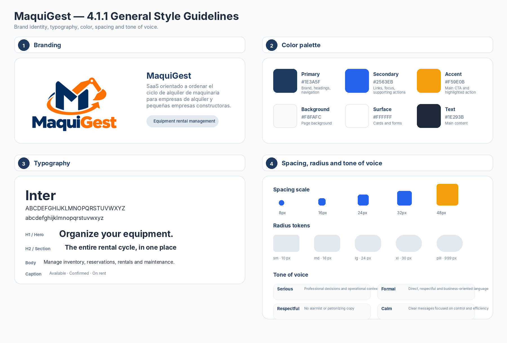
</p>

### 4.1.2. Web Style Guidelines

Las Web Style Guidelines trasladan la identidad general de MaquiGest a interfaces web responsive. La Landing Page utiliza una navegación horizontal y una organización secuencial de contenido, mientras que la Web Application utiliza navegación por módulos, cards, formularios, filtros y tablas o listas operativas.

#### Material Design and Components

El lenguaje visual de MaquiGest toma **Material Design** como referencia para la jerarquía, la separación de superficies, la consistencia de acciones, el feedback y los estados de interacción. Para la Web Application, la implementación se plantea con componentes compatibles con **Angular Material**, manteniendo la identidad propia de MaquiGest mediante sus tokens de color, tipografía y espaciado.

Los componentes principales son:

| Componente | Criterio de diseño |
|---|---|
| Primary CTA | Acción principal visible; utiliza `Accent` o `Primary` según el contexto |
| Secondary Button | Acción complementaria en variante outline o superficie blanca |
| Input / Select / Textarea | Label visible, borde consistente y estados de focus, error y disabled |
| Search Bar | Búsqueda directa por nombre o código, complementada con filtros |
| Status Badge | Etiqueta breve que comunica disponibilidad o estado operativo |
| Metric Card | Resumen de indicadores principales en dashboards |
| Data Table / List | Tabla en desktop; reorganización en cards o listas cuando el ancho sea reducido |
| Sidebar / Header | Navegación principal de Web Application / Landing Page |

#### Responsive Web Design

- **Desktop Web Browser:** estructura de hasta 12 columnas; Landing Page con header horizontal y Web Application con sidebar persistente.
- **Tablet / Small Laptop:** reducción de columnas, mayor compactación de cards y reorganización progresiva de tablas.
- **Mobile Web Browser:** distribución de una columna, menú desplegable, controles de ancho disponible y transformación de tablas extensas en listas o cards.

#### Interaction States

Los elementos interactivos deben contemplar los estados **default, hover, focus, disabled, success y error**. El focus de teclado debe ser claramente visible. La Landing Page actual implementa `:focus-visible` mediante un outline azul de `3 px`, con offset de `4 px`.

#### Internationalization and Accessibility

MaquiGest considera **English (`en_US`)** como idioma predeterminado y **Latin American Spanish (`es_419`)** como idioma alternativo. La Landing Page actual ya utiliza contenido en inglés, atributos `data-es` para su variante en español y un selector `EN / ES`.

Para accesibilidad, se consideran atributos ARIA en controles y secciones, estructura semántica, textos alternativos, foco visible y respeto por la preferencia `prefers-reduced-motion`. Estas decisiones deben mantenerse en la Web Application.

<p align="center">
  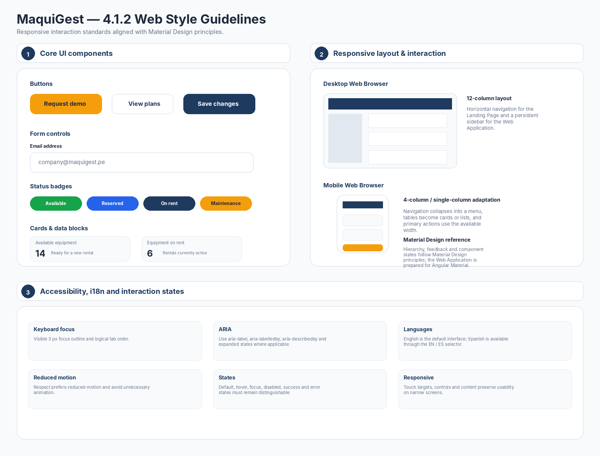
</p>

## 4.2. Information Architecture

Para el desarrollo del proyecto, la Arquitectura de la Información se plantea considerando las necesidades de los usuarios y la estructura del contenido de la plataforma. Esto permite establecer una organización coherente de las funcionalidades y reducir la complejidad durante la navegación e interacción con el sistema. 

### 4.2.1. Organization Systems

La Information Architecture de MaquiGest organiza la información de forma que tanto los visitantes de la Landing Page como los usuarios de la Web Application puedan identificar con rapidez dónde se encuentra cada contenido o acción. La propuesta combina organización jerárquica, secuencial, por tópicos y por audiencia.

### 4.2.1. Organization Systems

En la **Landing Page**, la información se organiza principalmente de manera **jerárquica y secuencial**. El visitante comienza con la propuesta de valor en Home y continúa hacia Benefits, Features, About, Solutions, Plans, Demo y Contact. Esta secuencia acompaña el proceso de conocimiento, evaluación y conversión del visitante.

En la **Web Application**, la organización es principalmente **por tópicos y por audiencia**. Después de la autenticación, la navegación se adapta al tipo de organización:

- La **empresa de alquiler de maquinaria** accede a Dashboard, Equipment, Rental Requests, Reservations, Rentals, Maintenance, Plan & Subscription y Profile.
- La **empresa constructora** accede a Dashboard, Search Equipment, Equipment Detail, My Requests, My Reservations, My Rentals y Profile.

También existe organización **secuencial** dentro del ciclo operativo: consulta o registro de maquinaria → solicitud → reserva → alquiler → entrega/devolución → inspección o mantenimiento → disponibilidad.

<p align="center">
  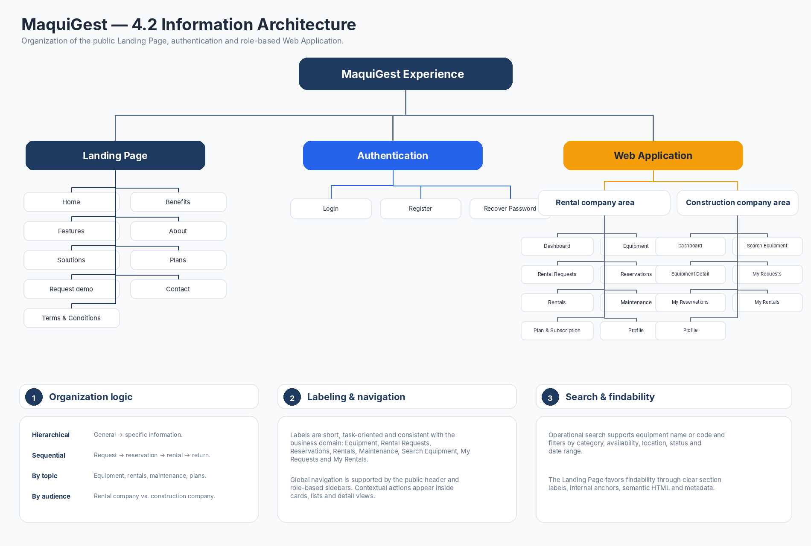
</p>

### 4.2.2. Labeling Systems

El sistema de etiquetado utiliza términos cortos, reconocibles y consistentes con las tareas del dominio. El idioma de interfaz predeterminado es inglés, manteniendo equivalentes en español mediante i18n.

| Contexto | Etiqueta principal | Asociación esperada |
|---|---|---|
| Landing Page | `Home` | Propuesta de valor y accesos principales |
| Landing Page | `Benefits` | Beneficios del uso de MaquiGest |
| Landing Page | `Features` | Capacidades principales del producto |
| Landing Page | `Solutions` | Soluciones para los segmentos objetivo |
| Landing Page | `Plans` | Planes Essential, Professional y Growth |
| Landing Page | `Request demo` | Solicitud de demostración |
| Web Application – Rental company | `Equipment` | Inventario y estado de maquinaria |
| Web Application – Rental company | `Rental Requests` | Solicitudes recibidas |
| Web Application – Rental company | `Reservations` | Reservas confirmadas |
| Web Application – Rental company | `Rentals` | Alquileres activos y seguimiento |
| Web Application – Rental company | `Maintenance` | Inspecciones, incidencias y mantenimiento |
| Web Application – Construction company | `Search Equipment` | Búsqueda de maquinaria disponible |
| Web Application – Construction company | `My Requests` | Solicitudes enviadas |
| Web Application – Construction company | `My Reservations` | Reservas confirmadas del usuario |
| Web Application – Construction company | `My Rentals` | Alquileres vigentes e historial operativo |

Los estados se comunican con etiquetas breves como `Available`, `Reserved`, `On rent`, `Maintenance`, `Confirmed`, `Pending` e `Inspection pending`, acompañadas por color pero sin depender exclusivamente de él.

### 4.2.3. SEO Tags and Meta Tags

Los SEO Tags y Meta Tags permiten describir correctamente las principales páginas de la experiencia. En la Landing Page se conservan los valores actualmente implementados. Para la Web Application se establecen valores coherentes con su propósito operativo.

| Producto | Tag | Valor |
|---|---|---|
| Landing Page | `title` | `MaquiGest` | Equipment rental management` |
| Landing Page | `description` | `Manage construction equipment rentals in one place. Organize inventory, availability, reservations, rentals and maintenance with MaquiGest.` |
| Landing Page | `keywords` | `equipment rental, construction equipment, rental management software, MaquiGest` |
| Landing Page | `author` | `CleanCode` |
| Web Application | `title` | `MaquiGest` | Equipment rental workspace` |
| Web Application | `description` | `Manage equipment, rental requests, reservations, rentals and maintenance in the MaquiGest workspace.` |
| Web Application | `keywords` | `equipment management, rental requests, reservations, rentals, maintenance, MaquiGest` |
| Web Application | `author` | `CleanCode` |

Como metadatos transversales se utiliza `charset=UTF-8` y un `viewport` adaptable a dispositivos. El documento HTML actual declara `lang="en-US"`; la variante en español se gestiona mediante i18n.

### 4.2.4. Searching Systems

El sistema de búsqueda se concentra en las zonas donde el volumen de registros puede dificultar el acceso directo a la información. En la Landing Page, la necesidad de búsqueda se resuelve principalmente mediante navegación por secciones y CTA, mientras que en la Web Application se incorpora búsqueda operativa y filtros.

| Área | Búsqueda / filtros | Presentación de resultados |
|---|---|---|
| Equipment – empresa de alquiler | Nombre, código, categoría, estado, ubicación y disponibilidad | Tabla en desktop; cards/lista en mobile |
| Rental Requests | Estado, cliente y período | Listado priorizado por estado y fecha |
| Reservations | Estado y rango de fechas | Tabla o cards con equipo, cliente y período |
| Rentals | Estado, cliente, equipo y fecha de devolución | Tabla con badges de estado y alertas temporales |
| Maintenance | Equipo, estado, tipo de mantenimiento y fecha | Listado de tareas e incidencias |
| Equipment Search – constructora | Nombre/categoría, ubicación, disponibilidad y rango de fechas | Catálogo de cards con datos esenciales del equipo |

El criterio principal es combinar **búsqueda directa** —cuando el usuario conoce el nombre o código— con **búsqueda exploratoria por filtros** cuando necesita comparar alternativas.

### 4.2.5. Navigation Systems

MaquiGest utiliza distintos niveles de navegación para ayudar al usuario a completar sus objetivos sin perder contexto.

| Tipo de navegación | Aplicación en MaquiGest |
|---|---|
| Global | Header de Landing Page y sidebar principal de la Web Application |
| Local | Módulos específicos como Equipment, Rentals, Maintenance o My Requests |
| Contextual | `View details`, editar, aprobar, rechazar, registrar entrega o devolución |
| Utility | Selector `EN / ES`, Profile, Plan & Subscription y Sign out |
| Quick actions | `Register equipment`, `Review requests`, `Register rental`, `Request demo` |
| Responsive | Menú toggle/drawer en mobile y reorganización vertical de contenido |

En la Landing Page, la navegación global conduce a `Home`, `Benefits`, `Features`, `About`, `Plans`, `Contact` y `Request demo`, mientras que `Solutions` forma parte de la secuencia de contenido. En la Web Application, la navegación se adapta al rol para evitar mostrar módulos irrelevantes.

La navegación contextual permite avanzar entre las vistas que conforman el ciclo de alquiler, mientras que las quick actions reducen la cantidad de pasos para las tareas más frecuentes. En dispositivos móviles, la navegación principal se compacta en un menú desplegable y el contenido se presenta verticalmente para preservar legibilidad y facilidad de interacción.

## 4.3. Landing Page UI Design
### 4.3.1. Landing Page Wireframe

En esta sección se presentan los wireframes de la Landing Page de MaquiGest. Estos artefactos permiten definir la estructura inicial de la interfaz, la distribución de los contenidos y la jerarquía visual de los principales elementos antes de aplicar los estilos finales del producto. Asimismo, permiten evidenciar la traducción de las decisiones tomadas previamente en las secciones de Style Guidelines e Information Architecture hacia una propuesta concreta de interfaz para la Landing Page.

La propuesta de wireframes organiza la experiencia de navegación de forma jerárquica y secuencial, guiando al visitante desde la comprensión inicial de la propuesta de valor de MaquiGest hasta las acciones de conversión, como la solicitud de una demostración o el envío de una consulta. La estructura general está compuesta por las secciones Home, Benefits, Features, About Us, Solutions, Plans, Request Demo y Contact, las cuales responden a las necesidades de los segmentos objetivo previamente identificados: pequeñas y medianas empresas de alquiler de maquinaria y pequeñas empresas constructoras.

#### Desktop Web Browser

La versión para Desktop Web Browser aprovecha el espacio horizontal para distribuir la información mediante bloques claramente diferenciados, facilitando la lectura, la comparación de contenido y la identificación de los principales llamados a la acción. La propuesta mantiene consistencia estructural entre secciones y aplica principios de jerarquía visual, alineación, proximidad y contraste, permitiendo que los visitantes comprendan de manera progresiva la solución ofrecida por MaquiGest.

##### Home

El wireframe de la sección Home presenta el primer contacto entre el visitante y la propuesta de valor de MaquiGest. En esta sección se ubican el encabezado de navegación, el mensaje principal del producto, una breve descripción y los principales Call To Action: “Solicitar Demo” y “Ver planes”. La composición está orientada a comunicar rápidamente el propósito de la plataforma y motivar al visitante a continuar explorando el sitio.

<p align="center">
  
</p>

##### Benefits

La sección Benefits organiza en tres bloques los principales beneficios de la solución. Esta disposición permite que el visitante identifique rápidamente el valor que ofrece MaquiGest, destacando aspectos como el control de disponibilidad, la centralización de operaciones y el seguimiento del estado de la maquinaria. La estructura mediante cards facilita la exploración y comparación de la información.

<p align="center">
  
</p>

##### Features

La sección Features presenta las funcionalidades principales de la plataforma mediante seis cards distribuidas en una retícula. Esta organización permite representar de forma clara y ordenada las herramientas más importantes de MaquiGest, como la gestión del inventario de maquinaria, disponibilidad, alquileres, entregas y devoluciones, mantenimiento e incidencias, y búsqueda o solicitud de equipos. La distribución busca favorecer la legibilidad y el reconocimiento visual de cada funcionalidad.

<p align="center">
  
</p>

##### About Us

La sección About Us comunica la identidad de la startup y la intención del producto. El wireframe emplea una composición de bloques que permite presentar información institucional de forma resumida, como la misión, la visión y los valores de CleanCode y MaquiGest. Esta organización contribuye a fortalecer la credibilidad de la propuesta y a comunicar el enfoque del equipo desarrollador.

<p align="center">
  
</p>

##### Solutions

La sección Solutions traduce de forma directa los resultados del análisis de segmentos objetivo. Su estructura permite diferenciar visualmente las soluciones orientadas a pequeñas y medianas empresas de alquiler de maquinaria y a pequeñas empresas constructoras. De esta manera, cada visitante puede identificar rápidamente la propuesta de valor más cercana a sus necesidades y relacionarla con su contexto de uso.

<p align="center">
  
</p>

##### Plans

La sección Plans organiza la información comercial de la plataforma en tres tarjetas comparables. El objetivo de esta disposición es permitir que el visitante reconozca de manera sencilla las alternativas disponibles y evalúe la opción más adecuada para su negocio. El uso de cards refuerza la claridad, la comparación entre opciones y la orientación a la conversión.

<p align="center">
  
</p>

##### Request Demo

La sección Request Demo está orientada a la conversión del visitante. El wireframe organiza el contenido en dos áreas: una zona de explicación breve sobre la demostración y un formulario para registrar los datos del interesado. Esta distribución facilita la comprensión del propósito de la sección y reduce la fricción durante el proceso de contacto inicial con la startup.

<p align="center">
  
</p>

##### Contact

La sección Contact presenta un formulario orientado a consultas generales y se complementa con un footer informativo. Su estructura prioriza la claridad en la interacción, permitiendo que el visitante identifique fácilmente los campos necesarios para enviar un mensaje. Además, el footer funciona como cierre de la experiencia, reforzando la navegación, la identidad del producto y la información complementaria del sitio.

<p align="center">
  
</p>

En conjunto, los wireframes de la Landing Page de MaquiGest evidencian una propuesta estructurada, coherente con la arquitectura de información y orientada a una experiencia de navegación clara, comprensible e inclusiva. La distribución de secciones, el uso de jerarquías visuales y la ubicación de los llamados a la acción buscan facilitar tanto la comprensión de la propuesta de valor como la interacción de los visitantes con el producto.

#### Mobile Web Browser

La versión para Mobile Web Browser adapta la estructura de la Landing Page de MaquiGest a una pantalla de menor ancho, priorizando la legibilidad, la navegación vertical y el acceso rápido a los principales llamados a la acción. Para ello, los contenidos se reorganizan en una sola columna, manteniendo la misma secuencia informativa definida en la versión desktop y preservando la coherencia con la arquitectura de información establecida previamente.

En esta propuesta, el encabezado se simplifica mediante un menú hamburguesa, lo cual permite optimizar el espacio disponible sin perder acceso a las secciones principales del sitio. Asimismo, el Hero prioriza el mensaje principal del producto y los Call To Action “Solicitar Demo” y “Ver planes”, con una disposición centrada que facilita la lectura y la interacción desde dispositivos móviles.

##### Home

La sección Home en mobile presenta la propuesta de valor de MaquiGest de forma resumida, destacando el nombre del producto, una breve descripción y los principales Call To Action. La disposición vertical permite centrar la atención del visitante en el propósito de la Landing Page desde el inicio de la experiencia.

<p align="center">
  
</p>

##### Benefits

La sección Benefits reorganiza la propuesta de beneficios en una sola card visible por bloque, priorizando la lectura secuencial y reduciendo la sobrecarga visual en pantallas pequeñas. Esta adaptación mantiene claridad en la presentación del valor de la plataforma.

<p align="center">
  
</p>

##### Features

La sección Features adapta las funcionalidades principales a una experiencia vertical y progresiva. Cada funcionalidad se presenta en tarjetas individuales, permitiendo al usuario concentrarse en un elemento a la vez y comprender con facilidad las capacidades principales de MaquiGest.

<p align="center">
  
</p>

##### About Us

La sección About Us en mobile conserva la información institucional de forma resumida y jerarquizada. Los bloques de contenido se disponen verticalmente para facilitar la lectura y mantener una presentación limpia y comprensible sobre la identidad de CleanCode y MaquiGest.

<p align="center">
  
</p>

##### Solutions

La sección Solutions mantiene la diferenciación de la propuesta de valor para los segmentos objetivo, reorganizando el contenido en formato vertical. Esta decisión favorece la identificación progresiva de cada solución y mejora la experiencia de lectura en dispositivos móviles.

<p align="center">
  
</p>

##### Plans

La sección Plans reorganiza las alternativas disponibles en un formato vertical, permitiendo que cada plan sea visualizado individualmente. Esta adaptación mejora la comparación y facilita que el visitante identifique la opción más adecuada sin afectar la claridad del contenido.

<p align="center">
  
</p>

##### Request Demo

La sección Request Demo en mobile prioriza la simplicidad de interacción, presentando el contenido explicativo y el formulario en una estructura vertical. Esta organización reduce la fricción y facilita el registro de datos desde una pantalla táctil.

<p align="center">
  
</p>

##### Contact

La sección Contact adapta el formulario y el footer al entorno móvil, manteniendo una disposición clara de campos y botones para favorecer la interacción del visitante. De esta forma, se asegura una experiencia consistente y accesible al cierre del recorrido de la Landing Page.

<p align="center">
  
</p>

En conjunto, la propuesta mobile mantiene la estructura, jerarquía y objetivos de conversión de la Landing Page de MaquiGest, adaptándolos a las características de navegación propias de dispositivos móviles. La organización en una sola columna, el uso de un menú simplificado y la disposición vertical de las cards y formularios contribuyen a una experiencia clara, comprensible e inclusiva.

### 4.3.2. Landing Page Mock-up

En esta sección se presentan los mock-ups de la Landing Page de MaquiGest para las versiones Desktop Web Browser y Mobile Web Browser. A diferencia de los wireframes, los mock-ups incorporan los elementos visuales definidos para el producto, como colores, tipografía, iconografía, estilos de botones, cards, formularios y demás componentes de interfaz, permitiendo representar una versión más cercana al resultado final de la Landing Page.

La propuesta mantiene la estructura y jerarquía establecidas previamente en los wireframes y aplica de manera consistente el Design System de MaquiGest. La identidad visual utiliza principalmente tonos azul oscuro, azul y naranja, acompañados de fondos claros que favorecen la legibilidad y permiten destacar los principales Call To Action.

Asimismo, los mock-ups evidencian la aplicación de principios de jerarquía visual, alineación, proximidad, consistencia y contraste. La organización del contenido facilita que los visitantes comprendan progresivamente la propuesta de valor, conozcan los beneficios y funcionalidades del producto, identifiquen la solución correspondiente a su segmento, comparen los planes disponibles y puedan solicitar una demostración o ponerse en contacto con CleanCode.

#### Landing Page Mock-up para Desktop Web Browser

La versión Desktop Web Browser aprovecha el espacio horizontal para organizar los contenidos mediante una estructura clara y consistente. El Header mantiene visibles las principales opciones de navegación y los Call To Action, mientras que las diferentes secciones utilizan cards, bloques de contenido y formularios para facilitar la exploración de la información.

La sección Home presenta la identidad de MaquiGest y comunica directamente su propuesta de valor mediante el mensaje principal “Organize your equipment. Stay on top of every rental.”. Los botones “Request demo” y “View plans” destacan las principales acciones disponibles para el visitante.

<p align="center">
  
</p>

La sección Benefits presenta tres beneficios principales mediante cards diferenciadas visualmente: claridad sobre la disponibilidad de equipos, conexión de las operaciones de alquiler y cuidado de la maquinaria. Esta organización permite comunicar de forma rápida los principales resultados que MaquiGest busca ofrecer a sus usuarios.

<p align="center">
  
</p>

La sección Features organiza las principales funcionalidades de MaquiGest mediante una retícula de seis cards. Entre ellas se encuentran la gestión del inventario de maquinaria, disponibilidad y reservas, seguimiento de alquileres, entregas y devoluciones, mantenimiento e incidencias, y búsqueda y solicitud de equipos. Esta disposición facilita la identificación y comprensión de las capacidades principales de la plataforma.

<p align="center">
  
</p>

La sección About Us presenta a CleanCode como la startup responsable de MaquiGest. La información se organiza mediante bloques diferenciados para misión, visión y valores, reforzando la identidad del equipo y comunicando los principios que orientan el desarrollo del producto.

<p align="center">
  
</p>

La sección Solutions diferencia visualmente las propuestas dirigidas a los dos segmentos objetivo de MaquiGest. El primer bloque está orientado a empresas de alquiler de maquinaria que requieren centralizar información y operaciones durante todo el ciclo de alquiler. El segundo está dirigido a pequeñas empresas constructoras que necesitan buscar equipos, consultar disponibilidad y gestionar sus solicitudes de alquiler.

<p align="center">
  
</p>

La sección Plans presenta los planes Essential, Professional y Growth mediante cards comparables. Cada alternativa muestra su precio referencial, propósito, principales funcionalidades y un Call To Action para solicitar una demostración. El plan Professional recibe un tratamiento visual destacado mediante la etiqueta “Recommended”, estableciendo una jerarquía entre las alternativas sin impedir su comparación.

<p align="center">
  
</p>

La sección Request Demo utiliza una composición de dos columnas. En el lado izquierdo se explica brevemente el propósito de la demostración, mientras que en el lado derecho se presenta un formulario con los datos necesarios para registrar el interés del visitante. El botón “Send demo request” funciona como Call To Action principal de la sección y utiliza el color de acento para reforzar su visibilidad.

<p align="center">
  
</p>

Finalmente, la sección Contact permite realizar consultas generales mediante un formulario simplificado compuesto por nombre, correo electrónico y mensaje. El Footer complementa el cierre de la experiencia mediante la identidad visual de MaquiGest, accesos de navegación, información de copyright y el enlace a los términos y condiciones.

<p align="center">
  
</p>

En conjunto, los mock-ups para Desktop Web Browser muestran la evolución visual de los wireframes y evidencian la aplicación coherente de la identidad visual y del Design System de MaquiGest. La combinación de jerarquía visual, contraste, agrupación de contenido, componentes reutilizables y Call To Action claramente identificables busca proporcionar una experiencia clara, consistente y orientada a las necesidades de los segmentos objetivo.

#### Landing Page Mock-up para Mobile Web Browser

La versión Mobile Web Browser adapta la propuesta visual de la Landing Page de MaquiGest a pantallas de menor tamaño, manteniendo la misma estructura, identidad visual y objetivos de conversión definidos para la versión desktop. En esta adaptación, los contenidos se reorganizan en una sola columna, priorizando la lectura vertical, la claridad de los elementos interactivos y la facilidad de navegación desde dispositivos móviles.

La propuesta conserva los lineamientos del Design System de MaquiGest mediante el uso consistente de colores, tipografía, botones, cards y formularios. Asimismo, se aplican principios de jerarquía visual, contraste, proximidad y consistencia para asegurar que la experiencia en dispositivos móviles continúe siendo clara, comprensible y alineada con las necesidades de los segmentos objetivo.

La sección Home concentra la propuesta de valor principal de MaquiGest en una composición vertical. El mensaje central, los botones “Request demo” y “View plans”, y la presencia destacada del logotipo permiten que el visitante identifique rápidamente el propósito de la plataforma desde el inicio de la navegación.

<p align="center">
  
</p>

La sección Benefits reorganiza los beneficios principales en tarjetas apiladas verticalmente, favoreciendo la lectura secuencial y la comprensión rápida del valor de la solución. Esta disposición permite destacar con claridad la disponibilidad, la conexión de operaciones y el cuidado de la maquinaria.

<p align="center">
  
</p>

La sección Features presenta las funcionalidades principales de la plataforma mediante cards verticales, facilitando la lectura de cada capacidad del sistema en una pantalla reducida. Esta distribución permite al visitante reconocer progresivamente funciones como el inventario de maquinaria, disponibilidad y reservas, seguimiento de alquileres, entregas y devoluciones, mantenimiento e incidencias, y búsqueda o solicitud de equipos.

<p align="center">
  
</p>

La sección About Us adapta la información institucional de CleanCode y MaquiGest a una estructura vertical, presentando de forma clara la misión, visión y valores del equipo. El uso de bloques diferenciados favorece la legibilidad y evita la saturación de contenido en la interfaz móvil.

<p align="center">
  
</p>

La sección Solutions mantiene la diferenciación de la propuesta de valor para los segmentos objetivo de MaquiGest. En la versión mobile, los bloques se presentan uno debajo del otro, permitiendo que el visitante identifique con claridad la solución orientada a empresas de alquiler de maquinaria y la propuesta dirigida a pequeñas empresas constructoras.

<p align="center">
  
</p>

La sección Plans reorganiza las alternativas disponibles en un formato vertical, permitiendo visualizar cada plan de manera individual. Esta adaptación mejora la comparación y mantiene una lectura clara de los planes Essential, Professional y Growth, así como de sus respectivas características y llamados a la acción.

<p align="center">
  
</p>
<p align="center">
  
</p>

La sección Request Demo combina una breve explicación de la demostración con un formulario adaptado a interacción táctil. La disposición en una sola columna facilita el ingreso de datos desde un dispositivo móvil y mantiene visible el Call To Action principal para enviar la solicitud.

<p align="center">
  
</p>

Finalmente, la sección Contact presenta un formulario simplificado para consultas generales y un footer adaptado al entorno móvil. La disposición vertical de los enlaces, el contenido institucional y la información complementaria permite cerrar la experiencia de navegación de manera ordenada y consistente con la identidad visual del producto.

<p align="center">
  
</p>

En conjunto, los mock-ups para Mobile Web Browser evidencian la adaptación del diseño visual de MaquiGest a dispositivos móviles, manteniendo coherencia con la versión desktop y aplicando de forma consistente el Design System del producto. La organización vertical, la claridad de los componentes y la visibilidad de los llamados a la acción contribuyen a una experiencia intuitiva, accesible y orientada a la conversión.


## 4.4. Web Applications UX/UI Design

### 4.4.1. Web Applications Wireframes

Los wireframes de la Web Application de MaquiGest representan la estructura funcional y la organización de las principales interfaces antes de incorporar los elementos visuales definitivos del Design System. Estos artefactos permiten definir la jerarquía de información, los componentes de interacción y los recorridos principales que realizarán los usuarios dentro de la aplicación.

Las interfaces consideran experiencias diferenciadas para los dos segmentos objetivo. Las empresas de alquiler de maquinaria disponen de funcionalidades orientadas a la gestión del inventario, solicitudes, reservas, alquileres y mantenimiento; mientras que las pequeñas empresas constructoras acceden a funcionalidades relacionadas con la búsqueda de maquinaria, consulta de disponibilidad, solicitud de alquiler y seguimiento de sus operaciones.

Cada pantalla contempla una variante para Desktop Web Browser y otra para Mobile Web Browser. En escritorio se prioriza el uso de navegación lateral, tablas, cards y paneles; mientras que en mobile los contenidos se reorganizan verticalmente y las tablas se transforman en cards para conservar la legibilidad y facilidad de interacción.
#### 1. Login

**Propósito:** Permitir que los usuarios registrados accedan de forma segura a MaquiGest mediante sus credenciales.

**Elementos clave:**
- Logotipo de MaquiGest y selector de idioma.
- Campo de correo electrónico y campo de contraseña.
- Acción principal para iniciar sesión.
- Enlace para recuperar la contraseña.
- Enlace para crear una nueva cuenta.

**Desktop Web Browser**

<p align="center">
  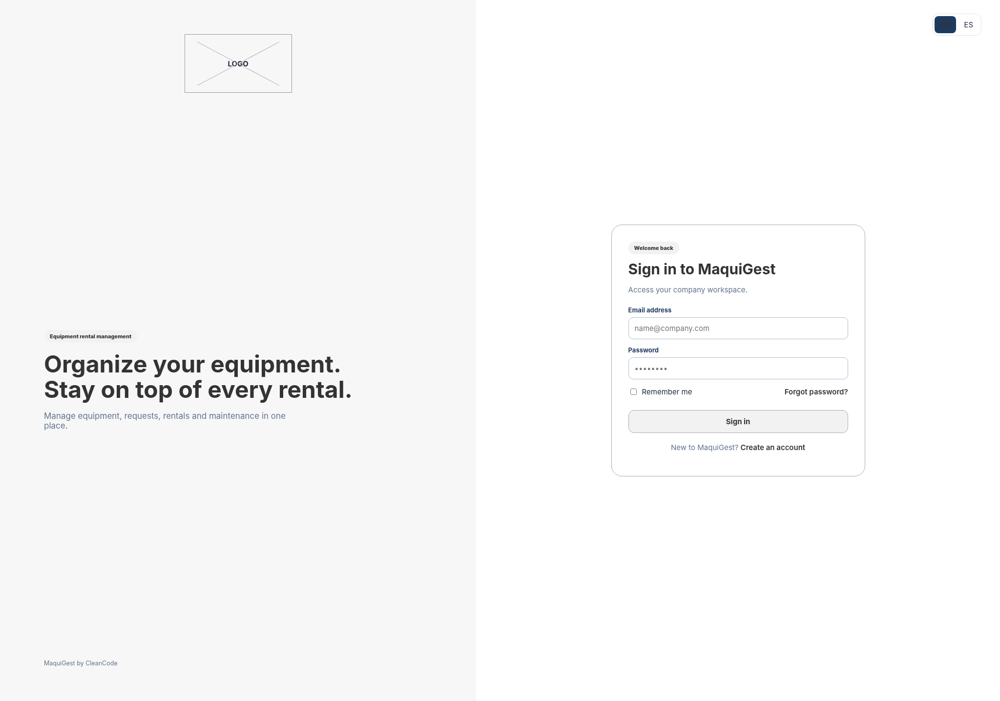
</p>

**Mobile Web Browser**

<p align="center">
  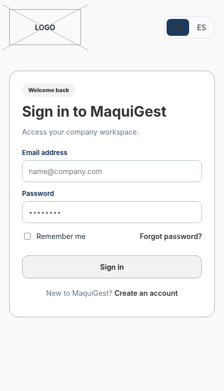
</p>

#### 2. Registro de usuario

**Propósito:** Permitir la creación de una cuenta y recopilar la información necesaria para identificar al usuario y su organización dentro de MaquiGest.

**Elementos clave:**
- Datos personales del usuario.
- Correo electrónico y contraseña.
- Información básica de la empresa.
- Selección del tipo de organización.
- Acción para crear la cuenta.
- Enlace para volver al inicio de sesión.

**Desktop Web Browser**

<p align="center">
  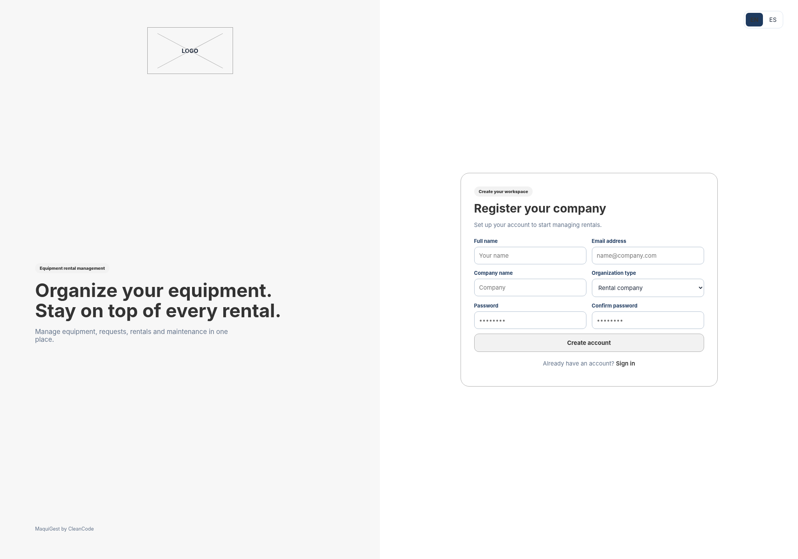
</p>

**Mobile Web Browser**

<p align="center">
  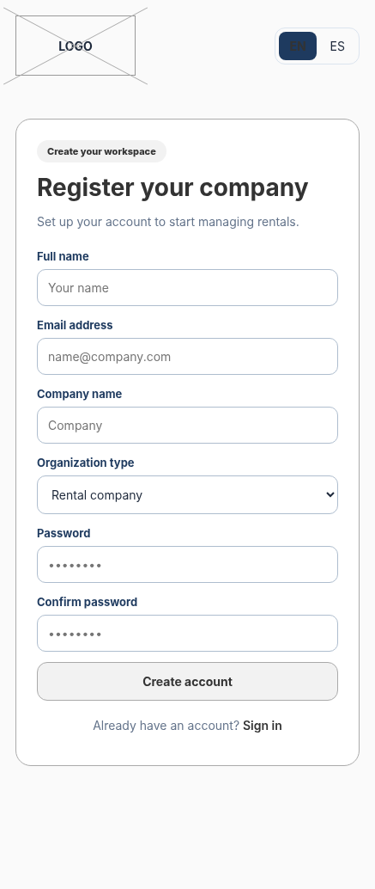
</p>

#### 3. Recuperación de contraseña

**Propósito:** Permitir que un usuario que no recuerda su contraseña solicite instrucciones para recuperar el acceso a su cuenta.

**Elementos clave:**
- Campo de correo electrónico.
- Acción para enviar la solicitud de recuperación.
- Mensaje informativo sobre el proceso.
- Enlace para volver al inicio de sesión.

**Desktop Web Browser**

<p align="center">
  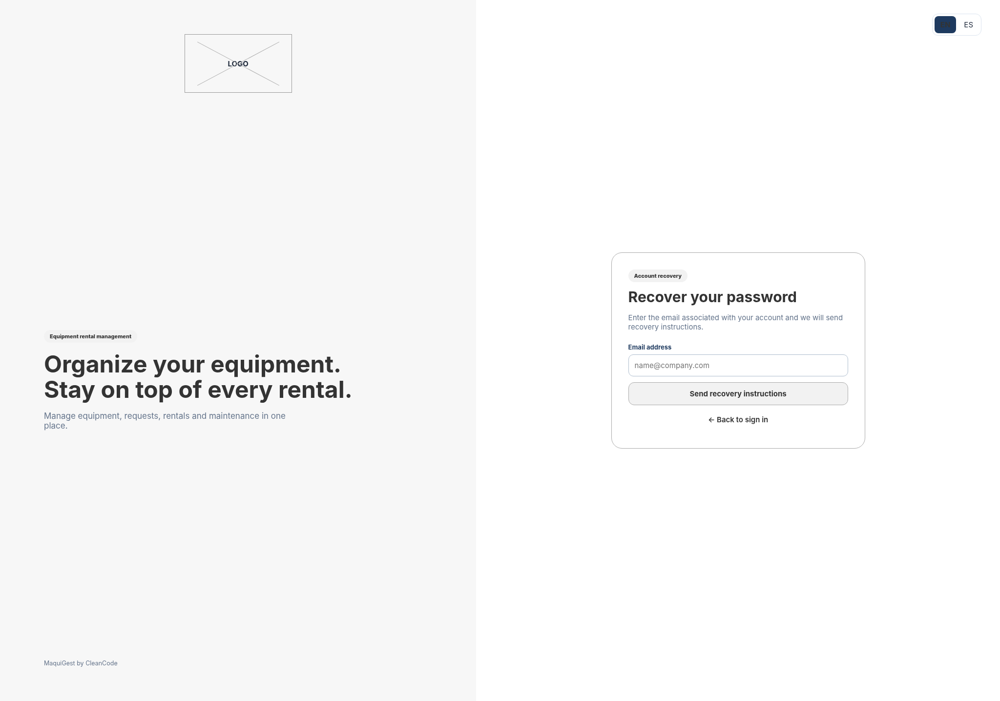
</p>

**Mobile Web Browser**

<p align="center">
  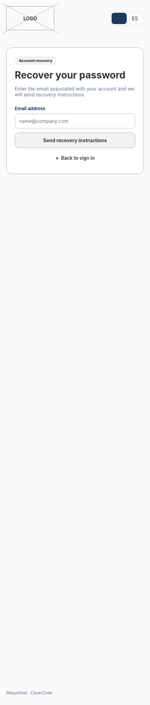
</p>

#### 4. Dashboard — Empresa de alquiler de maquinaria

**Propósito:** Proporcionar al administrador una vista general de la disponibilidad de su maquinaria y de las operaciones de alquiler, facilitando la identificación de próximas entregas, devoluciones y necesidades de mantenimiento.

**Elementos clave:**
- Navegación lateral hacia Dashboard, Equipment, Rental requests, Reservations, Rentals, Maintenance, Clients y Reports.
- Accesos rápidos para registrar maquinaria, revisar solicitudes y registrar un alquiler.
- Indicadores de maquinaria disponible, maquinaria alquilada, maquinaria en mantenimiento y próximas reservas.
- Listado de reservas confirmadas y resumen de alquileres activos con sus fechas de devolución.
- Seguimiento de inspecciones, mantenimiento y actividad reciente.
- Selector de idioma y acceso a la cuenta del administrador.

**Desktop Web Browser**

<p align="center">
  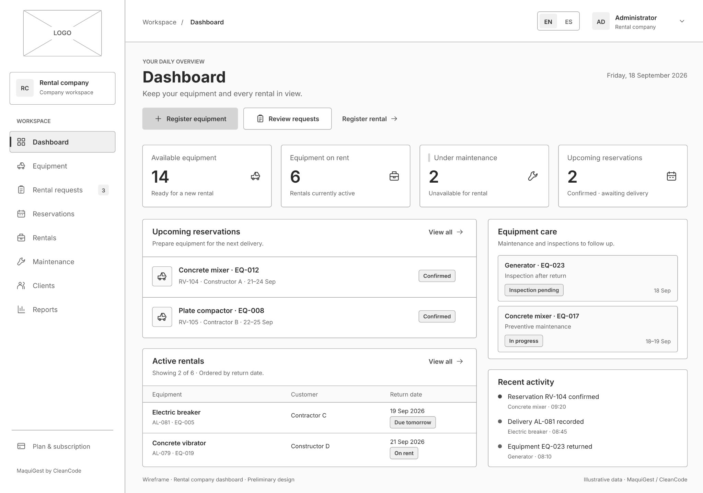
</p>

**Mobile Web Browser**

<p align="center">
  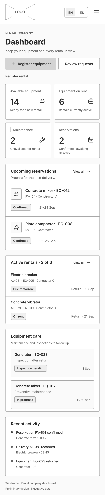
</p>

Los registros, cantidades y fechas se presentan como datos ilustrativos para representar la organización de la información.

#### 5. Equipment — Gestión de maquinaria

**Propósito:** Permitir que la empresa de alquiler consulte y administre la maquinaria registrada, identificando rápidamente su disponibilidad, estado y ubicación.

**Elementos clave:**
- Acción principal para registrar maquinaria.
- Barra de búsqueda por nombre o código.
- Filtros por categoría, estado, ubicación y disponibilidad.
- Indicadores de equipos disponibles, alquilados y en mantenimiento.
- Listado de maquinaria con código, categoría, ubicación y estado.
- Acciones para consultar detalles y editar información.

**Desktop Web Browser**

<p align="center">
  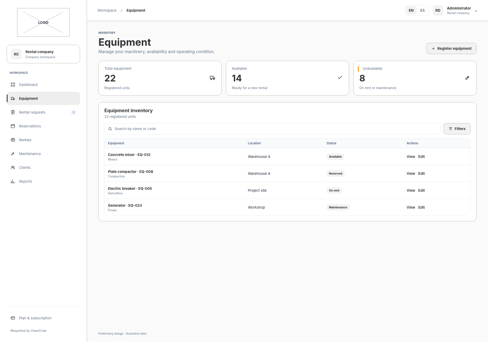
</p>

**Mobile Web Browser**

<p align="center">
  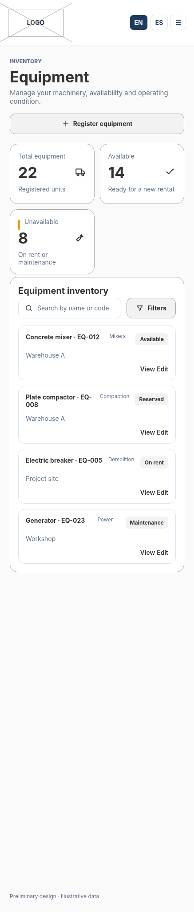
</p>

#### 6. Rental Requests — Solicitudes de alquiler

**Propósito:** Permitir que la empresa de alquiler revise las solicitudes recibidas y determine cuáles pueden ser atendidas de acuerdo con la disponibilidad de la maquinaria.

**Elementos clave:**
- Resumen de solicitudes pendientes, aprobadas y rechazadas.
- Filtros por estado y fecha.
- Información del solicitante, equipo solicitado y período.
- Acciones para revisar, aprobar o rechazar solicitudes.
- Etiquetas de estado claramente diferenciadas.

**Desktop Web Browser**

<p align="center">
  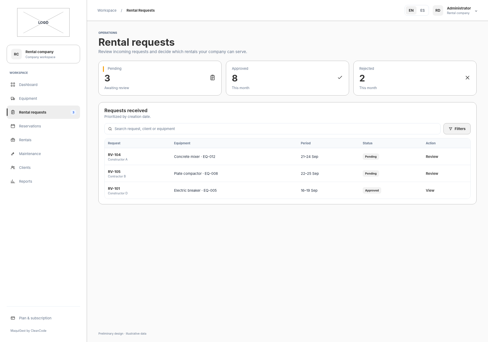
</p>

**Mobile Web Browser**

<p align="center">
  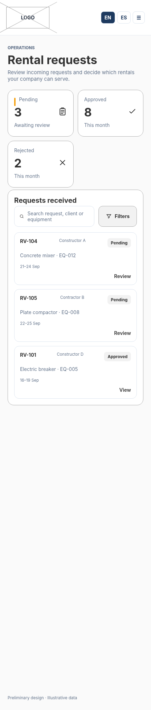
</p>

#### 7. Reservations — Reservas

**Propósito:** Permitir que la empresa de alquiler consulte y administre las reservas confirmadas de maquinaria para determinados períodos.

**Elementos clave:**
- Listado de reservas confirmadas.
- Equipo, cliente y período de reserva.
- Próximas fechas de entrega.
- Filtros por período y estado.
- Acceso al detalle de la reserva.
- Acción para continuar con el registro del alquiler.

**Desktop Web Browser**

<p align="center">
  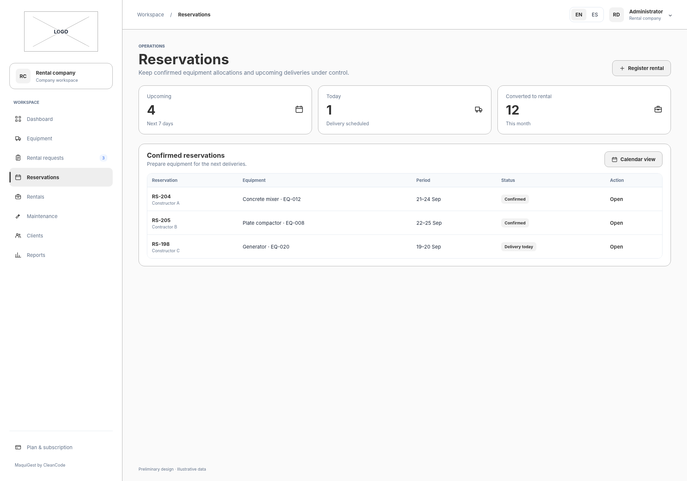
</p>

**Mobile Web Browser**

<p align="center">
  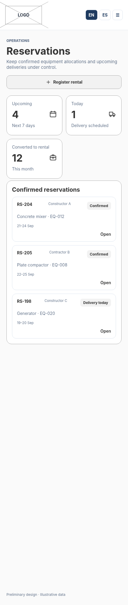
</p>

#### 8. Rentals — Alquileres

**Propósito:** Permitir que la empresa de alquiler consulte los alquileres activos y gestione las etapas de entrega y devolución de la maquinaria.

**Elementos clave:**
- Resumen de alquileres activos y próximos a vencer.
- Información de equipo, cliente, fecha de inicio y devolución.
- Estados del alquiler.
- Acciones para registrar entrega y devolución.
- Indicadores para devoluciones próximas o vencidas.

**Desktop Web Browser**

<p align="center">
  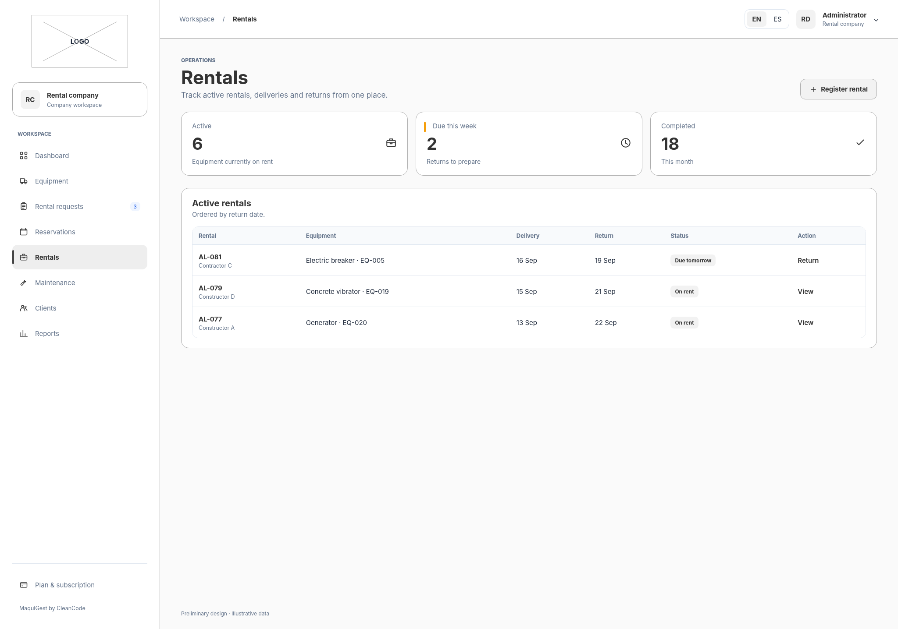
</p>

**Mobile Web Browser**

<p align="center">
  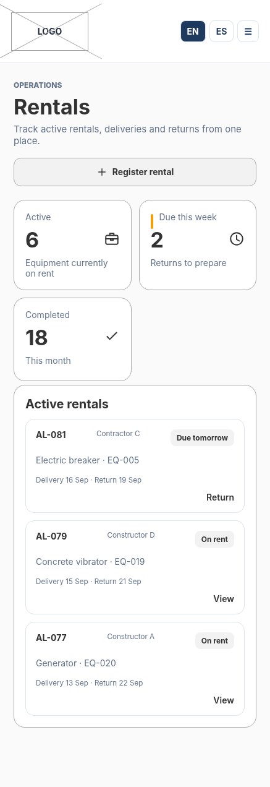
</p>

#### 9. Maintenance — Mantenimiento e incidencias

**Propósito:** Permitir que la empresa de alquiler gestione inspecciones, incidencias, mantenimientos programados y el historial operativo de la maquinaria.

**Elementos clave:**
- Resumen de equipos en mantenimiento e inspecciones pendientes.
- Listado de mantenimientos programados y en curso.
- Registro de incidencias asociadas a maquinaria.
- Fecha, tipo y estado de cada mantenimiento.
- Acciones para registrar, programar o consultar mantenimiento.

**Desktop Web Browser**

<p align="center">
  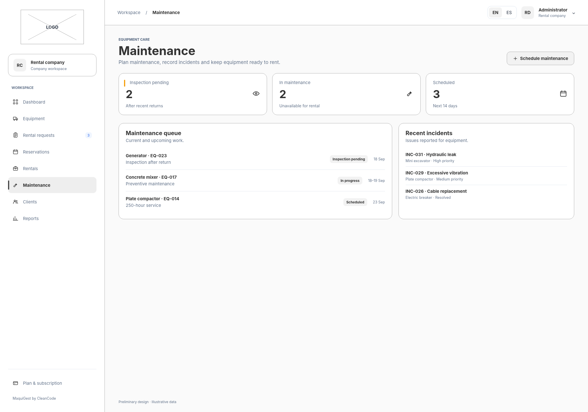
</p>

**Mobile Web Browser**

<p align="center">
  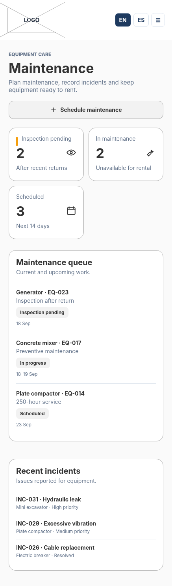
</p>

#### 10. Dashboard — Empresa constructora

**Propósito:** Proporcionar a la empresa constructora una vista general de sus solicitudes, reservas y alquileres, permitiéndole conocer rápidamente el estado de la maquinaria requerida para sus proyectos.

**Elementos clave:**
- Navegación hacia Dashboard, Search equipment, My requests, My reservations, My rentals y Profile.
- Acción principal para buscar maquinaria.
- Resumen de solicitudes pendientes y reservas próximas.
- Alquileres activos y fechas de devolución.
- Actividad reciente relacionada con solicitudes y alquileres.

**Desktop Web Browser**

<p align="center">
  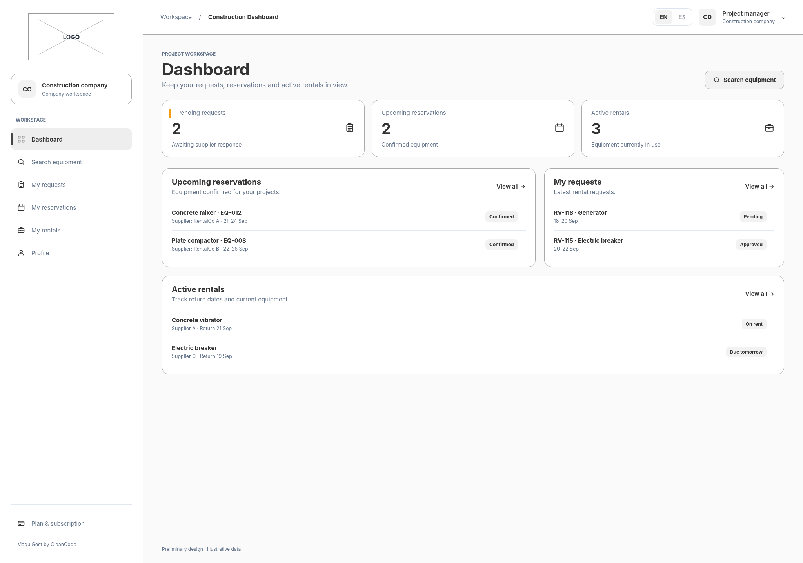
</p>

**Mobile Web Browser**

<p align="center">
  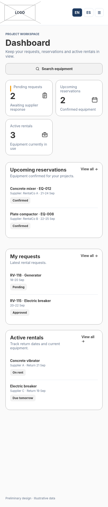
</p>

#### 11. Equipment Search — Búsqueda de maquinaria

**Propósito:** Permitir que la empresa constructora encuentre maquinaria de acuerdo con las necesidades de su proyecto.

**Elementos clave:**
- Barra de búsqueda.
- Filtros por categoría, disponibilidad, ubicación y características.
- Cards de maquinaria con nombre, código, categoría y estado.
- Información resumida de disponibilidad.
- Acción para consultar el detalle de un equipo.

**Desktop Web Browser**

<p align="center">
  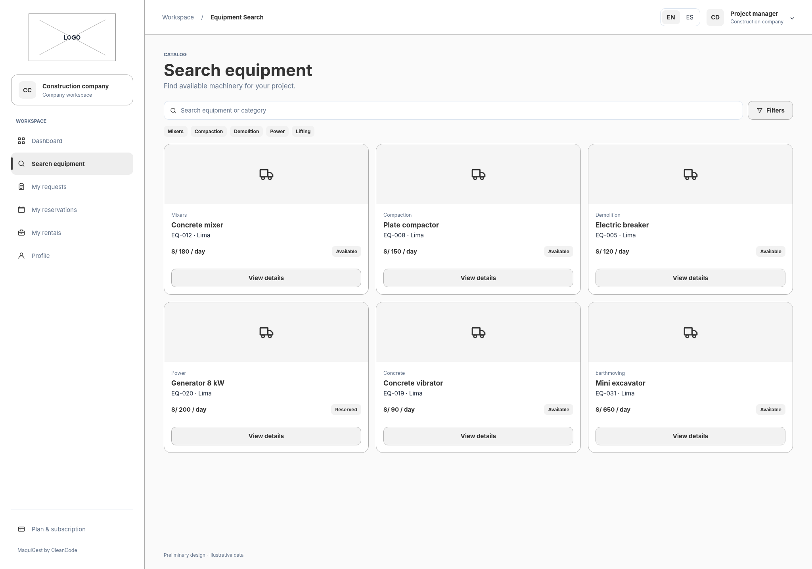
</p>

**Mobile Web Browser**

<p align="center">
  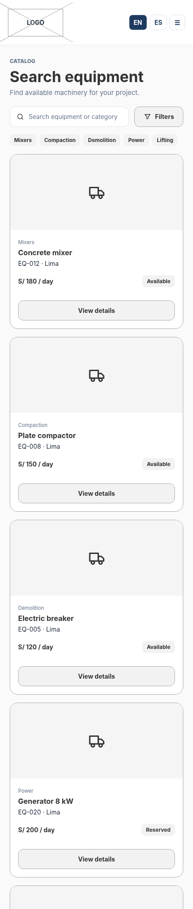
</p>

#### 12. Equipment Detail — Detalle de maquinaria

**Propósito:** Permitir que la empresa constructora consulte las características, condiciones y disponibilidad de una maquinaria antes de solicitar su alquiler.

**Elementos clave:**
- Nombre, código, categoría e información descriptiva del equipo.
- Características y condiciones de alquiler.
- Estado y disponibilidad.
- Selección del período requerido.
- Acción para consultar disponibilidad.
- Acción principal para solicitar alquiler.

**Desktop Web Browser**

<p align="center">
  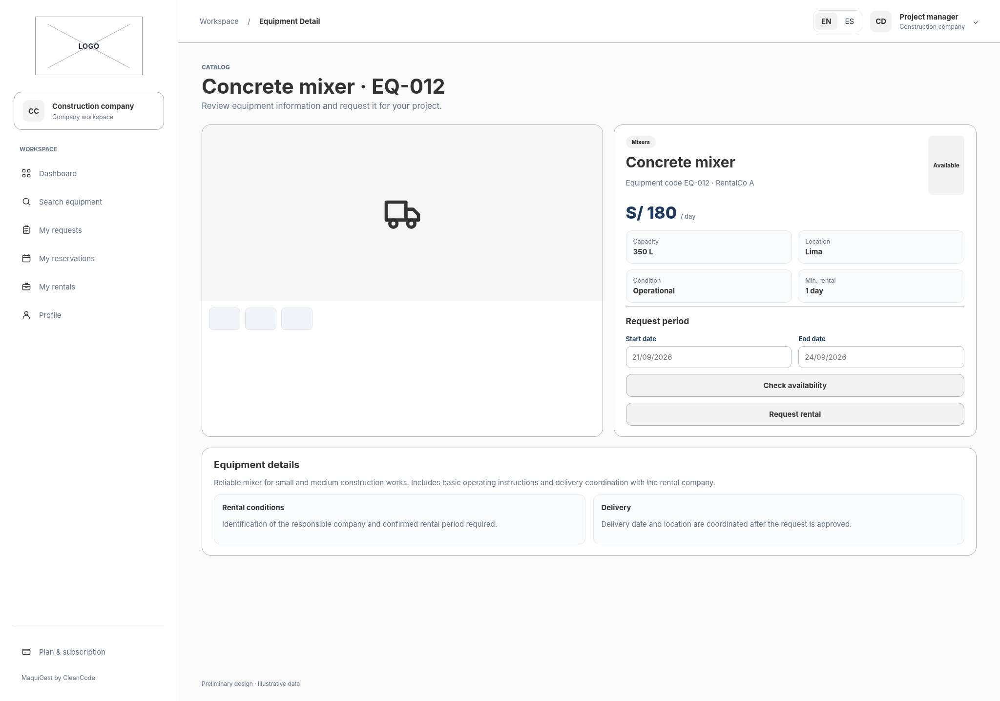
</p>

**Mobile Web Browser**

<p align="center">
  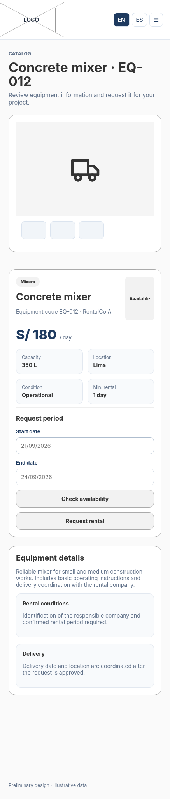
</p>

#### 13. My Requests — Mis solicitudes

**Propósito:** Permitir que la empresa constructora consulte el estado de las solicitudes de alquiler realizadas.

**Elementos clave:**
- Listado de solicitudes realizadas.
- Equipo solicitado y período requerido.
- Fecha de creación.
- Estados Pending, Approved y Rejected.
- Acceso al detalle de cada solicitud.

**Desktop Web Browser**

<p align="center">
  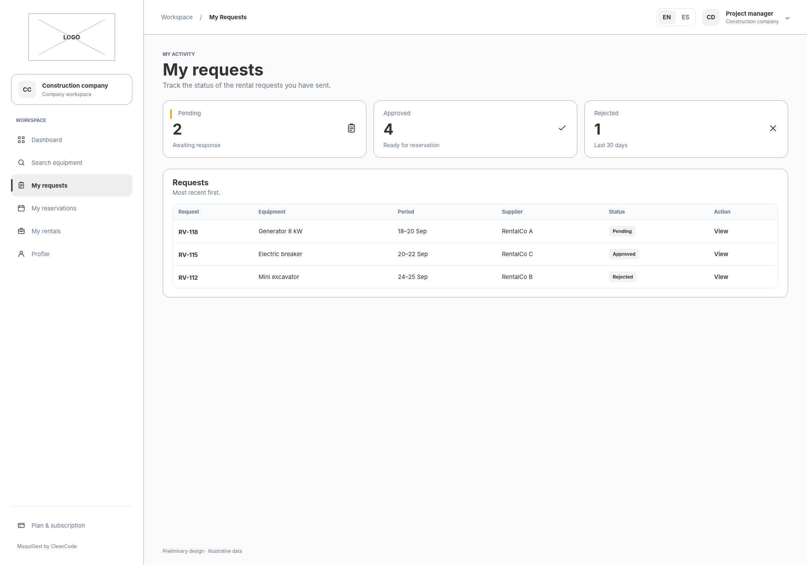
</p>

**Mobile Web Browser**

<p align="center">
  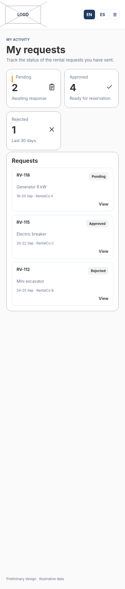
</p>

#### 14. My Reservations — Mis reservas

**Propósito:** Permitir que la empresa constructora consulte las reservas confirmadas y conozca las próximas fechas asociadas a la entrega de la maquinaria.

**Elementos clave:**
- Listado de reservas confirmadas.
- Equipo y empresa de alquiler.
- Período reservado.
- Fecha o información de próxima entrega.
- Acceso al detalle de la reserva.

**Desktop Web Browser**

<p align="center">
  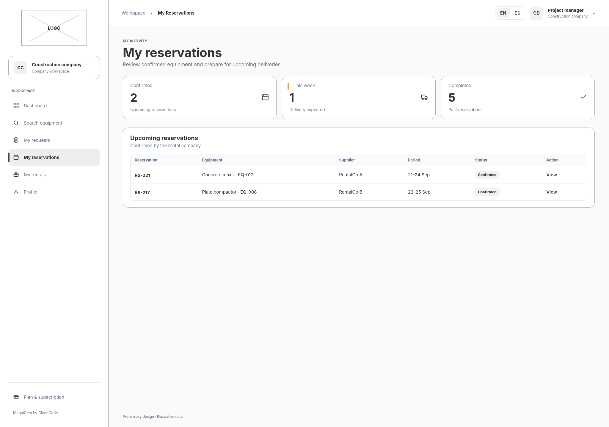
</p>

**Mobile Web Browser**

<p align="center">
  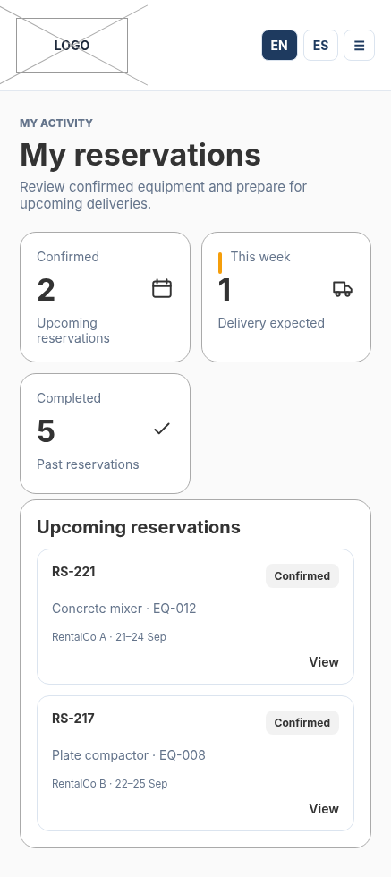
</p>

#### 15. My Rentals — Mis alquileres

**Propósito:** Permitir que la empresa constructora realice seguimiento de sus alquileres activos y conozca las fechas de devolución.

**Elementos clave:**
- Listado de alquileres activos.
- Equipo alquilado y empresa proveedora.
- Período del alquiler.
- Fecha de devolución.
- Indicadores para devoluciones próximas.
- Acceso al detalle del alquiler.

**Desktop Web Browser**

<p align="center">
  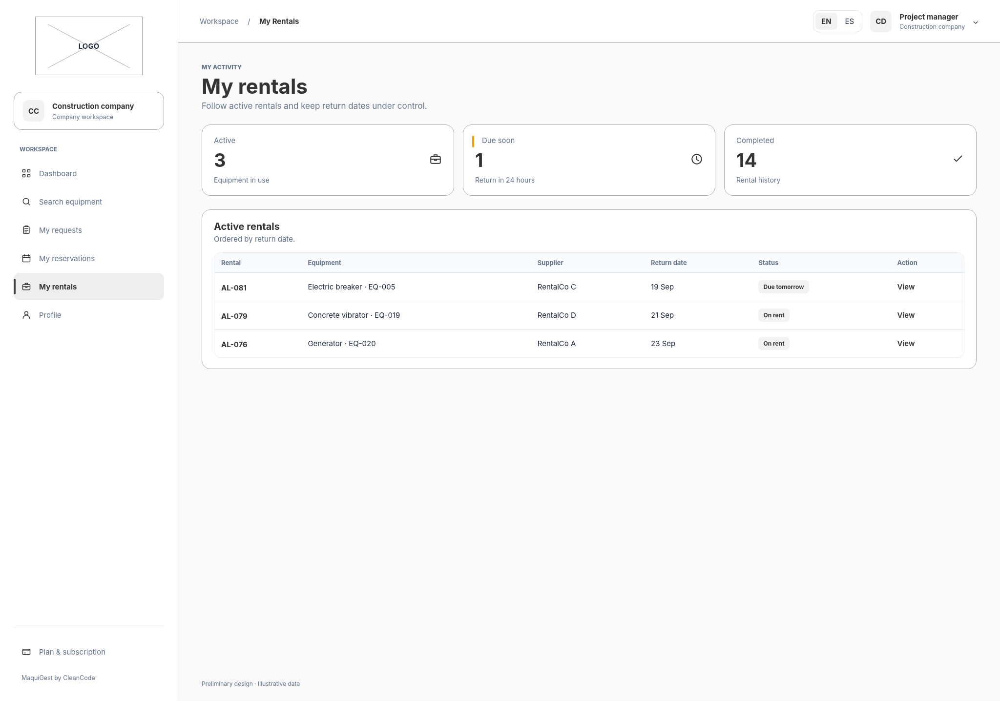
</p>

**Mobile Web Browser**

<p align="center">
  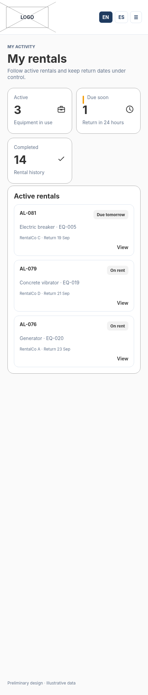
</p>

#### 16. Profile — Perfil

**Propósito:** Permitir que el usuario consulte y actualice su información personal, de contacto y de organización.

**Elementos clave:**
- Información personal.
- Información de contacto.
- Datos básicos de la organización.
- Acción para editar y guardar cambios.
- Acción para cerrar sesión.

**Desktop Web Browser**

<p align="center">
  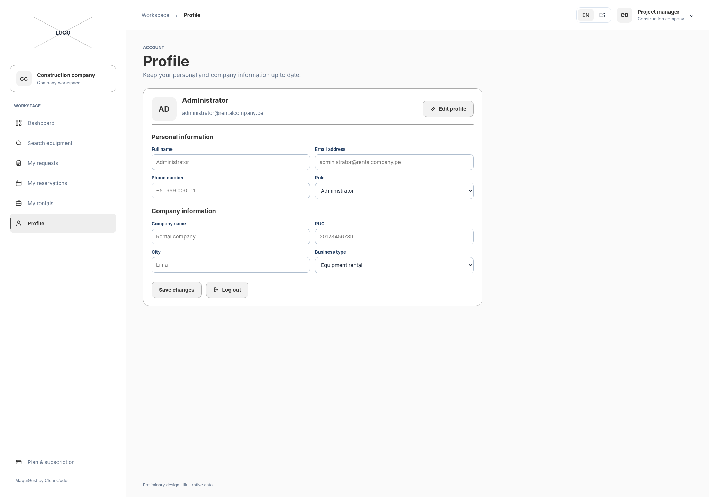
</p>

**Mobile Web Browser**

<p align="center">
  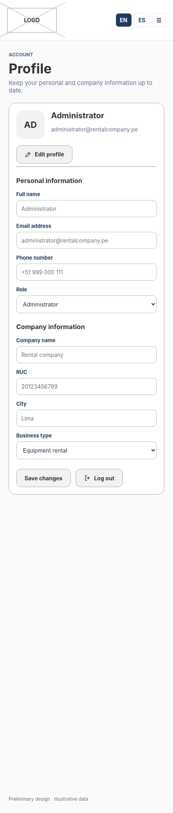
</p>

#### 17. Plan & Subscription — Plan y suscripción

**Propósito:** Permitir que la empresa consulte el plan actual y compare las alternativas disponibles para cambiar su suscripción.

**Elementos clave:**
- Plan actual y estado de la suscripción.
- Comparación de planes disponibles.
- Precio y funcionalidades principales.
- Acción para seleccionar o cambiar de plan.
- Información complementaria sobre la suscripción.

**Desktop Web Browser**

<p align="center">
  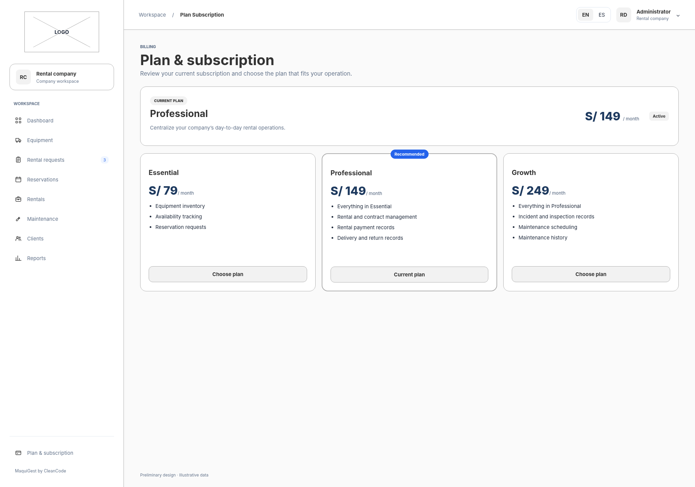
</p>

**Mobile Web Browser**

<p align="center">
  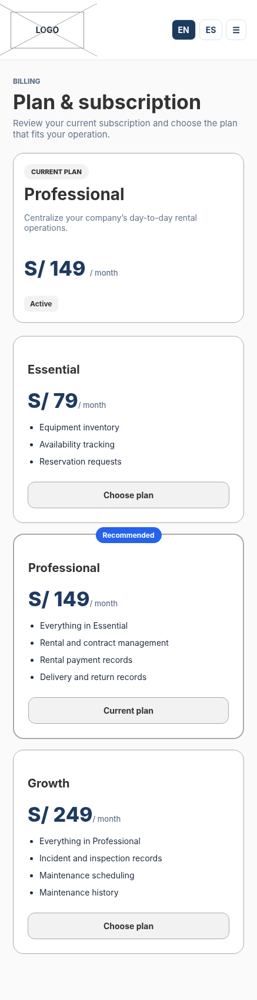
</p>

### 4.4.2. Web Applications Wireflow Diagrams

Los wireflow diagrams de la Web Application de **MaquiGest** representan la relación entre las principales pantallas del sistema y permiten visualizar el recorrido general de navegación que realizan los usuarios dentro de la plataforma. A diferencia de los wireframes, que muestran la estructura individual de cada interfaz, el wireflow permite comprender cómo se conectan las pantallas entre sí y cómo fluye la experiencia de uso de acuerdo con las acciones y decisiones del usuario.

En el caso de MaquiGest, se ha definido un wireflow general que integra los principales recorridos de la aplicación web, desde las pantallas de autenticación hasta las interfaces específicas para los dos segmentos principales de usuarios: las **empresas de alquiler de maquinaria** y las **empresas constructoras**. De esta forma, se representa de manera global la navegación principal del sistema, así como las pantallas clave que intervienen en el proceso de gestión y solicitud de maquinaria.

El recorrido inicia en la pantalla de **Login**, desde la cual el usuario puede registrarse en caso de no contar con una cuenta o recuperar su contraseña si no recuerda sus credenciales. Una vez completado el proceso de autenticación o registro, el flujo contempla una decisión relacionada con el tipo de empresa usuaria. Esta decisión divide la navegación en dos ramas principales.

Por un lado, la rama correspondiente a la **empresa de alquiler de maquinaria** conduce al dashboard principal de administración. Desde esta vista se accede a pantallas orientadas a la gestión interna de la operación, tales como **Equipment**, **Rental Requests**, **Reservations**, **Rentals**, **Maintenance**, **Plan & Subscription** y **Profile**. Estas interfaces permiten registrar y administrar maquinaria, revisar solicitudes de alquiler, gestionar reservas confirmadas, controlar alquileres activos, programar mantenimientos y administrar la suscripción del servicio.

Por otro lado, la rama correspondiente a la **empresa constructora** conduce a su propio dashboard, desde el cual el usuario puede navegar hacia **Equipment Search**, **Equipment Detail**, **My Requests**, **My Reservations**, **My Rentals** y **Profile**. Este recorrido permite buscar maquinaria disponible, consultar sus características, enviar solicitudes de alquiler y dar seguimiento a las reservas y alquileres realizados.

Asimismo, el wireflow incorpora una salida general mediante la acción de **sign out**, representando el cierre de sesión como parte del ciclo de navegación de la aplicación. En conjunto, este diagrama permite validar que las pantallas diseñadas en la sección 4.4.1 se encuentran conectadas de manera coherente y alineadas con los objetivos funcionales definidos para cada segmento de usuario.

<p align="center">
  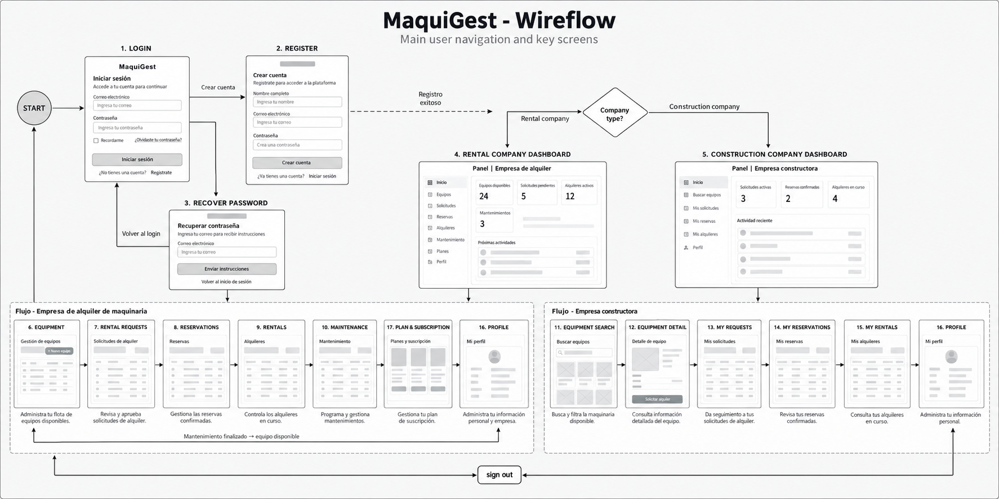
</p>

### 4.4.3. Web Applications Mock-ups

Los mock-ups de la Web Application de MaquiGest representan la propuesta visual de alta fidelidad de las interfaces definidas mediante los wireframes. Estas vistas incorporan los elementos establecidos en el Design System de MaquiGest, como la tipografía Inter, los colores corporativos, la iconografía, los botones, cards, formularios, etiquetas de estado y componentes de navegación.

La propuesta utiliza azul oscuro para la identidad y navegación principal, naranja para destacar las acciones prioritarias, azul para enlaces y acciones secundarias, y fondos claros para mantener una interfaz ordenada y legible. Los componentes mantienen una jerarquía visual consistente y comunican los estados mediante etiquetas textuales, evitando depender únicamente del color.

Las variantes Desktop Web Browser y Mobile Web Browser conservan la misma arquitectura de información y los mismos objetivos de tarea, adaptando únicamente la distribución y densidad de los componentes al espacio disponible.
#### 1. Login

**Propósito:** Presentar una interfaz que permita que los usuarios registrados accedan de forma segura a MaquiGest mediante sus credenciales.

**Elementos clave:**
- Logotipo de MaquiGest y selector de idioma.
- Campo de correo electrónico y campo de contraseña.
- Acción principal para iniciar sesión.
- Enlace para recuperar la contraseña.
- Enlace para crear una nueva cuenta.

**Desktop Web Browser**

<p align="center">
  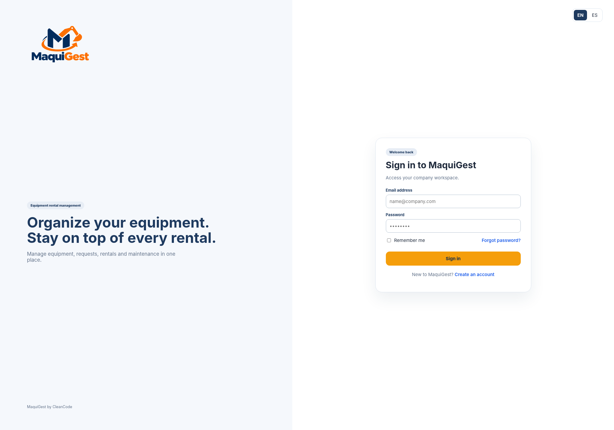
</p>

**Mobile Web Browser**

<p align="center">
  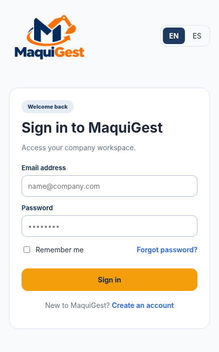
</p>

#### 2. Registro de usuario

**Propósito:** Permitir la creación de una cuenta y recopilar la información necesaria para identificar al usuario y su organización dentro de MaquiGest.

**Elementos clave:**
- Datos personales del usuario.
- Correo electrónico y contraseña.
- Información básica de la empresa.
- Selección del tipo de organización.
- Acción para crear la cuenta.
- Enlace para volver al inicio de sesión.

**Desktop Web Browser**

<p align="center">
  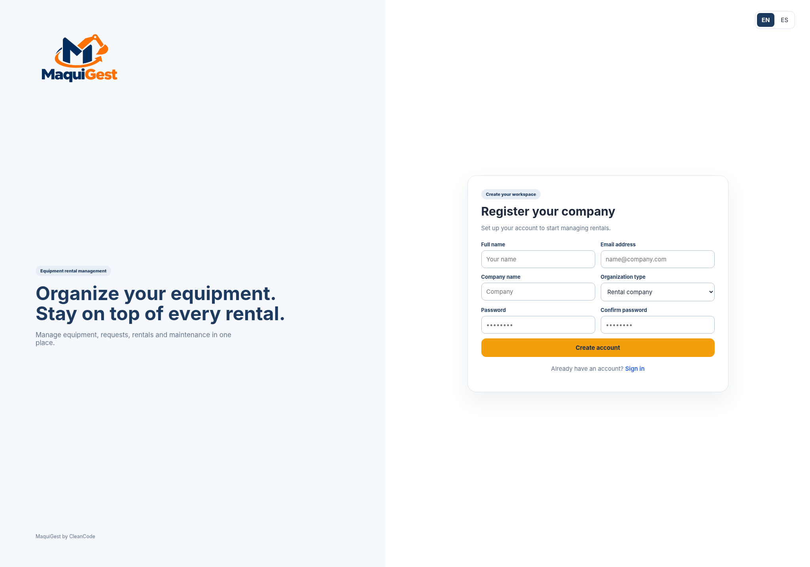
</p>

**Mobile Web Browser**

<p align="center">
  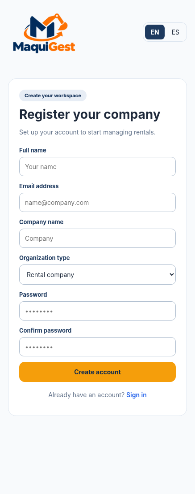
</p>

#### 3. Recuperación de contraseña

**Propósito:** Presentar una interfaz que permita que un usuario que no recuerda su contraseña solicite instrucciones para recuperar el acceso a su cuenta.

**Elementos clave:**
- Campo de correo electrónico.
- Acción para enviar la solicitud de recuperación.
- Mensaje informativo sobre el proceso.
- Enlace para volver al inicio de sesión.

**Desktop Web Browser**

<p align="center">
  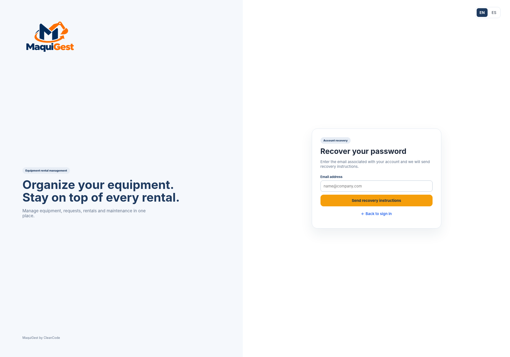
</p>

**Mobile Web Browser**

<p align="center">
  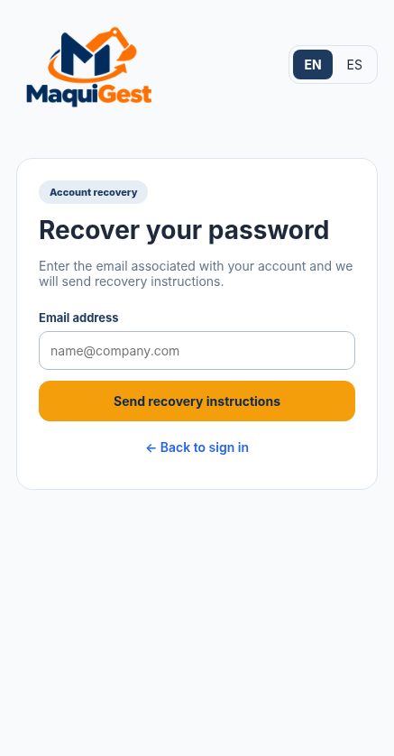
</p>

#### 4. Dashboard — Empresa de alquiler de maquinaria

**Propósito:** Presentar visualmente al administrador una vista general de la disponibilidad de su maquinaria y de las operaciones de alquiler, facilitando la identificación de próximas entregas, devoluciones y necesidades de mantenimiento.

**Elementos clave:**
- Navegación lateral hacia Dashboard, Equipment, Rental requests, Reservations, Rentals, Maintenance, Clients y Reports.
- Accesos rápidos para registrar maquinaria, revisar solicitudes y registrar un alquiler.
- Indicadores de maquinaria disponible, maquinaria alquilada, maquinaria en mantenimiento y próximas reservas.
- Listado de reservas confirmadas y resumen de alquileres activos con sus fechas de devolución.
- Seguimiento de inspecciones, mantenimiento y actividad reciente.
- Selector de idioma y acceso a la cuenta del administrador.

**Desktop Web Browser**

<p align="center">
  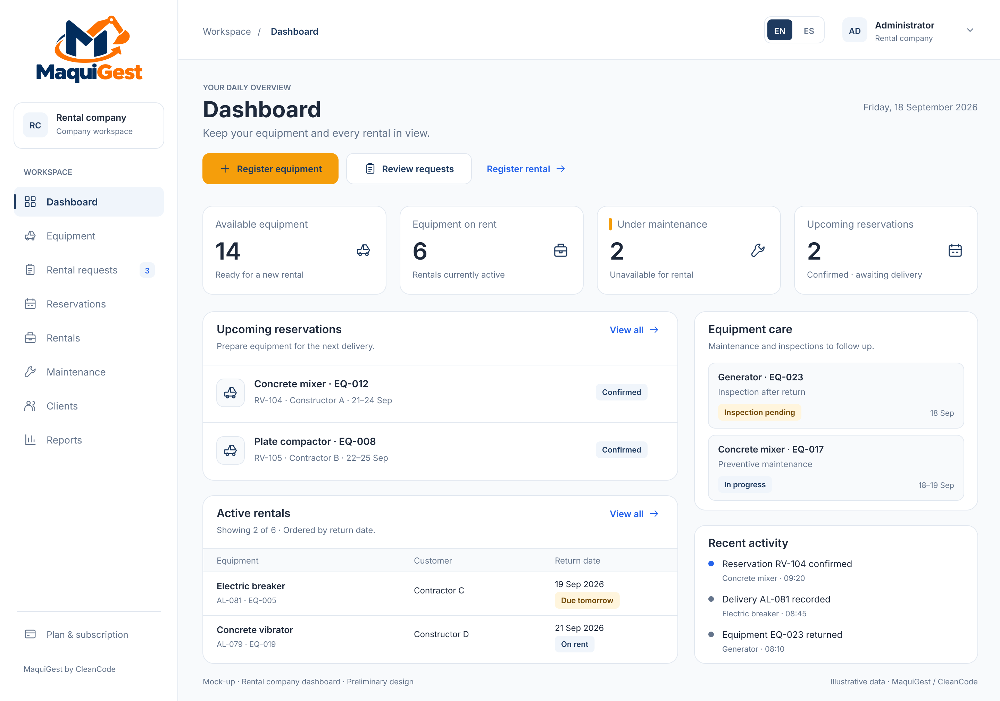
</p>

**Mobile Web Browser**

<p align="center">
  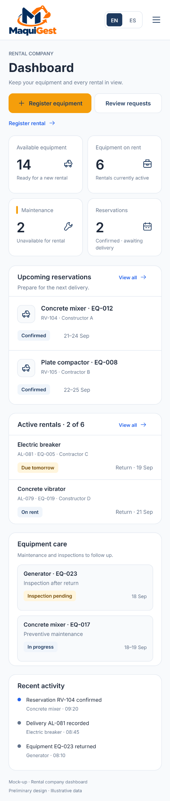
</p>

Esta propuesta utiliza datos ilustrativos y representa el diseño visual de la pantalla. Las interacciones se desarrollarán posteriormente al conectar las vistas en el prototipo.

#### 5. Equipment — Gestión de maquinaria

**Propósito:** Presentar una interfaz que permita que la empresa de alquiler consulte y administre la maquinaria registrada, identificando rápidamente su disponibilidad, estado y ubicación.

**Elementos clave:**
- Acción principal para registrar maquinaria.
- Barra de búsqueda por nombre o código.
- Filtros por categoría, estado, ubicación y disponibilidad.
- Indicadores de equipos disponibles, alquilados y en mantenimiento.
- Listado de maquinaria con código, categoría, ubicación y estado.
- Acciones para consultar detalles y editar información.

**Desktop Web Browser**

<p align="center">
  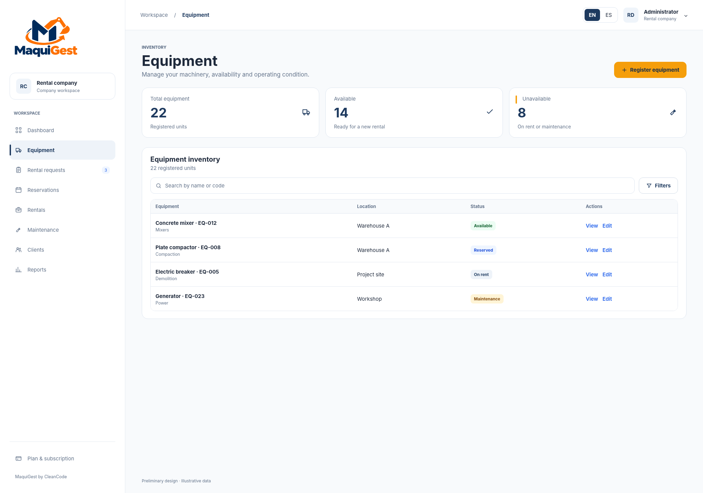
</p>

**Mobile Web Browser**

<p align="center">
  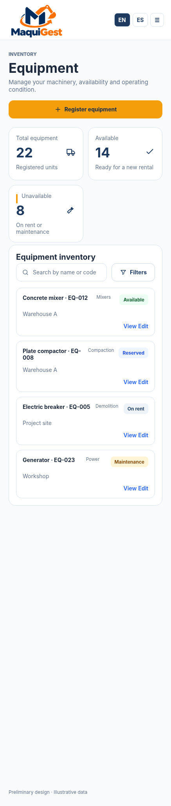
</p>

#### 6. Rental Requests — Solicitudes de alquiler

**Propósito:** Presentar una interfaz que permita que la empresa de alquiler revise las solicitudes recibidas y determine cuáles pueden ser atendidas de acuerdo con la disponibilidad de la maquinaria.

**Elementos clave:**
- Resumen de solicitudes pendientes, aprobadas y rechazadas.
- Filtros por estado y fecha.
- Información del solicitante, equipo solicitado y período.
- Acciones para revisar, aprobar o rechazar solicitudes.
- Etiquetas de estado claramente diferenciadas.

**Desktop Web Browser**

<p align="center">
  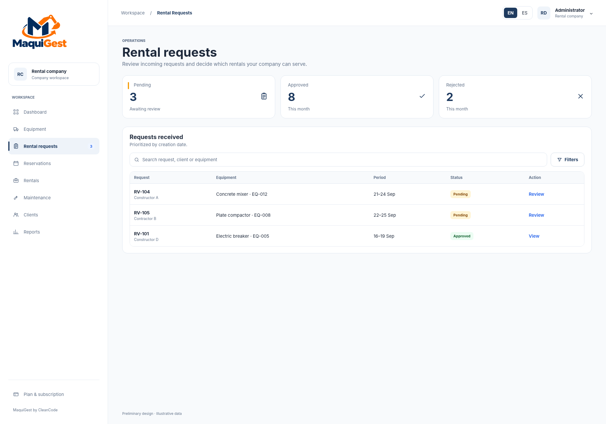
</p>

**Mobile Web Browser**

<p align="center">
  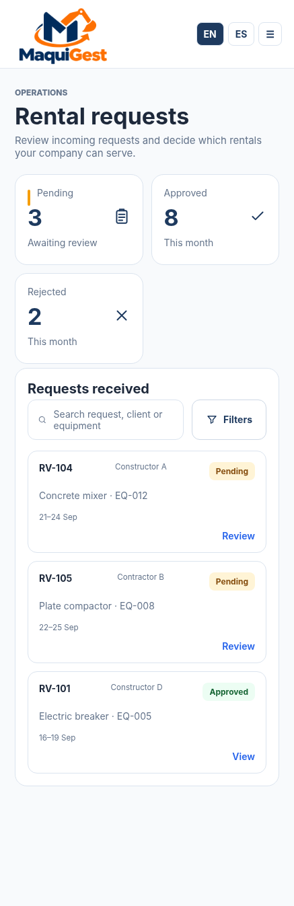
</p>

#### 7. Reservations — Reservas

**Propósito:** Presentar una interfaz que permita que la empresa de alquiler consulte y administre las reservas confirmadas de maquinaria para determinados períodos.

**Elementos clave:**
- Listado de reservas confirmadas.
- Equipo, cliente y período de reserva.
- Próximas fechas de entrega.
- Filtros por período y estado.
- Acceso al detalle de la reserva.
- Acción para continuar con el registro del alquiler.

**Desktop Web Browser**

<p align="center">
  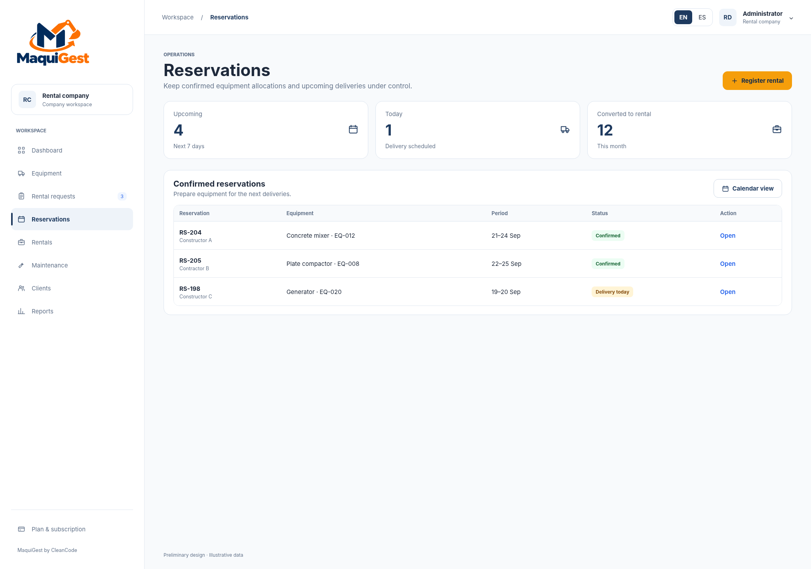
</p>

**Mobile Web Browser**

<p align="center">
  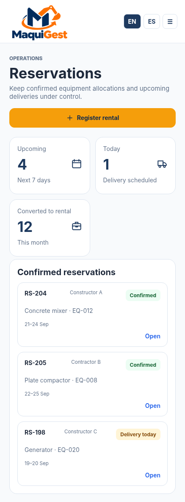
</p>

#### 8. Rentals — Alquileres

**Propósito:** Presentar una interfaz que permita que la empresa de alquiler consulte los alquileres activos y gestione las etapas de entrega y devolución de la maquinaria.

**Elementos clave:**
- Resumen de alquileres activos y próximos a vencer.
- Información de equipo, cliente, fecha de inicio y devolución.
- Estados del alquiler.
- Acciones para registrar entrega y devolución.
- Indicadores para devoluciones próximas o vencidas.

**Desktop Web Browser**

<p align="center">
  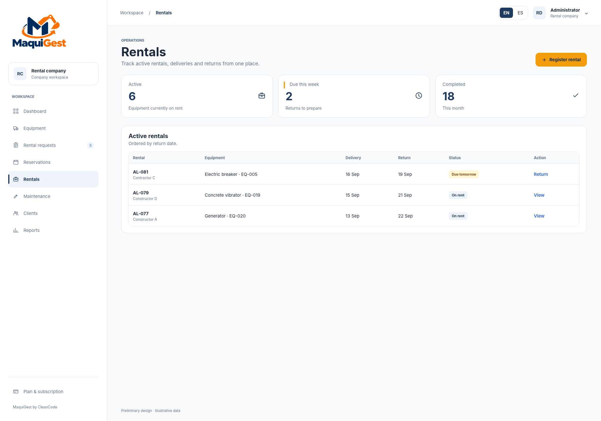
</p>

**Mobile Web Browser**

<p align="center">
  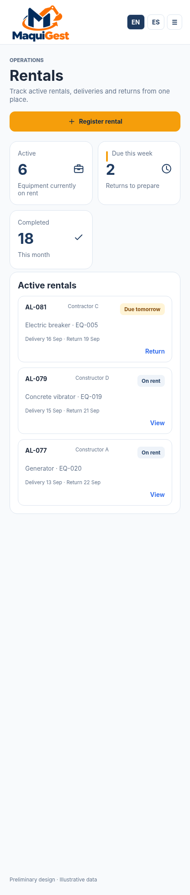
</p>

#### 9. Maintenance — Mantenimiento e incidencias

**Propósito:** Presentar una interfaz que permita que la empresa de alquiler gestione inspecciones, incidencias, mantenimientos programados y el historial operativo de la maquinaria.

**Elementos clave:**
- Resumen de equipos en mantenimiento e inspecciones pendientes.
- Listado de mantenimientos programados y en curso.
- Registro de incidencias asociadas a maquinaria.
- Fecha, tipo y estado de cada mantenimiento.
- Acciones para registrar, programar o consultar mantenimiento.

**Desktop Web Browser**

<p align="center">
  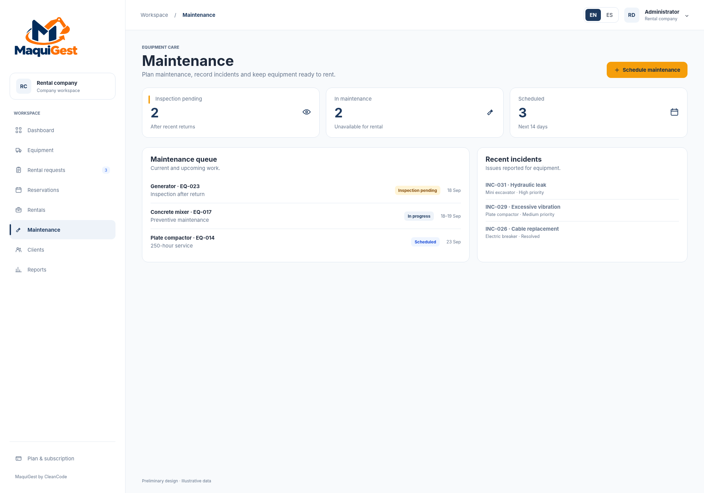
</p>

**Mobile Web Browser**

<p align="center">
  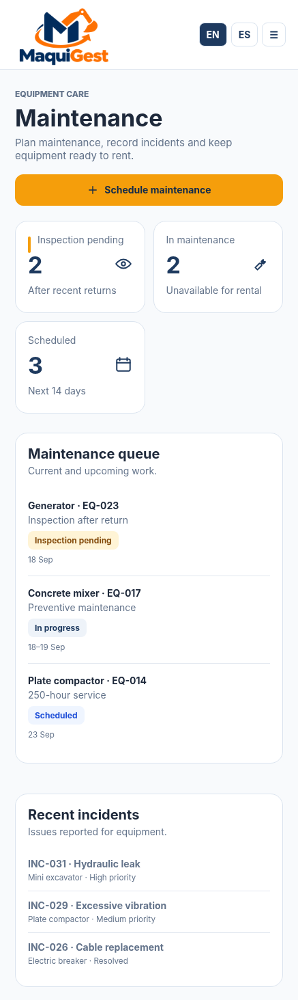
</p>

#### 10. Dashboard — Empresa constructora

**Propósito:** Presentar visualmente a la empresa constructora una vista general de sus solicitudes, reservas y alquileres, permitiéndole conocer rápidamente el estado de la maquinaria requerida para sus proyectos.

**Elementos clave:**
- Navegación hacia Dashboard, Search equipment, My requests, My reservations, My rentals y Profile.
- Acción principal para buscar maquinaria.
- Resumen de solicitudes pendientes y reservas próximas.
- Alquileres activos y fechas de devolución.
- Actividad reciente relacionada con solicitudes y alquileres.

**Desktop Web Browser**

<p align="center">
  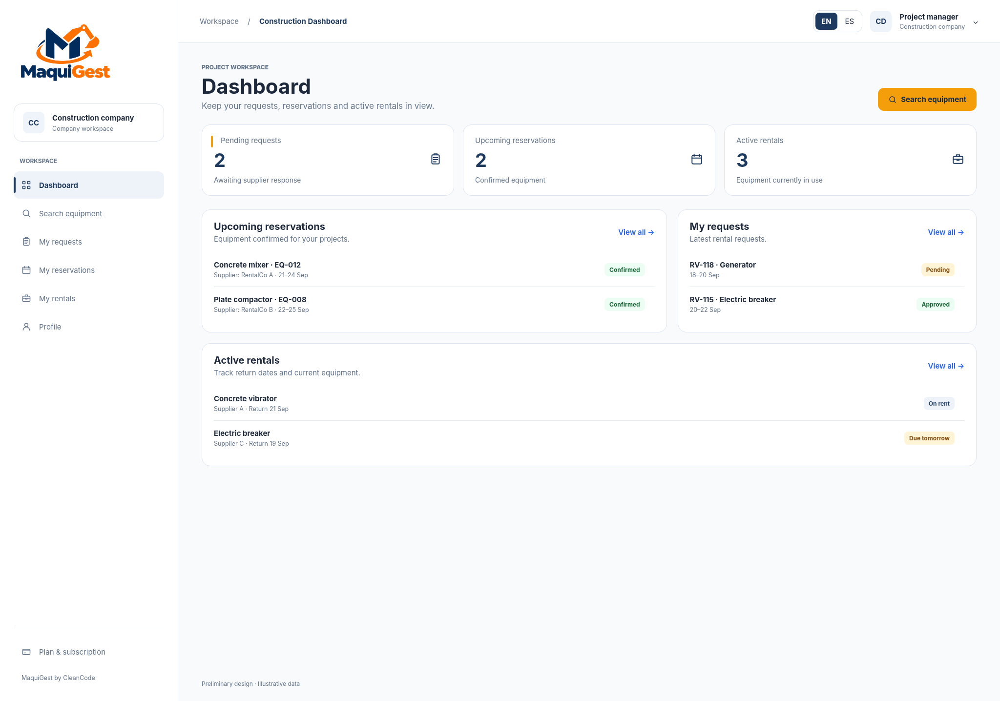
</p>

**Mobile Web Browser**

<p align="center">
  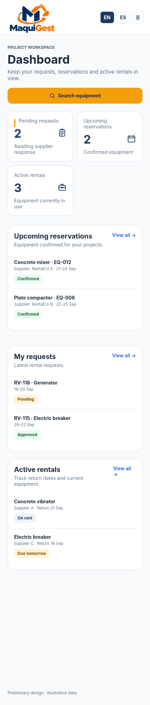
</p>

#### 11. Equipment Search — Búsqueda de maquinaria

**Propósito:** Presentar una interfaz que permita que la empresa constructora encuentre maquinaria de acuerdo con las necesidades de su proyecto.

**Elementos clave:**
- Barra de búsqueda.
- Filtros por categoría, disponibilidad, ubicación y características.
- Cards de maquinaria con nombre, código, categoría y estado.
- Información resumida de disponibilidad.
- Acción para consultar el detalle de un equipo.

**Desktop Web Browser**

<p align="center">
  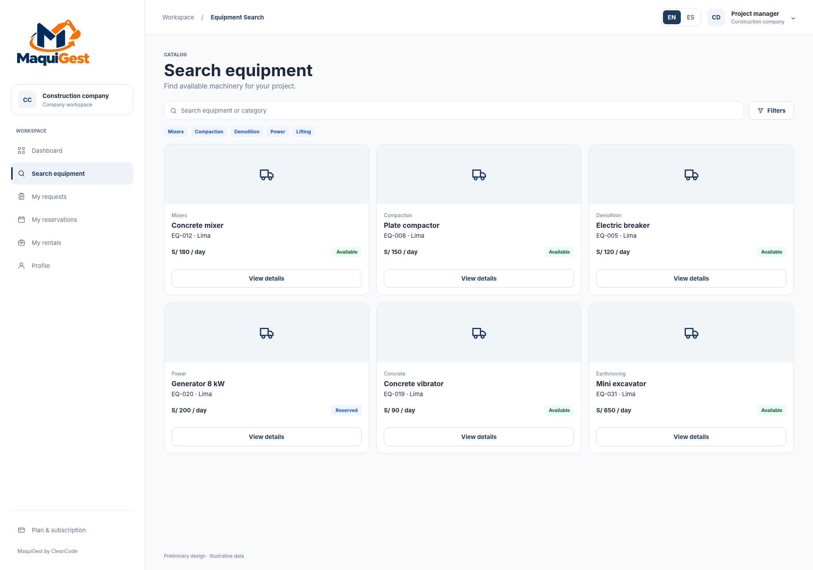
</p>

**Mobile Web Browser**

<p align="center">
  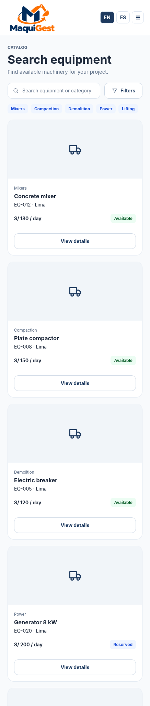
</p>

#### 12. Equipment Detail — Detalle de maquinaria

**Propósito:** Presentar una interfaz que permita que la empresa constructora consulte las características, condiciones y disponibilidad de una maquinaria antes de solicitar su alquiler.

**Elementos clave:**
- Nombre, código, categoría e información descriptiva del equipo.
- Características y condiciones de alquiler.
- Estado y disponibilidad.
- Selección del período requerido.
- Acción para consultar disponibilidad.
- Acción principal para solicitar alquiler.

**Desktop Web Browser**

<p align="center">
  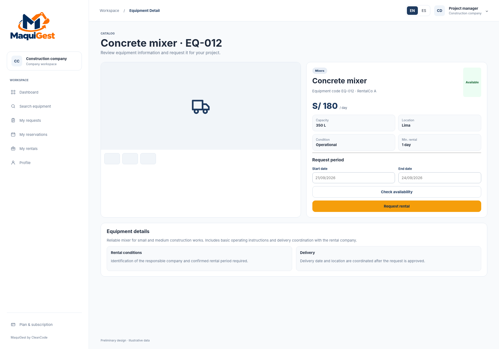
</p>

**Mobile Web Browser**

<p align="center">
  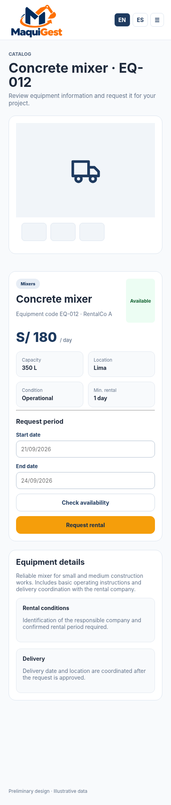
</p>

#### 13. My Requests — Mis solicitudes

**Propósito:** Presentar una interfaz que permita que la empresa constructora consulte el estado de las solicitudes de alquiler realizadas.

**Elementos clave:**
- Listado de solicitudes realizadas.
- Equipo solicitado y período requerido.
- Fecha de creación.
- Estados Pending, Approved y Rejected.
- Acceso al detalle de cada solicitud.

**Desktop Web Browser**

<p align="center">
  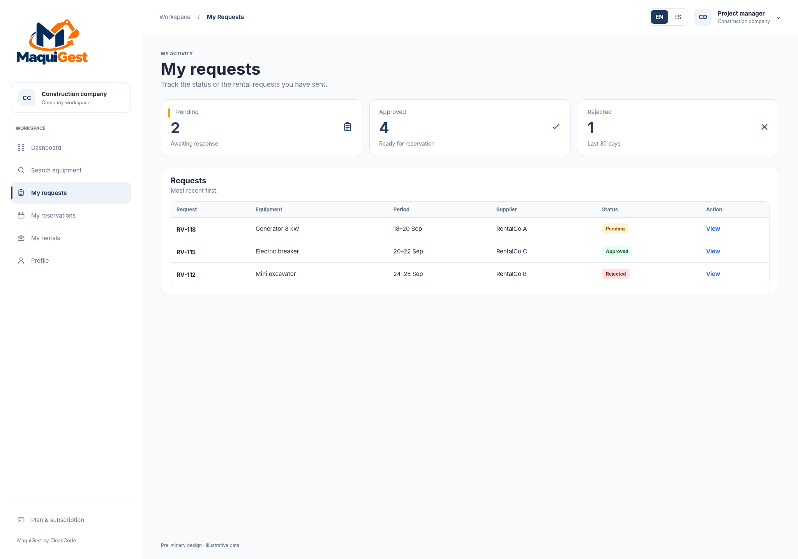
</p>

**Mobile Web Browser**

<p align="center">
  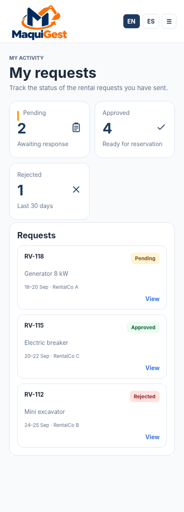
</p>

#### 14. My Reservations — Mis reservas

**Propósito:** Presentar una interfaz que permita que la empresa constructora consulte las reservas confirmadas y conozca las próximas fechas asociadas a la entrega de la maquinaria.

**Elementos clave:**
- Listado de reservas confirmadas.
- Equipo y empresa de alquiler.
- Período reservado.
- Fecha o información de próxima entrega.
- Acceso al detalle de la reserva.

**Desktop Web Browser**

<p align="center">
  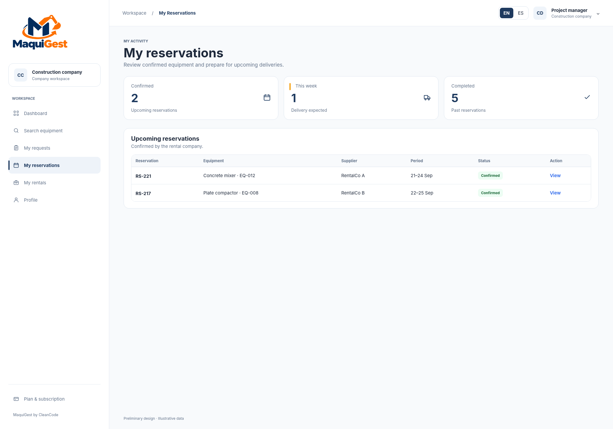
</p>

**Mobile Web Browser**

<p align="center">
  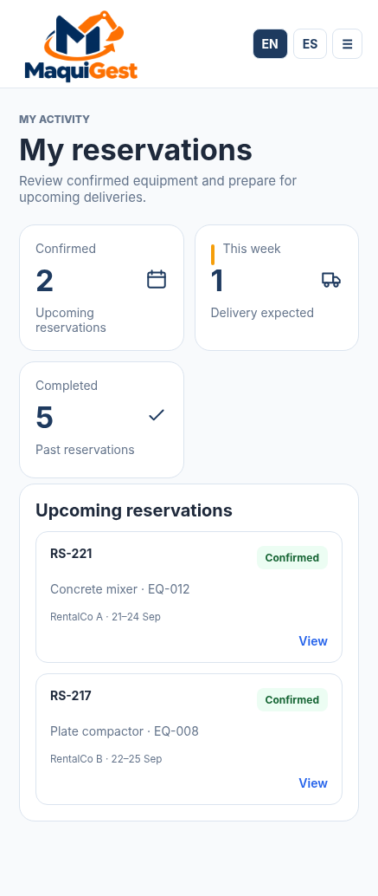
</p>

#### 15. My Rentals — Mis alquileres

**Propósito:** Presentar una interfaz que permita que la empresa constructora realice seguimiento de sus alquileres activos y conozca las fechas de devolución.

**Elementos clave:**
- Listado de alquileres activos.
- Equipo alquilado y empresa proveedora.
- Período del alquiler.
- Fecha de devolución.
- Indicadores para devoluciones próximas.
- Acceso al detalle del alquiler.

**Desktop Web Browser**

<p align="center">
  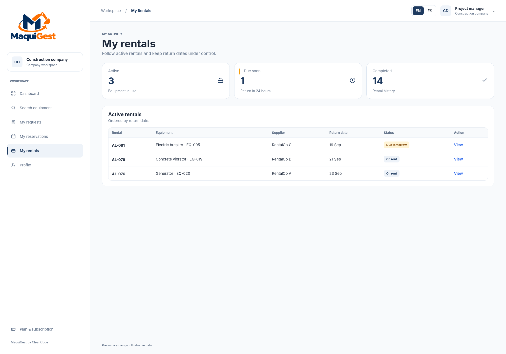
</p>

**Mobile Web Browser**

<p align="center">
  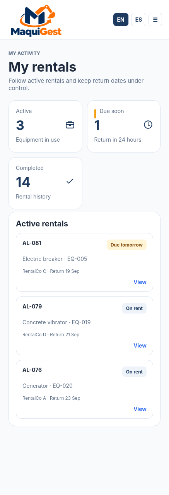
</p>

#### 16. Profile — Perfil

**Propósito:** Presentar una interfaz que permita que el usuario consulte y actualice su información personal, de contacto y de organización.

**Elementos clave:**
- Información personal.
- Información de contacto.
- Datos básicos de la organización.
- Acción para editar y guardar cambios.
- Acción para cerrar sesión.

**Desktop Web Browser**

<p align="center">
  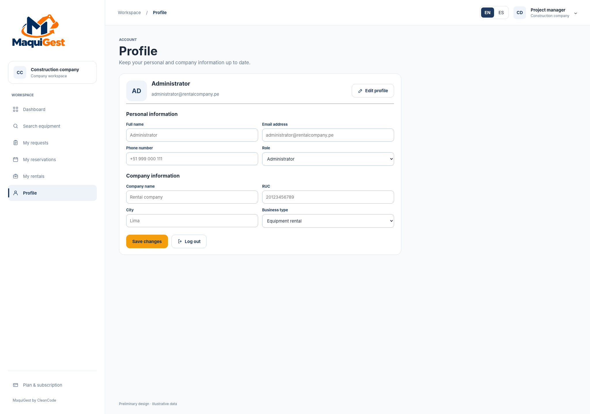
</p>

**Mobile Web Browser**

<p align="center">
  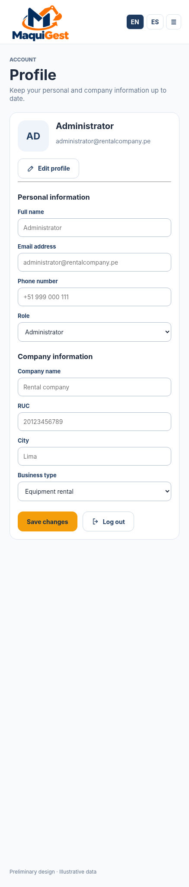
</p>

#### 17. Plan & Subscription — Plan y suscripción

**Propósito:** Presentar una interfaz que permita que la empresa consulte el plan actual y compare las alternativas disponibles para cambiar su suscripción.

**Elementos clave:**
- Plan actual y estado de la suscripción.
- Comparación de planes disponibles.
- Precio y funcionalidades principales.
- Acción para seleccionar o cambiar de plan.
- Información complementaria sobre la suscripción.

**Desktop Web Browser**

<p align="center">
  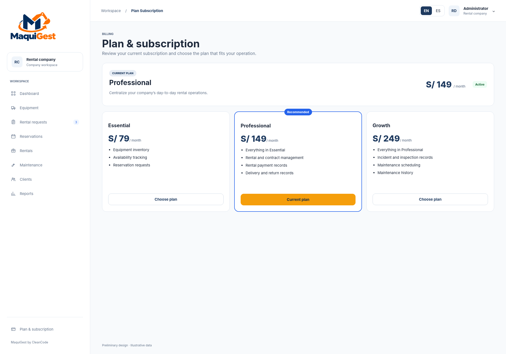
</p>

**Mobile Web Browser**

<p align="center">
  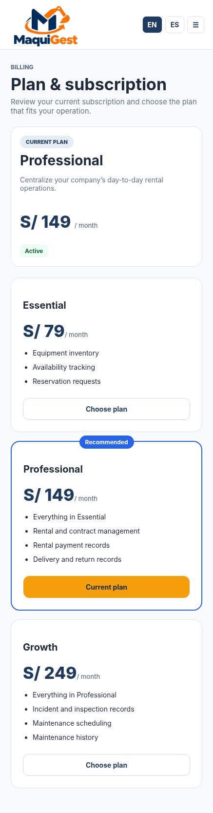
</p>


### 4.4.4. Web Applications User Flow Diagrams

El User Flow Diagram de la Web Application de **MaquiGest** representa las acciones, decisiones y resultados que atraviesan los usuarios durante los principales procesos de la plataforma. A diferencia del wireflow, que se enfoca en la relación y navegación entre pantallas, el user flow incorpora puntos de decisión y validaciones que permiten comprender cómo progresa cada tarea hasta alcanzar un resultado determinado.

El flujo inicia con el acceso a MaquiGest. Si el usuario ya mantiene una sesión activa, el sistema recupera dicha sesión y lo dirige al Dashboard correspondiente. En caso contrario, se presenta la pantalla de Login, desde la cual el usuario puede iniciar sesión, registrarse o iniciar el proceso de recuperación de contraseña. Durante el inicio de sesión se validan las credenciales ingresadas; si son correctas, se crea una sesión activa y se continúa hacia la aplicación, mientras que, si son incorrectas, se muestra un mensaje de error y el usuario permanece en la pantalla de acceso.

Cuando el usuario todavía no posee una cuenta, el flujo conduce hacia el proceso de registro, donde completa la información requerida, selecciona el tipo de empresa y crea su cuenta. Una vez completado correctamente el registro, el sistema confirma la operación y permite regresar al Login. De forma similar, el flujo de recuperación de contraseña solicita el correo electrónico registrado, envía las instrucciones correspondientes y posteriormente permite volver a la pantalla de inicio de sesión.

Después de la autenticación, el flujo se divide según el tipo de organización registrada en MaquiGest. Esta decisión permite ofrecer funcionalidades y recorridos diferentes para las **empresas de alquiler de maquinaria** y las **pequeñas empresas constructoras**, manteniendo una experiencia adaptada a las necesidades de cada segmento.

#### Flujo de la empresa de alquiler de maquinaria

La empresa de alquiler accede a un Dashboard orientado al control de sus operaciones. Desde la navegación principal puede gestionar las siguientes áreas:

- **Equipment:** permite consultar el inventario, registrar nueva maquinaria, actualizar información, revisar disponibilidad y acceder al detalle de cada equipo.
- **Rental Requests:** permite revisar las solicitudes recibidas y decidir si una solicitud debe aprobarse o rechazarse. Una solicitud aprobada puede generar una reserva.
- **Reservations:** permite consultar las reservas confirmadas, revisar sus detalles, administrar su estado y cancelar una reserva cuando corresponda.
- **Rentals:** permite consultar alquileres activos, registrar la entrega de la maquinaria, actualizar su estado, registrar la devolución y cerrar el alquiler.
- **Maintenance:** permite consultar el estado de los equipos, registrar mantenimientos, actualizar su progreso y volver a marcar una maquinaria como disponible cuando corresponda.
- **Plan & Subscription:** permite visualizar los planes disponibles, seleccionar un plan, registrar la información necesaria para la suscripción y activar el servicio.
- **Profile:** permite consultar y actualizar la información de la cuenta y de la empresa, además de gestionar preferencias y credenciales.

Dentro de este recorrido, uno de los principales puntos de decisión ocurre durante la revisión de una solicitud de alquiler. Si la empresa decide rechazarla, el sistema registra el nuevo estado y finaliza dicho proceso. Si la solicitud es aprobada, se genera una reserva que posteriormente puede continuar hacia el proceso de alquiler.

#### Flujo de la empresa constructora

La empresa constructora accede a un Dashboard orientado al seguimiento de sus solicitudes y alquileres. Desde esta interfaz puede realizar los siguientes procesos:

- **Search Equipment:** permite buscar maquinaria y aplicar filtros según las necesidades del proyecto.
- **Equipment Detail:** permite consultar las características, condiciones y disponibilidad del equipo seleccionado.
- **My Requests:** permite realizar seguimiento al estado de las solicitudes enviadas y consultar si fueron aprobadas, rechazadas o permanecen pendientes.
- **My Reservations:** permite consultar las reservas confirmadas y revisar sus principales datos.
- **My Rentals:** permite realizar seguimiento de los alquileres activos, sus fechas y los procesos relacionados con la entrega y devolución.
- **Profile:** permite consultar y actualizar la información de la cuenta y de la organización.

Durante el proceso de búsqueda se verifica la disponibilidad del equipo para el período requerido. Si la maquinaria no está disponible, el usuario puede modificar las fechas o regresar a la búsqueda para seleccionar otra alternativa. Si se encuentra disponible, puede continuar con la solicitud de alquiler y posteriormente realizar su seguimiento desde My Requests.

Finalmente, ambos recorridos convergen en la acción **Sign out**, mediante la cual se cierra la sesión activa y finaliza el recorrido dentro de la Web Application.

#### General User Flow of MaquiGest Web Application

**Purpose:** Representar las principales acciones, decisiones y recorridos que realizan los usuarios de MaquiGest desde la autenticación hasta la ejecución de los procesos principales correspondientes a cada segmento.

**Key elements:**

- Acceso, registro y recuperación de contraseña.
- Validación de sesión y credenciales.
- Selección y reconocimiento del tipo de empresa.
- Flujo operativo para empresas de alquiler de maquinaria.
- Flujo de búsqueda y solicitud para empresas constructoras.
- Puntos de decisión durante la aprobación de solicitudes y la disponibilidad de maquinaria.
- Gestión de perfil y suscripción.
- Cierre de sesión como finalización del recorrido.

<p align="center">
  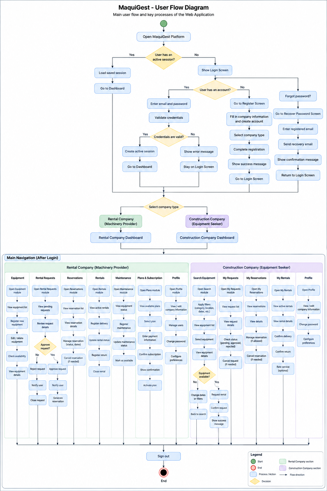
</p>

En conjunto, el User Flow Diagram permite verificar que las acciones y decisiones de los usuarios mantienen coherencia con las interfaces definidas en los wireframes y mock-ups, y proporciona una base para establecer posteriormente las interacciones del prototipo de la Web Application.
## 4.5. Web Applications Prototyping

## 4.6. Domain-Driven Software Architecture

### 4.6.1. Design-Level Event Storming

### 4.6.2. Software Architecture Context Diagram

El Software Architecture Context Diagram presenta a **MaquiGest** como un único sistema de software y muestra su interacción con los principales usuarios y servicios externos. En este nivel del C4 Model no se representan todavía los componentes internos, containers, bounded contexts ni tecnologías de implementación, ya que el objetivo es delimitar el alcance funcional de la solución y reconocer las dependencias externas con las que se comunica.

Los principales actores que interactúan con MaquiGest son:

- **Rental Operator:** representa al usuario perteneciente a una empresa de alquiler de maquinaria. Utiliza MaquiGest para administrar equipos, solicitudes de alquiler, reservas, entregas, devoluciones, incidencias y actividades de mantenimiento.
- **Construction Manager:** representa al usuario perteneciente a una empresa constructora. Utiliza la plataforma para buscar maquinaria, revisar disponibilidad, realizar solicitudes de alquiler y efectuar el seguimiento de sus reservas y alquileres activos.
- **System Administrator:** representa al responsable de administrar el acceso a la plataforma, supervisar su operación y atender casos excepcionales que requieran intervención administrativa.

MaquiGest también mantiene comunicación con servicios externos necesarios para determinadas capacidades del producto:

- **Google Maps Platform:** proporciona servicios de geolocalización y mapas utilizados para apoyar la localización de maquinaria y la coordinación de entregas y devoluciones.
- **Stripe:** procesa los pagos asociados a los planes de suscripción de MaquiGest.
- **SendGrid:** proporciona servicios de correo transaccional para comunicaciones relacionadas con cuentas, reservas, alquileres, suscripciones y otras notificaciones del sistema.

<p align="center">
  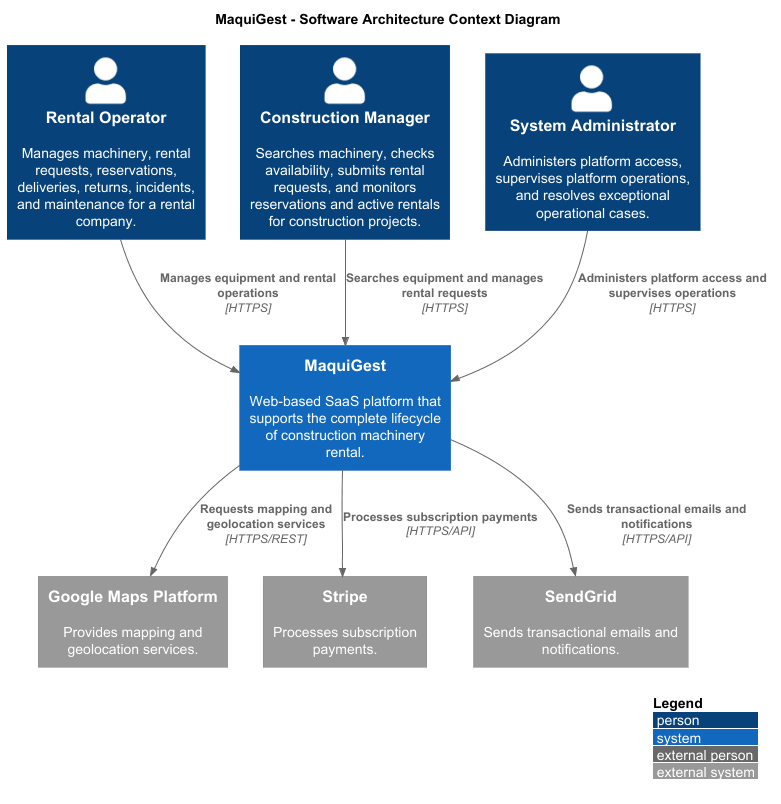
</p>

### 4.6.3. Software Architecture Container Diagram

The Software Architecture Container Diagram presents the main containers that compose the MaquiGest platform and the technologies used to implement them.

MaquiGest is composed of a public **Landing Page**, a **Single Page Application**, a **RESTful API**, and a **MySQL Database**. The Landing Page provides public information about the platform, while the Single Page Application allows authenticated users to interact with the main business capabilities. The RESTful API exposes the application services and manages access to persistent data.

Additionally, the RESTful API communicates with external services such as **Google Maps Platform** for geolocation capabilities, **Stripe** for subscription payment processing, and **SendGrid** for transactional email delivery.

<p align="center">
  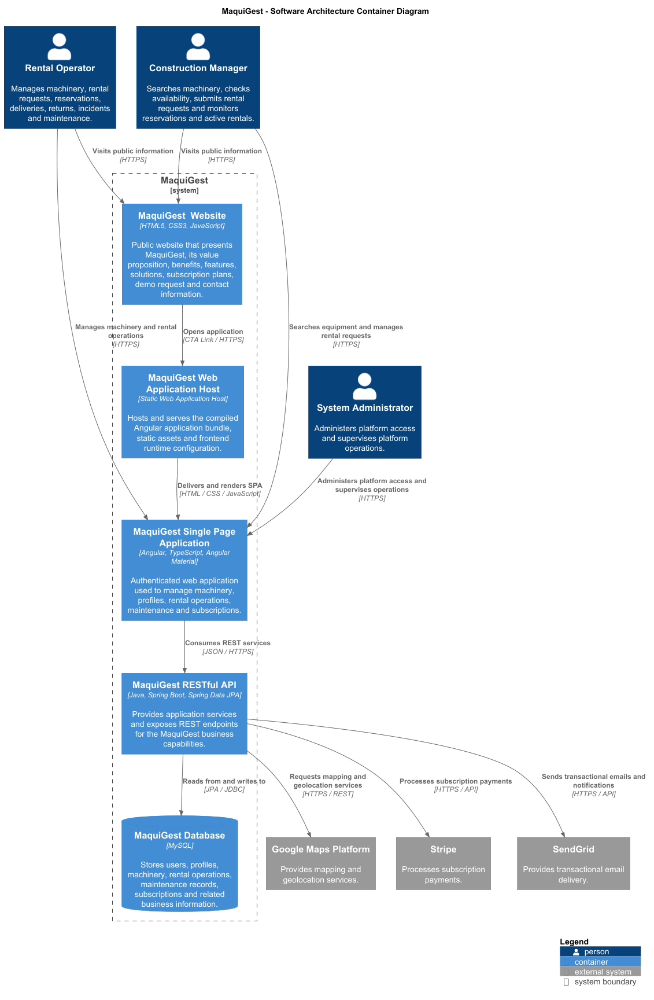
</p>

### 4.6.4. Software Architecture Component Diagrams

Los diagramas de componentes de arquitectura de software presentan una vista detallada de la organización interna de los principales contenedores frontend y backend que conforman MaquiGest.

A nivel de frontend, la Single Page Application desarrollada con Angular se organiza alrededor de los bounded contexts definidos para la solución: IAM, Profiles, Inventory, Rentals, Maintenance y Subscriptions. Adicionalmente, Shared Frontend concentra componentes, modelos y capacidades técnicas transversales reutilizables por los diferentes contextos de la aplicación. Una vista general de componentes muestra cómo estos elementos se integran dentro de la aplicación frontend, mientras que los diagramas individuales permiten observar su organización interna mediante las capas Presentation, Application, Domain e Infrastructure, según corresponda.

Además, para cada bounded context del frontend se presenta una vista adicional de la Presentation Layer, donde se muestran los componentes Angular concretos responsables de las páginas, formularios, vistas y elementos de interfaz correspondientes.

A nivel de backend, la RESTful API desarrollada con Java y Spring Boot mantiene la misma organización basada en bounded contexts. Una vista general presenta los contextos contenidos dentro de la aplicación backend, mientras que los diagramas individuales descomponen cada bounded context en las capas Interfaces, Application, Domain e Infrastructure siguiendo principios de Domain-Driven Design.

A continuación, se presentan las diferentes vistas de componentes que conforman la arquitectura de MaquiGest.

#### Frontend General Components Diagram

El Frontend General Components Diagram presenta la organización general de la Single Page Application de MaquiGest. El frontend está implementado con Angular y se estructura alrededor de los bounded contexts definidos para el dominio del negocio.

Los mecanismos de layout y routing de la aplicación permiten coordinar la navegación hacia IAM, Profiles, Inventory, Rentals, Maintenance y Subscriptions. Asimismo, Shared Frontend proporciona capacidades reutilizables de interfaz y servicios transversales, mientras que la infraestructura del frontend permite la comunicación con la MaquiGest Backend API.

<p align="center">
  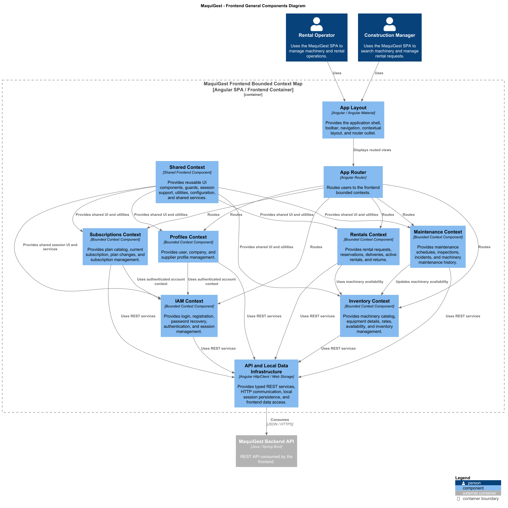
</p>

#### IAM Frontend Components Diagram

El bounded context IAM del frontend es responsable de las funcionalidades relacionadas con autenticación, registro, recuperación de contraseña, gestión de sesión y acceso a la cuenta.

La Presentation Layer administra las vistas y las interacciones relacionadas con la autenticación. La Application Layer coordina los flujos de autenticación y el estado de sesión. La Domain Layer contiene los modelos y reglas del frontend asociados con autenticación, mientras que la Infrastructure Layer proporciona la comunicación con los servicios de autenticación del backend y mecanismos técnicos como la persistencia de sesión.

IAM también proporciona información de la cuenta autenticada a otros contextos del frontend y utiliza las capacidades compartidas proporcionadas por Shared Frontend.

<p align="center">
  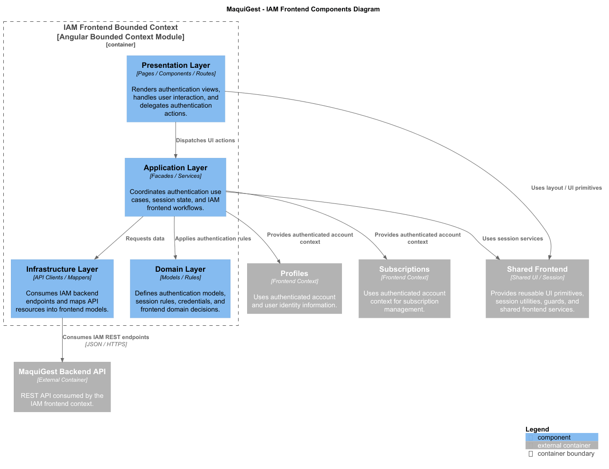
</p>

#### IAM Frontend Presentation Layer Components Diagram

Este diagrama representa un mayor nivel de detalle de la Presentation Layer del bounded context IAM.

`LoginComponent` proporciona el formulario y la interacción para iniciar sesión. `RegisterComponent` permite realizar el proceso de creación de una cuenta, mientras que `RecoverPasswordComponent` administra la interacción correspondiente a la recuperación de contraseña.

Estos componentes delegan los casos de uso correspondientes a la IAM Application Layer y utilizan componentes compartidos de interfaz cuando son necesarios.

<p align="center">
  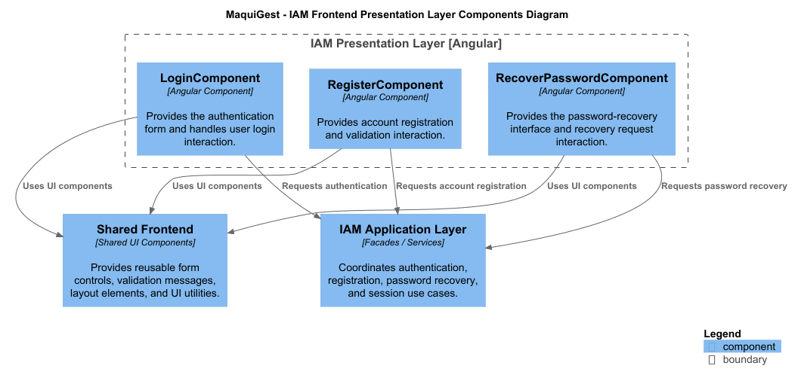
</p>

#### Profiles Frontend Components Diagram

El bounded context Profiles del frontend administra la información relacionada con los perfiles de usuarios, empresas y proveedores.

La Presentation Layer contiene las vistas y formularios asociados con los perfiles. La Application Layer coordina las consultas y operaciones de actualización, mientras que la Domain Layer contiene los modelos y reglas correspondientes. La Infrastructure Layer se encarga de la comunicación con los endpoints de Profiles disponibles en el backend.

Este bounded context también utiliza la información de la cuenta autenticada proporcionada por IAM y las capacidades comunes proporcionadas por Shared Frontend.

<p align="center">
  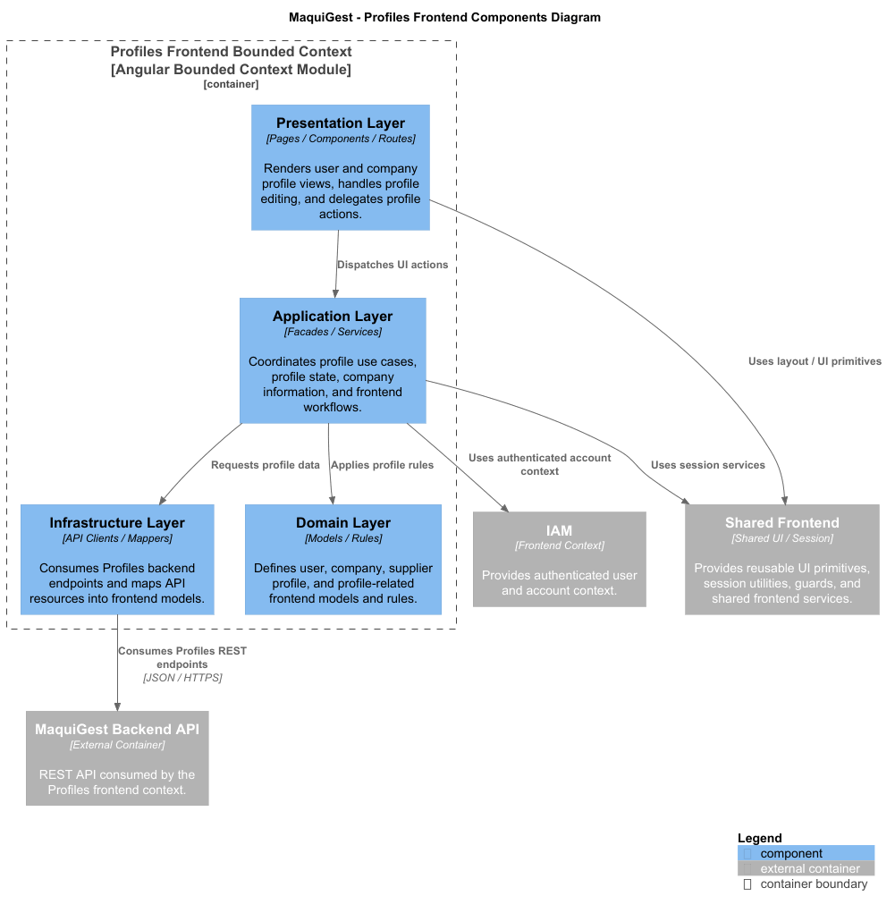
</p>

#### Profiles Frontend Presentation Layer Components Diagram

Este diagrama representa el detalle interno de la Presentation Layer del bounded context Profiles.

`ProfileComponent` muestra la información del perfil del usuario autenticado. `EditProfileComponent` permite modificar la información del perfil, mientras que `CompanyProfileComponent` proporciona la interfaz necesaria para visualizar y administrar la información correspondiente a la empresa.

<p align="center">
  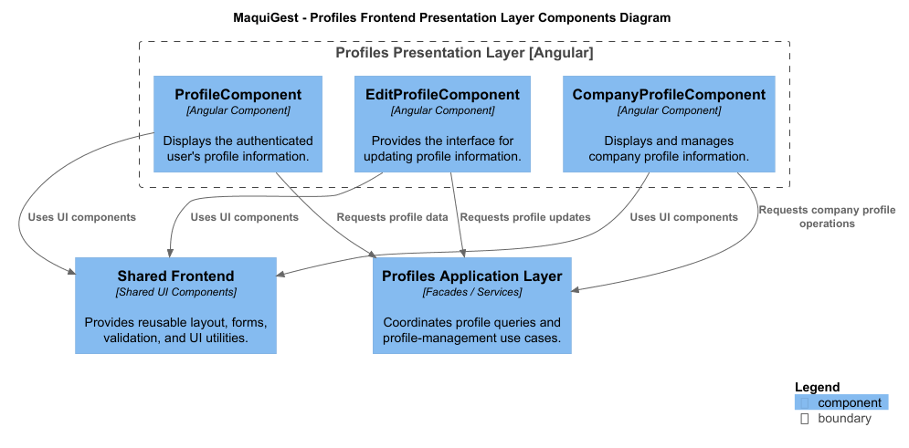
</p>

#### Inventory Frontend Components Diagram

El bounded context Inventory del frontend administra el catálogo de maquinaria, los detalles de los equipos, sus categorías, tarifas, estado operativo y disponibilidad.

Su Application Layer coordina los flujos relacionados con la gestión y consulta del inventario, comunicándose con las capas Domain e Infrastructure. Inventory también proporciona información sobre maquinaria y disponibilidad requerida por Rentals y coordina con Maintenance los cambios relacionados con el estado de los equipos.

<p align="center">
  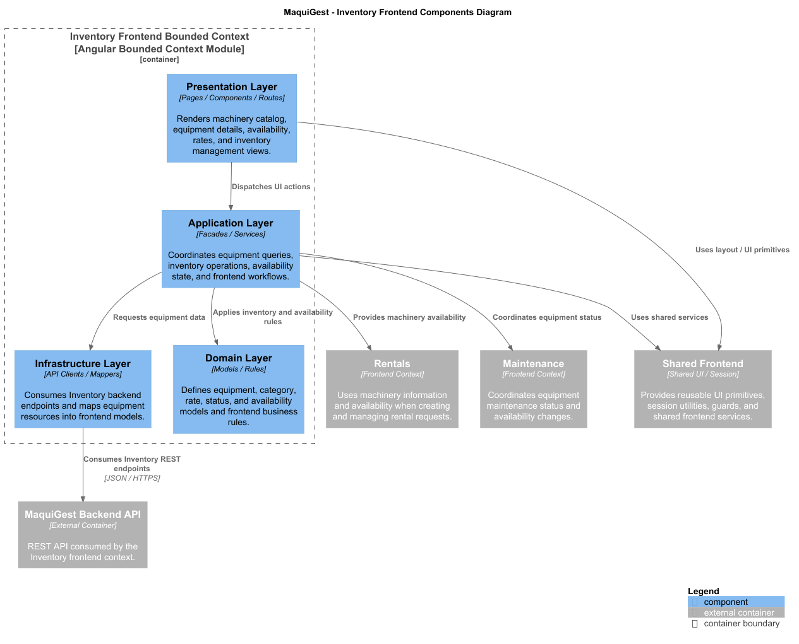
</p>

#### Inventory Frontend Presentation Layer Components Diagram

Este diagrama representa el detalle de la Presentation Layer de Inventory y muestra los componentes Angular responsables de la interacción con la maquinaria.

`EquipmentListComponent` muestra la maquinaria disponible, mientras que `EquipmentDetailComponent` presenta información detallada del equipo, incluyendo tarifa, estado y disponibilidad. `EquipmentFormComponent` proporciona los formularios necesarios para registrar y editar equipos.

Las funcionalidades de búsqueda y filtrado son administradas por `EquipmentSearchComponent` y `EquipmentFilterComponent`, mientras que `AvailabilityBadgeComponent` proporciona una representación visual reutilizable de la disponibilidad de cada equipo.

<p align="center">
  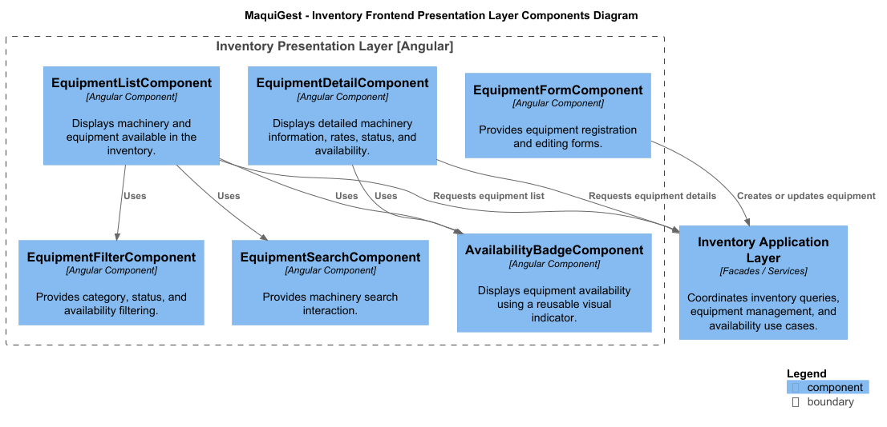
</p>

#### Rentals Frontend Components Diagram

El bounded context Rentals del frontend soporta la interacción correspondiente al ciclo de alquiler, incluyendo solicitudes de alquiler, reservas, entregas, alquileres activos y devoluciones.

Este contexto utiliza la información de los equipos y su disponibilidad proporcionada por Inventory, así como la información de empresas y participantes administrada por Profiles. Su Infrastructure Layer se encarga de la comunicación con los endpoints de Rentals expuestos por el backend.

<p align="center">
  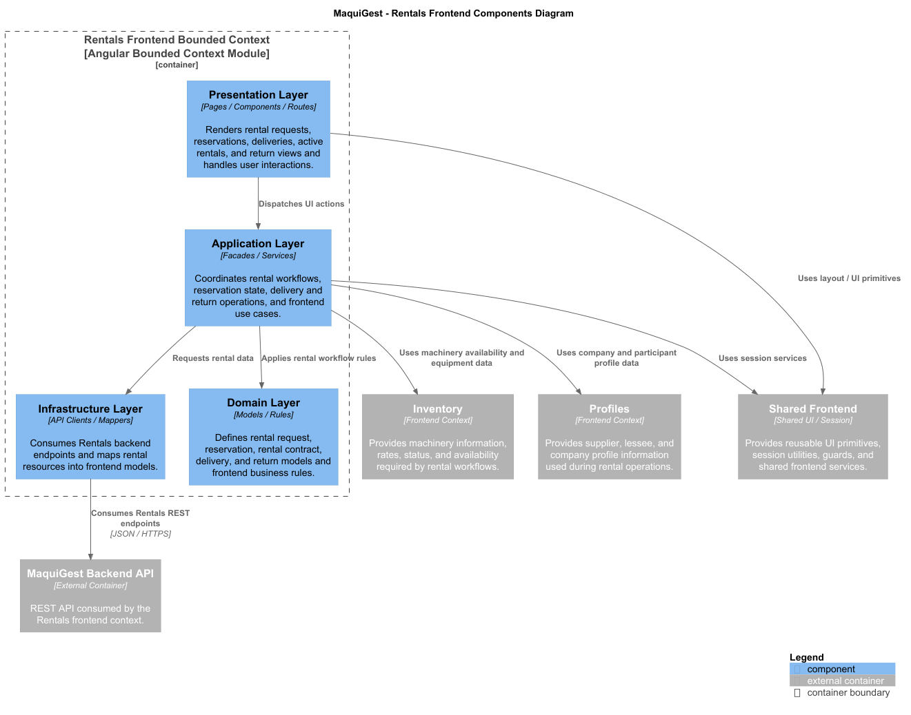
</p>

#### Rentals Frontend Presentation Layer Components Diagram

Este diagrama muestra la descomposición de la Presentation Layer del bounded context Rentals.

`RentalRequestsComponent` muestra y administra las solicitudes de alquiler, mientras que `RentalRequestDetailComponent` presenta la información detallada de una solicitud seleccionada. `ReservationsComponent` muestra las reservas confirmadas y `ActiveRentalsComponent` presenta los alquileres actualmente activos.

`DeliveryFormComponent` y `ReturnFormComponent` proporcionan las interfaces necesarias para registrar las operaciones de entrega y devolución de maquinaria.

<p align="center">
  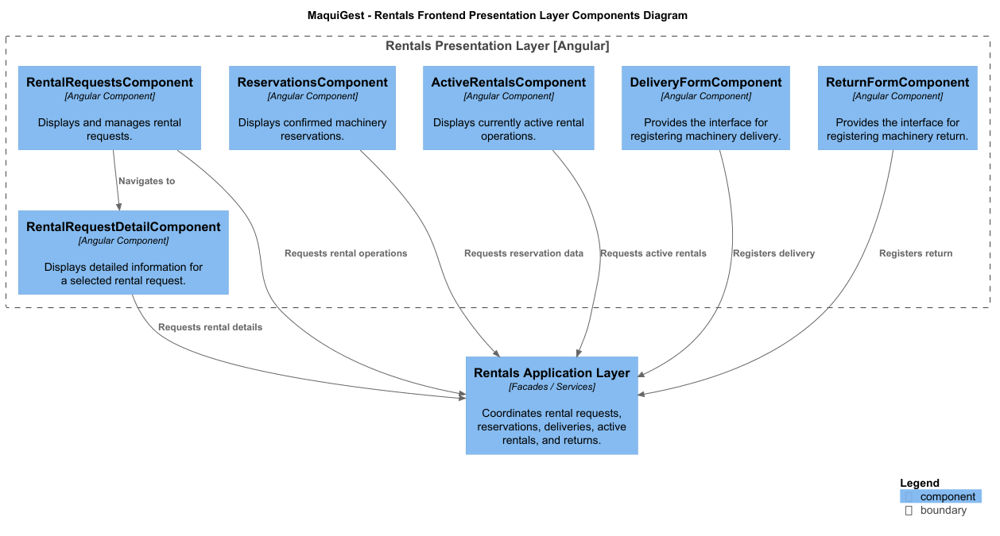
</p>

#### Maintenance Frontend Components Diagram

El bounded context Maintenance del frontend administra las programaciones de mantenimiento, inspecciones, incidencias, registros de mantenimiento e historial de mantenimiento de la maquinaria.

Este contexto colabora con Inventory para reflejar cambios en el estado y disponibilidad de los equipos, y con Rentals cuando una incidencia o actividad de mantenimiento afecta a una maquinaria asociada con un alquiler activo.

<p align="center">
  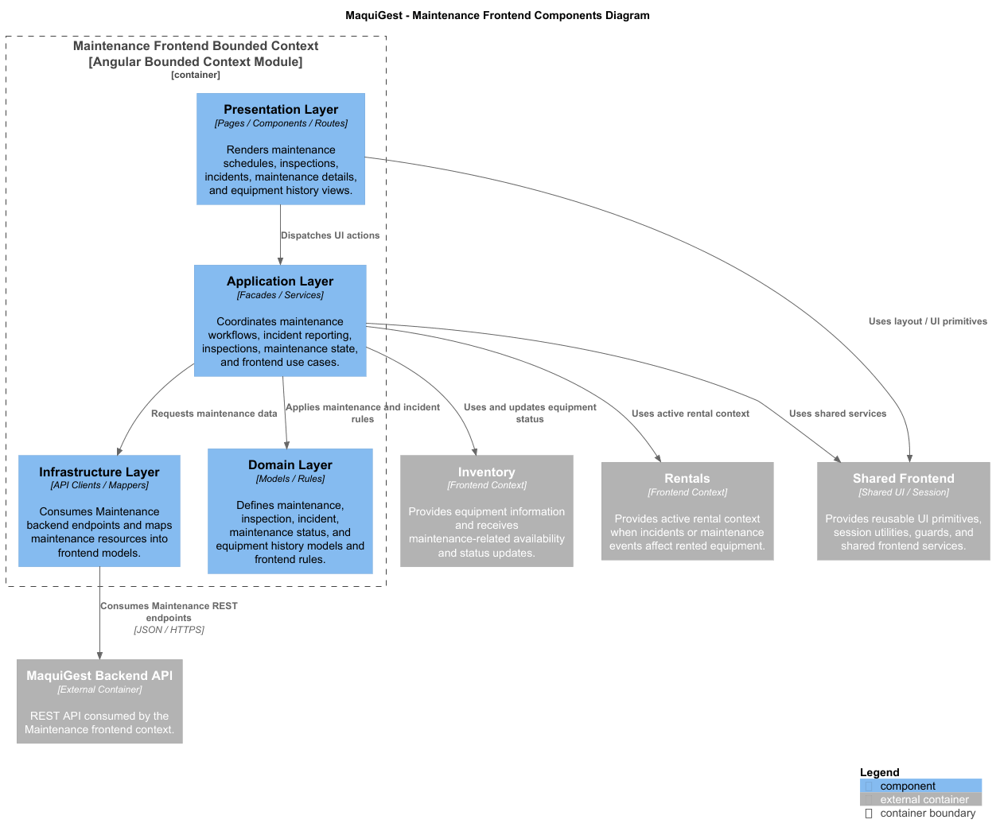
</p>

#### Maintenance Frontend Presentation Layer Components Diagram

Este diagrama representa el detalle interno de la Presentation Layer del bounded context Maintenance.

`MaintenanceListComponent` muestra los mantenimientos programados y realizados, mientras que `MaintenanceDetailComponent` presenta información detallada del mantenimiento y del historial del equipo.

`IncidentFormComponent` permite registrar incidencias relacionadas con la maquinaria, mientras que `InspectionComponent` proporciona la interacción necesaria para las operaciones de inspección de los equipos.

<p align="center">
  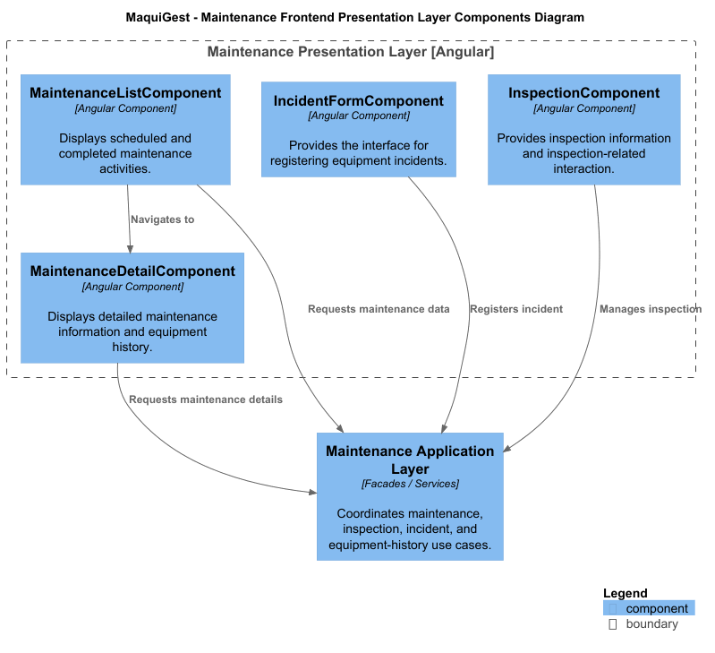
</p>

#### Subscriptions Frontend Components Diagram

El bounded context Subscriptions del frontend administra los planes disponibles, la suscripción actual, el estado de la suscripción y los flujos relacionados con la gestión o cambio de plan.

Este contexto utiliza IAM para identificar la cuenta autenticada y Profiles para obtener la información de la empresa asociada con la suscripción. Su Infrastructure Layer se comunica con los servicios correspondientes de Subscriptions disponibles en el backend.

<p align="center">
  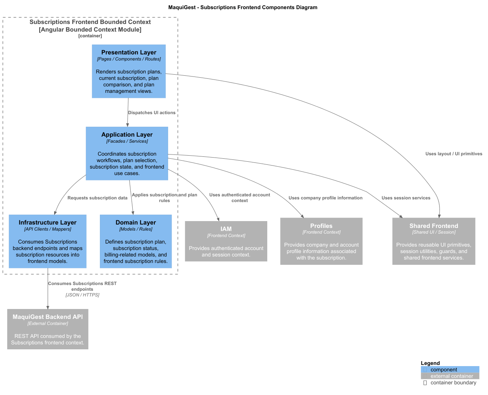
</p>

#### Subscriptions Frontend Presentation Layer Components Diagram

Este diagrama representa el detalle de la Presentation Layer del bounded context Subscriptions.

`PlansComponent` muestra los planes de suscripción disponibles. `CurrentSubscriptionComponent` presenta la suscripción actual, su estado y la información relacionada con el plan contratado, mientras que `ChangePlanComponent` proporciona la interfaz necesaria para seleccionar y cambiar el plan de suscripción.

<p align="center">
  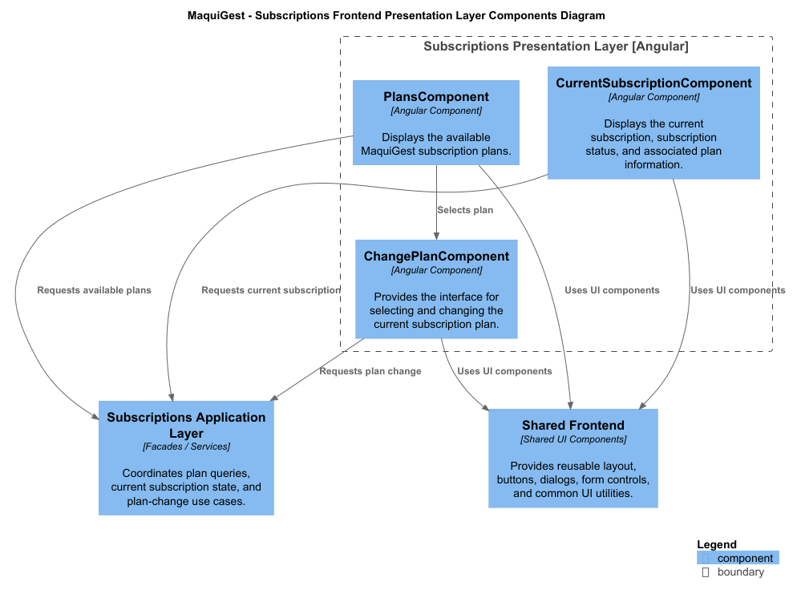
</p>

#### Shared Frontend Components Diagram

El Shared Frontend concentra capacidades transversales y reutilizables utilizadas por los diferentes bounded contexts de la Single Page Application de MaquiGest.

La Presentation Layer contiene componentes comunes de interfaz como `LayoutComponent`, `NavigationComponent`, `LanguageSwitcherComponent` y `FooterComponent`. Estos elementos proporcionan la estructura visual compartida, la navegación principal, el cambio de idioma y contenido reutilizable entre las diferentes vistas de la aplicación.

La Domain Layer contiene value objects reutilizables que no pertenecen exclusivamente a un bounded context, como `Money` y `DateRange`, permitiendo representar valores comunes mediante objetos autovalidados.

Por su parte, la Infrastructure Layer proporciona mecanismos técnicos compartidos. `ApiClient` centraliza capacidades comunes para la comunicación HTTP con la MaquiGest REST API, `AuthInterceptor` incorpora la información de autenticación requerida en las solicitudes salientes y `LocalStorageService` proporciona acceso reutilizable al almacenamiento local del navegador.

De esta manera, Shared Frontend evita duplicar capacidades técnicas y visuales comunes dentro de los bounded contexts y mantiene dichas responsabilidades separadas de los conceptos específicos del dominio.

<p align="center">
  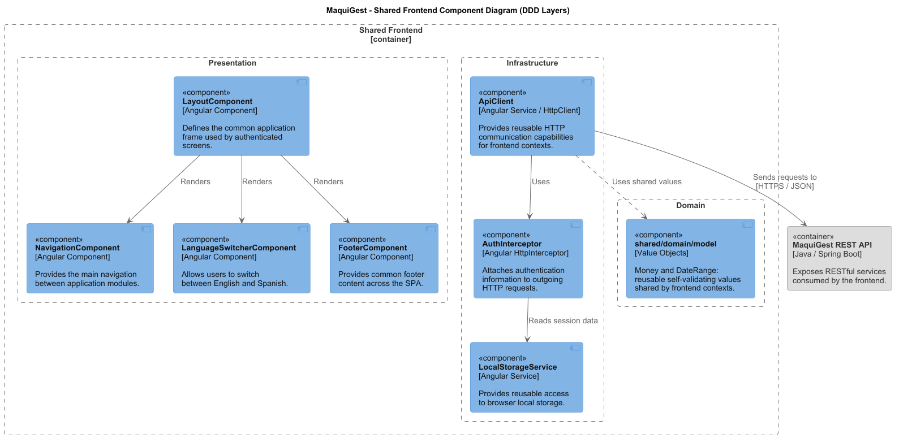
</p>

#### Backend General Components Diagram

El Backend General Components Diagram presenta la organización general de la MaquiGest API Application implementada con Java y Spring Boot.

El contenedor backend está organizado alrededor de seis bounded contexts de negocio: IAM, Profiles, Inventory, Rentals, Maintenance y Subscriptions. Adicionalmente, un componente Shared proporciona capacidades técnicas y transversales reutilizables por los diferentes contextos del backend.

La Single Page Application desarrollada con Angular aparece fuera del límite del backend debido a que actúa como cliente de los servicios REST expuestos por la aplicación. De igual manera, la base de datos MySQL se representa fuera del límite de componentes del backend como el contenedor encargado de la persistencia de la información.

<p align="center">
  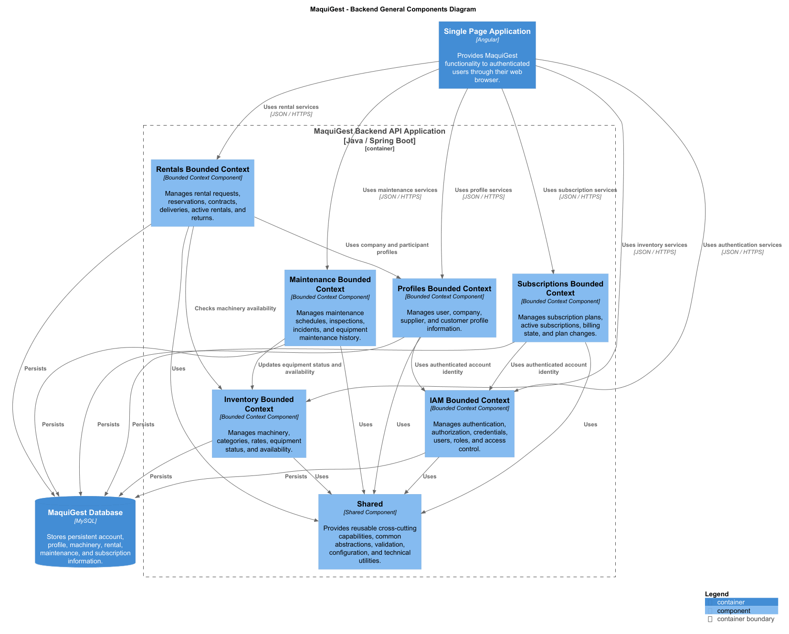
</p>

#### IAM Backend Component Diagram

El bounded context IAM del backend administra la autenticación, autorización, credenciales, usuarios, roles y control de acceso.

La Interfaces Layer expone los endpoints REST relacionados con autenticación, registro y administración de cuentas. La Application Layer coordina los casos de uso correspondientes y delega las decisiones de negocio a la Domain Layer. Por su parte, la Infrastructure Layer proporciona los mecanismos de persistencia y adaptadores técnicos necesarios.

Las capacidades relacionadas con seguridad son proporcionadas mediante mecanismos como Spring Security, codificación de contraseñas y autenticación basada en tokens. Además, este contexto puede comunicarse con el servicio externo de correo transaccional para soportar operaciones como recuperación de contraseña y notificaciones relacionadas con la cuenta.

<p align="center">
  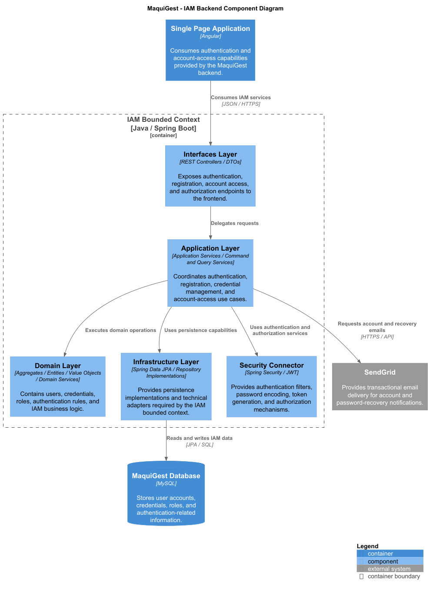
</p>

#### Profiles Backend Component Diagram

El bounded context Profiles del backend administra la información correspondiente a usuarios, empresas, proveedores y clientes.

La Interfaces Layer expone los endpoints REST relacionados con perfiles. La Application Layer coordina operaciones de registro, actualización de perfiles, gestión de información empresarial y consultas.

La Domain Layer contiene los conceptos y reglas de negocio relacionados con los perfiles, mientras que la Infrastructure Layer proporciona las implementaciones de repositorios y mecanismos de persistencia. Profiles también colabora con IAM para identificar la cuenta autenticada asociada con cada perfil.

<p align="center">
  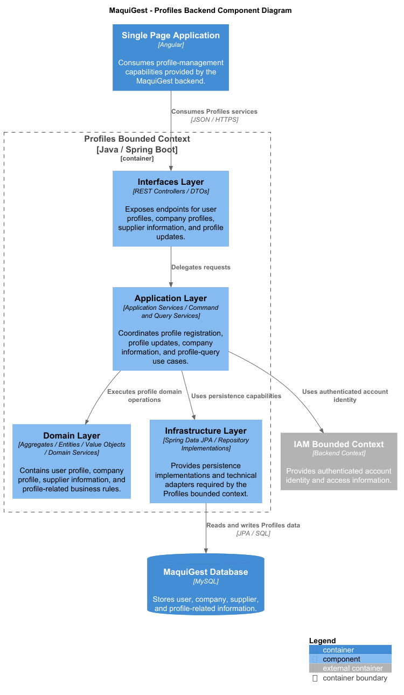
</p>

#### Inventory Backend Component Diagram

El bounded context Inventory del backend administra la maquinaria, categorías, tarifas, estado operativo y disponibilidad.

La Interfaces Layer expone los endpoints REST correspondientes a la gestión del inventario. La Application Layer coordina el registro y actualización de maquinaria, consultas de disponibilidad, gestión de tarifas y demás operaciones relacionadas con el inventario.

La Domain Layer contiene los conceptos y reglas de negocio asociados con los equipos, mientras que la Infrastructure Layer proporciona las implementaciones de persistencia mediante Spring Data JPA.

Rentals utiliza Inventory para validar la disponibilidad de la maquinaria, mientras que Maintenance interactúa con este contexto cuando las actividades de mantenimiento modifican el estado operativo o la disponibilidad de los equipos.

<p align="center">
  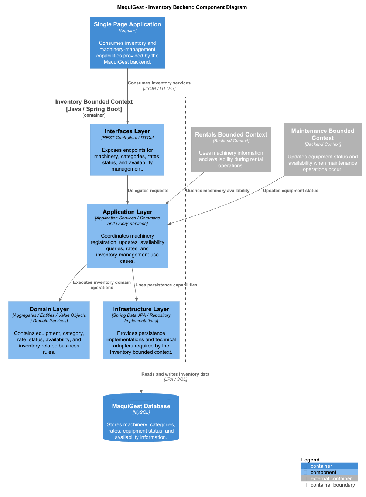
</p>

#### Rentals Backend Component Diagram

El bounded context Rentals del backend administra el ciclo completo de alquiler, incluyendo solicitudes, reservas, contratos, entregas, alquileres activos y devoluciones.

La Interfaces Layer expone las operaciones REST requeridas por el frontend. La Application Layer coordina los diferentes flujos del alquiler, mientras que la Domain Layer contiene los agregados, entidades, value objects y reglas de negocio correspondientes.

La Infrastructure Layer proporciona las implementaciones necesarias para la persistencia. Rentals colabora con Inventory para verificar la disponibilidad de la maquinaria y con Profiles para obtener la información de las empresas y participantes involucrados en las operaciones de alquiler.

<p align="center">
  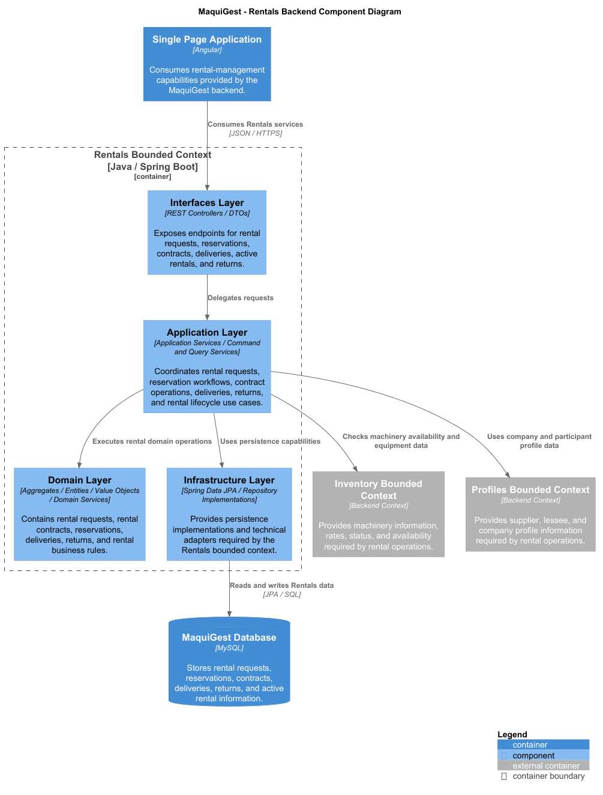
</p>

#### Maintenance Backend Component Diagram

El bounded context Maintenance del backend administra las programaciones de mantenimiento, inspecciones, incidencias, registros de mantenimiento e historial de mantenimiento de la maquinaria.

La Interfaces Layer expone los endpoints REST relacionados con estas operaciones. La Application Layer coordina los casos de uso asociados con programación de mantenimiento, inspecciones, registro de incidencias y actualización de mantenimientos.

La Domain Layer contiene los conceptos y reglas de negocio relacionados con el mantenimiento, mientras que la Infrastructure Layer proporciona las implementaciones de repositorios y mecanismos de persistencia.

Maintenance colabora con Inventory para actualizar el estado y disponibilidad de la maquinaria y con Rentals cuando una actividad de mantenimiento o incidencia afecta a un equipo asociado con un alquiler activo.

<p align="center">
  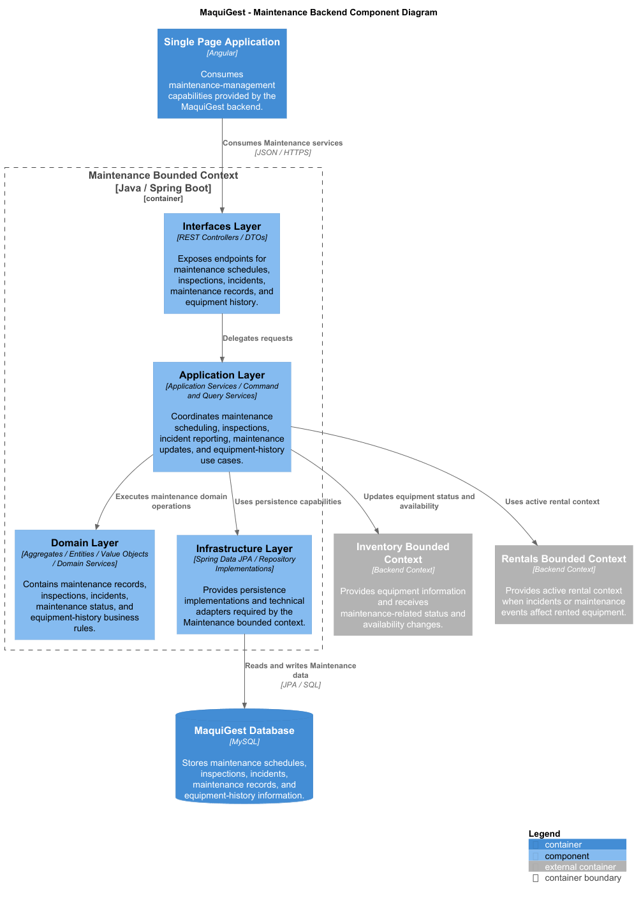
</p>

#### Subscriptions Backend Component Diagram

El bounded context Subscriptions del backend administra los planes de suscripción, suscripciones activas, cambios de plan, estado de facturación y operaciones relacionadas con pagos.

La Interfaces Layer expone los endpoints REST necesarios para la gestión de suscripciones. La Application Layer coordina la selección de planes, activación de suscripciones, cambios de plan, estado de facturación y operaciones relacionadas con pagos.

La Domain Layer contiene los conceptos y reglas de negocio correspondientes a las suscripciones, mientras que la Infrastructure Layer proporciona los mecanismos de persistencia necesarios.

Este bounded context utiliza IAM para identificar la cuenta autenticada y Profiles para asociar la suscripción con la información de la empresa. Asimismo, un Payment Connector integra el contexto con Stripe para realizar el procesamiento de los pagos correspondientes a las suscripciones.

<p align="center">
  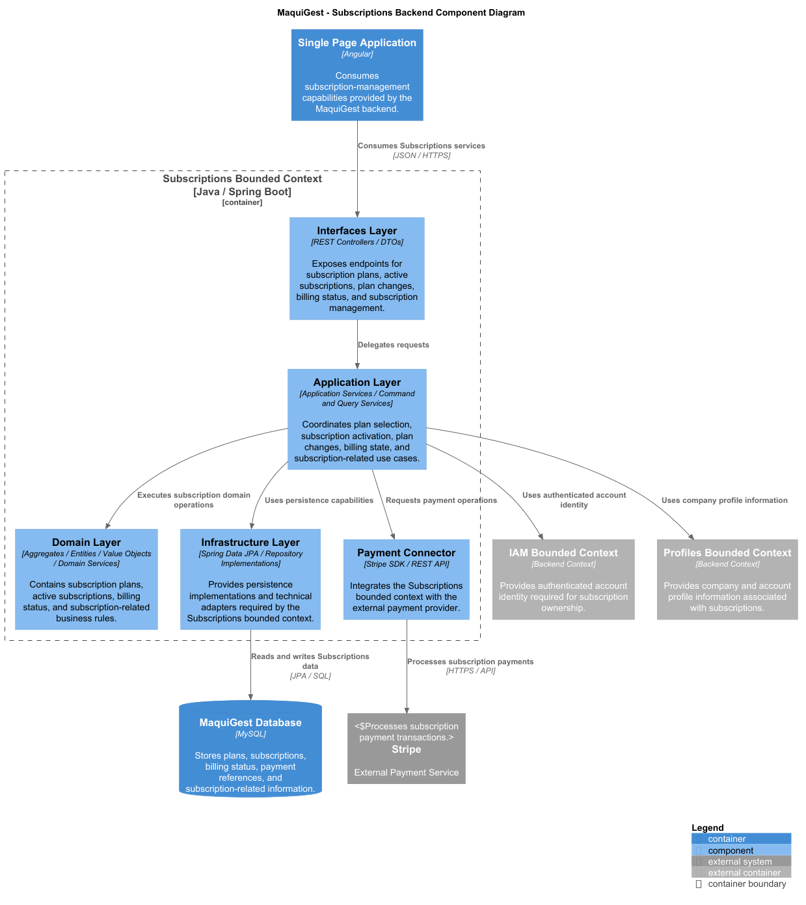
</p>

## 4.7. Software Object-Oriented Design

### 4.7.1. Class Diagrams

#### IAM


`User` es la entidad central, con `role` (empresa de alquiler o constructora) y `status`. `Credentials` es un value object que encapsula la validación de correo y contraseña, y `Session` representa el token vigente. `AuthenticationService` orquesta registro, inicio y cierre de sesión (US01, US02) a través de `UserRepository`.

#### Profiles

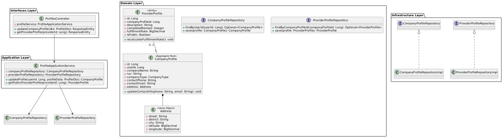

`CompanyProfile` guarda los datos de la empresa (US03) y compone un value object `Address` con coordenadas, que alimenta la integración con Google Maps. `ProviderProfile` extiende el perfil de una empresa de alquiler con su reputación pública — alquileres completados y tasa de cumplimiento —, que corresponde al término "Perfil de Proveedor" del Ubiquitous Language.

#### Inventory

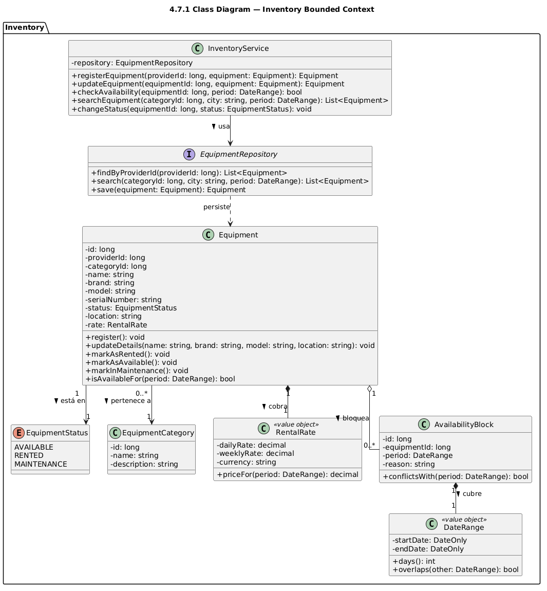

`Equipment` es el agregado principal: pertenece a una `EquipmentCategory`, compone una `RentalRate` (tarifa diaria y semanal) y mantiene su `EquipmentStatus` (disponible, alquilado, en mantenimiento). Los `AvailabilityBlock` con su `DateRange` permiten responder `isAvailableFor(period)` sin superposiciones, que es la regla que evita las dobles reservas descritas en la problemática. `InventoryService` cubre el registro, la actualización, la búsqueda para constructoras y el cambio de estado (US04–US11).

#### Rentals


`RentalRequest` modela la reservación: nace en estado `PENDING` y, al aceptarse, genera un `RentalContract` (US12–US16). El contrato compone un `RentalPeriod` y registra una `Delivery` y un `EquipmentReturn` (US17). `EquipmentReturn.requiresMaintenance()` es el punto donde una devolución con daño dispara el flujo del contexto Maintenance. `RentalService` orquesta el ciclo completo mediante los dos repositorios.

#### Maintenance

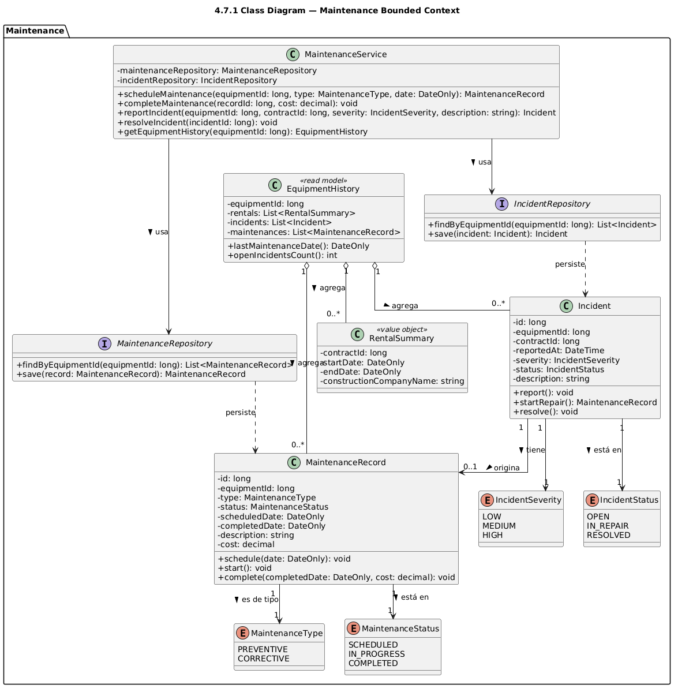

`MaintenanceRecord` distingue mantenimientos preventivos y correctivos con su ciclo de estados (US18, US19). `Incident` registra daños o fallas con su severidad y puede originar un `MaintenanceRecord` (US20). `EquipmentHistory` es un modelo de lectura que agrega alquileres, incidencias y mantenimientos de un equipo para responder US21 sin acoplar el contexto a Rentals: solo consume un `RentalSummary` con los datos mínimos.

#### Subscription 

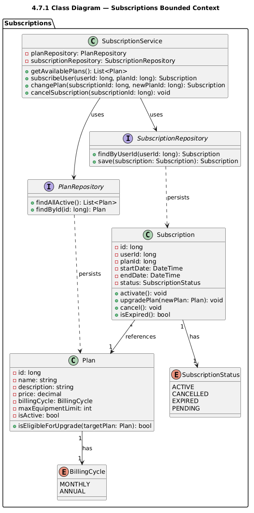

## 4.8. Database Design

### 4.8.1. Database Diagrams


# Capítulo V: Product Implementation, Validation & Deployment

# Capítulo V: Product Implementation, Validation & Deployment

## 5.1. Software Configuration Management

La gestión de la configuración de software en MaquiGest tiene como propósito mantener el control sobre los artefactos producidos durante el desarrollo del proyecto, garantizar la trazabilidad de los cambios realizados por los integrantes del equipo y asegurar que las diferentes versiones del producto puedan ser identificadas, integradas y desplegadas de manera organizada.

Para ello, CleanCode utiliza herramientas de control de versiones, diseño, documentación y despliegue que permiten coordinar el trabajo colaborativo tanto en el Project Report como en el Landing Page y, posteriormente, en los demás productos de software que conformarán MaquiGest.

La estrategia de trabajo se encuentra basada en Git y GitHub para el versionamiento y colaboración, GitFlow para la organización de ramas, Conventional Commits para mantener mensajes de cambios consistentes y Semantic Versioning para identificar las versiones liberadas del producto.

Asimismo, se utilizan herramientas especializadas para las diferentes actividades del ciclo de desarrollo, incluyendo Figma para el diseño UX/UI, PlantUML para la elaboración de diagramas de arquitectura de software y Netlify para el despliegue público del Landing Page.

### 5.1.1. Software Development Environment Configuration

El entorno de desarrollo de MaquiGest se ha configurado utilizando diferentes herramientas de acuerdo con las actividades de gestión, diseño, implementación, documentación y despliegue requeridas durante el desarrollo del producto.

Esta configuración permite mantener una separación clara entre los artefactos de documentación, diseño e implementación, facilitando el trabajo colaborativo del equipo y la evolución progresiva de la solución.

#### Project Management

Para la administración técnica y colaboración del proyecto se utiliza GitHub como plataforma principal.

CleanCode dispone de una organización en GitHub que centraliza los repositorios correspondientes a los diferentes productos de MaquiGest. A través de esta plataforma, los integrantes del equipo pueden trabajar de manera distribuida, crear ramas independientes para sus tareas, registrar commits, integrar cambios y mantener un historial completo de la evolución del proyecto.

Durante el desarrollo se utiliza GitFlow como estrategia de ramificación. Las nuevas funcionalidades y modificaciones se desarrollan principalmente mediante ramas `feature/*`, las cuales se integran posteriormente en la rama `develop`. Cuando el conjunto de funcionalidades alcanza un estado adecuado para una entrega, se utiliza una rama `release/*`, mientras que `main` representa las versiones estables del producto.

Los principales repositorios utilizados actualmente son:

| Producto | Repositorio |
| --- | --- |
| Project Report | `maquigest-report` |
| Landing Page | `maquigest-website` |

**GitHub Organization:**  
`upc-pre-202620-1asi0729-7750-cleancode`

#### Requirements Management

Los requisitos funcionales y las necesidades identificadas para MaquiGest se documentan dentro del Project Report.

La definición de requisitos parte de los resultados obtenidos mediante el proceso de Requirements Elicitation & Analysis, incluyendo entrevistas, Needfinding, User Personas, User Task Matrix, User Journey Mapping, Empathy Mapping, Big Picture Event Storming y Ubiquitous Language.

Posteriormente, los requisitos son formalizados mediante Epics y User Stories, incluyendo criterios de aceptación utilizando la estructura Given-When-Then. Estos artefactos constituyen la base para organizar las funcionalidades que posteriormente son incorporadas al Product Backlog y desarrolladas durante los Sprints.

GitHub también permite relacionar los cambios realizados en los repositorios con las funcionalidades correspondientes mediante ramas y commits descriptivos, proporcionando trazabilidad entre los requisitos documentados y su posterior implementación.

#### Product UX/UI Design

Para el diseño de la experiencia de usuario y de las interfaces de MaquiGest se utiliza Figma.

Esta herramienta permitió desarrollar los Wireframes y Mock-ups correspondientes tanto al Landing Page como a la Web Application. Las propuestas fueron elaboradas considerando los Style Guidelines, la Information Architecture y los segmentos objetivo definidos previamente.

Los diseños incluyen versiones para Desktop Web Browser y Mobile Web Browser, permitiendo representar el comportamiento responsive esperado antes de comenzar la implementación.

Asimismo, Figma sirve como referencia visual durante el desarrollo, facilitando que los integrantes encargados de implementar las interfaces mantengan consistencia con la identidad visual, estructura y componentes definidos durante la etapa de diseño.

**Herramienta:** Figma

#### Software Development

Para el desarrollo inicial del Landing Page de MaquiGest se utilizan tecnologías web estándar:

- HTML5 para la estructura semántica del contenido.
- CSS3 para los estilos, diseño responsive y presentación visual.
- JavaScript para las interacciones y comportamiento dinámico del sitio.

El código fuente del Landing Page se administra en el repositorio `maquigest-website`.

Para el desarrollo de la Web Application se ha definido Angular con TypeScript y Angular Material como tecnologías principales del frontend.

Para el backend se ha establecido una RESTful API desarrollada con Java y Spring Boot, utilizando Spring Data JPA para la persistencia y MySQL como sistema gestor de base de datos.

La arquitectura del software está organizada siguiendo principios de Domain-Driven Design, separando la solución en los siguientes bounded contexts:

`IAM`, `Profiles`, `Inventory`, `Rentals`, `Maintenance` y `Subscriptions`.

La organización por bounded contexts permite mantener separadas las responsabilidades asociadas con autenticación, perfiles, inventario, alquileres, mantenimiento y suscripciones.

#### Software Architecture and Modeling

Para la elaboración de los diagramas de arquitectura de MaquiGest se utiliza PlantUML junto con la librería C4-PlantUML.

Esta configuración permite generar diagramas correspondientes a los diferentes niveles del C4 Model, incluyendo:

- Software Architecture Context Diagram.
- Software Architecture Container Diagram.
- Software Architecture Component Diagrams.

Los archivos PlantUML se utilizan como fuente para generar imágenes PNG que posteriormente son incorporadas al Project Report.

Los diagramas permiten representar progresivamente la arquitectura de MaquiGest, comenzando por las relaciones generales del sistema, continuando con sus containers y finalizando con la descomposición interna de los principales componentes frontend y backend.

#### Software Documentation

La documentación del proyecto se administra principalmente mediante archivos Markdown almacenados en el repositorio `maquigest-report`.

El archivo `README.md` concentra el Project Report y permite mantener versionado el contenido correspondiente a análisis de requisitos, diseño UX/UI, arquitectura de software, implementación y evidencias del proyecto.

GitHub facilita el trabajo colaborativo sobre este documento mediante ramas independientes, commits y merges, permitiendo identificar las contribuciones realizadas por los diferentes integrantes del equipo.

Los recursos visuales utilizados en el informe, como Wireframes, Mock-ups, diagramas C4 y demás evidencias, se almacenan dentro de la estructura de `assets` del repositorio para conservar una organización uniforme.

#### Software Deployment

Para el despliegue del Landing Page de MaquiGest se utiliza Netlify.

El repositorio `maquigest-website` se encuentra vinculado con el proyecto de despliegue `maquigest-cleancode`, permitiendo publicar una versión accesible del Landing Page a través de Internet.

La configuración del despliegue se administra mediante el archivo `netlify.toml`, donde se establecen las instrucciones necesarias para que Netlify procese correctamente el proyecto.

El flujo general de publicación utilizado por el equipo es:

`feature/* → develop → release/* → main → versión estable → Netlify`

De esta manera, las funcionalidades son desarrolladas inicialmente de forma independiente, integradas y verificadas en `develop`, preparadas mediante una rama de release y finalmente incorporadas a `main`, desde donde se mantiene la versión estable del producto.

Para la primera versión del Landing Page se generó la release `1.0.0`, acompañada por los tags correspondientes utilizados para identificar dicha versión dentro del repositorio.

**Deployment Platform:** Netlify  
**Netlify Project:** `maquigest-cleancode`

### 5.1.2. Source Code Management

Para la gestión del código fuente y de los artefactos de documentación de MaquiGest, el equipo CleanCode utiliza **Git** como sistema de control de versiones distribuido y **GitHub** como plataforma remota para el almacenamiento, colaboración y seguimiento de los repositorios del proyecto.

El uso de estas herramientas permite mantener un historial trazable de los cambios realizados, distribuir el trabajo entre los integrantes mediante ramas independientes y controlar la integración progresiva de las funcionalidades desarrolladas.

La organización de GitHub de CleanCode centraliza actualmente los siguientes repositorios principales:

| Producto | Repositorio | Propósito |
| --- | --- | --- |
| Project Report | `maquigest-report` | Contiene el informe del proyecto, diagramas, evidencias y documentación técnica. |
| Landing Page | `maquigest-website` | Contiene la implementación del Landing Page de MaquiGest desarrollado con HTML, CSS y JavaScript. |

A medida que avance el desarrollo del producto, se incorporarán los repositorios correspondientes a la Frontend Web Application y al RESTful API.

#### GitFlow Workflow

El equipo utiliza **GitFlow** como estrategia principal de ramificación para organizar el desarrollo de MaquiGest.

La estrategia se basa en las ramas `main` y `develop`, complementadas por ramas temporales utilizadas para desarrollar funcionalidades, preparar versiones y realizar correcciones.

Las principales ramas son:

- `main`: contiene las versiones estables y publicables del producto.
- `develop`: funciona como rama principal de integración durante el desarrollo.
- `feature/*`: se utiliza para desarrollar nuevas funcionalidades o realizar modificaciones específicas.
- `release/*`: se utiliza para preparar una nueva versión estable antes de integrarla en `main`.
- `hotfix/*`: se reserva para correcciones urgentes que deban aplicarse sobre una versión estable.

El flujo general utilizado por CleanCode es el siguiente:

`feature/* → develop → release/* → main`

Cada nueva tarea comienza normalmente desde `develop`, creando una rama `feature/*` independiente. Una vez completado y verificado el trabajo, la rama se integra nuevamente en `develop`.

Cuando el conjunto de funcionalidades planificadas para una entrega se encuentra listo, se crea una rama `release/*`, donde se realizan las últimas verificaciones antes de integrar la versión en `main`.

Ejemplos de ramas utilizadas durante el desarrollo del proyecto incluyen:

- `feature/landing-header`
- `feature/landing-home`
- `feature/landing-about`
- `feature/landing-features`
- `feature/landing-solutions`
- `feature/landing-benefits`
- `feature/landing-plans`
- `feature/landing-demo`
- `feature/landing-contact`
- `feature/landing-footer`
- `feature/chapter-4-landing-page-ui-design`
- `release/1.0.0`

Este enfoque permite que cada integrante trabaje de manera independiente sin afectar directamente las versiones estables del proyecto.

#### Semantic Versioning

Las versiones estables de MaquiGest siguen los principios de **Semantic Versioning**, utilizando el formato:

`MAJOR.MINOR.PATCH`

donde:

- **MAJOR** representa cambios importantes que pueden introducir incompatibilidades con versiones anteriores.
- **MINOR** representa nuevas funcionalidades compatibles con la versión anterior.
- **PATCH** representa correcciones o ajustes menores que no modifican las funcionalidades principales del producto.

Para la primera versión estable del Landing Page se definió la versión:

`1.0.0`

Asimismo, se utilizaron tags en Git para identificar formalmente esta versión dentro del repositorio.

Los tags asociados a esta primera entrega son:

- `1.0.0`
- `v1.0.0`

El uso de tags permite identificar de forma precisa el estado del código correspondiente a una determinada versión y facilita su recuperación o despliegue cuando sea necesario.

#### Conventional Commits

Los mensajes de commit siguen la convención **Conventional Commits**, permitiendo identificar rápidamente el propósito de cada cambio realizado dentro de los repositorios.

El formato general utilizado es:

`type: short description`

Entre los tipos de commit empleados se encuentran:

| Tipo | Uso |
| --- | --- |
| `feat` | Incorporación de una nueva funcionalidad. |
| `fix` | Corrección de errores. |
| `docs` | Cambios relacionados con documentación. |
| `style` | Cambios de formato o estilo que no alteran la lógica. |
| `refactor` | Reestructuración del código sin modificar su comportamiento funcional. |
| `chore` | Tareas de configuración, mantenimiento o soporte del proyecto. |

Ejemplos de mensajes utilizados durante el desarrollo son:

```
feat: add landing page home section
docs: add landing page UI design wireframes and mockups
docs: center landing page design images
fix: correct Netlify deployment configuration
 ```
### 5.1.3. Source Code Style Guide & Conventions

Con el propósito de mantener consistencia, legibilidad y mantenibilidad en el código fuente de MaquiGest, el equipo CleanCode establece convenciones comunes para el desarrollo del Landing Page.

Todo el código fuente utiliza nomenclatura en inglés para variables, funciones, clases, identificadores y archivos, empleando nombres descriptivos relacionados con la responsabilidad de cada elemento.

#### General Conventions

Las principales convenciones adoptadas por el equipo son:

- El código fuente debe escribirse en inglés.
- Los nombres deben ser descriptivos y representar claramente su propósito.
- Se debe evitar el uso de abreviaciones ambiguas.
- Los archivos deben mantener una estructura organizada de acuerdo con su responsabilidad.
- Se debe evitar código duplicado o que no sea utilizado.
- Los cambios realizados en el repositorio deben seguir la convención Conventional Commits.

#### HTML

Para la estructura del Landing Page se utiliza HTML5, priorizando etiquetas semánticas y buenas prácticas de accesibilidad.

Entre las principales etiquetas utilizadas se encuentran:

- `header`: contiene el encabezado principal y la navegación inicial.
- `nav`: agrupa los enlaces de navegación.
- `main`: contiene el contenido principal del Landing Page.
- `section`: delimita cada sección temática del sitio.
- `div`: permite agrupar elementos visuales y estructurales.
- `img`: incorpora recursos gráficos e incluye atributos `alt`.
- `ul` / `li`: permite representar listas de elementos.
- `a`: representa enlaces y Call-to-Action.
- `p`: representa contenido textual.
- `button`: representa acciones interactivas.
- `form`: agrupa controles para el ingreso de información.
- `footer`: contiene la información final del sitio.
- `h1` - `h6`: establecen la jerarquía de títulos y subtítulos.

Se utilizan identificadores y atributos descriptivos, así como atributos de accesibilidad cuando corresponde.

#### CSS

Para los estilos del Landing Page se utiliza CSS3.

Los nombres de las clases utilizan la convención **kebab-case**.

Ejemplos:

```css
.feature-card
.subscription-plan
.contact-form
.navigation-menu
```

### 5.1.4. Software Deployment Configuration

La configuración de despliegue de MaquiGest permite publicar versiones estables de los productos desarrollados a partir de los repositorios administrados mediante GitHub, manteniendo trazabilidad entre el código fuente, las versiones liberadas y el producto disponible para los usuarios.

Para la primera entrega del proyecto, el producto desplegado corresponde al **Landing Page de MaquiGest**, desarrollado con HTML5, CSS3 y JavaScript y almacenado en el repositorio `maquigest-website`.

#### Landing Page Deployment

El Landing Page de MaquiGest se encuentra desplegado mediante **Netlify**, plataforma utilizada para publicar el sitio web y mantener disponible una versión accesible a través de Internet.

El proyecto configurado en Netlify corresponde a:

`maquigest-cleancode`

La configuración necesaria para el despliegue se encuentra definida mediante el archivo:

`netlify.toml`

Este archivo permite establecer las instrucciones utilizadas por Netlify para procesar y publicar correctamente el contenido del repositorio.

El flujo de desarrollo y publicación utilizado por CleanCode sigue la estrategia GitFlow adoptada para el proyecto:

```text
feature/*
    ↓
develop
    ↓
release/*
    ↓
main
    ↓
version tag
    ↓
Netlify
    ↓
Production
```
**Repository:**  
https://github.com/upc-pre-202620-1asi0729-7750-cleancode/maquigest-website

**Deployment URL:**  
https://maquigest-cleancode.netlify.app/

## 5.2. Landing Page, Services & Applications Implementation

En esta sección se explica y evidencia el proceso de implementación, pruebas, documentación y despliegue de los productos de software que conforman la solución MaquiGest.

El avance del producto se organiza mediante Sprints. Para cada Sprint se documentan las actividades de planificación, la distribución de responsabilidades mediante una Leadership-and-Collaboration Matrix, el Sprint Backlog, las evidencias de desarrollo obtenidas del sistema de control de versiones, las evidencias de ejecución, la documentación de servicios cuando corresponda, las actividades de despliegue y las evidencias de colaboración del equipo.

Durante el Sprint 1, el alcance de implementación se concentró en desarrollar y desplegar la primera versión funcional del Landing Page de MaquiGest, utilizando HTML5, CSS3 y JavaScript.

### 5.2.1. Sprint 1

Durante el Sprint 1, el equipo CleanCode desarrolló la primera versión funcional y responsive del Landing Page de MaquiGest.

La implementación se realizó tomando como referencia los Wireframes, Mock-ups, Style Guidelines e Information Architecture definidos previamente para el producto. Como resultado, el Landing Page permite comunicar la propuesta de valor de MaquiGest, presentar sus beneficios y funcionalidades principales, proporcionar información institucional sobre CleanCode y MaquiGest, diferenciar las soluciones dirigidas a los segmentos objetivo, presentar los planes disponibles y proporcionar mecanismos de interacción mediante los formularios de solicitud de demostración y contacto.

El alcance funcional del Sprint se encuentra relacionado principalmente con el Epic `EP07 - Información y contratación del servicio` y las siguientes User Stories:

- `US27 - Consultar información de MaquiGest`.
- `US28 - Solicitar demostración`.
- `US29 - Contactar con MaquiGest`.

Para el control de versiones se utilizaron Git y GitHub aplicando GitFlow y Conventional Commits. Al finalizar el Sprint se generó la primera versión estable del Landing Page, identificada mediante el tag `v1.0.0` y publicada mediante Netlify.

#### 5.2.1.1. Sprint Planning 1

El Sprint Planning 1 permitió establecer el alcance de la primera iteración de implementación de MaquiGest, seleccionar las User Stories relacionadas con el Landing Page y organizar las actividades necesarias para desarrollar y desplegar una primera versión funcional del producto.

A continuación, se presenta el resumen correspondiente al Sprint Planning Meeting:

| Campo | Descripción |
| --- | --- |
| **Sprint #** | Sprint 1 |
| **Sprint Planning Background** | Primera iteración orientada a la implementación, integración y despliegue de la primera versión funcional del Landing Page de MaquiGest. |
| **Date** | Pendiente de confirmar |
| **Time** | Pendiente de confirmar |
| **Location** | Pendiente de confirmar |
| **Prepared By** | Pendiente de confirmar |
| **Attendees (to planning meeting)** | Daga Chávez, Joaquín Leonardo / Delgado Perez, James Caleb / Manosalva Tovar, Miroslav Oscar / Montalvo Vasquez, Bruno Rodrigo / Paredes Chávez, Carlos Augusto |
| **Sprint n - 1 Review Summary** | Not applicable. Sprint 1 corresponde a la primera iteración del proyecto, por lo que no existe un Sprint anterior que revisar. |
| **Sprint n - 1 Retrospective Summary** | Not applicable. Sprint 1 corresponde a la primera iteración del proyecto, por lo que no existe una retrospectiva correspondiente a un Sprint anterior. |
| **Sprint Goal & User Stories** | `EP07 - Información y contratación del servicio` / `US27 - Consultar información de MaquiGest` / `US28 - Solicitar demostración` / `US29 - Contactar con MaquiGest` |
| **Sprint 1 Goal** | Nuestro enfoque se centra en disponer de una primera versión funcional y desplegada del Landing Page de MaquiGest que permita a los visitantes comprender la propuesta de valor, los beneficios, las funcionalidades, las soluciones para los segmentos objetivo y los planes del producto. Creemos que esto brindará a las empresas interesadas una forma clara de evaluar la propuesta y comunicarse con CleanCode. Esto se confirmará cuando la versión publicada permita navegar por las principales secciones del Landing Page, consultar la información del producto y utilizar los formularios de solicitud de demostración y contacto mediante una experiencia responsive. |
| **Sprint 1 Velocity** | Pendiente de definir a partir de los Story Points establecidos para las User Stories seleccionadas. |
| **Sum of Story Points** | Pendiente de completar a partir del Product Backlog. |

#### 5.2.1.2. Aspect Leaders and Collaborators

Durante el Sprint 1 se identificaron los principales aspectos funcionales y técnicos requeridos para implementar la primera versión del Landing Page.

Con el objetivo de organizar las responsabilidades del equipo se utiliza una Leadership-and-Collaboration Matrix (LACX). En esta matriz, `L` identifica al integrante que asumió el liderazgo de un aspecto del Sprint, mientras que `C` identifica a los integrantes que colaboraron en dicho aspecto.

Los aspectos establecidos mantienen relación con las actividades registradas posteriormente en el Sprint Backlog y con las contribuciones realizadas en el repositorio del Landing Page.

| Team Member (Last Name, First Name) | GitHub Username | Project Setup & Navigation | Informational Sections | Conversion Forms | Visual Assets & Footer | Deployment |
| --- | --- | :---: | :---: | :---: | :---: | :---: |
| Delgado Perez, James Caleb | `JAmsy06` | L | C |  |  | L |
| Montalvo Vasquez, Bruno Rodrigo | `TartaroZ` | C | L | L |  |  |
| Manosalva Tovar, Miroslav Oscar | `Miroa123` |  |  | C | L |  |
| Daga Chávez, Joaquín Leonardo | `Eshnikeee` | C |  |  | C | C |
| Paredes Chávez, Carlos Augusto | `CarlosUPC` |  |  |  |  | C |

**Leyenda:**

- `L`: Leader.
- `C`: Collaborator.

James Caleb Delgado Perez lideró la preparación de la estructura principal del proyecto y las actividades relacionadas con el despliegue, además de participar en la implementación de diferentes secciones informativas. Bruno Rodrigo Montalvo Vasquez lideró la implementación de diferentes secciones informativas y elementos de conversión, además de colaborar en la navegación. Miroslav Oscar Manosalva Tovar participó en los mecanismos de contacto y lideró las actividades asociadas con el Footer y recursos visuales. Joaquín Leonardo Daga Chávez colaboró en la preparación del proyecto, integración de recursos y configuración del despliegue. Carlos Augusto Paredes Chávez colaboró en las correcciones realizadas sobre la configuración de despliegue.

#### 5.2.1.3. Sprint Backlog 1

El Sprint Backlog 1 reúne las User Stories seleccionadas para alcanzar el Sprint Goal y los Work-Items/Tasks derivados de su descomposición.

Para este Sprint se seleccionaron las User Stories `US27`, `US28` y `US29`, pertenecientes al Epic `EP07 - Información y contratación del servicio`. También se consideran Technical Tasks necesarias para preparar el proyecto y realizar el despliegue del Landing Page.

Como herramienta para gestionar y visualizar el Sprint Backlog se utiliza Trello. El Board organiza las tareas utilizando los estados `To-do`, `In-Process`, `To-Review` y `Done`.

**Sprint Backlog 1 - Trello Board:**  
`[PENDIENTE: insertar URL pública del Board de Trello]`

<!--
Agregar aquí la captura del Sprint Backlog cuando el Board de Trello esté listo.

<p align="center">
  
</p>
-->

| Sprint # | Sprint 1 |
| --- | --- |

| Story Id | Story Title | Task Id | Task Title | Task Description | Estimation (Hours) | Assigned To | Status |
| --- | --- | --- | --- | --- | ---: | --- | --- |
| US27 | Consultar información de MaquiGest | TS01 | Prepare Landing Page base | Crear la estructura inicial del Landing Page utilizando HTML5, CSS3 y JavaScript. | Pendiente | James Caleb Delgado Perez | Done |
| US27 | Consultar información de MaquiGest | TS02 | Implement Header and language switching | Implementar el Header, la navegación principal y el comportamiento de cambio de idioma. | Pendiente | James Caleb Delgado Perez / Bruno Rodrigo Montalvo Vasquez | Done |
| US27 | Consultar información de MaquiGest | TS03 | Implement Home section | Implementar la propuesta de valor principal y los Call To Action del Landing Page. | Pendiente | James Caleb Delgado Perez | Done |
| US27 | Consultar información de MaquiGest | TS04 | Implement Benefits section | Implementar la sección destinada a comunicar los principales beneficios de MaquiGest. | Pendiente | Bruno Rodrigo Montalvo Vasquez | Done |
| US27 | Consultar información de MaquiGest | TS05 | Implement Features section | Implementar las cards destinadas a presentar las principales funcionalidades ofrecidas por MaquiGest. | Pendiente | James Caleb Delgado Perez | Done |
| US27 | Consultar información de MaquiGest | TS06 | Implement About section | Implementar la información correspondiente a misión, visión y valores de CleanCode y MaquiGest. | Pendiente | Bruno Rodrigo Montalvo Vasquez | Done |
| US27 | Consultar información de MaquiGest | TS07 | Implement Solutions section | Implementar las soluciones diferenciadas para empresas de alquiler de maquinaria y empresas constructoras. | Pendiente | Bruno Rodrigo Montalvo Vasquez | Done |
| US27 | Consultar información de MaquiGest | TS08 | Implement Plans section | Implementar la presentación y comparación de los planes Essential, Professional y Growth. | Pendiente | James Caleb Delgado Perez | Done |
| US27 | Consultar información de MaquiGest | TS09 | Integrate visual assets | Incorporar las imágenes, logotipos y demás recursos visuales requeridos por el Landing Page. | Pendiente | Joaquín Leonardo Daga Chávez | Done |
| US27 | Consultar información de MaquiGest | TS10 | Implement Footer and Terms page | Implementar el Footer y la primera versión de Terms and Conditions. | Pendiente | Miroslav Oscar Manosalva Tovar | Done |
| US28 | Solicitar demostración | TS11 | Implement Demo Request form | Implementar el formulario utilizado para solicitar una demostración y seleccionar un plan. | Pendiente | Bruno Rodrigo Montalvo Vasquez | Done |
| US29 | Contactar con MaquiGest | TS12 | Implement Contact form | Implementar el formulario mediante el cual los potenciales clientes pueden realizar consultas al equipo. | Pendiente | Miroslav Oscar Manosalva Tovar | Done |
| - | Technical Task | TS13 | Configure Netlify deployment | Configurar Netlify para permitir el despliegue y publicación del Landing Page. | Pendiente | James Caleb Delgado Perez | Done |
| - | Technical Task | TS14 | Fix Netlify configuration | Realizar los ajustes necesarios sobre la configuración de Netlify para completar correctamente el despliegue. | Pendiente | Joaquín Leonardo Daga Chávez / Carlos Augusto Paredes Chávez | Done |
| - | Technical Task | TS15 | Final deployment verification | Verificar la correcta publicación de la versión estable `v1.0.0` del Landing Page. | Pendiente | James Caleb Delgado Perez | Done |

#### 5.2.1.4. Development Evidence for Sprint Review

Durante el Sprint 1 se desarrolló la primera versión estable del Landing Page de MaquiGest. Los avances realizados incluyen la preparación de la estructura inicial del proyecto, navegación, internacionalización básica, implementación de las diferentes secciones informativas, formularios de conversión, integración de recursos visuales y configuración del despliegue.

El desarrollo fue gestionado mediante el repositorio `maquigest-website`, utilizando ramas `feature/*` para las diferentes funcionalidades, `develop` como rama de integración y `main` como rama correspondiente a la versión estable.

Los commits fueron redactados aplicando Conventional Commits. Además del Commit Message principal, cada commit cuenta con un Commit Message Body que proporciona información adicional sobre el cambio registrado.

A continuación, se presentan los commits no asociados con operaciones de merge que evidencian los principales avances realizados durante el Sprint.

| Repository | Branch | Commit Id | Commit Message | Commit Message Body | Commited on (Date) |
| --- | --- | --- | --- | --- | --- |
| `upc-pre-202620-1asi0729-7750-cleancode/maquigest-website` | `main` | `304f2d4` | `Initial commit` | Initializes the repository for the MaquiGest Landing Page project. | 2026-09-07 |
| `upc-pre-202620-1asi0729-7750-cleancode/maquigest-website` | `feature/setup-landing-base` | `cb1de32` | `chore(website): prepare readme and gitignore` | Prepares the project README and Git ignore rules for the Landing Page repository. | 2026-09-06 |
| `upc-pre-202620-1asi0729-7750-cleancode/maquigest-website` | `feature/setup-landing-base` | `98e3a96` | `chore(website): add html css and javascript base` | Adds the initial HTML5, CSS3 and JavaScript structure used as the base of the Landing Page. | 2026-09-06 |
| `upc-pre-202620-1asi0729-7750-cleancode/maquigest-website` | `feature/landing-header` | `421a0e4` | `feat(website): implement header and language switching` | Implements and refines the Landing Page header, navigation and language switching behavior. | 2026-09-08 |
| `upc-pre-202620-1asi0729-7750-cleancode/maquigest-website` | `feature/landing-header` | `d798471` | `feat(website): implement header and language switching` | Implements and refines the Landing Page header, navigation and language switching behavior. | 2026-09-08 |
| `upc-pre-202620-1asi0729-7750-cleancode/maquigest-website` | `feature/landing-header` | `cd3980b` | `feat(website): implement header and language switching` | Implements and refines the Landing Page header, navigation and language switching behavior. | 2026-09-08 |
| `upc-pre-202620-1asi0729-7750-cleancode/maquigest-website` | `feature/landing-home` | `441f2a6` | `feat(website): implement home section` | Implements the Home section with the main value proposition and primary calls to action. | 2026-09-08 |
| `upc-pre-202620-1asi0729-7750-cleancode/maquigest-website` | `feature/landing-benefits` | `6672cae` | `feat(website): implement benefits section` | Implements the Benefits section to communicate the main value provided by MaquiGest. | 2026-09-08 |
| `upc-pre-202620-1asi0729-7750-cleancode/maquigest-website` | `feature/landing-features` | `48baabe` | `feat(website): implement features section` | Implements the Features section to present the main capabilities offered by MaquiGest. | 2026-09-08 |
| `upc-pre-202620-1asi0729-7750-cleancode/maquigest-website` | `feature/landing-about` | `96a2656` | `style(website): prepare about section styles` | Adds the initial styles required by the About section before its complete implementation. | 2026-09-08 |
| `upc-pre-202620-1asi0729-7750-cleancode/maquigest-website` | `feature/landing-about` | `493ed1d` | `feat(website): implement about section with startup mission vision and values` | Implements the About section with the mission, vision and values of CleanCode and MaquiGest. | 2026-09-08 |
| `upc-pre-202620-1asi0729-7750-cleancode/maquigest-website` | `feature/landing-solutions` | `733918a` | `feat(website): implement target segment solutions section` | Implements the Solutions section for machinery rental companies and construction companies. | 2026-09-08 |
| `upc-pre-202620-1asi0729-7750-cleancode/maquigest-website` | `feature/landing-plans` | `15645ed` | `feat(website): implement subscription plans section` | Implements the Essential, Professional and Growth subscription plans and their calls to action. | 2026-09-08 |
| `upc-pre-202620-1asi0729-7750-cleancode/maquigest-website` | `feature/landing-demo` | `afd4c63` | `feat(website): implement demo request form and plan selection` | Implements the demo request form and supports subscription plan selection before submitting the request. | 2026-09-09 |
| `upc-pre-202620-1asi0729-7750-cleancode/maquigest-website` | `feature/landing-contact` | `a9f35ae` | `feat(website): implement contact form` | Implements the contact form for potential customers to send inquiries to the MaquiGest team. | 2026-09-09 |
| `upc-pre-202620-1asi0729-7750-cleancode/maquigest-website` | `feature/landing-footer` | `84be364` | `feat(website): add footer and draft terms page` | Implements the Landing Page footer and adds the initial Terms and Conditions page. | 2026-09-09 |
| `upc-pre-202620-1asi0729-7750-cleancode/maquigest-website` | `develop` | `35ce43c` | `feat(website): add footer and draft terms page` | Integrates the footer and initial Terms and Conditions page into the Landing Page development version. | 2026-09-09 |
| `upc-pre-202620-1asi0729-7750-cleancode/maquigest-website` | `develop` | `132400c` | `feat(website): add new images` | Adds the visual image assets required by the different Landing Page sections. | 2026-09-09 |
| `upc-pre-202620-1asi0729-7750-cleancode/maquigest-website` | `develop` | `bd88235` | `fix(website): use transparent logos and PNG favicon` | Updates branding assets to use transparent logos and a PNG favicon across the Landing Page. | 2026-09-09 |
| `upc-pre-202620-1asi0729-7750-cleancode/maquigest-website` | `develop` | `c7ba406` | `chore(website): configure Netlify deployment` | Adds the Netlify configuration required to deploy and publish the MaquiGest Landing Page. | 2026-09-09 |
| `upc-pre-202620-1asi0729-7750-cleancode/maquigest-website` | `develop` | `52e2510` | `fix: correct Netlify configuration` | Adjusts the Netlify configuration to correct deployment settings for the MaquiGest Landing Page. | 2026-09-09 |
| `upc-pre-202620-1asi0729-7750-cleancode/maquigest-website` | `develop` | `0720c3b` | `fix: correct Netlify configuration` | Adjusts the Netlify configuration to correct deployment settings for the MaquiGest Landing Page. | 2026-09-09 |
| `upc-pre-202620-1asi0729-7750-cleancode/maquigest-website` | `develop` | `b96dd06` | `fix: correct Netlify configuration` | Adjusts the Netlify configuration to correct deployment settings for the MaquiGest Landing Page. | 2026-09-09 |
| `upc-pre-202620-1asi0729-7750-cleancode/maquigest-website` | `develop` | `3bfa9c7` | `fix: remove BOM from Netlify configuration` | Removes the Byte Order Mark from the Netlify configuration file to prevent configuration parsing issues. | 2026-09-09 |

La distribución de los commits no asociados con operaciones de merge registrados durante el Sprint 1 es la siguiente:

| Team Member | GitHub Username | Number of Commits |
| --- | --- | ---: |
| James Caleb Delgado Perez | `JAmsy06` | 8 |
| Bruno Rodrigo Montalvo Vasquez | `TartaroZ` | 7 |
| Miroslav Oscar Manosalva Tovar | `Miroa123` | 4 |
| Joaquín Leonardo Daga Chávez | `Eshnikeee` | 3 |
| Carlos Augusto Paredes Chávez | `CarlosUPC` | 2 |
| **Total** |  | **24** |

La versión estable generada al finalizar este proceso corresponde al tag `v1.0.0`. El tag y la rama remota `main` se encuentran asociados al mismo commit de la versión estable:

`e40e7ad3714c138dfbe637e3ec9f7bb330d2a1ef`

De esta manera, las evidencias registradas permiten establecer trazabilidad entre las actividades realizadas durante el Sprint, los Work-Items definidos en el Sprint Backlog y las modificaciones almacenadas en el repositorio del Landing Page.


#### 5.2.1.5. Execution Evidence for Sprint Review

Durante el Sprint 1 se completó la implementación y publicación de la primera versión funcional del Landing Page de MaquiGest. Esta versión permite que los visitantes conozcan la propuesta de valor del producto, sus principales beneficios y funcionalidades, las soluciones orientadas a los segmentos objetivo y los planes disponibles.

Asimismo, se implementaron mecanismos de interacción dirigidos a potenciales clientes mediante los formularios de solicitud de demostración y contacto. El Landing Page también incorpora navegación entre secciones y cambio de idioma.

La versión implementada durante el Sprint se encuentra desplegada públicamente mediante Netlify en la siguiente dirección:

https://maquigest-cleancode.netlify.app/

A continuación, se presentan las principales vistas correspondientes a la ejecución del producto desarrollado durante el Sprint 1.

##### Home and Header

La vista inicial presenta el Header de navegación y la propuesta de valor principal de MaquiGest. Desde esta sección, el visitante puede acceder a las principales áreas del Landing Page, cambiar el idioma y utilizar los Call To Action para solicitar una demostración o consultar los planes disponibles.

<p align="center">
  
</p>

##### Benefits

La sección Benefits comunica los principales beneficios que MaquiGest ofrece a sus usuarios. Entre ellos se encuentran una mejor visualización de la disponibilidad de maquinaria, la centralización de las operaciones relacionadas con los alquileres y el seguimiento del estado de los equipos.

<p align="center">
  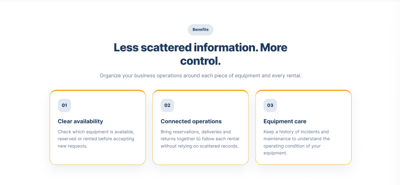
</p>

##### Features

La sección Features presenta las principales funcionalidades contempladas por MaquiGest, entre ellas la gestión de inventario de maquinaria, disponibilidad y reservas, seguimiento de alquileres, entregas y devoluciones, mantenimiento e incidencias, así como búsqueda y solicitud de equipos.

<p align="center">
  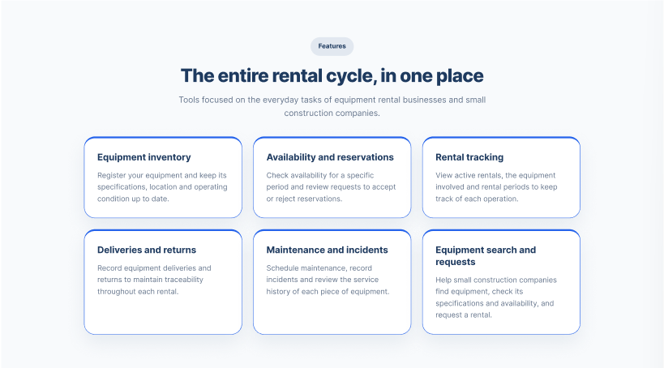
</p>

##### About Us

La sección About Us presenta información institucional sobre CleanCode, startup responsable del desarrollo de MaquiGest. Esta vista comunica la misión, visión y valores que orientan el desarrollo de la solución.

<p align="center">
  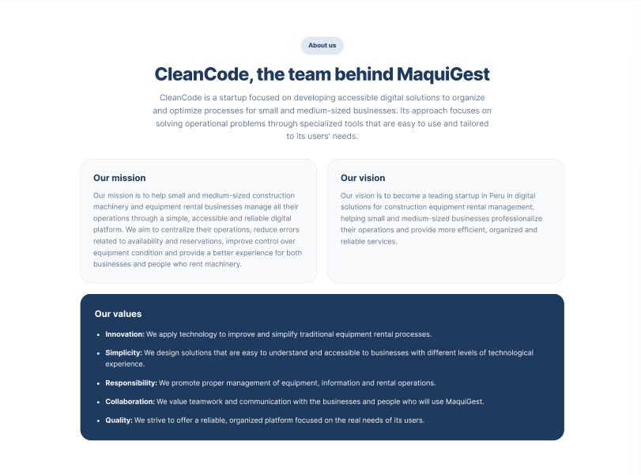
</p>

##### Solutions

La sección Solutions presenta de manera diferenciada la propuesta de MaquiGest para los dos segmentos objetivo del proyecto: empresas dedicadas al alquiler de maquinaria y empresas constructoras o contratistas que necesitan maquinaria para desarrollar sus proyectos.

Para las empresas de alquiler, se presentan funcionalidades relacionadas con inventario, disponibilidad, reservas, entregas, devoluciones, incidencias y mantenimiento. Para las empresas constructoras y contratistas, se presentan funcionalidades orientadas a la búsqueda de maquinaria, consulta de disponibilidad, solicitud de equipos y seguimiento de los alquileres realizados.

<p align="center">
  
</p>

##### Plans

La sección Plans presenta tres alternativas de contratación: Essential, Professional y Growth. Cada plan muestra un conjunto diferenciado de funcionalidades y un precio mensual referencial en soles peruanos.

Además, cada alternativa incorpora un Call To Action que permite al visitante continuar hacia el formulario de solicitud de demostración asociado con el plan seleccionado.

<p align="center">
  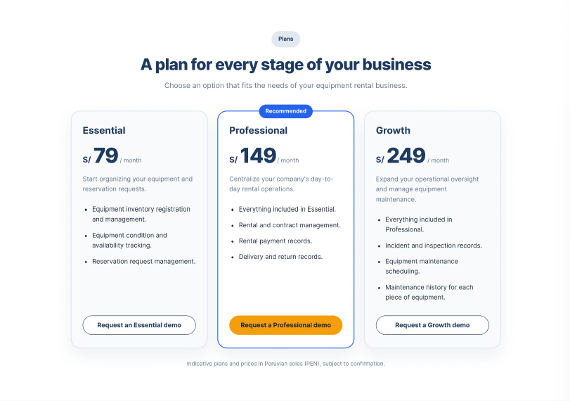
</p>

##### Request Demo

La sección Request Demo proporciona un formulario mediante el cual un potencial cliente puede solicitar una demostración de MaquiGest.

El formulario permite registrar el nombre completo, correo electrónico, nombre de la empresa, plan de interés e información adicional sobre lo que el usuario desea conocer durante la demostración.

<p align="center">
  
</p>

##### Contact and Footer

La sección Contact permite que los visitantes envíen consultas al equipo de MaquiGest mediante el registro de su nombre, correo electrónico y mensaje.

Al finalizar el Landing Page se encuentra el Footer, que incorpora información resumida sobre MaquiGest, navegación complementaria hacia las principales secciones del sitio y acceso a los Terms and Conditions.

<p align="center">
  
</p>

Las evidencias presentadas permiten comprobar que las principales secciones definidas para el Landing Page fueron implementadas y se encuentran disponibles en la versión publicada correspondiente al Sprint 1.

##### Product Navigation Video

Como evidencia complementaria de ejecución se presentará un video en el que se demuestra la navegación por las principales secciones del Landing Page de MaquiGest y el comportamiento de los elementos interactivos implementados durante el Sprint.

**Product Navigation Video:**  
`[PENDIENTE: insertar URL del video de navegación]`

#### 5.2.1.6. Services Documentation Evidence for Sprint Review

Durante el Sprint 1, el alcance de implementación estuvo concentrado en el desarrollo y despliegue de la primera versión funcional del Landing Page de MaquiGest.

En esta iteración no se implementaron RESTful Web Services correspondientes al backend de la solución. Por este motivo, durante el Sprint 1 no existen endpoints desarrollados ni documentación OpenAPI o Swagger asociada a servicios de aplicación.

La implementación de los Web Services será realizada en Sprints posteriores, de acuerdo con la evolución del Product Backlog y con la arquitectura definida para MaquiGest, la cual contempla el desarrollo de una REST API utilizando Java, Spring Boot y Spring Data JPA.

Por lo tanto, en el Sprint 1 esta sección no presenta evidencias de endpoints, métodos HTTP, parámetros o respuestas, debido a que el producto implementado durante esta iteración corresponde exclusivamente al Landing Page.

#### 5.2.1.7. Software Deployment Evidence for Sprint Review

Durante el Sprint 1 se realizaron las actividades necesarias para publicar la primera versión estable del Landing Page de MaquiGest en un entorno accesible públicamente.

El código fuente del Landing Page se encuentra almacenado en el repositorio `maquigest-website`, perteneciente a la organización GitHub de CleanCode. La solución fue desarrollada utilizando HTML5, CSS3 y JavaScript y posteriormente integrada con Netlify para automatizar su publicación.

##### Netlify Deployment

Para el despliegue del Landing Page se utilizó Netlify mediante el proyecto `maquigest-cleancode`.

El proyecto de Netlify se encuentra conectado directamente con el repositorio:

`upc-pre-202620-1asi0729-7750-cleancode/maquigest-website`

La configuración establece la rama `main` como fuente para el entorno de producción y mantiene habilitada la publicación automática de los cambios realizados sobre dicha rama.

La versión desplegada corresponde al commit:

`e40e7ad3714c138dfbe637e3ec9f7bb330d2a1ef`

El Landing Page se encuentra disponible públicamente mediante la siguiente URL:

https://maquigest-cleancode.netlify.app/

<p align="center">
  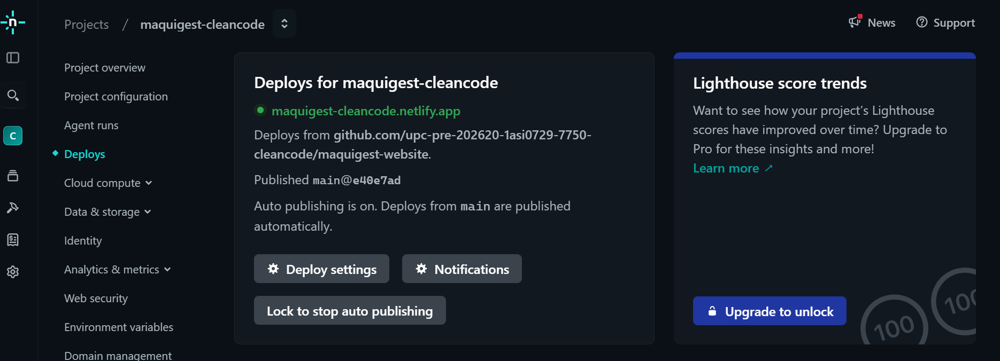
</p>

La evidencia anterior permite verificar el proyecto configurado en Netlify, su conexión con GitHub, la rama utilizada para producción y el commit correspondiente a la versión publicada.

##### GitHub Release

Una vez finalizada la implementación e integración del Sprint 1, se publicó la primera versión estable del Landing Page mediante GitHub Releases.

La versión publicada fue identificada mediante el tag:

`v1.0.0`

El Release fue publicado con el nombre `MaquiGest Landing Page v1.0.0` y representa la primera versión estable desarrollada por el equipo CleanCode.

<p align="center">
  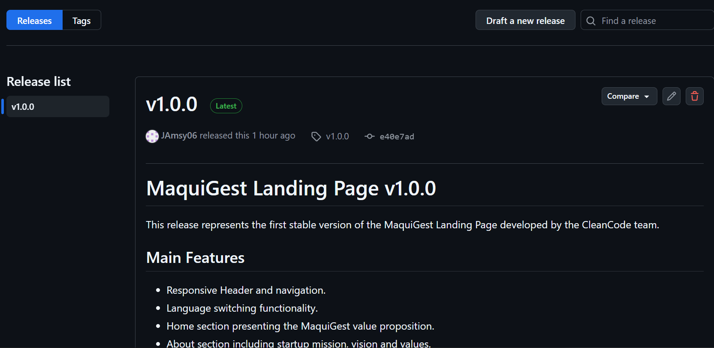
</p>

En GitHub, el tag `v1.0.0` se encuentra asociado al mismo commit utilizado por la rama `main`:

`e40e7ad3714c138dfbe637e3ec9f7bb330d2a1ef`

De esta manera, se mantiene trazabilidad entre la versión almacenada en el repositorio, el Release generado y el producto publicado mediante Netlify.

##### Production Environment

El entorno de producción correspondiente al Sprint 1 se encuentra disponible en:

https://maquigest-cleancode.netlify.app/

La versión desplegada fue verificada comprobando la correcta carga del Landing Page, la navegación entre sus secciones, los recursos visuales, los formularios implementados y los elementos interactivos definidos para la primera versión del producto.

Por lo tanto, las evidencias presentadas permiten comprobar que el Landing Page desarrollado durante el Sprint 1 fue integrado, versionado y desplegado satisfactoriamente en un entorno público.

#### 5.2.1.8. Team Collaboration Insights during Sprint

Durante el Sprint 1, el equipo CleanCode trabajó colaborativamente en la implementación, integración y despliegue de la primera versión del Landing Page de MaquiGest.

Git y GitHub fueron utilizados como herramientas principales para administrar el código fuente y registrar las contribuciones realizadas durante la iteración. El trabajo se organizó mediante ramas destinadas al desarrollo de funcionalidades específicas, una rama `develop` utilizada para integración y la rama `main` correspondiente a la versión estable del producto.

Las contribuciones realizadas por los integrantes pueden observarse mediante las herramientas de análisis proporcionadas por GitHub.

##### GitHub Contributors

GitHub Contributors permite visualizar la participación de los integrantes del equipo en el repositorio `maquigest-website`.

La distribución de commits no asociados con operaciones de merge registrada para el Sprint 1 fue la siguiente:

| Team Member | GitHub Username | Commits |
| --- | --- | ---: |
| James Caleb Delgado Perez | `JAmsy06` | 8 |
| Bruno Rodrigo Montalvo Vasquez | `TartaroZ` | 7 |
| Miroslav Oscar Manosalva Tovar | `Miroa123` | 4 |
| Joaquín Leonardo Daga Chávez | `Eshnikeee` | 3 |
| Carlos Augusto Paredes Chávez | `CarlossUPC` | 2 |
| **Total** |  | **24** |

Las siguientes evidencias muestran las estadísticas individuales registradas por GitHub para los integrantes del equipo.

<p align="center">
  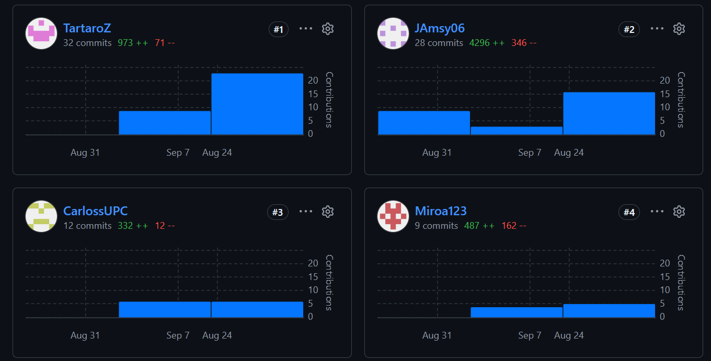
</p>

<p align="center">
  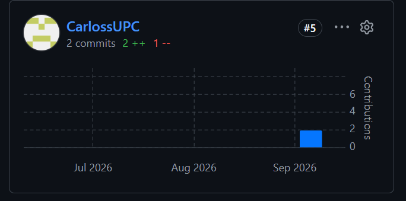
</p>

Las estadísticas muestran que los cinco integrantes cuentan con actividad registrada en el repositorio durante el desarrollo del Landing Page.

Las contribuciones incluyen actividades relacionadas con la estructura inicial del proyecto, navegación, secciones informativas, formularios, recursos visuales y configuración del despliegue.

##### Commit Activity

La sección de estadísticas de GitHub permite observar también la actividad general de commits realizada sobre el repositorio.

Durante el periodo correspondiente al Sprint 1 se registraron los 24 commits utilizados como evidencia del desarrollo del Landing Page.

<p align="center">
  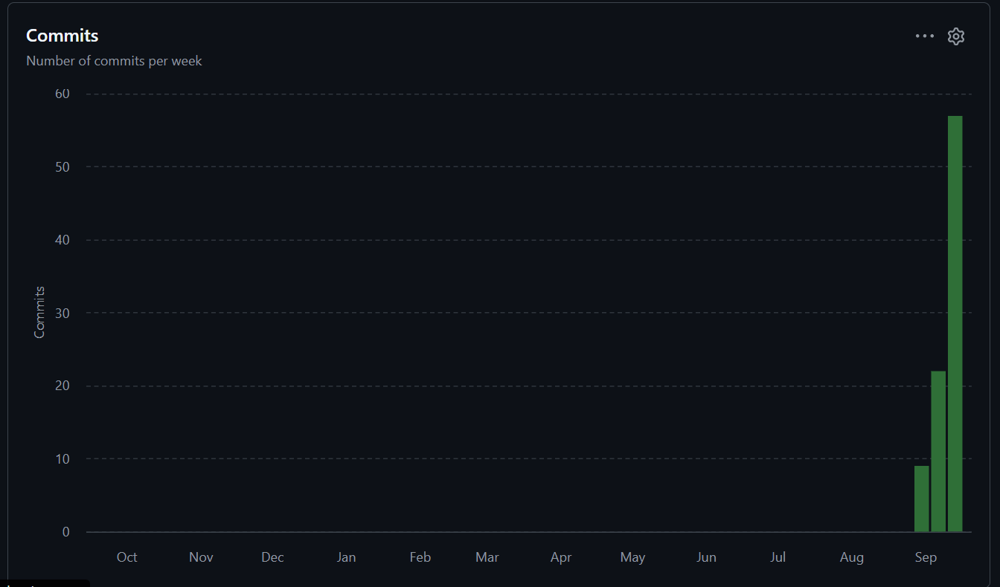
</p>

La concentración de actividad registrada durante septiembre de 2026 corresponde al periodo de implementación e integración de la primera versión del Landing Page.

La evidencia obtenida mediante GitHub permite establecer trazabilidad entre las contribuciones realizadas por los integrantes, los Work-Items definidos en el Sprint Backlog y los commits documentados previamente en la sección Development Evidence for Sprint Review.

Asimismo, la participación registrada es consistente con la Leadership-and-Collaboration Matrix definida para el Sprint, en la que se distribuyeron responsabilidades relacionadas con la estructura del proyecto, las secciones informativas, los mecanismos de conversión, los recursos visuales y las actividades de despliegue.

# Conclusiones

## Conclusiones y recomendaciones

# Bibliografía

# Anexos
