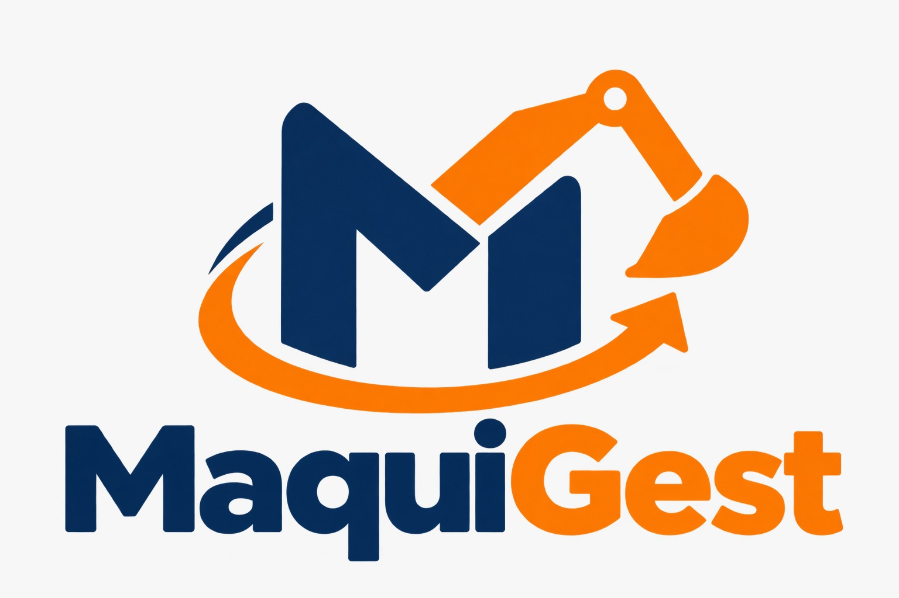
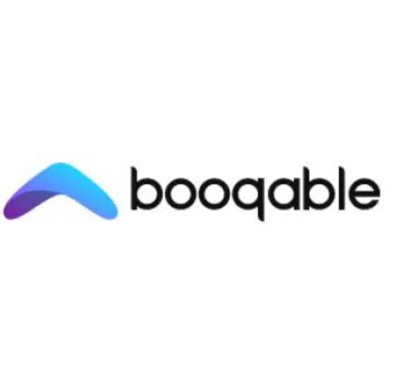

# MaquiGest

  

  
Universidad Peruana de Ciencias Aplicadas

  
Facultad de Ingeniería

  
Carrera de Ingeniería de Software

  
Ciclo académico 2026-20
 

  
<b>1ASI0729</b>

  
<b>Desarrollo de Aplicaciones Open Source</b>

  
NRC

  
<b>7750</b>

  
<b>Informe de Trabajo Final</b>

  
Docente

  
<b>Bautista Ubillús, Efraín Ricardo</b>

  
Startup

  
<b>CleanCode</b>
 
  
Producto

  
<b>MaquiGest</b>

  <h3>Integrantes</h3>

  <table>
    <thead>
      <tr>
        <th>Código</th>
        <th>Apellidos y Nombres</th>
      </tr>
    </thead>
    <tbody>
      <tr>
        <td>U202115277</td>
        <td>Delgado Perez, James Caleb</td>
      </tr>
      <tr>
        <td>U202111529</td>
        <td>Montalvo Vasquez, Bruno Rodrigo</td>
      </tr>
      <tr>
        <td>U202410211</td>
        <td>Manosalva Tovar, Miroslav</td>
      </tr>
    </tbody>
  </table>
   

  
<b>Septiembre, 2026</b>

## Registro de Versiones del Informe

| Versión | Fecha |  Autor   |                                                  Descripción de modificación                                                   |
| :-----: |:-----:|:--------:| :----------------------------------------------------------------------------------------------------------------------------: |
|   AV1   |       |  Todos   | Se agregó la primera versión del informe, incluyendo carátula, registro de versiones, perfiles del equipo, análisis inicial del problema, artefactos de UX, arquitectura preliminar y evidencias del Sprint 1. |

## Project Report Collaboration Insights

A continuación, se presenta el repositorio utilizado para la elaboración colaborativa del informe del proyecto MaquiGest.

#### Link del repositorio del Reporte:

- https://github.com/upc-pre-202620-1asi0729-7750-cleancode/maquigest-report

### Entrega AV1:

#### Participación por integrante:

##### Commits en el Project Report:

# Contenido

## Índice

- [Registro de Versiones del Informe](#registro-de-versiones-del-informe)
- [Project Report Collaboration Insights](#project-report-collaboration-insights)
- [Contenido](#contenido)
- [Student Outcome](#student-outcome)
- [Capítulo I: Introducción](#capítulo-i-introducción)
    - [1.1. Startup Profile](#11-startup-profile)
        - [1.1.1. Descripción de la Startup](#111-descripción-de-la-startup)
        - [1.1.2. Perfiles de integrantes del equipo](#112-perfiles-de-integrantes-del-equipo)
    - [1.2. Solution Profile](#12-solution-profile)
        - [1.2.1. Antecedentes y problemática](#121-antecedentes-y-problemática)
        - [1.2.2. Lean UX Process](#122-lean-ux-process)
            - [1.2.2.1. Lean UX Problem Statements](#1221-lean-ux-problem-statements)
            - [1.2.2.2. Lean UX Assumptions](#1222-lean-ux-assumptions)
            - [1.2.2.3. Lean UX Hypothesis Statements](#1223-lean-ux-hypothesis-statements)
            - [1.2.2.4. Lean UX Canvas](#1224-lean-ux-canvas)
    - [1.3. Segmentos objetivo](#13-segmentos-objetivo)
- [Capítulo II: Requirements Elicitation & Analysis](#capítulo-ii-requirements-elicitation--analysis)
    - [2.1. Competidores](#21-competidores)
        - [2.1.1. Análisis competitivo](#211-análisis-competitivo)
        - [2.1.2. Estrategias y tácticas frente a competidores](#212-estrategias-y-tácticas-frente-a-competidores)
    - [2.2. Entrevistas](#22-entrevistas)
        - [2.2.1. Diseño de entrevistas](#221-diseño-de-entrevistas)
        - [2.2.2. Registro de entrevistas](#222-registro-de-entrevistas)
        - [2.2.3. Análisis de entrevistas](#223-análisis-de-entrevistas)
    - [2.3. Needfinding](#23-needfinding)
        - [2.3.1. User Personas](#231-user-personas)
        - [2.3.2. User Task Matrix](#232-user-task-matrix)
        - [2.3.3. User Journey Mapping](#233-user-journey-mapping)
        - [2.3.4. Empathy Mapping](#234-empathy-mapping)
    - [2.4. Big Picture Event Storming](#24-big-picture-event-storming)
    - [2.5. Ubiquitous Language](#25-ubiquitous-language)
- [Capítulo III: Requirements Specification](#capítulo-iii-requirements-specification)
    - [3.1. User Stories](#31-user-stories)
    - [3.2. Impact Mapping](#32-impact-mapping)
    - [3.3. Product Backlog](#33-product-backlog)
- [Capítulo IV: Product Design](#capítulo-iv-product-design)
    - [4.1. Style Guidelines](#41-style-guidelines)
        - [4.1.1. General Style Guidelines](#411-general-style-guidelines)
        - [4.1.2. Web Style Guidelines](#412-web-style-guidelines)
    - [4.2. Information Architecture](#42-information-architecture)
        - [4.2.1. Organization Systems](#421-organization-systems)
        - [4.2.2. Labeling Systems](#422-labeling-systems)
        - [4.2.3. SEO Tags and Meta Tags](#423-seo-tags-and-meta-tags)
        - [4.2.4. Searching Systems](#424-searching-systems)
        - [4.2.5. Navigation Systems](#425-navigation-systems)
    - [4.3. Landing Page UI Design](#43-landing-page-ui-design)
        - [4.3.1. Landing Page Wireframe](#431-landing-page-wireframe)
        - [4.3.2. Landing Page Mock-up](#432-landing-page-mock-up)
    - [4.4. Web Applications UX/UI Design](#44-web-applications-uxui-design)
        - [4.4.1. Web Applications Wireframes](#441-web-applications-wireframes)
        - [4.4.2. Web Applications Wireflow Diagrams](#442-web-applications-wireflow-diagrams)
        - [4.4.3. Web Applications Mock-ups](#443-web-applications-mock-ups)
        - [4.4.4. Web Applications User Flow Diagrams](#444-web-applications-user-flow-diagrams)
    - [4.5. Web Applications Prototyping](#45-web-applications-prototyping)
    - [4.6. Domain-Driven Software Architecture](#46-domain-driven-software-architecture)
        - [4.6.1. Design-Level Event Storming](#461-design-level-event-storming)
        - [4.6.2. Software Architecture Context Diagram](#462-software-architecture-context-diagram)
        - [4.6.3. Software Architecture Container Diagrams](#463-software-architecture-container-diagrams)
        - [4.6.4. Software Architecture Components Diagrams](#464-software-architecture-components-diagrams)
    - [4.7. Software Object-Oriented Design](#47-software-object-oriented-design)
        - [4.7.1. Class Diagrams](#471-class-diagrams)
    - [4.8. Database Design](#48-database-design)
        - [4.8.1. Database Diagrams](#481-database-diagrams)
- [Capítulo V: Product Implementation, Validation & Deployment](#capítulo-v-product-implementation-validation--deployment)
    - [5.1. Software Configuration Management](#51-software-configuration-management)
        - [5.1.1. Software Development Environment Configuration](#511-software-development-environment-configuration)
        - [5.1.2. Source Code Management](#512-source-code-management)
        - [5.1.3. Source Code Style Guide & Conventions](#513-source-code-style-guide--conventions)
        - [5.1.4. Software Deployment Configuration](#514-software-deployment-configuration)
    - [5.2. Landing Page, Services & Applications Implementation](#52-landing-page-services--applications-implementation)
        - [5.2.1. Sprint 1](#521-sprint-1)
            - [5.2.1.1. Sprint Planning 1](#5211-sprint-planning-1)
            - [5.2.1.2. Aspect Leaders and Collaborators](#5212-aspect-leaders-and-collaborators)
            - [5.2.1.3. Sprint Backlog 1](#5213-sprint-backlog-1)
            - [5.2.1.4. Development Evidence for Sprint Review](#5214-development-evidence-for-sprint-review)
            - [5.2.1.5. Execution Evidence for Sprint Review](#5215-execution-evidence-for-sprint-review)
            - [5.2.1.6. Services Documentation Evidence for Sprint Review](#5216-services-documentation-evidence-for-sprint-review)
            - [5.2.1.7. Software Deployment Evidence for Sprint Review](#5217-software-deployment-evidence-for-sprint-review)
            - [5.2.1.8. Team Collaboration Insights during Sprint](#5218-team-collaboration-insights-during-sprint)
- [Conclusiones](#conclusiones)
    - [Conclusiones y recomendaciones](#conclusiones-y-recomendaciones)
- [Bibliografía](#bibliografía)
- [Anexos](#anexos)

## Student Outcome

El curso contribuye al cumplimiento del Student Outcome ABET:  
**ABET - EAC - Student Outcome 3**

**Criterio:** *Capacidad de comunicarse efectivamente con un rango de audiencias.*

En el siguiente cuadro se describe las acciones realizadas y enunciados de conclusiones por parte del grupo, que permiten sustentar el haber alcanzado el logro del ABET - EAC - Student Outcome 3.

| Criterio específico | Acciones realizadas | Conclusiones |
| :--- | :--- | :--- |
| **Comunica oralmente con efectividad a diferentes rangos de audiencia.** | **Delgado Perez, James Caleb** **AV1:**  **Montalvo Vasquez, Bruno Rodrigo** **AV1:**  **Manosalva Tovar, Miroslav** **AV1:** | **AV1:** |
| **Comunica por escrito con efectividad a diferentes rangos de audiencia.** | **Delgado Perez, James Caleb** **AV1:**  **Montalvo Vasquez, Bruno Rodrigo** **AV1:**  **Manosalva Tovar, Miroslav** **AV1:** | **AV1:** |

# Capítulo I: Introducción

## 1.1. Startup Profile

### 1.1.1. Descripción de la Startup

CleanCode es una startup orientada al desarrollo de soluciones digitales accesibles que permitan organizar y optimizar los procesos de pequeñas y medianas empresas. Su propuesta se enfoca en resolver problemas operativos mediante herramientas especializadas, sencillas de utilizar y adaptadas a las necesidades de sus usuarios.

Como parte de esta iniciativa, CleanCode desarrolla MaquiGest, una plataforma SaaS dirigida principalmente a pequeñas y medianas empresas dedicadas al alquiler de maquinaria y equipos para obras de construcción de pequeña escala. Estas empresas suelen gestionar sus operaciones mediante hojas de cálculo, llamadas, mensajes y sistemas independientes, lo cual dificulta el control de sus equipos y aumenta la posibilidad de cometer errores.

MaquiGest centralizará la gestión del inventario, disponibilidad, reservas, contratos, pagos, entregas, devoluciones, incidencias y mantenimiento de los equipos. De esta manera, permitirá realizar el seguimiento de la maquinaria durante todo su ciclo de alquiler y facilitará la interacción con las personas que necesitan alquilar equipos para sus proyectos personales relacionados con la construcción.

#### Misión

Nuestra misión es facilitar la gestión integral de las pequeñas y medianas empresas dedicadas al alquiler de maquinaria y equipos para construcción mediante una plataforma digital sencilla, accesible y confiable. Buscamos centralizar sus operaciones, reducir errores relacionados con la disponibilidad y las reservas, mejorar el control del estado de los equipos y brindar una mejor experiencia tanto a las empresas como a las personas que alquilan maquinaria.

#### Visión

Nuestra visión es convertirnos en una startup referente en el Perú en soluciones digitales para la gestión del alquiler de maquinaria de construcción, contribuyendo a que las pequeñas y medianas empresas profesionalicen sus operaciones y brinden servicios más eficientes, organizados y confiables.

#### Valores

Nuestros valores principales son los siguientes:

* **Innovación:** Aplicamos tecnología para mejorar y simplificar los procesos tradicionales del alquiler de maquinaria.
* **Simplicidad:** Diseñamos soluciones comprensibles y accesibles para empresas con diferentes niveles de experiencia tecnológica.
* **Responsabilidad:** Promovemos una gestión adecuada de los equipos, la información y las operaciones de alquiler.
* **Colaboración:** Valoramos el trabajo en equipo y la comunicación con las empresas y personas que utilizarán MaquiGest.
* **Calidad:** Buscamos ofrecer una plataforma confiable, organizada y orientada a las necesidades reales de sus usuarios.

### 1.1.2. Perfiles de integrantes del equipo

|   Código   | Nombre completo del integrante  | Descripción de la carrera                                          |                               Fotografía                                | Conocimientos y habilidades                                                                                                                                                                                                                                                                                                                                                                                                                                                                                                                                                                                                                                                                                                                                                                                                                                                                                                                                                                                                             |
| :--------: |:--------------------------------| :----------------------------------------------------------------- |:-----------------------------------------------------------------------:| :-------------------------------------------------------------------------------------------------------------------------------------------------------------------------------------------------------------------------------------------------------------------------------------------------------------------------------------------------------------------------------------------------------------------------------------------------------------------------------------------------------------------------------------------------------------------------------------------------------------------------------------------------------------------------------------------------------------------------------------------------------------------------------------------------------------------------------------------------------------------------------------------------------------------------------------------------------------------------------------------------------------------------------------- |
| U202115277 | Delgado Perez, James Caleb      | Ingeniería de Software - Universidad Peruana de Ciencias Aplicadas |  | Soy estudiante de Ingeniería de Software y me apasiona la creación de productos digitales que simplifiquen procesos y ayuden a las personas a ahorrar tiempo para enfocarse en lo que realmente importa. Me motiva transformar problemas en soluciones prácticas, eficientes y con impacto real. Actualmente estoy fortaleciendo mis conocimientos en C# y tengo experiencia con C++, HTML, CSS, JavaScript y Java, este último desarrollado durante el curso de Diseño y Patrones de Software. Me interesa especialmente el área de frontend, bases de datos y aplicaciones web. Lo que más me motiva de este proyecto es que representa una gran oportunidad para incorporarme al mundo laboral, adquirir nuevos conocimientos y seguir fortaleciendo mi perfil profesional. Además, me considero una persona organizada, que aprende rápido y que trabaja bien en equipo. Fuera del ámbito académico y tecnológico, me gustan los deportes, y también encuentro en la programación y la música una forma de expresión y creatividad. |
| U202111529 | Montalvo Vasquez, Bruno Rodrigo | Ingeniería de Software - Universidad Peruana de Ciencias Aplicadas |  | Soy Bruno Rodrigo Montalvo Vasquez, estudiante de la carrera de Ingeniería de Software. Me encuentro interesado y motivado por aprender nuevos temas relacionados con mi carrera. Asimismo, estoy abierto a trabajar con profesionales de mi área académica para mejorar mis conocimientos, adquirir experiencia y fortalecer mis habilidades de trabajo en equipo.                                                                                                                                                                                                                                                                                                                                                                                                                                                                                                                                                                                                                                                                     |           
| U202410211 | Manosalva Tovar, Miroslav       | Ingeniería de Software - Universidad Peruana de Ciencias Aplicadas |  | Soy Miroslav Manosalva Tovar, estudiante de Ingeniería de Software. Tengo conocimientos en el área de programación y experiencia en la elaboración de interfaces de usuario (UI), que puedo aportar al desarrollo de MaquiGest. Mi experiencia trabajando con interfaces me permite contribuir a la presentación de la información y a la organización visual de las funcionalidades de la plataforma. Me considero una persona responsable y persistente: procuro cumplir con las actividades que asumo y mantener el esfuerzo cuando encuentro dificultades. En este proyecto, busco aplicar mis conocimientos de programación y diseño de interfaces, seguir fortaleciendo mi formación y contribuir al desarrollo de una solución útil para sus usuarios. |

## 1.2. Solution Profile

### 1.2.1. Antecedentes y problemática

Actualmente, muchas pequeñas y medianas empresas dedicadas al alquiler de maquinaria y equipos para construcción gestionan sus operaciones mediante herramientas dispersas, como hojas de cálculo, documentos físicos, llamadas telefónicas y aplicaciones de mensajería. Aunque estos medios permiten registrar información básica, no proporcionan una visión integrada y actualizada sobre la disponibilidad, ubicación, condición y mantenimiento de cada equipo.

El alquiler de maquinaria comprende distintas actividades que deben mantenerse coordinadas, entre ellas el registro del inventario, la consulta de disponibilidad, la creación de reservas, la elaboración de contratos, el registro de pagos, la programación de entregas, la recepción de devoluciones y la atención de incidencias. Cuando esta información se encuentra distribuida en diferentes medios, aumenta la posibilidad de generar reservas duplicadas, entregar equipos que no están disponibles, perder el seguimiento de los contratos o retrasar los mantenimientos correspondientes.

Esta situación también afecta a las personas que necesitan alquilar maquinaria para remodelaciones, reparaciones u obras personales. La comunicación con las empresas suele realizarse mediante llamadas o mensajes, por lo que el cliente puede tener dificultades para conocer qué equipos están disponibles, cuáles son sus condiciones de alquiler y en qué estado se encuentra su solicitud.

Existen plataformas orientadas a empresas de alquiler de gran escala; sin embargo, pueden resultar complejas o poco accesibles para negocios pequeños que necesitan organizar sus operaciones sin incorporar sistemas sobredimensionados. En consecuencia, se identifica la necesidad de una solución especializada que centralice el ciclo de alquiler y que pueda ser utilizada tanto por las empresas proveedoras como por las personas interesadas en alquilar los equipos.

MaquiGest abordará esta problemática mediante una plataforma SaaS que permitirá administrar en un único entorno el inventario, la disponibilidad, las reservas, los contratos, los pagos, las entregas, las devoluciones, las incidencias y el mantenimiento. De esta manera, las empresas podrán mantener un mejor control de sus equipos y los clientes podrán realizar sus procesos de alquiler de forma más organizada.

#### 5W & 2H

**Who (¿Quiénes?)**

La problemática afecta principalmente a los propietarios, administradores y trabajadores de pequeñas y medianas empresas dedicadas al alquiler de maquinaria para construcción. También afecta a personas que necesitan alquilar equipos para ejecutar remodelaciones, reparaciones u otros proyectos personales relacionados con la construcción.

**What (¿Qué?)**

El problema principal es la ausencia de una plataforma especializada que permita administrar integralmente el ciclo de alquiler de la maquinaria. La información sobre inventario, disponibilidad, reservas, contratos, pagos, entregas, devoluciones, incidencias y mantenimiento suele encontrarse distribuida en diferentes herramientas y medios de comunicación.

**Where (¿Dónde?)**

La problemática se presenta en las operaciones internas de las pequeñas y medianas empresas de alquiler y durante la comunicación con sus clientes. Abarca tanto la gestión administrativa del negocio como el seguimiento de los equipos que son entregados para obras de construcción de pequeña escala.

**When (¿Cuándo?)**

Puede manifestarse durante cualquier etapa del ciclo de alquiler: cuando un cliente consulta la disponibilidad, realiza una reserva, firma un contrato, efectúa un pago, recibe el equipo, comunica una incidencia, devuelve la maquinaria o cuando la empresa debe programar su mantenimiento.

**Why (¿Por qué?)**

La problemática ocurre porque las herramientas utilizadas no se encuentran integradas y requieren que la información sea registrada o comprobada manualmente. Asimismo, muchas soluciones existentes están orientadas a operaciones de mayor escala y pueden resultar excesivamente complejas para pequeñas empresas.

**How (¿Cómo?)**

Las empresas revisan y actualizan manualmente hojas de cálculo, documentos, llamadas y conversaciones por mensajería para determinar el estado de sus alquileres. Esta forma de trabajo puede producir información desactualizada, registros duplicados, dificultades de coordinación y pérdida de trazabilidad sobre los equipos.

**How Much (¿Cuánto impacta?)**

El impacto se refleja en el tiempo empleado para comprobar información, los posibles conflictos de disponibilidad, los retrasos en entregas y devoluciones, la inmovilización de equipos que requieren mantenimiento y la pérdida de oportunidades de alquiler. También puede afectar la confianza y satisfacción de los clientes. La dimensión cuantitativa de este impacto se determinará posteriormente mediante las entrevistas y la investigación de los segmentos objetivo.

#### Objetivos

**Corto plazo**

* Identificar y validar las necesidades principales de las empresas de alquiler y de las personas que solicitan maquinaria.
* Diseñar una experiencia digital comprensible para los dos segmentos objetivo.
* Implementar y desplegar la primera versión del Landing Page de MaquiGest.
* Definir las funcionalidades iniciales relacionadas con inventario, disponibilidad, reservas y alquileres.

**Mediano plazo**

* Implementar progresivamente la gestión de contratos, pagos, entregas, devoluciones, incidencias y mantenimiento.
* Integrar la Web Application con el RESTful API desarrollado por el equipo.
* Incorporar un servicio externo que complemente las funcionalidades de la plataforma.
* Mejorar el producto a partir de las entrevistas y validaciones realizadas con los segmentos objetivo.

**Largo plazo**

* Conseguir una adopción recurrente de MaquiGest por parte de pequeñas y medianas empresas del sector.
* Reducir los errores relacionados con reservas, disponibilidad y seguimiento de equipos.
* Incorporar nuevas herramientas de análisis y seguimiento de las operaciones.
* Posicionar MaquiGest como una solución especializada para la gestión del alquiler de maquinaria de construcción.

#### Restricciones

* MaquiGest debe desarrollarse como una solución web distribuida compuesta por un Landing Page, una Web Application y un RESTful API propio.
* La lógica del lado servidor debe desarrollarse con Java y tecnologías open-source, conforme a los lineamientos del curso.
* La plataforma debe integrar al menos un servicio externo de terceros.
* La interfaz debe adaptarse a las dimensiones de computadoras, tabletas y dispositivos móviles.
* La experiencia visual y funcional debe ser consistente entre el Landing Page y la Web Application.
* Los call-to-action del Landing Page deben dirigir a las vistas correspondientes de la Web Application.
* El funcionamiento de la plataforma dependerá de una conexión a Internet para consultar y actualizar la información.
* El alcance de la primera versión debe priorizar las funcionalidades principales que puedan desarrollarse dentro del ciclo académico.
* El código y la documentación deben gestionarse en repositorios públicos de la organización de GitHub de CleanCode.
* El equipo debe aplicar GitFlow y Conventional Commits durante la evolución del proyecto.

### 1.2.2. Lean UX Process

#### 1.2.2.1. Lean UX Problem Statements

#### 1.2.2.2. Lean UX Assumptions

#### 1.2.2.3. Lean UX Hypothesis Statements

#### 1.2.2.4. Lean UX Canvas

## 1.3. Segmentos objetivo

# Capítulo II: Requirements Elicitation & Analysis

## 2.1. Competidores

En esta sección se analizan soluciones digitales que actualmente brindan soporte a empresas dedicadas al alquiler de equipos y otros activos, con el objetivo de conocer las alternativas existentes e identificar oportunidades de diferenciación para MaquiGest.

Para el análisis se han seleccionado **Booqable, EZRentOut y Point of Rental**, debido a que cuentan con modelos de negocio basados en productos digitales relacionados directamente con la gestión de alquileres. Booqable ofrece una plataforma SaaS para la administración de inventario, pedidos y reservas; EZRentOut se especializa en la gestión de alquiler de equipos e incorpora funcionalidades de mantenimiento y seguimiento de activos; mientras que Point of Rental ofrece soluciones de gestión para empresas de alquiler de distintos tamaños, incluyendo aquellas vinculadas al alquiler de herramientas y maquinaria.

### 2.1.1. Análisis competitivo

A través del presente análisis se busca conocer la posición de MaquiGest frente a soluciones digitales consolidadas dentro del mercado de gestión de alquileres. La comparación permite identificar las principales fortalezas, debilidades, oportunidades y amenazas relacionadas con cada alternativa y determinar posibles características diferenciales para la propuesta de CleanCode.

<table>
  <thead>
    <tr>
      <th colspan="6">Competitive Analysis Landscape</th>
    </tr>
    <tr>
      <td colspan="2"><strong>¿Por qué llevar a cabo este análisis?</strong></td>
      <td colspan="4">¿Cómo puede MaquiGest posicionarse como una alternativa especializada para pequeñas y medianas empresas dedicadas al alquiler de maquinaria y equipos para construcción frente a soluciones digitales de gestión de alquiler ya existentes?</td>
    </tr>
    <tr>
      <td colspan="2"><strong>(En la cabecera colocar por cada competidor nombre y logo)</strong></td>
      <th>
        MaquiGest 
        
      </th>
      <th>
        Booqable 
        
      </th>
      <th>
        EZRentOut 
        
      </th>
      <th>
        Point of Rental 
        
      </th>
    </tr>
  </thead>
  <tbody>
    <tr>
      <th rowspan="2">Perfil</th>
      <td><strong>Overview</strong></td>
      <td>Plataforma SaaS desarrollada por CleanCode para centralizar el ciclo de alquiler de maquinaria y equipos para construcción. Contempla la gestión de inventario, disponibilidad, reservas, contratos, pagos, entregas, devoluciones, incidencias y mantenimiento.</td>
      <td>Plataforma SaaS orientada a empresas de alquiler. Integra gestión de inventario, pedidos, disponibilidad, reservas, presupuestos, contratos, facturas, pagos y reservas online.</td>
      <td>Plataforma especializada en empresas de alquiler de equipos. Integra inventario, disponibilidad, reservas, devoluciones, mantenimiento, facturación y seguimiento de los equipos dentro de una misma solución.</td>
      <td>Plataforma cloud para empresas de alquiler de diferentes industrias. Permite gestionar inventario, contratos, facturación, disponibilidad, mantenimiento, comercio electrónico, clientes y reportes.</td>
    </tr>
    <tr>
      <td><strong>Ventaja competitiva</strong> ¿Qué valor ofrece a los clientes?</td>
      <td>Busca diferenciarse mediante una experiencia especializada para pequeñas y medianas empresas dedicadas al alquiler de maquinaria para construcción, priorizando simplicidad, centralización y trazabilidad durante todo el ciclo de alquiler.</td>
      <td>Ofrece una puesta en marcha sencilla, disponibilidad en tiempo real y un conjunto amplio de herramientas para gestionar alquileres y recibir reservas online desde una misma plataforma.</td>
      <td>Ofrece una cobertura amplia del ciclo de los equipos, integrando alquiler, mantenimiento, órdenes de trabajo, facturación y herramientas avanzadas de seguimiento de activos.</td>
      <td>Cuenta con una trayectoria consolidada en software de alquiler y ofrece un ecosistema escalable que permite crecer desde operaciones pequeñas hasta empresas con múltiples ubicaciones y mayores necesidades operativas.</td>
    </tr>
    <tr>
      <th rowspan="2">Perfil de Marketing</th>
      <td><strong>Mercado objetivo</strong></td>
      <td>Pequeñas y medianas empresas dedicadas al alquiler de maquinaria y equipos utilizados principalmente en obras de construcción de pequeña escala, además de personas interesadas en alquilar dichos equipos.</td>
      <td>Operadores independientes, pequeñas empresas, negocios de alquiler en crecimiento y empresas con múltiples ubicaciones pertenecientes a distintas industrias.</td>
      <td>Empresas dedicadas al alquiler de equipos y, mediante sus planes de mayor nivel, compañías con múltiples ubicaciones y operaciones relacionadas con maquinaria pesada.</td>
      <td>Empresas de alquiler de herramientas, equipos, eventos, maquinaria y otros activos, desde negocios en crecimiento hasta organizaciones con operaciones de mayor escala.</td>
    </tr>
    <tr>
      <td><strong>Estrategias de marketing</strong></td>
      <td>Se plantea utilizar presencia digital, contenido relacionado con la gestión de maquinaria, demostraciones del producto y contacto directo con empresas del sector para facilitar el conocimiento y adopción de la plataforma.</td>
      <td>Utiliza prueba gratuita, demostraciones, contenido digital y planes diferenciados según el tamaño y crecimiento de la empresa.</td>
      <td>Emplea pruebas gratuitas, demostraciones comerciales, contenido especializado y planes diferenciados según la complejidad de la operación.</td>
      <td>Utiliza demostraciones personalizadas, casos de éxito, contenido especializado y soluciones diferenciadas según la industria y el tamaño de las operaciones.</td>
    </tr>
    <tr>
      <th rowspan="3">Perfil de Producto</th>
      <td><strong>Productos &amp; Servicios</strong></td>
      <td>Gestión de inventario, disponibilidad, reservas, alquileres, contratos, pagos, entregas, devoluciones, incidencias y mantenimiento. También contempla una experiencia digital para que los clientes consulten equipos y realicen procesos relacionados con sus alquileres.</td>
      <td>Gestión de inventario y pedidos, disponibilidad en tiempo real, reservas online, presupuestos, contratos, facturas, pagos, reportes, integraciones, página de reservas y acceso a API en determinados planes.</td>
      <td>Gestión de inventario, reservas, calendario de disponibilidad, pagos, tienda de alquiler, mantenimiento, órdenes de trabajo, aplicaciones móviles, alquileres de largo plazo y, en planes superiores, GPS y telemática.</td>
      <td>Gestión de inventario, contratos, facturación, mantenimiento, órdenes de trabajo, reservas, portal para clientes, comercio electrónico, disponibilidad en múltiples ubicaciones, pagos, reportes y analítica.</td>
    </tr>
    <tr>
      <td><strong>Precios &amp; Costos</strong></td>
      <td>El esquema definitivo de precios deberá validarse durante el desarrollo del modelo de negocio. Se plantea un modelo SaaS basado en suscripciones adaptadas a las necesidades y capacidad operativa de las empresas objetivo.</td>
      <td>Cuenta con los planes Start, Grow y Scale. Con facturación anual, sus precios publicados parten aproximadamente de USD 29, USD 69 y USD 149 mensuales respectivamente, además de complementos opcionales.</td>
      <td>El plan Growth parte de USD 399 mensuales con facturación anual, Premium de USD 499 mensuales y Enterprise utiliza un esquema de precio personalizado.</td>
      <td>No publica una tarifa única. El costo se determina mediante una cotización basada en factores como tamaño de la flota, número de ubicaciones y funcionalidades requeridas.</td>
    </tr>
    <tr>
      <td><strong>Canales de distribución</strong> (Web y/o Móvil)</td>
      <td>Landing Page y Web Application responsive accesibles mediante Internet.</td>
      <td>Plataforma web, página de reservas, integración con sitios web y herramientas móviles complementarias para la gestión de alquileres.</td>
      <td>Aplicación web, aplicaciones móviles para Android y iOS y Rental Webstore orientada a los clientes.</td>
      <td>Plataforma web cloud, portal para clientes, comercio electrónico y herramientas móviles para las operaciones de alquiler.</td>
    </tr>
    <tr>
      <th colspan="2">Análisis SWOT</th>
      <td colspan="4">Se realiza el análisis para MaquiGest y sus competidores. Las fortalezas de MaquiGest deben apoyar sus oportunidades y contribuir a la posible ventaja competitiva de la propuesta.</td>
    </tr>
    <tr>
      <th rowspan="4">Análisis SWOT</th>
      <td><strong>Fortalezas</strong></td>
      <td>
        <ul>
          <li>Especialización propuesta en pequeñas y medianas empresas vinculadas al alquiler de maquinaria para construcción.</li>
          <li>Centralización del ciclo de alquiler.</li>
          <li>Orientación tanto a las empresas como a sus clientes.</li>
          <li>Propuesta enfocada en simplicidad y trazabilidad.</li>
        </ul>
      </td>
      <td>
        <ul>
          <li>Plataforma madura y fácil de adoptar.</li>
          <li>Disponibilidad en tiempo real.</li>
          <li>Reservas online.</li>
          <li>Amplio conjunto de funcionalidades e integraciones.</li>
          <li>Plan inicial de menor costo frente a otras soluciones analizadas.</li>
        </ul>
      </td>
      <td>
        <ul>
          <li>Amplia cobertura del ciclo de alquiler.</li>
          <li>Gestión avanzada de mantenimiento.</li>
          <li>Aplicaciones móviles.</li>
          <li>Soporte para operaciones con maquinaria pesada.</li>
          <li>Integraciones de GPS y telemática en el plan Enterprise.</li>
        </ul>
      </td>
      <td>
        <ul>
          <li>Amplia experiencia en el mercado de alquiler.</li>
          <li>Ecosistema escalable.</li>
          <li>Gestión de mantenimiento y órdenes de trabajo.</li>
          <li>Gran cantidad de reportes.</li>
          <li>Soporte para múltiples industrias y ubicaciones.</li>
        </ul>
      </td>
    </tr>
    <tr>
      <td><strong>Debilidades</strong></td>
      <td>
        <ul>
          <li>Producto nuevo y todavía en desarrollo.</li>
          <li>Ausencia inicial de reconocimiento de marca.</li>
          <li>Menor cantidad de funcionalidades durante el MVP.</li>
          <li>Base inicial limitada de usuarios e integraciones.</li>
          <li>Necesidad de validar la disposición de pago del segmento objetivo.</li>
        </ul>
      </td>
      <td>
        <ul>
          <li>Está orientado a diferentes industrias de alquiler y no específicamente al alquiler de maquinaria para construcción.</li>
          <li>Algunas funcionalidades avanzadas dependen de planes superiores o complementos adicionales.</li>
        </ul>
      </td>
      <td>
        <ul>
          <li>El precio inicial puede representar una barrera para pequeñas empresas con presupuestos reducidos.</li>
          <li>Algunas capacidades avanzadas se encuentran únicamente en planes superiores.</li>
        </ul>
      </td>
      <td>
        <ul>
          <li>El precio no se encuentra publicado directamente y requiere contacto comercial.</li>
          <li>Su amplia cobertura puede superar las necesidades iniciales de pequeños negocios que buscan digitalizar solamente sus procesos esenciales.</li>
        </ul>
      </td>
    </tr>
    <tr>
      <td><strong>Oportunidades</strong></td>
      <td>
        <ul>
          <li>Digitalización de empresas que todavía utilizan hojas de cálculo, documentos y mensajería.</li>
          <li>Especialización en un nicho concreto del alquiler de maquinaria.</li>
          <li>Adaptación a las necesidades de empresas locales.</li>
          <li>Incorporación progresiva de nuevas funcionalidades y servicios.</li>
          <li>Desarrollo de planes SaaS adecuados al crecimiento de las empresas.</li>
        </ul>
      </td>
      <td>
        <ul>
          <li>Crecimiento de las reservas digitales.</li>
          <li>Expansión hacia nuevas industrias y empresas con múltiples ubicaciones.</li>
          <li>Ampliación de integraciones y automatización de procesos.</li>
        </ul>
      </td>
      <td>
        <ul>
          <li>Crecimiento de la digitalización de flotas.</li>
          <li>Mayor adopción de mantenimiento preventivo y telemática.</li>
          <li>Expansión hacia empresas de maquinaria pesada y operaciones multi-sede.</li>
        </ul>
      </td>
      <td>
        <ul>
          <li>Crecimiento de empresas de alquiler que buscan migrar a soluciones cloud.</li>
          <li>Incorporación de analítica e inteligencia artificial.</li>
          <li>Expansión de servicios para operaciones multi-sede.</li>
        </ul>
      </td>
    </tr>
    <tr>
      <td><strong>Amenazas</strong></td>
      <td>
        <ul>
          <li>Presencia de competidores internacionales consolidados.</li>
          <li>Resistencia al cambio de empresas acostumbradas a procesos manuales.</li>
          <li>Sensibilidad al precio en pequeñas empresas.</li>
          <li>Posibilidad de que plataformas existentes profundicen su oferta para el mismo segmento.</li>
          <li>Dificultad inicial para generar confianza.</li>
        </ul>
      </td>
      <td>
        <ul>
          <li>Aparición de soluciones especializadas en nichos específicos.</li>
          <li>Competencia basada en precios.</li>
          <li>Plataformas regionales que ofrezcan mayor adaptación al mercado local.</li>
        </ul>
      </td>
      <td>
        <ul>
          <li>Competencia de soluciones SaaS de menor costo.</li>
          <li>Preferencia de pequeñas empresas por herramientas más simples.</li>
          <li>Aparición de plataformas especializadas en sectores concretos.</li>
        </ul>
      </td>
      <td>
        <ul>
          <li>Competencia de soluciones SaaS más económicas y de menor alcance.</li>
          <li>Aparición de plataformas especializadas por industria.</li>
          <li>Empresas pequeñas que prefieran soluciones con precios publicados y adopción inmediata.</li>
        </ul>
      </td>
    </tr>
  </tbody>
</table>

El análisis permite observar que **Booqable, EZRentOut y Point of Rental cuentan con soluciones consolidadas y una cobertura funcional considerable**. Booqable destaca por su facilidad de adopción y su capacidad para habilitar reservas digitales; EZRentOut presenta una fuerte orientación a la gestión integral de equipos y mantenimiento; mientras que Point of Rental dispone de un ecosistema de mayor amplitud y escalabilidad para distintos tipos de operaciones.

Frente a estas alternativas, MaquiGest no plantea competir inicialmente mediante una mayor cantidad de funcionalidades. Su oportunidad preliminar consiste en **especializar la experiencia en pequeñas y medianas empresas dedicadas al alquiler de maquinaria y equipos para construcción**, priorizando los procesos de mayor valor para este segmento, una experiencia sencilla y la centralización del ciclo de alquiler. Estas características deberán contrastarse posteriormente con los resultados obtenidos en las entrevistas con los segmentos objetivo.

### 2.1.2. Estrategias y tácticas frente a competidores

A partir del análisis competitivo realizado, CleanCode plantea las siguientes estrategias y tácticas preliminares para posicionar a MaquiGest frente a las soluciones identificadas. Estas propuestas buscan aprovechar las oportunidades del mercado, utilizar las fortalezas de MaquiGest, responder a las fortalezas de los competidores y aprovechar las limitaciones identificadas en sus propuestas.

#### 1. Aprovechar la fortaleza: especialización en el alquiler de maquinaria para construcción

**Estrategia**

Posicionar MaquiGest como una plataforma especializada en los procesos de pequeñas y medianas empresas dedicadas al alquiler de maquinaria y equipos para construcción, evitando competir únicamente mediante la cantidad de funcionalidades disponibles.

**Tácticas**

- **Terminología especializada:** utilizar conceptos propios del dominio del alquiler de maquinaria de manera consistente dentro de la plataforma.
- **Priorización de procesos principales:** centrar el MVP en inventario, disponibilidad, reservas, alquileres, entregas, devoluciones y mantenimiento.
- **Validación con empresas del sector:** utilizar las entrevistas para identificar cuáles de estos procesos representan mayor valor para los usuarios.
- **Experiencia orientada al ciclo de alquiler:** diseñar los flujos de acuerdo con las etapas que atraviesa un equipo desde su disponibilidad hasta su devolución y posterior mantenimiento.

**Valor Añadido**

- Mayor adaptación de la plataforma al contexto específico de las empresas objetivo.
- Reducción de funcionalidades innecesarias durante las primeras etapas de adopción.
- Experiencia de uso alineada con las tareas que realizan las empresas de alquiler de maquinaria.

#### 2. Aprovechar las debilidades de competidores: costos y amplitud funcional

**Estrategia**

Reducir la barrera de entrada para pequeñas y medianas empresas que no necesitan inicialmente el alcance funcional de plataformas más amplias o cuyos costos pueden superar su capacidad de inversión.

**Tácticas**

- **Adopción progresiva:** permitir que las empresas comiencen utilizando las funcionalidades esenciales de gestión de alquiler.
- **Modelo SaaS escalonado:** evaluar planes de suscripción que permitan aumentar las capacidades disponibles conforme crezca la operación de la empresa.
- **MVP orientado al valor:** evitar incorporar funcionalidades avanzadas que todavía no hayan sido validadas con los segmentos objetivo.
- **Configuración simplificada:** reducir la cantidad de pasos necesarios para registrar inicialmente los equipos y comenzar a administrar alquileres.

**Valor Añadido**

- Menor barrera para la adopción de una plataforma digital por parte de pequeñas empresas.
- Posibilidad de incorporar nuevas capacidades conforme aumenten las necesidades del negocio.
- Mayor relación entre las funcionalidades contratadas y las necesidades reales de la empresa.

#### 3. Afrontar las fortalezas de competidores consolidados

**Estrategia**

Frente a la experiencia, amplitud funcional y reconocimiento de Booqable, EZRentOut y Point of Rental, MaquiGest buscará construir confianza mediante una experiencia sencilla, trazable y adaptada al segmento objetivo.

**Tácticas**

- **Seguimiento del estado de las operaciones:** mostrar claramente el estado de reservas, alquileres, entregas, devoluciones e incidencias.
- **Historial de equipos:** mantener registros relevantes sobre alquileres, incidencias y mantenimiento de cada equipo.
- **Experiencia consistente:** mantener una navegación y comunicación coherentes entre el Landing Page y la Web Application.
- **Retroalimentación de usuarios:** actualizar progresivamente el producto según los hallazgos obtenidos mediante Needfinding y Validation Interviews.

**Valor Añadido**

- Mayor visibilidad sobre el estado de los equipos y alquileres.
- Reducción de la incertidumbre generada por información distribuida en diferentes herramientas.
- Construcción progresiva de confianza mediante procesos claros y trazables.

#### 4. Aprovechar la oportunidad: digitalización de empresas con procesos dispersos

**Estrategia**

Orientar la propuesta de MaquiGest hacia empresas que actualmente dependen de hojas de cálculo, documentos físicos, llamadas y aplicaciones de mensajería para coordinar sus operaciones de alquiler.

**Tácticas**

- **Centralización de información:** concentrar inventario, disponibilidad, reservas y alquileres en un mismo entorno.
- **Consulta de disponibilidad:** facilitar que los responsables del negocio puedan conocer el estado de los equipos antes de confirmar un alquiler.
- **Digitalización progresiva de documentos:** incorporar de manera gradual contratos, pagos y otros registros asociados al ciclo de alquiler.
- **Contenido demostrativo:** utilizar el Landing Page y material audiovisual para mostrar de forma sencilla los beneficios de reemplazar procesos dispersos por una plataforma centralizada.

**Valor Añadido**

- Menor dependencia de registros distribuidos entre diferentes herramientas.
- Mayor facilidad para consultar información actualizada durante las operaciones.
- Mejor trazabilidad del ciclo de alquiler desde la reserva hasta la devolución del equipo.

## 2.2. Entrevistas

### 2.2.1. Diseño de entrevistas

### 2.2.2. Registro de entrevistas

### 2.2.3. Análisis de entrevistas

## 2.3. Needfinding

### 2.3.1. User Personas

### 2.3.2. User Task Matrix

### 2.3.3. User Journey Mapping

### 2.3.4. Empathy Mapping

## 2.4. Big Picture Event Storming

## 2.5. Ubiquitous Language

# Capítulo III: Requirements Specification

## 3.1. User Stories

## 3.1. User Stories

<table>
<tr>
<th>Epic / Story ID</th>
<th>Título</th>
<th>Descripción</th>
<th>Criterios de Aceptación</th>
<th>Relacionado con</th>
</tr>

<tr>
<td>EP01</td>
<td>Gestión de usuarios y acceso</td>
<td>Epic orientado al registro, autenticación y gestión básica de las cuentas de los usuarios de MaquiGest.</td>
<td>-</td>
<td>-</td>
</tr>

<tr>
<td>US01</td>
<td>Registro de usuario</td>
<td>Como usuario, quiero registrarme en MaquiGest para acceder a las funcionalidades de la plataforma.</td>
<td>
Given que el usuario accede al formulario de registro 
When ingresa sus datos correctamente 
Then el sistema crea su cuenta 
And muestra un mensaje de confirmación
</td>
<td>EP01</td>
</tr>

<tr>
<td>US02</td>
<td>Inicio de sesión</td>
<td>Como usuario registrado, quiero iniciar sesión para acceder a las funcionalidades correspondientes a mi cuenta.</td>
<td>
Given que el usuario posee una cuenta registrada 
When ingresa credenciales válidas 
Then el sistema permite el acceso a la plataforma
</td>
<td>EP01</td>
</tr>

<tr>
<td>US03</td>
<td>Gestionar perfil</td>
<td>Como usuario, quiero consultar y actualizar mis datos personales y de contacto para mantener mi información actualizada.</td>
<td>
Given que el usuario ha iniciado sesión 
When modifica sus datos de perfil 
Then el sistema guarda la información actualizada 
And muestra los nuevos datos
</td>
<td>EP01</td>
</tr>

<tr>
<td>EP02</td>
<td>Gestión de maquinaria</td>
<td>Epic orientado al registro, organización y consulta del inventario de maquinaria disponible para alquiler.</td>
<td>-</td>
<td>-</td>
</tr>

<tr>
<td>US04</td>
<td>Registrar maquinaria</td>
<td>Como empresa de alquiler, quiero registrar mis máquinas y equipos para mantener organizado mi inventario.</td>
<td>
Given que el usuario tiene permisos para gestionar maquinaria 
When registra los datos de un equipo 
Then el sistema almacena la maquinaria en el inventario 
And muestra el equipo registrado
</td>
<td>EP02</td>
</tr>

<tr>
<td>US05</td>
<td>Consultar maquinaria</td>
<td>Como empresa de alquiler, quiero consultar las máquinas registradas para conocer la información de mis equipos.</td>
<td>
Given que existen equipos registrados 
When el usuario consulta el inventario 
Then el sistema muestra la lista de maquinaria 
And muestra información relevante de cada equipo
</td>
<td>EP02</td>
</tr>

<tr>
<td>US06</td>
<td>Actualizar información de maquinaria</td>
<td>Como empresa de alquiler, quiero actualizar la información de mis equipos para mantener el inventario actualizado.</td>
<td>
Given que existe una maquinaria registrada 
When el usuario modifica sus datos 
Then el sistema guarda la información actualizada
</td>
<td>EP02</td>
</tr>

<tr>
<td>US07</td>
<td>Consultar disponibilidad de maquinaria</td>
<td>Como empresa de alquiler, quiero conocer la disponibilidad de cada equipo para evitar conflictos al gestionar nuevos alquileres.</td>
<td>
Given que existen equipos registrados 
When el usuario consulta su disponibilidad 
Then el sistema muestra si cada equipo está disponible, reservado o alquilado
</td>
<td>EP02</td>
</tr>

<tr>
<td>US08</td>
<td>Consultar estado de maquinaria</td>
<td>Como empresa de alquiler, quiero conocer el estado de mis equipos para evitar alquilar maquinaria que no se encuentra en condiciones de uso.</td>
<td>
Given que existe una maquinaria registrada 
When el usuario consulta su información 
Then el sistema muestra su estado actual 
And permite identificar si está disponible para alquiler
</td>
<td>EP02</td>
</tr>

<tr>
<td>EP03</td>
<td>Búsqueda y solicitud de alquiler</td>
<td>Epic orientado a permitir que las pequeñas empresas constructoras encuentren maquinaria y gestionen solicitudes de alquiler.</td>
<td>-</td>
<td>-</td>
</tr>

<tr>
<td>US09</td>
<td>Buscar maquinaria</td>
<td>Como empresa constructora, quiero buscar maquinaria según mis necesidades para encontrar equipos adecuados para mi proyecto.</td>
<td>
Given que el usuario accede al catálogo de maquinaria 
When busca o filtra equipos 
Then el sistema muestra las maquinarias que coinciden con sus necesidades
</td>
<td>EP03</td>
</tr>

<tr>
<td>US10</td>
<td>Consultar información de maquinaria</td>
<td>Como empresa constructora, quiero consultar las características de una maquinaria para determinar si es adecuada para mi proyecto.</td>
<td>
Given que el usuario visualiza una maquinaria 
When selecciona el equipo 
Then el sistema muestra sus características, estado y condiciones de alquiler
</td>
<td>EP03</td>
</tr>

<tr>
<td>US11</td>
<td>Consultar disponibilidad para un periodo</td>
<td>Como empresa constructora, quiero consultar la disponibilidad de una maquinaria para un periodo determinado antes de solicitar el alquiler.</td>
<td>
Given que el usuario selecciona una maquinaria y un periodo 
When consulta su disponibilidad 
Then el sistema indica si el equipo puede ser alquilado durante dicho periodo
</td>
<td>EP03</td>
</tr>

<tr>
<td>US12</td>
<td>Solicitar alquiler de maquinaria</td>
<td>Como empresa constructora, quiero solicitar el alquiler de una maquinaria para utilizarla en mi proyecto.</td>
<td>
Given que la maquinaria está disponible 
When el usuario registra una solicitud de alquiler 
Then el sistema registra la solicitud 
And muestra su estado
</td>
<td>EP03</td>
</tr>

<tr>
<td>EP04</td>
<td>Gestión de reservas y alquileres</td>
<td>Epic orientado a la administración de reservas y al seguimiento del ciclo de alquiler de los equipos.</td>
<td>-</td>
<td>-</td>
</tr>

<tr>
<td>US13</td>
<td>Gestionar solicitudes de alquiler</td>
<td>Como empresa de alquiler, quiero revisar las solicitudes recibidas para decidir cuáles atender y mantener control sobre mis alquileres.</td>
<td>
Given que existen solicitudes de alquiler 
When el usuario consulta las solicitudes 
Then el sistema muestra la información de cada solicitud 
And permite identificar su estado
</td>
<td>EP04</td>
</tr>

<tr>
<td>US14</td>
<td>Confirmar o rechazar una solicitud</td>
<td>Como empresa de alquiler, quiero aceptar o rechazar solicitudes de alquiler para controlar la disponibilidad de mis equipos.</td>
<td>
Given que existe una solicitud pendiente 
When el usuario selecciona aceptar o rechazar 
Then el sistema actualiza el estado de la solicitud 
And muestra el nuevo estado
</td>
<td>EP04</td>
</tr>

<tr>
<td>US15</td>
<td>Consultar alquileres activos</td>
<td>Como empresa de alquiler, quiero consultar mis alquileres activos para conocer qué equipos están actualmente alquilados.</td>
<td>
Given que existen alquileres activos 
When el usuario consulta sus alquileres 
Then el sistema muestra los equipos alquilados 
And muestra información del periodo correspondiente
</td>
<td>EP04</td>
</tr>

<tr>
<td>US16</td>
<td>Consultar estado de una solicitud de alquiler</td>
<td>Como empresa constructora, quiero consultar el estado de mi solicitud para saber si mi alquiler fue aceptado, rechazado o aún está pendiente.</td>
<td>
Given que el usuario ha realizado una solicitud 
When consulta sus solicitudes 
Then el sistema muestra el estado actualizado de cada una
</td>
<td>EP04</td>
</tr>

<tr>
<td>US17</td>
<td>Gestionar entregas y devoluciones</td>
<td>Como empresa de alquiler, quiero registrar las entregas y devoluciones de maquinaria para mantener trazabilidad sobre los equipos alquilados.</td>
<td>
Given que existe un alquiler confirmado 
When se registra la entrega o devolución 
Then el sistema actualiza el estado del alquiler 
And registra la operación realizada
</td>
<td>EP04</td>
</tr>

<tr>
<td>EP05</td>
<td>Gestión de mantenimiento e incidencias</td>
<td>Epic orientado al seguimiento del estado operativo de la maquinaria y a la gestión de mantenimientos e incidencias.</td>
<td>-</td>
<td>-</td>
</tr>

<tr>
<td>US18</td>
<td>Registrar mantenimiento</td>
<td>Como empresa de alquiler, quiero registrar mantenimientos realizados a una maquinaria para mantener un historial de su estado operativo.</td>
<td>
Given que existe una maquinaria registrada 
When el usuario registra un mantenimiento 
Then el sistema almacena la información 
And la relaciona con el equipo correspondiente
</td>
<td>EP05</td>
</tr>

<tr>
<td>US19</td>
<td>Programar mantenimiento</td>
<td>Como empresa de alquiler, quiero programar mantenimientos para evitar que los equipos sean utilizados cuando requieren atención.</td>
<td>
Given que una maquinaria requiere mantenimiento 
When el usuario registra una fecha de mantenimiento 
Then el sistema guarda la programación 
And permite consultar el mantenimiento pendiente
</td>
<td>EP05</td>
</tr>

<tr>
<td>US20</td>
<td>Registrar incidencia de maquinaria</td>
<td>Como empresa de alquiler, quiero registrar incidencias de mis equipos para llevar un control de problemas y reparaciones.</td>
<td>
Given que una maquinaria presenta una incidencia 
When el usuario registra el problema 
Then el sistema almacena la incidencia 
And la relaciona con la maquinaria correspondiente
</td>
<td>EP05</td>
</tr>

<tr>
<td>US21</td>
<td>Consultar historial de maquinaria</td>
<td>Como empresa de alquiler, quiero consultar el historial de una maquinaria para conocer sus alquileres, incidencias y mantenimientos.</td>
<td>
Given que existe una maquinaria registrada 
When el usuario consulta su historial 
Then el sistema muestra las operaciones asociadas al equipo
</td>
<td>EP05</td>
</tr>

<tr>
<td>EP06</td>
<td>Información y contratación del servicio</td>
<td>Epic orientado a brindar información sobre MaquiGest y facilitar el contacto de potenciales clientes con la plataforma.</td>
<td>-</td>
<td>-</td>
</tr>

<tr>
<td>US22</td>
<td>Consultar información de MaquiGest</td>
<td>Como visitante, quiero conocer las funcionalidades y beneficios de MaquiGest para determinar si la solución se adapta a las necesidades de mi empresa.</td>
<td>
Given que el visitante accede al Landing Page 
When revisa la información del producto 
Then el sistema muestra sus principales funcionalidades y beneficios
</td>
<td>EP06</td>
</tr>

<tr>
<td>US23</td>
<td>Solicitar demostración</td>
<td>Como potencial cliente, quiero solicitar una demostración de MaquiGest para conocer cómo funciona antes de utilizar el servicio.</td>
<td>
Given que el visitante desea conocer la plataforma 
When completa y envía el formulario de demostración 
Then el sistema registra la solicitud 
And muestra un mensaje de confirmación
</td>
<td>EP06</td>
</tr>

<tr>
<td>US24</td>
<td>Contactar con MaquiGest</td>
<td>Como potencial cliente, quiero contactar con el equipo de MaquiGest para realizar consultas sobre el servicio.</td>
<td>
Given que el visitante accede a la sección de contacto 
When completa y envía sus datos y consulta 
Then el sistema registra la solicitud de contacto
</td>
<td>EP06</td>
</tr>

</table>

## 3.2. Impact Mapping

## 3.3. Product Backlog

# Capítulo IV: Product Design

## 4.1. Style Guidelines

### 4.1.1. General Style Guidelines

### 4.1.2. Web Style Guidelines

## 4.2. Information Architecture

### 4.2.1. Organization Systems

### 4.2.2. Labeling Systems

### 4.2.3. SEO Tags and Meta Tags

### 4.2.4. Searching Systems

### 4.2.5. Navigation Systems

## 4.3. Landing Page UI Design

### 4.3.1. Landing Page Wireframe

### 4.3.2. Landing Page Mock-up

## 4.4. Web Applications UX/UI Design

### 4.4.1. Web Applications Wireframes

### 4.4.2. Web Applications Wireflow Diagrams

### 4.4.3. Web Applications Mock-ups

### 4.4.4. Web Applications User Flow Diagrams

## 4.5. Web Applications Prototyping

## 4.6. Domain-Driven Software Architecture

### 4.6.1. Design-Level Event Storming

### 4.6.2. Software Architecture Context Diagram

### 4.6.3. Software Architecture Container Diagrams

### 4.6.4. Software Architecture Components Diagrams

## 4.7. Software Object-Oriented Design

### 4.7.1. Class Diagrams

## 4.8. Database Design

### 4.8.1. Database Diagrams

# Capítulo V: Product Implementation, Validation & Deployment

## 5.1. Software Configuration Management

### 5.1.1. Software Development Environment Configuration

### 5.1.2. Source Code Management

### 5.1.3. Source Code Style Guide & Conventions

### 5.1.4. Software Deployment Configuration

## 5.2. Landing Page, Services & Applications Implementation

### 5.2.1. Sprint 1

#### 5.2.1.1. Sprint Planning 1

#### 5.2.1.2. Aspect Leaders and Collaborators

#### 5.2.1.3. Sprint Backlog 1

#### 5.2.1.4. Development Evidence for Sprint Review

#### 5.2.1.5. Execution Evidence for Sprint Review

#### 5.2.1.6. Services Documentation Evidence for Sprint Review

#### 5.2.1.7. Software Deployment Evidence for Sprint Review

#### 5.2.1.8. Team Collaboration Insights during Sprint

# Conclusiones

## Conclusiones y recomendaciones

# Bibliografía

# Anexos
