# MaquiGest

  

  
Universidad Peruana de Ciencias Aplicadas

  
Facultad de Ingeniería

  
Carrera de Ingeniería de Software

  
Ciclo académico 2026-20
 

  
<b>1ASI0729</b>

  
<b>Desarrollo de Aplicaciones Open Source</b>

  
NRC

  
<b>7750</b>

  
<b>Informe de Trabajo Final</b>

  
Docente

  
<b>Bautista Ubillús, Efraín Ricardo</b>

  
Startup

  
<b>CleanCode</b>
 
  
Producto

  
<b>MaquiGest</b>

  <h3>Integrantes</h3>

  <table>
    <thead>
      <tr>
        <th>Código</th>
        <th>Apellidos y Nombres</th>
      </tr>
    </thead>
    <tbody>
      <tr>
        <td>U202115277</td>
        <td>Delgado Perez, James Caleb</td>
      </tr>
      <tr>
        <td>U202111529</td>
        <td>Montalvo Vasquez, Bruno Rodrigo</td>
      </tr>
      <tr>
        <td>U202410211</td>
        <td>Manosalva Tovar, Miroslav</td>
      </tr>
    </tbody>
  </table>
   

  
<b>Septiembre, 2026</b>

## Registro de Versiones del Informe

| Versión | Fecha |  Autor   |                                                  Descripción de modificación                                                   |
| :-----: |:-----:|:--------:| :----------------------------------------------------------------------------------------------------------------------------: |
|   AV1   |       |  Todos   | Se agregó la primera versión del informe, incluyendo carátula, registro de versiones, perfiles del equipo, análisis inicial del problema, artefactos de UX, arquitectura preliminar y evidencias del Sprint 1. |

## Project Report Collaboration Insights

A continuación, se presenta el repositorio utilizado para la elaboración colaborativa del informe del proyecto MaquiGest.

#### Link del repositorio del Reporte:

- https://github.com/upc-pre-202620-1asi0729-7750-cleancode/maquigest-report

### Entrega AV1:

#### Participación por integrante:

##### Commits en el Project Report:

# Contenido

## Índice

- [Registro de Versiones del Informe](#registro-de-versiones-del-informe)
- [Project Report Collaboration Insights](#project-report-collaboration-insights)
- [Contenido](#contenido)
- [Student Outcome](#student-outcome)
- [Capítulo I: Introducción](#capítulo-i-introducción)
    - [1.1. Startup Profile](#11-startup-profile)
        - [1.1.1. Descripción de la Startup](#111-descripción-de-la-startup)
        - [1.1.2. Perfiles de integrantes del equipo](#112-perfiles-de-integrantes-del-equipo)
    - [1.2. Solution Profile](#12-solution-profile)
        - [1.2.1. Antecedentes y problemática](#121-antecedentes-y-problemática)
        - [1.2.2. Lean UX Process](#122-lean-ux-process)
            - [1.2.2.1. Lean UX Problem Statements](#1221-lean-ux-problem-statements)
            - [1.2.2.2. Lean UX Assumptions](#1222-lean-ux-assumptions)
            - [1.2.2.3. Lean UX Hypothesis Statements](#1223-lean-ux-hypothesis-statements)
            - [1.2.2.4. Lean UX Canvas](#1224-lean-ux-canvas)
    - [1.3. Segmentos objetivo](#13-segmentos-objetivo)
- [Capítulo II: Requirements Elicitation & Analysis](#capítulo-ii-requirements-elicitation--analysis)
    - [2.1. Competidores](#21-competidores)
        - [2.1.1. Análisis competitivo](#211-análisis-competitivo)
        - [2.1.2. Estrategias y tácticas frente a competidores](#212-estrategias-y-tácticas-frente-a-competidores)
    - [2.2. Entrevistas](#22-entrevistas)
        - [2.2.1. Diseño de entrevistas](#221-diseño-de-entrevistas)
        - [2.2.2. Registro de entrevistas](#222-registro-de-entrevistas)
        - [2.2.3. Análisis de entrevistas](#223-análisis-de-entrevistas)
    - [2.3. Needfinding](#23-needfinding)
        - [2.3.1. User Personas](#231-user-personas)
        - [2.3.2. User Task Matrix](#232-user-task-matrix)
        - [2.3.3. User Journey Mapping](#233-user-journey-mapping)
        - [2.3.4. Empathy Mapping](#234-empathy-mapping)
    - [2.4. Big Picture Event Storming](#24-big-picture-event-storming)
    - [2.5. Ubiquitous Language](#25-ubiquitous-language)
- [Capítulo III: Requirements Specification](#capítulo-iii-requirements-specification)
    - [3.1. User Stories](#31-user-stories)
    - [3.2. Impact Mapping](#32-impact-mapping)
    - [3.3. Product Backlog](#33-product-backlog)
- [Capítulo IV: Product Design](#capítulo-iv-product-design)
    - [4.1. Style Guidelines](#41-style-guidelines)
        - [4.1.1. General Style Guidelines](#411-general-style-guidelines)
        - [4.1.2. Web Style Guidelines](#412-web-style-guidelines)
    - [4.2. Information Architecture](#42-information-architecture)
        - [4.2.1. Organization Systems](#421-organization-systems)
        - [4.2.2. Labeling Systems](#422-labeling-systems)
        - [4.2.3. SEO Tags and Meta Tags](#423-seo-tags-and-meta-tags)
        - [4.2.4. Searching Systems](#424-searching-systems)
        - [4.2.5. Navigation Systems](#425-navigation-systems)
    - [4.3. Landing Page UI Design](#43-landing-page-ui-design)
        - [4.3.1. Landing Page Wireframe](#431-landing-page-wireframe)
        - [4.3.2. Landing Page Mock-up](#432-landing-page-mock-up)
    - [4.4. Web Applications UX/UI Design](#44-web-applications-uxui-design)
        - [4.4.1. Web Applications Wireframes](#441-web-applications-wireframes)
        - [4.4.2. Web Applications Wireflow Diagrams](#442-web-applications-wireflow-diagrams)
        - [4.4.3. Web Applications Mock-ups](#443-web-applications-mock-ups)
        - [4.4.4. Web Applications User Flow Diagrams](#444-web-applications-user-flow-diagrams)
    - [4.5. Web Applications Prototyping](#45-web-applications-prototyping)
    - [4.6. Domain-Driven Software Architecture](#46-domain-driven-software-architecture)
        - [4.6.1. Design-Level Event Storming](#461-design-level-event-storming)
        - [4.6.2. Software Architecture Context Diagram](#462-software-architecture-context-diagram)
        - [4.6.3. Software Architecture Container Diagrams](#463-software-architecture-container-diagrams)
        - [4.6.4. Software Architecture Components Diagrams](#464-software-architecture-components-diagrams)
    - [4.7. Software Object-Oriented Design](#47-software-object-oriented-design)
        - [4.7.1. Class Diagrams](#471-class-diagrams)
    - [4.8. Database Design](#48-database-design)
        - [4.8.1. Database Diagrams](#481-database-diagrams)
- [Capítulo V: Product Implementation, Validation & Deployment](#capítulo-v-product-implementation-validation--deployment)
    - [5.1. Software Configuration Management](#51-software-configuration-management)
        - [5.1.1. Software Development Environment Configuration](#511-software-development-environment-configuration)
        - [5.1.2. Source Code Management](#512-source-code-management)
        - [5.1.3. Source Code Style Guide & Conventions](#513-source-code-style-guide--conventions)
        - [5.1.4. Software Deployment Configuration](#514-software-deployment-configuration)
    - [5.2. Landing Page, Services & Applications Implementation](#52-landing-page-services--applications-implementation)
        - [5.2.1. Sprint 1](#521-sprint-1)
            - [5.2.1.1. Sprint Planning 1](#5211-sprint-planning-1)
            - [5.2.1.2. Aspect Leaders and Collaborators](#5212-aspect-leaders-and-collaborators)
            - [5.2.1.3. Sprint Backlog 1](#5213-sprint-backlog-1)
            - [5.2.1.4. Development Evidence for Sprint Review](#5214-development-evidence-for-sprint-review)
            - [5.2.1.5. Execution Evidence for Sprint Review](#5215-execution-evidence-for-sprint-review)
            - [5.2.1.6. Services Documentation Evidence for Sprint Review](#5216-services-documentation-evidence-for-sprint-review)
            - [5.2.1.7. Software Deployment Evidence for Sprint Review](#5217-software-deployment-evidence-for-sprint-review)
            - [5.2.1.8. Team Collaboration Insights during Sprint](#5218-team-collaboration-insights-during-sprint)
- [Conclusiones](#conclusiones)
    - [Conclusiones y recomendaciones](#conclusiones-y-recomendaciones)
- [Bibliografía](#bibliografía)
- [Anexos](#anexos)

## Student Outcome

El curso contribuye al cumplimiento del Student Outcome ABET:  
**ABET - EAC - Student Outcome 3**

**Criterio:** *Capacidad de comunicarse efectivamente con un rango de audiencias.*

En el siguiente cuadro se describe las acciones realizadas y enunciados de conclusiones por parte del grupo, que permiten sustentar el haber alcanzado el logro del ABET - EAC - Student Outcome 3.

| Criterio específico | Acciones realizadas | Conclusiones |
| :--- | :--- | :--- |
| **Comunica oralmente con efectividad a diferentes rangos de audiencia.** | **Delgado Perez, James Caleb** **AV1:**  **Montalvo Vasquez, Bruno Rodrigo** **AV1:**  **Manosalva Tovar, Miroslav** **AV1:** | **AV1:** |
| **Comunica por escrito con efectividad a diferentes rangos de audiencia.** | **Delgado Perez, James Caleb** **AV1:**  **Montalvo Vasquez, Bruno Rodrigo** **AV1:**  **Manosalva Tovar, Miroslav** **AV1:** | **AV1:** |

# Capítulo I: Introducción

## 1.1. Startup Profile

### 1.1.1. Descripción de la Startup

CleanCode es una startup orientada al desarrollo de soluciones digitales accesibles que permitan organizar y optimizar los procesos de pequeñas y medianas empresas. Su propuesta se enfoca en resolver problemas operativos mediante herramientas especializadas, sencillas de utilizar y adaptadas a las necesidades de sus usuarios.

Como parte de esta iniciativa, CleanCode desarrolla MaquiGest, una plataforma SaaS dirigida principalmente a pequeñas y medianas empresas dedicadas al alquiler de maquinaria y equipos para obras de construcción de pequeña escala. Estas empresas suelen gestionar sus operaciones mediante hojas de cálculo, llamadas, mensajes y sistemas independientes, lo cual dificulta el control de sus equipos y aumenta la posibilidad de cometer errores.

MaquiGest centralizará la gestión del inventario, disponibilidad, reservas, contratos, pagos, entregas, devoluciones, incidencias y mantenimiento de los equipos. De esta manera, permitirá realizar el seguimiento de la maquinaria durante todo su ciclo de alquiler y facilitará la interacción con las personas que necesitan alquilar equipos para sus proyectos personales relacionados con la construcción.

#### Misión

Nuestra misión es facilitar la gestión integral de las pequeñas y medianas empresas dedicadas al alquiler de maquinaria y equipos para construcción mediante una plataforma digital sencilla, accesible y confiable. Buscamos centralizar sus operaciones, reducir errores relacionados con la disponibilidad y las reservas, mejorar el control del estado de los equipos y brindar una mejor experiencia tanto a las empresas como a las personas que alquilan maquinaria.

#### Visión

Nuestra visión es convertirnos en una startup referente en el Perú en soluciones digitales para la gestión del alquiler de maquinaria de construcción, contribuyendo a que las pequeñas y medianas empresas profesionalicen sus operaciones y brinden servicios más eficientes, organizados y confiables.

#### Valores

Nuestros valores principales son los siguientes:

* **Innovación:** Aplicamos tecnología para mejorar y simplificar los procesos tradicionales del alquiler de maquinaria.
* **Simplicidad:** Diseñamos soluciones comprensibles y accesibles para empresas con diferentes niveles de experiencia tecnológica.
* **Responsabilidad:** Promovemos una gestión adecuada de los equipos, la información y las operaciones de alquiler.
* **Colaboración:** Valoramos el trabajo en equipo y la comunicación con las empresas y personas que utilizarán MaquiGest.
* **Calidad:** Buscamos ofrecer una plataforma confiable, organizada y orientada a las necesidades reales de sus usuarios.

### 1.1.2. Perfiles de integrantes del equipo

|   Código   | Nombre completo del integrante  | Descripción de la carrera                                          |                               Fotografía                                | Conocimientos y habilidades                                                                                                                                                                                                                                                                                                                                                                                                                                                                                                                                                                                                                                                                                                                                                                                                                                                                                                                                                                                                             |
| :--------: |:--------------------------------| :----------------------------------------------------------------- |:-----------------------------------------------------------------------:| :-------------------------------------------------------------------------------------------------------------------------------------------------------------------------------------------------------------------------------------------------------------------------------------------------------------------------------------------------------------------------------------------------------------------------------------------------------------------------------------------------------------------------------------------------------------------------------------------------------------------------------------------------------------------------------------------------------------------------------------------------------------------------------------------------------------------------------------------------------------------------------------------------------------------------------------------------------------------------------------------------------------------------------------- |
| U202115277 | Delgado Perez, James Caleb      | Ingeniería de Software - Universidad Peruana de Ciencias Aplicadas |  | Soy estudiante de Ingeniería de Software y me apasiona la creación de productos digitales que simplifiquen procesos y ayuden a las personas a ahorrar tiempo para enfocarse en lo que realmente importa. Me motiva transformar problemas en soluciones prácticas, eficientes y con impacto real. Actualmente estoy fortaleciendo mis conocimientos en C# y tengo experiencia con C++, HTML, CSS, JavaScript y Java, este último desarrollado durante el curso de Diseño y Patrones de Software. Me interesa especialmente el área de frontend, bases de datos y aplicaciones web. Lo que más me motiva de este proyecto es que representa una gran oportunidad para incorporarme al mundo laboral, adquirir nuevos conocimientos y seguir fortaleciendo mi perfil profesional. Además, me considero una persona organizada, que aprende rápido y que trabaja bien en equipo. Fuera del ámbito académico y tecnológico, me gustan los deportes, y también encuentro en la programación y la música una forma de expresión y creatividad. |
| U202111529 | Montalvo Vasquez, Bruno Rodrigo | Ingeniería de Software - Universidad Peruana de Ciencias Aplicadas |  | Soy Bruno Rodrigo Montalvo Vasquez, estudiante de la carrera de Ingeniería de Software. Me encuentro interesado y motivado por aprender nuevos temas relacionados con mi carrera. Asimismo, estoy abierto a trabajar con profesionales de mi área académica para mejorar mis conocimientos, adquirir experiencia y fortalecer mis habilidades de trabajo en equipo.                                                                                                                                                                                                                                                                                                                                                                                                                                                                                                                                                                                                                                                                     |           
| U202410211 | Manosalva Tovar, Miroslav       | Ingeniería de Software - Universidad Peruana de Ciencias Aplicadas |  | Soy Miroslav Manosalva Tovar, estudiante de Ingeniería de Software. Tengo conocimientos en el área de programación y experiencia en la elaboración de interfaces de usuario (UI), que puedo aportar al desarrollo de MaquiGest. Mi experiencia trabajando con interfaces me permite contribuir a la presentación de la información y a la organización visual de las funcionalidades de la plataforma. Me considero una persona responsable y persistente: procuro cumplir con las actividades que asumo y mantener el esfuerzo cuando encuentro dificultades. En este proyecto, busco aplicar mis conocimientos de programación y diseño de interfaces, seguir fortaleciendo mi formación y contribuir al desarrollo de una solución útil para sus usuarios. |

## 1.2. Solution Profile

### 1.2.1. Antecedentes y problemática

Actualmente, muchas pequeñas y medianas empresas dedicadas al alquiler de maquinaria y equipos para construcción gestionan sus operaciones mediante herramientas dispersas, como hojas de cálculo, documentos físicos, llamadas telefónicas y aplicaciones de mensajería. Aunque estos medios permiten registrar información básica, no proporcionan una visión integrada y actualizada sobre la disponibilidad, ubicación, condición y mantenimiento de cada equipo.

El alquiler de maquinaria comprende distintas actividades que deben mantenerse coordinadas, entre ellas el registro del inventario, la consulta de disponibilidad, la creación de reservas, la elaboración de contratos, el registro de pagos, la programación de entregas, la recepción de devoluciones y la atención de incidencias. Cuando esta información se encuentra distribuida en diferentes medios, aumenta la posibilidad de generar reservas duplicadas, entregar equipos que no están disponibles, perder el seguimiento de los contratos o retrasar los mantenimientos correspondientes.

Esta situación también afecta a las personas que necesitan alquilar maquinaria para remodelaciones, reparaciones u obras personales. La comunicación con las empresas suele realizarse mediante llamadas o mensajes, por lo que el cliente puede tener dificultades para conocer qué equipos están disponibles, cuáles son sus condiciones de alquiler y en qué estado se encuentra su solicitud.

Existen plataformas orientadas a empresas de alquiler de gran escala; sin embargo, pueden resultar complejas o poco accesibles para negocios pequeños que necesitan organizar sus operaciones sin incorporar sistemas sobredimensionados. En consecuencia, se identifica la necesidad de una solución especializada que centralice el ciclo de alquiler y que pueda ser utilizada tanto por las empresas proveedoras como por las personas interesadas en alquilar los equipos.

MaquiGest abordará esta problemática mediante una plataforma SaaS que permitirá administrar en un único entorno el inventario, la disponibilidad, las reservas, los contratos, los pagos, las entregas, las devoluciones, las incidencias y el mantenimiento. De esta manera, las empresas podrán mantener un mejor control de sus equipos y los clientes podrán realizar sus procesos de alquiler de forma más organizada.

#### 5W & 2H

**Who (¿Quiénes?)**

La problemática afecta principalmente a los propietarios, administradores y trabajadores de pequeñas y medianas empresas dedicadas al alquiler de maquinaria para construcción. También afecta a personas que necesitan alquilar equipos para ejecutar remodelaciones, reparaciones u otros proyectos personales relacionados con la construcción.

**What (¿Qué?)**

El problema principal es la ausencia de una plataforma especializada que permita administrar integralmente el ciclo de alquiler de la maquinaria. La información sobre inventario, disponibilidad, reservas, contratos, pagos, entregas, devoluciones, incidencias y mantenimiento suele encontrarse distribuida en diferentes herramientas y medios de comunicación.

**Where (¿Dónde?)**

La problemática se presenta en las operaciones internas de las pequeñas y medianas empresas de alquiler y durante la comunicación con sus clientes. Abarca tanto la gestión administrativa del negocio como el seguimiento de los equipos que son entregados para obras de construcción de pequeña escala.

**When (¿Cuándo?)**

Puede manifestarse durante cualquier etapa del ciclo de alquiler: cuando un cliente consulta la disponibilidad, realiza una reserva, firma un contrato, efectúa un pago, recibe el equipo, comunica una incidencia, devuelve la maquinaria o cuando la empresa debe programar su mantenimiento.

**Why (¿Por qué?)**

La problemática ocurre porque las herramientas utilizadas no se encuentran integradas y requieren que la información sea registrada o comprobada manualmente. Asimismo, muchas soluciones existentes están orientadas a operaciones de mayor escala y pueden resultar excesivamente complejas para pequeñas empresas.

**How (¿Cómo?)**

Las empresas revisan y actualizan manualmente hojas de cálculo, documentos, llamadas y conversaciones por mensajería para determinar el estado de sus alquileres. Esta forma de trabajo puede producir información desactualizada, registros duplicados, dificultades de coordinación y pérdida de trazabilidad sobre los equipos.

**How Much (¿Cuánto impacta?)**

El impacto se refleja en el tiempo empleado para comprobar información, los posibles conflictos de disponibilidad, los retrasos en entregas y devoluciones, la inmovilización de equipos que requieren mantenimiento y la pérdida de oportunidades de alquiler. También puede afectar la confianza y satisfacción de los clientes. La dimensión cuantitativa de este impacto se determinará posteriormente mediante las entrevistas y la investigación de los segmentos objetivo.

#### Objetivos

**Corto plazo**

* Identificar y validar las necesidades principales de las empresas de alquiler y de las personas que solicitan maquinaria.
* Diseñar una experiencia digital comprensible para los dos segmentos objetivo.
* Implementar y desplegar la primera versión del Landing Page de MaquiGest.
* Definir las funcionalidades iniciales relacionadas con inventario, disponibilidad, reservas y alquileres.

**Mediano plazo**

* Implementar progresivamente la gestión de contratos, pagos, entregas, devoluciones, incidencias y mantenimiento.
* Integrar la Web Application con el RESTful API desarrollado por el equipo.
* Incorporar un servicio externo que complemente las funcionalidades de la plataforma.
* Mejorar el producto a partir de las entrevistas y validaciones realizadas con los segmentos objetivo.

**Largo plazo**

* Conseguir una adopción recurrente de MaquiGest por parte de pequeñas y medianas empresas del sector.
* Reducir los errores relacionados con reservas, disponibilidad y seguimiento de equipos.
* Incorporar nuevas herramientas de análisis y seguimiento de las operaciones.
* Posicionar MaquiGest como una solución especializada para la gestión del alquiler de maquinaria de construcción.

#### Restricciones

* MaquiGest debe desarrollarse como una solución web distribuida compuesta por un Landing Page, una Web Application y un RESTful API propio.
* La lógica del lado servidor debe desarrollarse con Java y tecnologías open-source, conforme a los lineamientos del curso.
* La plataforma debe integrar al menos un servicio externo de terceros.
* La interfaz debe adaptarse a las dimensiones de computadoras, tabletas y dispositivos móviles.
* La experiencia visual y funcional debe ser consistente entre el Landing Page y la Web Application.
* Los call-to-action del Landing Page deben dirigir a las vistas correspondientes de la Web Application.
* El funcionamiento de la plataforma dependerá de una conexión a Internet para consultar y actualizar la información.
* El alcance de la primera versión debe priorizar las funcionalidades principales que puedan desarrollarse dentro del ciclo académico.
* El código y la documentación deben gestionarse en repositorios públicos de la organización de GitHub de CleanCode.
* El equipo debe aplicar GitFlow y Conventional Commits durante la evolución del proyecto.

### 1.2.2. Lean UX Process

#### 1.2.2.1. Lean UX Problem Statements

#### 1.2.2.2. Lean UX Assumptions

#### 1.2.2.3. Lean UX Hypothesis Statements

#### 1.2.2.4. Lean UX Canvas

## 1.3. Segmentos objetivo

# Capítulo II: Requirements Elicitation & Analysis

## 2.1. Competidores

### 2.1.1. Análisis competitivo

### 2.1.2. Estrategias y tácticas frente a competidores

## 2.2. Entrevistas

### 2.2.1. Diseño de entrevistas

**Segmento 1: Pequeñas y medianas empresas de alquiler de maquinaria**

**Objetivo:** Conocer cómo gestionan actualmente sus máquinas y alquileres, qué problemas enfrentan y qué tan útil podría resultarles una solución como MaquiGest.

**Contexto**

1. ¿A qué se dedica actualmente su empresa y qué tipo de maquinaria suelen alquilar?

2. ¿Quién se encarga normalmente de gestionar los alquileres y las máquinas?

**Situación actual**

3. Cuando un cliente quiere alquilar una máquina, ¿cómo realizan normalmente todo el proceso?

4. ¿Cómo saben qué máquinas están disponibles, alquiladas o fuera de servicio?

5. ¿Qué herramientas utilizan actualmente para llevar el control de sus máquinas y alquileres?

**Problemas**

6. ¿Cuál es la principal dificultad que tienen al gestionar sus alquileres?

7. ¿Alguna vez han tenido problemas porque una máquina fue reservada para más de un cliente o no estaba disponible cuando debía estarlo?

8. ¿Qué ocurre cuando una máquina es devuelta con algún daño o presenta una falla?

9. ¿Cómo controlan actualmente los mantenimientos y cuándo una máquina puede volver a alquilarse?

10. ¿Qué parte del proceso de alquiler les toma más tiempo o les genera más problemas?

**Opinión sobre MaquiGest**

> *"Estamos desarrollando MaquiGest, una plataforma pensada para pequeñas y medianas empresas de alquiler de maquinaria. La idea es permitir gestionar las máquinas y alquileres desde un solo lugar, desde la reserva hasta la devolución y mantenimiento, de una manera sencilla."*

11. ¿Qué le parece esta idea? ¿Cree que podría ser útil para su empresa? ¿Por qué?

12. Si pudiera mejorar una sola parte de la gestión de sus alquileres, ¿cuál sería?

**Segmento 2: Pequeñas empresas constructoras**

**Objetivo:** Conocer cómo buscan y alquilan maquinaria actualmente, qué dificultades encuentran y qué tan útil podría resultarles MaquiGest.

**Contexto**

1. ¿A qué tipo de proyectos de construcción o remodelación se dedica su empresa?

2. ¿Con qué frecuencia necesitan alquilar maquinaria o equipos?

**Situación actual**

3. Cuando necesitan una máquina para un proyecto, ¿cómo buscan actualmente dónde alquilarla?

4. ¿Cómo averiguan si una máquina está disponible para las fechas que necesitan?

5. ¿Qué información necesitan conocer antes de decidir alquilar una máquina?

**Problemas**

6. ¿Cuál es la principal dificultad que encuentran cuando necesitan conseguir maquinaria?

7. ¿Alguna vez han necesitado una máquina y no pudieron conseguirla cuando la necesitaban? ¿Qué ocurrió?

8. ¿Han tenido problemas con la entrega, el uso o la devolución de una máquina alquilada?

9. ¿Qué parte del proceso de conseguir y alquilar maquinaria les toma más tiempo?

10. ¿Qué cambiarían de la forma en que actualmente buscan o alquilan maquinaria?

**Opinión sobre MaquiGest**

> *"Estamos desarrollando MaquiGest, una plataforma pensada para facilitar el alquiler de maquinaria. La idea es que las empresas puedan buscar equipos, consultar información y disponibilidad y gestionar sus alquileres desde un solo lugar, de una manera sencilla."*

11. ¿Qué le parece esta idea? ¿Cree que podría ser útil para su empresa? ¿Por qué?

12. Si pudiera encontrar toda la información de una máquina en un solo lugar, ¿qué información sería indispensable para usted?

### 2.2.2. Registro de entrevistas

### 2.2.3. Análisis de entrevistas

## 2.3. Needfinding

### 2.3.1. User Personas

El user persona se construyó a partir de patrones encontrados en las entrevistas

**Segmento objetivo 1: Pequeñas y medianas empresas de alquiler de maquinaria**
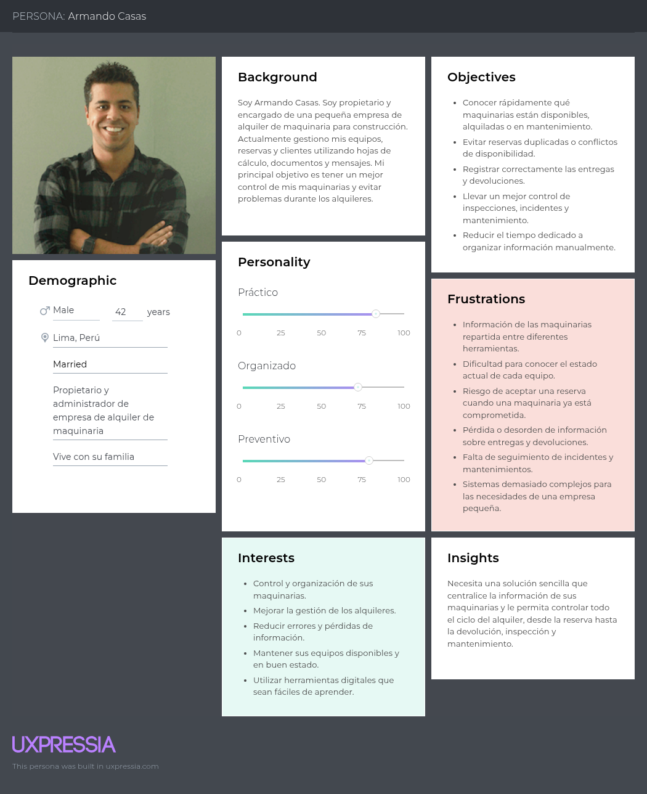

**Segmento Objetivo 2: Pequeñas empresas constructoras**

### 2.3.2. User Task Matrix

| TASK | Armando Casas (Empresa de alquiler) Frecuencia | Armando Casas (Empresa de alquiler) Importancia | Andrea Torres (Empresa constructora) Frecuencia | Andrea Torres (Empresa constructora) Importancia |
| :---- | :---: | :---: | :---: | :---: |
| **Consultar el inventario de maquinaria** | **Often** | **High** | **Sometimes** | **Medium** |
| **Consultar la disponibilidad de una maquinaria** | **Often** | **High** | **Often** | **High** |
| **Registrar o actualizar información de maquinaria** | **Often** | **High** | **Rarely** | **Low** |
| **Gestionar reservas y solicitudes de alquiler** | **Often** | **High** | **Often** | **High** |
| **Coordinar la entrega de maquinaria** | **Often** | **High** | **Often** | **High** |
| **Registrar la devolución de maquinaria** | **Often** | **High** | **Sometimes** | **Medium** |
| **Verificar el estado de la maquinaria después de un alquiler** | **Often** | **High** | **Sometimes** | **Medium** |
| **Registrar incidentes o daños en una maquinaria** | **Sometimes** | **High** | **Sometimes** | **High** |
| **Consultar el historial de mantenimiento de una maquinaria** | **Often** | **High** | **Rarely** | **Medium** |
| **Programar o registrar mantenimientos** | **Sometimes** | **High** | **Rarely** | **Low** |
| **Buscar maquinaria según las necesidades de un proyecto** | **Rarely** | **Low** | **Often** | **High** |
| **Consultar características y condiciones de una maquinaria** | **Sometimes** | **Medium** | **Often** | **High** |
| **Realizar seguimiento del estado de una solicitud o alquiler** | **Often** | **High** | **Often** | **High** |

### 2.3.3. User Journey Mapping

**1. User Journey Map para el primer segmento**

**2. User Journey Map para el segundo segmento**

### 2.3.4. Empathy Mapping

**1. Empathy Map para el primer segmento**

**2. Empathy Map para el segundo segmento**

## 2.4. Big Picture Event Storming

## 2.5. Ubiquitous Language

# Capítulo III: Requirements Specification

## 3.1. User Stories

<table>
<tr>
<th>Epic / Story ID</th>
<th>Título</th>
<th>Descripción</th>
<th>Criterios de Aceptación</th>
<th>Relacionado con</th>
</tr>

<tr>
<td>EP01</td>
<td>Gestión de usuarios y acceso</td>
<td>Epic orientado al registro, autenticación y gestión básica de las cuentas de los usuarios de MaquiGest.</td>
<td>-</td>
<td>-</td>
</tr>

<tr>
<td>US01</td>
<td>Registro de usuario</td>
<td>Como usuario, quiero registrarme en MaquiGest para acceder a las funcionalidades de la plataforma.</td>
<td>
Given que el usuario accede al formulario de registro 
When ingresa sus datos correctamente 
Then el sistema crea su cuenta 
And muestra un mensaje de confirmación
</td>
<td>EP01</td>
</tr>

<tr>
<td>US02</td>
<td>Inicio de sesión</td>
<td>Como usuario registrado, quiero iniciar sesión para acceder a las funcionalidades correspondientes a mi cuenta.</td>
<td>
Given que el usuario posee una cuenta registrada 
When ingresa credenciales válidas 
Then el sistema permite el acceso a la plataforma
</td>
<td>EP01</td>
</tr>

<tr>
<td>US03</td>
<td>Gestionar perfil</td>
<td>Como usuario, quiero consultar y actualizar mis datos personales y de contacto para mantener mi información actualizada.</td>
<td>
Given que el usuario ha iniciado sesión 
When modifica sus datos de perfil 
Then el sistema guarda la información actualizada 
And muestra los nuevos datos
</td>
<td>EP01</td>
</tr>

<tr>
<td>EP02</td>
<td>Gestión de maquinaria</td>
<td>Epic orientado al registro, organización y consulta del inventario de maquinaria disponible para alquiler.</td>
<td>-</td>
<td>-</td>
</tr>

<tr>
<td>US04</td>
<td>Registrar maquinaria</td>
<td>Como empresa de alquiler, quiero registrar mis máquinas y equipos para mantener organizado mi inventario.</td>
<td>
Given que el usuario tiene permisos para gestionar maquinaria 
When registra los datos de un equipo 
Then el sistema almacena la maquinaria en el inventario 
And muestra el equipo registrado
</td>
<td>EP02</td>
</tr>

<tr>
<td>US05</td>
<td>Consultar maquinaria</td>
<td>Como empresa de alquiler, quiero consultar las máquinas registradas para conocer la información de mis equipos.</td>
<td>
Given que existen equipos registrados 
When el usuario consulta el inventario 
Then el sistema muestra la lista de maquinaria 
And muestra información relevante de cada equipo
</td>
<td>EP02</td>
</tr>

<tr>
<td>US06</td>
<td>Actualizar información de maquinaria</td>
<td>Como empresa de alquiler, quiero actualizar la información de mis equipos para mantener el inventario actualizado.</td>
<td>
Given que existe una maquinaria registrada 
When el usuario modifica sus datos 
Then el sistema guarda la información actualizada
</td>
<td>EP02</td>
</tr>

<tr>
<td>US07</td>
<td>Consultar disponibilidad de maquinaria</td>
<td>Como empresa de alquiler, quiero conocer la disponibilidad de cada equipo para evitar conflictos al gestionar nuevos alquileres.</td>
<td>
Given que existen equipos registrados 
When el usuario consulta su disponibilidad 
Then el sistema muestra si cada equipo está disponible, reservado o alquilado
</td>
<td>EP02</td>
</tr>

<tr>
<td>US08</td>
<td>Consultar estado de maquinaria</td>
<td>Como empresa de alquiler, quiero conocer el estado de mis equipos para evitar alquilar maquinaria que no se encuentra en condiciones de uso.</td>
<td>
Given que existe una maquinaria registrada 
When el usuario consulta su información 
Then el sistema muestra su estado actual 
And permite identificar si está disponible para alquiler
</td>
<td>EP02</td>
</tr>

<tr>
<td>EP03</td>
<td>Búsqueda y solicitud de alquiler</td>
<td>Epic orientado a permitir que las pequeñas empresas constructoras encuentren maquinaria y gestionen solicitudes de alquiler.</td>
<td>-</td>
<td>-</td>
</tr>

<tr>
<td>US09</td>
<td>Buscar maquinaria</td>
<td>Como empresa constructora, quiero buscar maquinaria según mis necesidades para encontrar equipos adecuados para mi proyecto.</td>
<td>
Given que el usuario accede al catálogo de maquinaria 
When busca o filtra equipos 
Then el sistema muestra las maquinarias que coinciden con sus necesidades
</td>
<td>EP03</td>
</tr>

<tr>
<td>US10</td>
<td>Consultar información de maquinaria</td>
<td>Como empresa constructora, quiero consultar las características de una maquinaria para determinar si es adecuada para mi proyecto.</td>
<td>
Given que el usuario visualiza una maquinaria 
When selecciona el equipo 
Then el sistema muestra sus características, estado y condiciones de alquiler
</td>
<td>EP03</td>
</tr>

<tr>
<td>US11</td>
<td>Consultar disponibilidad para un periodo</td>
<td>Como empresa constructora, quiero consultar la disponibilidad de una maquinaria para un periodo determinado antes de solicitar el alquiler.</td>
<td>
Given que el usuario selecciona una maquinaria y un periodo 
When consulta su disponibilidad 
Then el sistema indica si el equipo puede ser alquilado durante dicho periodo
</td>
<td>EP03</td>
</tr>

<tr>
<td>US12</td>
<td>Solicitar alquiler de maquinaria</td>
<td>Como empresa constructora, quiero solicitar el alquiler de una maquinaria para utilizarla en mi proyecto.</td>
<td>
Given que la maquinaria está disponible 
When el usuario registra una solicitud de alquiler 
Then el sistema registra la solicitud 
And muestra su estado
</td>
<td>EP03</td>
</tr>

<tr>
<td>EP04</td>
<td>Gestión de reservas y alquileres</td>
<td>Epic orientado a la administración de reservas y al seguimiento del ciclo de alquiler de los equipos.</td>
<td>-</td>
<td>-</td>
</tr>

<tr>
<td>US13</td>
<td>Gestionar solicitudes de alquiler</td>
<td>Como empresa de alquiler, quiero revisar las solicitudes recibidas para decidir cuáles atender y mantener control sobre mis alquileres.</td>
<td>
Given que existen solicitudes de alquiler 
When el usuario consulta las solicitudes 
Then el sistema muestra la información de cada solicitud 
And permite identificar su estado
</td>
<td>EP04</td>
</tr>

<tr>
<td>US14</td>
<td>Confirmar o rechazar una solicitud</td>
<td>Como empresa de alquiler, quiero aceptar o rechazar solicitudes de alquiler para controlar la disponibilidad de mis equipos.</td>
<td>
Given que existe una solicitud pendiente 
When el usuario selecciona aceptar o rechazar 
Then el sistema actualiza el estado de la solicitud 
And muestra el nuevo estado
</td>
<td>EP04</td>
</tr>

<tr>
<td>US15</td>
<td>Consultar alquileres activos</td>
<td>Como empresa de alquiler, quiero consultar mis alquileres activos para conocer qué equipos están actualmente alquilados.</td>
<td>
Given que existen alquileres activos 
When el usuario consulta sus alquileres 
Then el sistema muestra los equipos alquilados 
And muestra información del periodo correspondiente
</td>
<td>EP04</td>
</tr>

<tr>
<td>US16</td>
<td>Consultar estado de una solicitud de alquiler</td>
<td>Como empresa constructora, quiero consultar el estado de mi solicitud para saber si mi alquiler fue aceptado, rechazado o aún está pendiente.</td>
<td>
Given que el usuario ha realizado una solicitud 
When consulta sus solicitudes 
Then el sistema muestra el estado actualizado de cada una
</td>
<td>EP04</td>
</tr>

<tr>
<td>US17</td>
<td>Gestionar entregas y devoluciones</td>
<td>Como empresa de alquiler, quiero registrar las entregas y devoluciones de maquinaria para mantener trazabilidad sobre los equipos alquilados.</td>
<td>
Given que existe un alquiler confirmado 
When se registra la entrega o devolución 
Then el sistema actualiza el estado del alquiler 
And registra la operación realizada
</td>
<td>EP04</td>
</tr>

<tr>
<td>EP05</td>
<td>Gestión de mantenimiento e incidencias</td>
<td>Epic orientado al seguimiento del estado operativo de la maquinaria y a la gestión de mantenimientos e incidencias.</td>
<td>-</td>
<td>-</td>
</tr>

<tr>
<td>US18</td>
<td>Registrar mantenimiento</td>
<td>Como empresa de alquiler, quiero registrar mantenimientos realizados a una maquinaria para mantener un historial de su estado operativo.</td>
<td>
Given que existe una maquinaria registrada 
When el usuario registra un mantenimiento 
Then el sistema almacena la información 
And la relaciona con el equipo correspondiente
</td>
<td>EP05</td>
</tr>

<tr>
<td>US19</td>
<td>Programar mantenimiento</td>
<td>Como empresa de alquiler, quiero programar mantenimientos para evitar que los equipos sean utilizados cuando requieren atención.</td>
<td>
Given que una maquinaria requiere mantenimiento 
When el usuario registra una fecha de mantenimiento 
Then el sistema guarda la programación 
And permite consultar el mantenimiento pendiente
</td>
<td>EP05</td>
</tr>

<tr>
<td>US20</td>
<td>Registrar incidencia de maquinaria</td>
<td>Como empresa de alquiler, quiero registrar incidencias de mis equipos para llevar un control de problemas y reparaciones.</td>
<td>
Given que una maquinaria presenta una incidencia 
When el usuario registra el problema 
Then el sistema almacena la incidencia 
And la relaciona con la maquinaria correspondiente
</td>
<td>EP05</td>
</tr>

<tr>
<td>US21</td>
<td>Consultar historial de maquinaria</td>
<td>Como empresa de alquiler, quiero consultar el historial de una maquinaria para conocer sus alquileres, incidencias y mantenimientos.</td>
<td>
Given que existe una maquinaria registrada 
When el usuario consulta su historial 
Then el sistema muestra las operaciones asociadas al equipo
</td>
<td>EP05</td>
</tr>

<tr>
<td>EP06</td>
<td>Información y contratación del servicio</td>
<td>Epic orientado a brindar información sobre MaquiGest y facilitar el contacto de potenciales clientes con la plataforma.</td>
<td>-</td>
<td>-</td>
</tr>

<tr>
<td>US22</td>
<td>Consultar información de MaquiGest</td>
<td>Como visitante, quiero conocer las funcionalidades y beneficios de MaquiGest para determinar si la solución se adapta a las necesidades de mi empresa.</td>
<td>
Given que el visitante accede al Landing Page 
When revisa la información del producto 
Then el sistema muestra sus principales funcionalidades y beneficios
</td>
<td>EP06</td>
</tr>

<tr>
<td>US23</td>
<td>Solicitar demostración</td>
<td>Como potencial cliente, quiero solicitar una demostración de MaquiGest para conocer cómo funciona antes de utilizar el servicio.</td>
<td>
Given que el visitante desea conocer la plataforma 
When completa y envía el formulario de demostración 
Then el sistema registra la solicitud 
And muestra un mensaje de confirmación
</td>
<td>EP06</td>
</tr>

<tr>
<td>US24</td>
<td>Contactar con MaquiGest</td>
<td>Como potencial cliente, quiero contactar con el equipo de MaquiGest para realizar consultas sobre el servicio.</td>
<td>
Given que el visitante accede a la sección de contacto 
When completa y envía sus datos y consulta 
Then el sistema registra la solicitud de contacto
</td>
<td>EP06</td>
</tr>

</table>

## 3.2. Impact Mapping

## 3.3. Product Backlog

# Capítulo IV: Product Design

## 4.1. Style Guidelines

### 4.1.1. General Style Guidelines

### 4.1.2. Web Style Guidelines

## 4.2. Information Architecture

### 4.2.1. Organization Systems

### 4.2.2. Labeling Systems

### 4.2.3. SEO Tags and Meta Tags

### 4.2.4. Searching Systems

### 4.2.5. Navigation Systems

## 4.3. Landing Page UI Design
### 4.3.1. Landing Page Wireframe

En esta sección se presentan los wireframes de la Landing Page de MaquiGest. Estos artefactos permiten definir la estructura inicial de la interfaz, la distribución de los contenidos y la jerarquía visual de los principales elementos antes de aplicar los estilos finales del producto. Asimismo, permiten evidenciar la traducción de las decisiones tomadas previamente en las secciones de Style Guidelines e Information Architecture hacia una propuesta concreta de interfaz para la Landing Page.

La propuesta de wireframes organiza la experiencia de navegación de forma jerárquica y secuencial, guiando al visitante desde la comprensión inicial de la propuesta de valor de MaquiGest hasta las acciones de conversión, como la solicitud de una demostración o el envío de una consulta. La estructura general está compuesta por las secciones Home, Benefits, Features, About Us, Solutions, Plans, Request Demo y Contact, las cuales responden a las necesidades de los segmentos objetivo previamente identificados: pequeñas y medianas empresas de alquiler de maquinaria y pequeñas empresas constructoras.

#### Desktop Web Browser

La versión para Desktop Web Browser aprovecha el espacio horizontal para distribuir la información mediante bloques claramente diferenciados, facilitando la lectura, la comparación de contenido y la identificación de los principales llamados a la acción. La propuesta mantiene consistencia estructural entre secciones y aplica principios de jerarquía visual, alineación, proximidad y contraste, permitiendo que los visitantes comprendan de manera progresiva la solución ofrecida por MaquiGest.

##### Home

El wireframe de la sección Home presenta el primer contacto entre el visitante y la propuesta de valor de MaquiGest. En esta sección se ubican el encabezado de navegación, el mensaje principal del producto, una breve descripción y los principales Call To Action: “Solicitar Demo” y “Ver planes”. La composición está orientada a comunicar rápidamente el propósito de la plataforma y motivar al visitante a continuar explorando el sitio.

  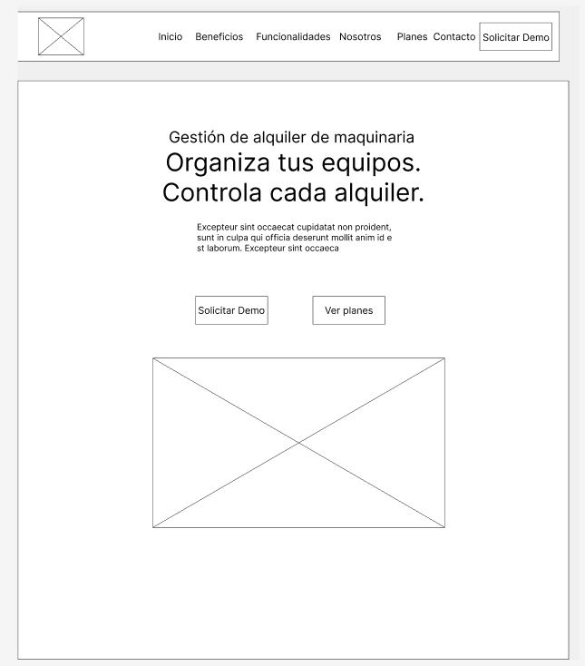

##### Benefits

La sección Benefits organiza en tres bloques los principales beneficios de la solución. Esta disposición permite que el visitante identifique rápidamente el valor que ofrece MaquiGest, destacando aspectos como el control de disponibilidad, la centralización de operaciones y el seguimiento del estado de la maquinaria. La estructura mediante cards facilita la exploración y comparación de la información.

  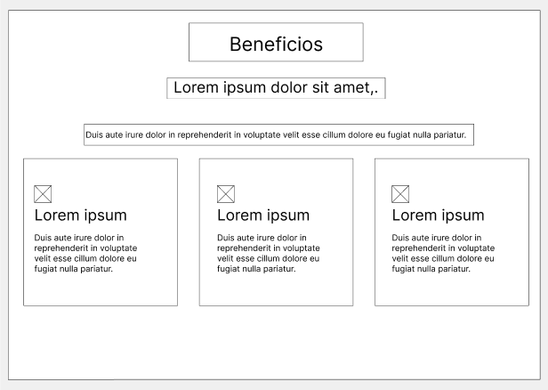

##### Features

La sección Features presenta las funcionalidades principales de la plataforma mediante seis cards distribuidas en una retícula. Esta organización permite representar de forma clara y ordenada las herramientas más importantes de MaquiGest, como la gestión del inventario de maquinaria, disponibilidad, alquileres, entregas y devoluciones, mantenimiento e incidencias, y búsqueda o solicitud de equipos. La distribución busca favorecer la legibilidad y el reconocimiento visual de cada funcionalidad.

  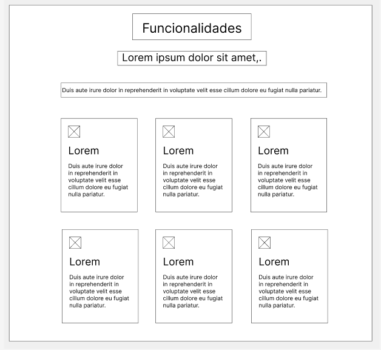

##### About Us

La sección About Us comunica la identidad de la startup y la intención del producto. El wireframe emplea una composición de bloques que permite presentar información institucional de forma resumida, como la misión, la visión y los valores de CleanCode y MaquiGest. Esta organización contribuye a fortalecer la credibilidad de la propuesta y a comunicar el enfoque del equipo desarrollador.

  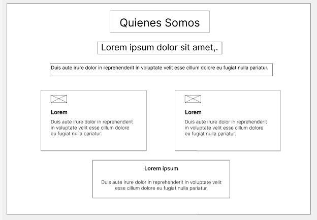

##### Solutions

La sección Solutions traduce de forma directa los resultados del análisis de segmentos objetivo. Su estructura permite diferenciar visualmente las soluciones orientadas a pequeñas y medianas empresas de alquiler de maquinaria y a pequeñas empresas constructoras. De esta manera, cada visitante puede identificar rápidamente la propuesta de valor más cercana a sus necesidades y relacionarla con su contexto de uso.

  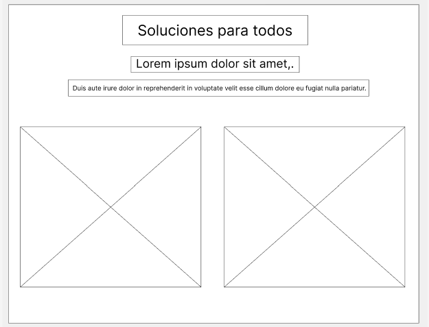

##### Plans

La sección Plans organiza la información comercial de la plataforma en tres tarjetas comparables. El objetivo de esta disposición es permitir que el visitante reconozca de manera sencilla las alternativas disponibles y evalúe la opción más adecuada para su negocio. El uso de cards refuerza la claridad, la comparación entre opciones y la orientación a la conversión.

  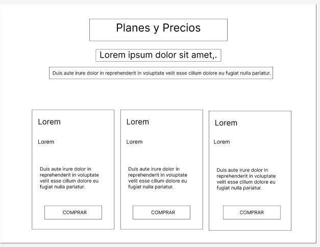

##### Request Demo

La sección Request Demo está orientada a la conversión del visitante. El wireframe organiza el contenido en dos áreas: una zona de explicación breve sobre la demostración y un formulario para registrar los datos del interesado. Esta distribución facilita la comprensión del propósito de la sección y reduce la fricción durante el proceso de contacto inicial con la startup.

  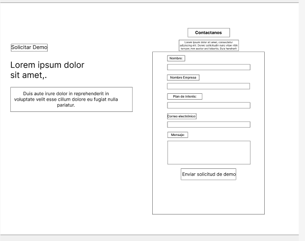

##### Contact

La sección Contact presenta un formulario orientado a consultas generales y se complementa con un footer informativo. Su estructura prioriza la claridad en la interacción, permitiendo que el visitante identifique fácilmente los campos necesarios para enviar un mensaje. Además, el footer funciona como cierre de la experiencia, reforzando la navegación, la identidad del producto y la información complementaria del sitio.

  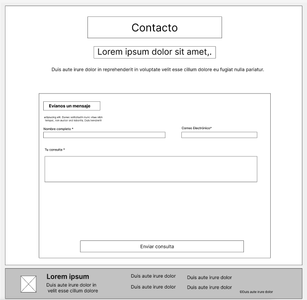

En conjunto, los wireframes de la Landing Page de MaquiGest evidencian una propuesta estructurada, coherente con la arquitectura de información y orientada a una experiencia de navegación clara, comprensible e inclusiva. La distribución de secciones, el uso de jerarquías visuales y la ubicación de los llamados a la acción buscan facilitar tanto la comprensión de la propuesta de valor como la interacción de los visitantes con el producto.

#### Mobile Web Browser

La versión para Mobile Web Browser adapta la estructura de la Landing Page de MaquiGest a una pantalla de menor ancho, priorizando la legibilidad, la navegación vertical y el acceso rápido a los principales llamados a la acción. Para ello, los contenidos se reorganizan en una sola columna, manteniendo la misma secuencia informativa definida en la versión desktop y preservando la coherencia con la arquitectura de información establecida previamente.

En esta propuesta, el encabezado se simplifica mediante un menú hamburguesa, lo cual permite optimizar el espacio disponible sin perder acceso a las secciones principales del sitio. Asimismo, el Hero prioriza el mensaje principal del producto y los Call To Action “Solicitar Demo” y “Ver planes”, con una disposición centrada que facilita la lectura y la interacción desde dispositivos móviles.

##### Home

La sección Home en mobile presenta la propuesta de valor de MaquiGest de forma resumida, destacando el nombre del producto, una breve descripción y los principales Call To Action. La disposición vertical permite centrar la atención del visitante en el propósito de la Landing Page desde el inicio de la experiencia.

  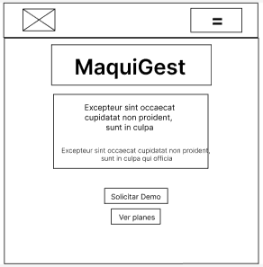

##### Benefits

La sección Benefits reorganiza la propuesta de beneficios en una sola card visible por bloque, priorizando la lectura secuencial y reduciendo la sobrecarga visual en pantallas pequeñas. Esta adaptación mantiene claridad en la presentación del valor de la plataforma.

  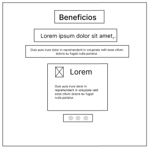

##### Features

La sección Features adapta las funcionalidades principales a una experiencia vertical y progresiva. Cada funcionalidad se presenta en tarjetas individuales, permitiendo al usuario concentrarse en un elemento a la vez y comprender con facilidad las capacidades principales de MaquiGest.

  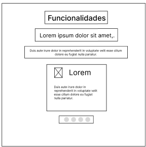

##### About Us

La sección About Us en mobile conserva la información institucional de forma resumida y jerarquizada. Los bloques de contenido se disponen verticalmente para facilitar la lectura y mantener una presentación limpia y comprensible sobre la identidad de CleanCode y MaquiGest.

  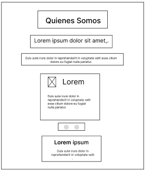

##### Solutions

La sección Solutions mantiene la diferenciación de la propuesta de valor para los segmentos objetivo, reorganizando el contenido en formato vertical. Esta decisión favorece la identificación progresiva de cada solución y mejora la experiencia de lectura en dispositivos móviles.

  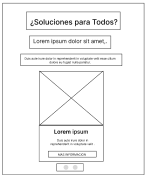

##### Plans

La sección Plans reorganiza las alternativas disponibles en un formato vertical, permitiendo que cada plan sea visualizado individualmente. Esta adaptación mejora la comparación y facilita que el visitante identifique la opción más adecuada sin afectar la claridad del contenido.

  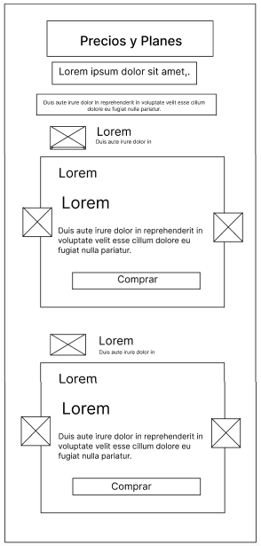

##### Request Demo

La sección Request Demo en mobile prioriza la simplicidad de interacción, presentando el contenido explicativo y el formulario en una estructura vertical. Esta organización reduce la fricción y facilita el registro de datos desde una pantalla táctil.

  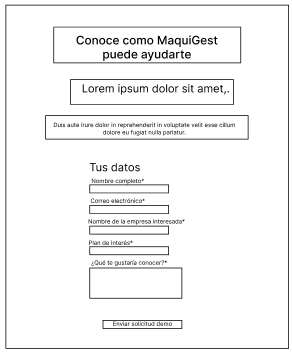

##### Contact

La sección Contact adapta el formulario y el footer al entorno móvil, manteniendo una disposición clara de campos y botones para favorecer la interacción del visitante. De esta forma, se asegura una experiencia consistente y accesible al cierre del recorrido de la Landing Page.

  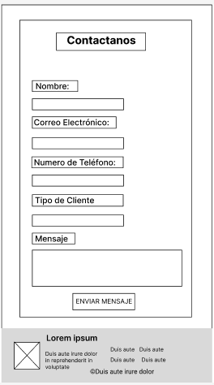

En conjunto, la propuesta mobile mantiene la estructura, jerarquía y objetivos de conversión de la Landing Page de MaquiGest, adaptándolos a las características de navegación propias de dispositivos móviles. La organización en una sola columna, el uso de un menú simplificado y la disposición vertical de las cards y formularios contribuyen a una experiencia clara, comprensible e inclusiva.

### 4.3.2. Landing Page Mock-up

En esta sección se presentan los mock-ups de la Landing Page de MaquiGest para las versiones Desktop Web Browser y Mobile Web Browser. A diferencia de los wireframes, los mock-ups incorporan los elementos visuales definidos para el producto, como colores, tipografía, iconografía, estilos de botones, cards, formularios y demás componentes de interfaz, permitiendo representar una versión más cercana al resultado final de la Landing Page.

La propuesta mantiene la estructura y jerarquía establecidas previamente en los wireframes y aplica de manera consistente el Design System de MaquiGest. La identidad visual utiliza principalmente tonos azul oscuro, azul y naranja, acompañados de fondos claros que favorecen la legibilidad y permiten destacar los principales Call To Action.

Asimismo, los mock-ups evidencian la aplicación de principios de jerarquía visual, alineación, proximidad, consistencia y contraste. La organización del contenido facilita que los visitantes comprendan progresivamente la propuesta de valor, conozcan los beneficios y funcionalidades del producto, identifiquen la solución correspondiente a su segmento, comparen los planes disponibles y puedan solicitar una demostración o ponerse en contacto con CleanCode.

#### Landing Page Mock-up para Desktop Web Browser

La versión Desktop Web Browser aprovecha el espacio horizontal para organizar los contenidos mediante una estructura clara y consistente. El Header mantiene visibles las principales opciones de navegación y los Call To Action, mientras que las diferentes secciones utilizan cards, bloques de contenido y formularios para facilitar la exploración de la información.

La sección Home presenta la identidad de MaquiGest y comunica directamente su propuesta de valor mediante el mensaje principal “Organize your equipment. Stay on top of every rental.”. Los botones “Request demo” y “View plans” destacan las principales acciones disponibles para el visitante.

  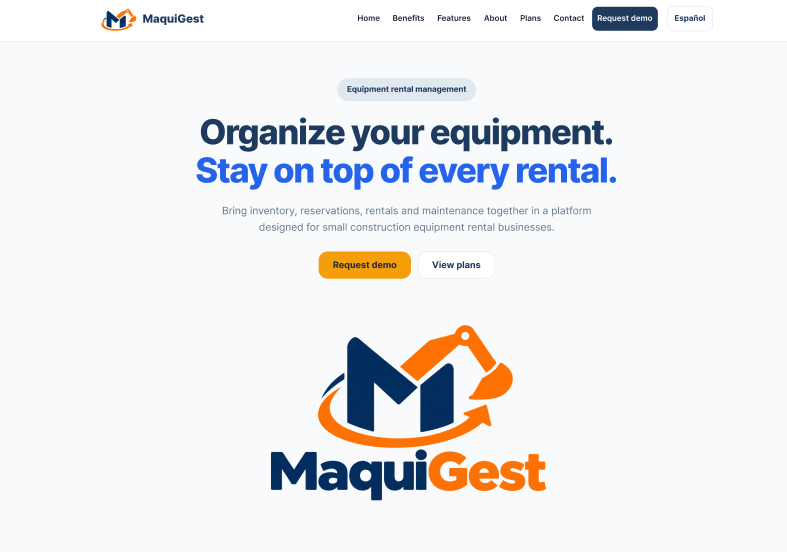

La sección Benefits presenta tres beneficios principales mediante cards diferenciadas visualmente: claridad sobre la disponibilidad de equipos, conexión de las operaciones de alquiler y cuidado de la maquinaria. Esta organización permite comunicar de forma rápida los principales resultados que MaquiGest busca ofrecer a sus usuarios.

  

La sección Features organiza las principales funcionalidades de MaquiGest mediante una retícula de seis cards. Entre ellas se encuentran la gestión del inventario de maquinaria, disponibilidad y reservas, seguimiento de alquileres, entregas y devoluciones, mantenimiento e incidencias, y búsqueda y solicitud de equipos. Esta disposición facilita la identificación y comprensión de las capacidades principales de la plataforma.

  

La sección About Us presenta a CleanCode como la startup responsable de MaquiGest. La información se organiza mediante bloques diferenciados para misión, visión y valores, reforzando la identidad del equipo y comunicando los principios que orientan el desarrollo del producto.

  

La sección Solutions diferencia visualmente las propuestas dirigidas a los dos segmentos objetivo de MaquiGest. El primer bloque está orientado a empresas de alquiler de maquinaria que requieren centralizar información y operaciones durante todo el ciclo de alquiler. El segundo está dirigido a pequeñas empresas constructoras que necesitan buscar equipos, consultar disponibilidad y gestionar sus solicitudes de alquiler.

  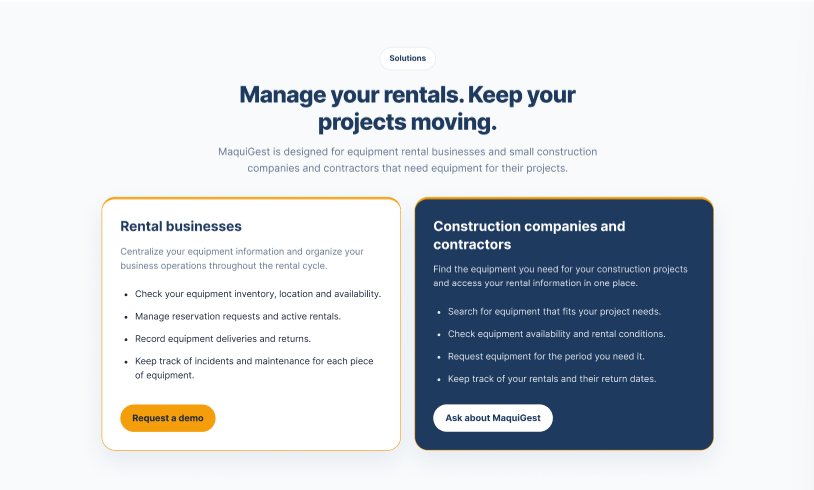

La sección Plans presenta los planes Essential, Professional y Growth mediante cards comparables. Cada alternativa muestra su precio referencial, propósito, principales funcionalidades y un Call To Action para solicitar una demostración. El plan Professional recibe un tratamiento visual destacado mediante la etiqueta “Recommended”, estableciendo una jerarquía entre las alternativas sin impedir su comparación.

  

La sección Request Demo utiliza una composición de dos columnas. En el lado izquierdo se explica brevemente el propósito de la demostración, mientras que en el lado derecho se presenta un formulario con los datos necesarios para registrar el interés del visitante. El botón “Send demo request” funciona como Call To Action principal de la sección y utiliza el color de acento para reforzar su visibilidad.

  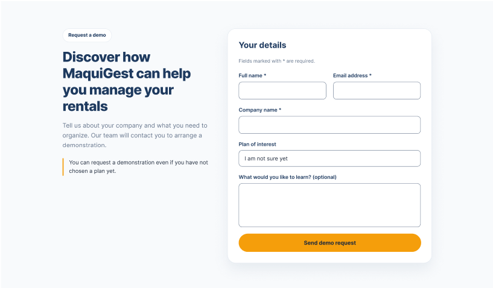

Finalmente, la sección Contact permite realizar consultas generales mediante un formulario simplificado compuesto por nombre, correo electrónico y mensaje. El Footer complementa el cierre de la experiencia mediante la identidad visual de MaquiGest, accesos de navegación, información de copyright y el enlace a los términos y condiciones.

  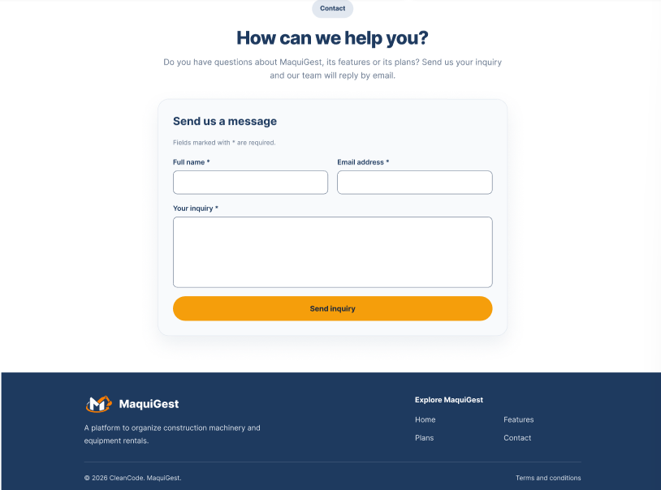

En conjunto, los mock-ups para Desktop Web Browser muestran la evolución visual de los wireframes y evidencian la aplicación coherente de la identidad visual y del Design System de MaquiGest. La combinación de jerarquía visual, contraste, agrupación de contenido, componentes reutilizables y Call To Action claramente identificables busca proporcionar una experiencia clara, consistente y orientada a las necesidades de los segmentos objetivo.

#### Landing Page Mock-up para Mobile Web Browser

La versión Mobile Web Browser adapta la propuesta visual de la Landing Page de MaquiGest a pantallas de menor tamaño, manteniendo la misma estructura, identidad visual y objetivos de conversión definidos para la versión desktop. En esta adaptación, los contenidos se reorganizan en una sola columna, priorizando la lectura vertical, la claridad de los elementos interactivos y la facilidad de navegación desde dispositivos móviles.

La propuesta conserva los lineamientos del Design System de MaquiGest mediante el uso consistente de colores, tipografía, botones, cards y formularios. Asimismo, se aplican principios de jerarquía visual, contraste, proximidad y consistencia para asegurar que la experiencia en dispositivos móviles continúe siendo clara, comprensible y alineada con las necesidades de los segmentos objetivo.

La sección Home concentra la propuesta de valor principal de MaquiGest en una composición vertical. El mensaje central, los botones “Request demo” y “View plans”, y la presencia destacada del logotipo permiten que el visitante identifique rápidamente el propósito de la plataforma desde el inicio de la navegación.

  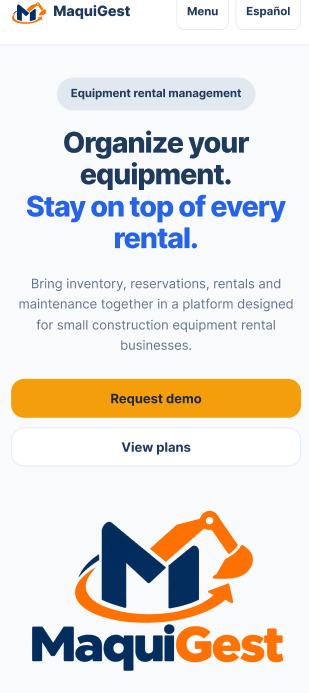

La sección Benefits reorganiza los beneficios principales en tarjetas apiladas verticalmente, favoreciendo la lectura secuencial y la comprensión rápida del valor de la solución. Esta disposición permite destacar con claridad la disponibilidad, la conexión de operaciones y el cuidado de la maquinaria.

  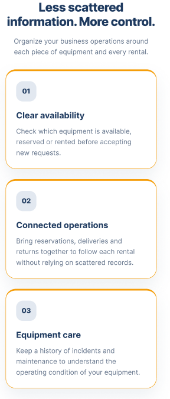

La sección Features presenta las funcionalidades principales de la plataforma mediante cards verticales, facilitando la lectura de cada capacidad del sistema en una pantalla reducida. Esta distribución permite al visitante reconocer progresivamente funciones como el inventario de maquinaria, disponibilidad y reservas, seguimiento de alquileres, entregas y devoluciones, mantenimiento e incidencias, y búsqueda o solicitud de equipos.

  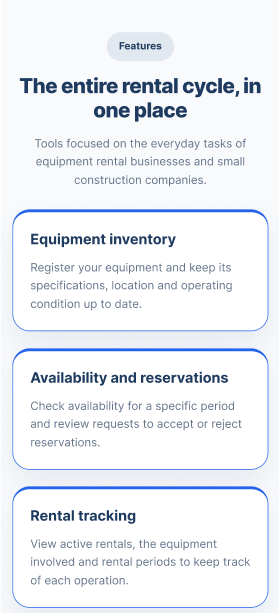

La sección About Us adapta la información institucional de CleanCode y MaquiGest a una estructura vertical, presentando de forma clara la misión, visión y valores del equipo. El uso de bloques diferenciados favorece la legibilidad y evita la saturación de contenido en la interfaz móvil.

  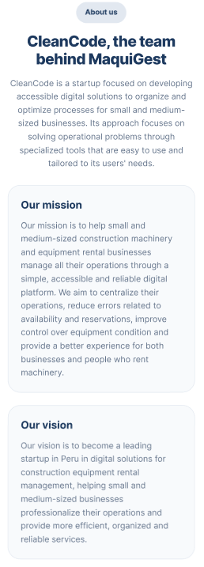

La sección Solutions mantiene la diferenciación de la propuesta de valor para los segmentos objetivo de MaquiGest. En la versión mobile, los bloques se presentan uno debajo del otro, permitiendo que el visitante identifique con claridad la solución orientada a empresas de alquiler de maquinaria y la propuesta dirigida a pequeñas empresas constructoras.

  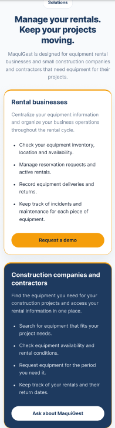

La sección Plans reorganiza las alternativas disponibles en un formato vertical, permitiendo visualizar cada plan de manera individual. Esta adaptación mejora la comparación y mantiene una lectura clara de los planes Essential, Professional y Growth, así como de sus respectivas características y llamados a la acción.

  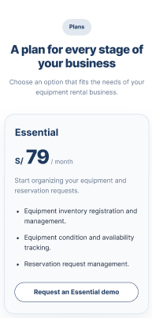

  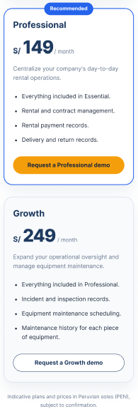

La sección Request Demo combina una breve explicación de la demostración con un formulario adaptado a interacción táctil. La disposición en una sola columna facilita el ingreso de datos desde un dispositivo móvil y mantiene visible el Call To Action principal para enviar la solicitud.

  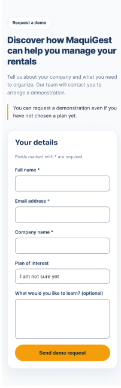

Finalmente, la sección Contact presenta un formulario simplificado para consultas generales y un footer adaptado al entorno móvil. La disposición vertical de los enlaces, el contenido institucional y la información complementaria permite cerrar la experiencia de navegación de manera ordenada y consistente con la identidad visual del producto.

  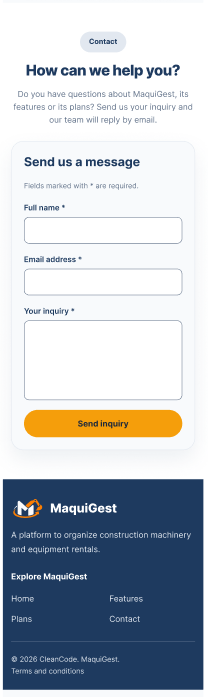

En conjunto, los mock-ups para Mobile Web Browser evidencian la adaptación del diseño visual de MaquiGest a dispositivos móviles, manteniendo coherencia con la versión desktop y aplicando de forma consistente el Design System del producto. La organización vertical, la claridad de los componentes y la visibilidad de los llamados a la acción contribuyen a una experiencia intuitiva, accesible y orientada a la conversión.

## 4.4. Web Applications UX/UI Design

### 4.4.1. Web Applications Wireframes

### 4.4.2. Web Applications Wireflow Diagrams

### 4.4.3. Web Applications Mock-ups

### 4.4.4. Web Applications User Flow Diagrams

## 4.5. Web Applications Prototyping

## 4.6. Domain-Driven Software Architecture

### 4.6.1. Design-Level Event Storming

### 4.6.2. Software Architecture Context Diagram

### 4.6.3. Software Architecture Container Diagrams

### 4.6.4. Software Architecture Components Diagrams

## 4.7. Software Object-Oriented Design

### 4.7.1. Class Diagrams

## 4.8. Database Design

### 4.8.1. Database Diagrams

# Capítulo V: Product Implementation, Validation & Deployment

## 5.1. Software Configuration Management

### 5.1.1. Software Development Environment Configuration

### 5.1.2. Source Code Management

### 5.1.3. Source Code Style Guide & Conventions

### 5.1.4. Software Deployment Configuration

## 5.2. Landing Page, Services & Applications Implementation

### 5.2.1. Sprint 1

#### 5.2.1.1. Sprint Planning 1

#### 5.2.1.2. Aspect Leaders and Collaborators

#### 5.2.1.3. Sprint Backlog 1

#### 5.2.1.4. Development Evidence for Sprint Review

#### 5.2.1.5. Execution Evidence for Sprint Review

#### 5.2.1.6. Services Documentation Evidence for Sprint Review

#### 5.2.1.7. Software Deployment Evidence for Sprint Review

#### 5.2.1.8. Team Collaboration Insights during Sprint

# Conclusiones

## Conclusiones y recomendaciones

# Bibliografía

# Anexos